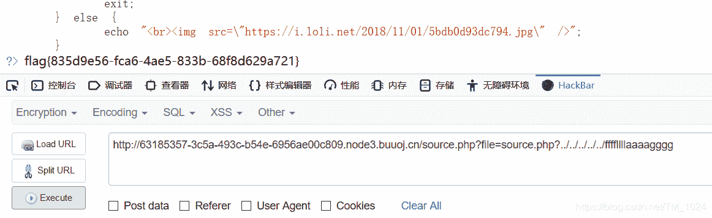
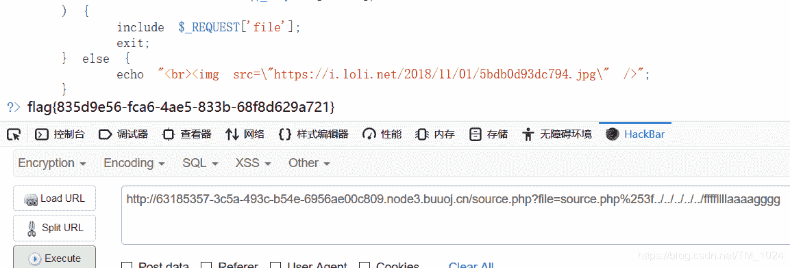

<!--yml
category: 未分类
date: 2022-04-26 14:40:27
-->

# BUUCTF__[HCTF 2018]WarmUp_题解_风过江南乱的博客-CSDN博客

> 来源：[https://blog.csdn.net/TM_1024/article/details/105537289](https://blog.csdn.net/TM_1024/article/details/105537289)

## 第一次写题解，以此来做一个学习记录。

```
 <?php
    highlight_file(__FILE__);
    class emmm
    {
        public static function checkFile(&$page)
        {
            $whitelist = ["source"=>"source.php","hint"=>"hint.php"];
            if (! isset($page) || !is_string($page)) {
                echo "you can't see it";
                return false;
            }

            if (in_array($page, $whitelist)) {
                return true;
            }

            $_page = mb_substr(
                $page,
                0,
                mb_strpos($page . '?', '?')
            );

            if (in_array($_page, $whitelist)) {
                return true;
            }

            $_page = urldecode($page);
            $_page = mb_substr(
                $_page,
                0,
                mb_strpos($_page . '?', '?')
            );
            if (in_array($_page, $whitelist)) {
                return true;
            }
            echo "you can't see it";
            return false;
        }
    }

    if (! empty($_REQUEST['file'])
        && is_string($_REQUEST['file'])
        && emmm::checkFile($_REQUEST['file'])
    ) {
        include $_REQUEST['file'];
        exit;
    } else {
        echo "<br>";
    }  
?> 
```

*   来分析一下这段代码，首先看最后的if else，可知，当if括号三个条件同时成立时变量被包含，目测本地文件包含题目，否则显示滑稽。所以需要满足
    - 变量file不为空
    - 变量file为字符串
    - emmm::checkFile()返回ture

*   再来看一下类里面的内容，首先看到hint.php,尝试访问，提示说flag在ffffllllaaaagggg，继续往下看

*   看第一个if，如果变量page也就是输入的file为空或者非字符串则返回false，没有多大意义，只是再判断了一下变量file不为空并且为字符串。

*   看第二个if，白名单验证，匹配变量page的值是否存在数组white。也就是hint.php或source.php，也就是说page只能是hint.php或source.php才能返回ture，虽然可以返回ture，但是无法让它包含ffffllllaaaagggg，所以不可用。

*   看第三个if，判断经过处理后的page，分析处理方式，

    ```
    - mb_strpos($page . '?', '?')   
      在变量page中从第一位开始搜寻？，并返回第一次出现的位置的数值。                          
    - $_page=mb_substr($page,0,mb_strpos($page . '?', '?'))
      从变量page中第0位截取到上面返回的数值位并赋值给_page
    - 然后再判断变量_page是否存在数组whitelist里，是则返回ture。这里可以利用 
    ```

*   再看第四个，和第三个差不多，不过对page多了一次url解码，可以利用。

* * *

*   来具体分析一下第三个为什么可以利用，因为截取了 ? 号前字符来进行白名单验证，那我们可以在 ? 号后加上我们需要的字符，也就是让它包含我们需要的ffffllllaaaagggg。

    *   如果我们的file变量为source.php?../…/…/…/…/ffffllllaaaagggg,先截取 ？ 号前字符串白名单验证也就是 source.php，符合，返回ture，然后服务器访问时访问 source.php? 文件不存在，目录穿越至ffffllllaaaagggg，得到我们要的flag。至于为什么需要四个…/，可以一个个增加多次尝试。
        
*   第四个if和第三个差不多，多了一次url解码，首先我们要知道，服务器在处理访问时会先进行一次url解码，也就是说，我们要使两次url解码后为 ？号，？号经过两次url编码为%253f，所以我们的file变量应该为source.php%253f…/…/…/…/…/ffffllllaaaagggg。得到flag。
    

*   写在最后，这题其实刚开始也不会做，也是看别人的wp才做出来，过了很久才想起来回来写个wp，但这篇也写了很久，中间有一些还是没有理解，就是第三个和第四个if为什么都可以，最后本地复现让他们返回不一样的内容才理解。

*   持续更新BUU题解，以此来做个学习记录。

*   附上题目链接 https://buuoj.cn/challenges#[HCTF%202018]WarmUp

*   写的不是很好，欢迎指正。