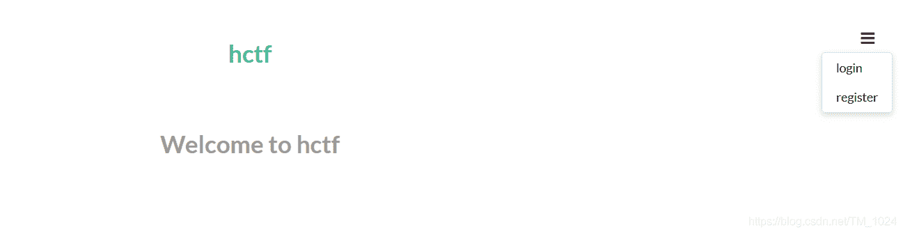
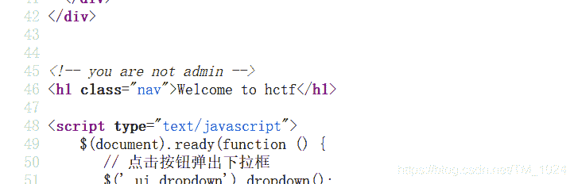
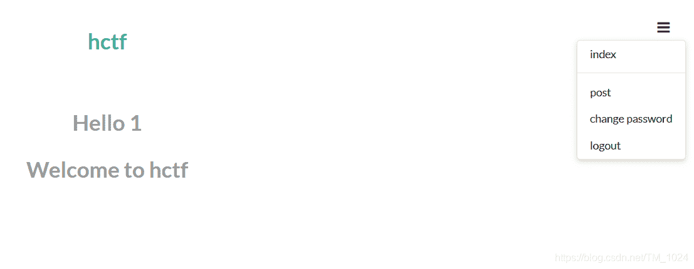
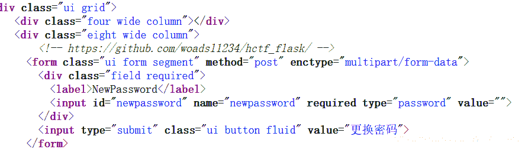
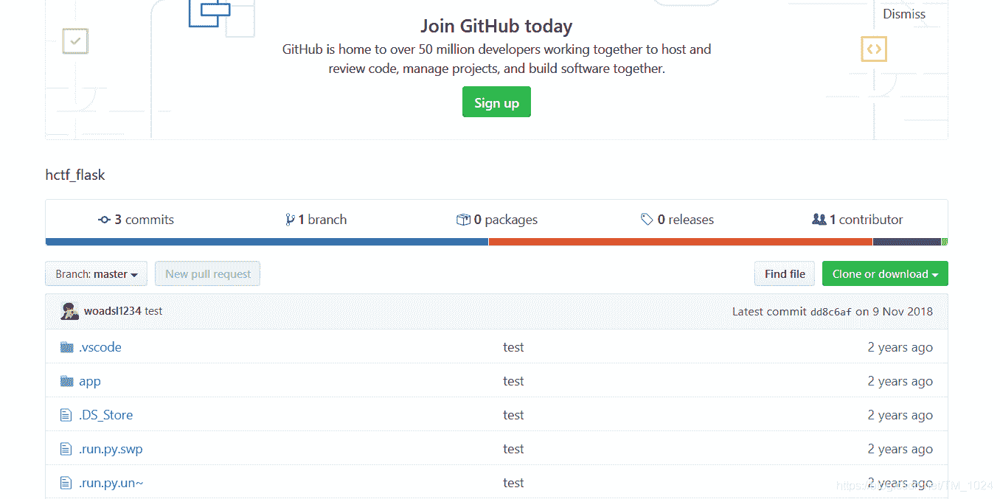
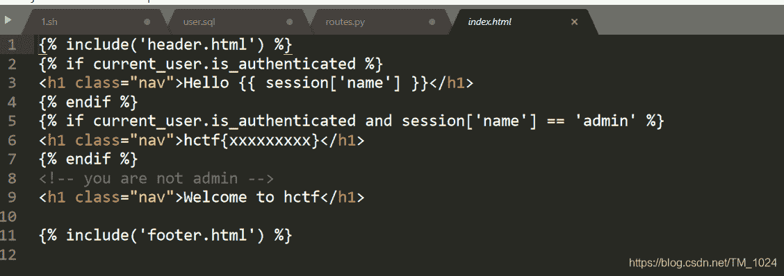
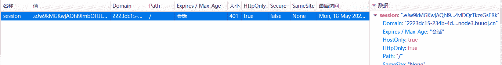

<!--yml
category: 未分类
date: 2022-04-26 14:37:22
-->

# BUUCTF__[HCTF 2018]admin_题解_风过江南乱的博客-CSDN博客

> 来源：[https://blog.csdn.net/TM_1024/article/details/106180117](https://blog.csdn.net/TM_1024/article/details/106180117)

## 一、看题

*   拿到题目，发现一个欢迎页面。有注册、登录功能。
    
*   首先习惯性 F12。发现提示。
    
*   提示不是 admin ，那我们尝试登录用户名 admin ，密码随便输入，提示密码错误。尝试注 册 admin ，提示账号已被注册，那么我们怎么才能用 admin 登录呢。
*   那先尝试随便注册一个账号登录看看有什么内容，注册用户名和密码都为1，登录。
*   发现有修改密码功能。
    
*   可以注册、登录、修改密码，很自然的想到二次注入。
*   事实上，预期解的确是二次注入，只不过有好几种非预期解法。

## 二、研究

*   这题得到flag，实际上可能有四种方式吧。
*   还有一点没想到的是，在修改密码页面还存在被注释的提示。题目有两处注释提示，没想到这点，还是 F12 没用好。
*   在这里提示发现了一个 GitHub 项目。
    
*   访问发现了源码
    
*   下载到本地，发现是 python 写的，因为还没学 python 。这题超纲了。
*   不过看wp还是能看懂。

### 解法一__Unicode欺骗（预期解法）

*   既然有源码，重点肯定是在注册登录的验证处理和对数据库操作。
*   在 `index.html` 发现 当登录用户名为 `admin` 时 输出 flag
    
*   但之前用 admin 登录注册都报错。
*   所以想到二次注入，也就是先注册一个账号和 `admin` 不同，成功注册后，登录在修改密码时，能修改 `admin` 的密码。
*   在 `routes.py` 中发现了登录注册修改密码的验证代码。
*   注册模块

```
@app.route('/register', methods = ['GET', 'POST'])
def register():

    if current_user.is_authenticated:
        return redirect(url_for('index'))

    form = RegisterForm()
    if request.method == 'POST':
        name = strlower(form.username.data)
        if session.get('image').lower() != form.verify_code.data.lower():
            flash('Wrong verify code.')
            return render_template('register.html', title = 'register', form=form)
        if User.query.filter_by(username = name).first():
            flash('The username has been registered')
            return redirect(url_for('register'))
        user = User(username=name)
        user.set_password(form.password.data)
        db.session.add(user)
        db.session.commit()
        flash('register successful')
        return redirect(url_for('login'))
    return render_template('register.html', 
```

```
@app.route('/login', methods = ['GET', 'POST'])
def login():
    if current_user.is_authenticated:
        return redirect(url_for('index'))

    form = LoginForm()
    if request.method == 'POST':
        name = strlower(form.username.data)
        session['name'] = name
        user = User.query.filter_by(username=name).first()
        if user is None or not user.check_password(form.password.data):
            flash('Invalid username or password')
            return redirect(url_for('login'))
        login_user(user, remember=form.remember_me.data)
        return redirect(url_for('index'))
    return render_template('login.html', title = 'login', form = form) 
```

```
@app.route('/change', methods = ['GET', 'POST'])
def change():
    if not current_user.is_authenticated:
        return redirect(url_for('login'))
    form = NewpasswordForm()
    if request.method == 'POST':
        name = strlower(session['name'])
        user = User.query.filter_by(username=name).first()
        user.set_password(form.newpassword.data)
        db.session.commit()
        flash('change successful')
        return redirect(url_for('index'))
    return render_template('change.html', title = 'change', form = form) 
```

*   在登录后，发现有 `session` 储存在本地，而且修改密码也是取的 `session` 验证用户名。
*   但本来储存在本地的应该是 `cookie`，`session` 应该是存储在服务器的，而这里为什么 `session` 在本地？？？
*   这里引用解释

> 根据p神的文章 https://www.leavesongs.com/PENETRATION/client-session-security.html
> 可以知道，flask的session是存在客户端的



```
def strlower(username):
    username = nodeprep.prepare(username)
    return username 
```

*   这个函数的解释是(百度没找到相关文档)，在别人的wp里看到的。

> nodeprep.prepare函数会将unicode字符ᴬ转换成A，而A在调用一次nodeprep.prepare函数会把A转换成a

*   这个字符可以在后面网站找到，https://unicode-table.com/en/1D2E/

*   知道这个结合源码就能理解一下，看到注册、登录、修改密码都经过了处理。

    ```
    name = strlower(session['name']) 
    ```

*   那么如果用 `ᴬᴰᴹᴵᴺ` 注册，注册经过处理，储存在数据库就变成了 `ADMIN`，

*   登录后，加密储存在`session` 的也是 `ADMIN`，

*   那么修改密码时，取出`session`解密后的用户名也是 `ADMIN`，

*   再一次调用 `strlower` 函数处理就变成了 `admin` 所以修改密码就是修改`admin` 的密码，所以实际上修改了数据库中的`admin` 。

*   这时`admin` 的密码就变成了自定义修改后的密码。登录后就得到 flag 。

*   只能说看wp不难理解，但还是不简单。

### 解法二__弱密码（最大非预期）

*   直接 admin 的密码就是 123 。登录直接出 flag 。
*   跑一下字典或者随便输入都能出 flag。

### 解法三__flask session 伪造（非预期）

*   这个对我来说，是很大的知识盲区。
*   首先我知道`session` 可以用来身份验证，就是你在浏览器打开网页登录后，可能关闭后再打开不需要重新登录，这就是 cookie 和 session 的作用。其次，修改 session 绕过验证的操作接触过，之前看着大佬的教程，绕过一个钓鱼网站进入后台。但是我不会利用，我只是知道有这个东西。
*   主要的知识盲区是这里用了签名，而且我不会解密 session
*   但知道这个方法后，百度可以找到 flask session 加解密的脚本。
*   理论上可以做出来。解密 session 修改后替换原 session 再访问即可。
*   这里不详细介绍，因为没复现成功，详细了解可以看其他师傅的wp。

### 解法四__条件竞争 （非预期）

*   这种解法原理更深层，完全的知识盲区。
*   涉及到了多进程和多线程在共享数据时的逻辑顺序问题。
*   暂时无法理解。说一下有这种方法。

## 三、最后

*   很多知识点和做题技巧，有点难懂。

*   web真的太多知识点了。很难灵活运用。

*   附上原题链接 https://buuoj.cn/challenges#[HCTF%202018]admin

*   持续更新BUUCTF题解，写的不是很好，欢迎指正。

*   最后欢迎来访个人博客 http://ctf-web.zm996.cloud/