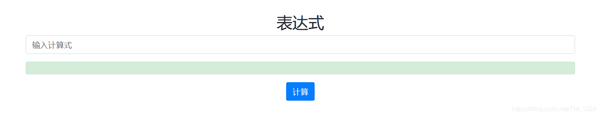
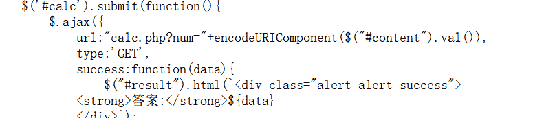
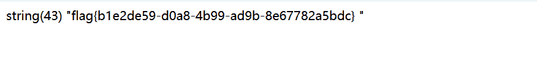

<!--yml
category: 未分类
date: 2022-04-26 14:39:43
-->

# BUUCTF__[RoarCTF 2019]Easy Calc_题解_风过江南乱的博客-CSDN博客

> 来源：[https://blog.csdn.net/TM_1024/article/details/106061191](https://blog.csdn.net/TM_1024/article/details/106061191)

## 一、看题

*   拿到题目
    
*   输入发现会显示简单的计算。
*   想到是不是ssti模板注入。
*   尝试{{1+1}}报错，行不通。
*   F12查看源码。发现存在WAF，访问 `calc.php` 。
    
*   尝试访问得到源代码。

```
<?php
error_reporting(0);
if(!isset($_GET['num'])){
    show_source(__FILE__);
}else{
        $str = $_GET['num'];
        $blacklist = [' ', '\t', '\r', '\n','\'', '"', '`', '\[', '\]','\$','\\','\^'];
        foreach ($blacklist as $blackitem) {
                if (preg_match('/' . $blackitem . '/m', $str)) {
                        die("what are you want to do?");
                }
        }
        eval('echo '.$str.';');
}
?> 
```

*   发现，可以get传入的变量 `num` 可以被 `eval()` 执行。这里就应该是突破点。
*   再发现。当传入变量`num`为非数值时，403报错，考虑这应该就是WAF拦截规则吧。
*   先不看上面的过滤。假设我们成功绕过，我们需要get什么？？？
*   这里就需要做题经验了和一个知识点，对，我还是不会。

## 二、研究

1、首先，要知道flag在哪，其次，怎么让它显示，再者，如何绕过WAF。
2、先来看看怎么找到flag在哪，这里就是存在一个f1agg.php ，怎么知道的？可以用php中的 `scandir()` 函数遍历文件目录（这就应该是做题的经验了，没想到）。
3、知道有 f1agg.php 这个文件就可以用 `file_get_contents()` 函数先读取文件为字符串然后用 `var_dump` 显示字符串得到flag。
4、再就是如何绕过WAF，不能传入字符，那怎么玩，所以我们需要一个知识点。

> PHP需要将所有参数转换为有效的变量名，因此在解析查询字符串时，它会做两件事：1.删除空白符 2.将某些字符转换为下划线（包括空格）
> 。
> 参考链接 ： https://www.freebuf.com/articles/web/213359.html

*   什么意思呢，就是说如果你 `? num=1` 与`?num=1`经过php解析后，都是Array([num] => “a”)；实际上就是同一个变量。但刚刚的WAF没有这个规则，所以当我们传入 `? num=...` 就可以绕过WAF，再经过php解析变回 `?num` 。
*   绕过WAF再看上面的的过滤黑名单发现 `/` 被过滤了，无法用函数来遍历目录，但php中还有 `chr()` 函数可以将ASCII码转换为字符，而且没被过滤。所以绕过。

## 三、解题



*   得到flag。
*   主要是得知道怎么绕过WAF和怎么找flag。还是多做题积累经验吧。

## 四、最后

*   附上题目链接 https://buuoj.cn/challenges#[RoarCTF%202019]Easy%20Calc
*   持续更新BUUCTF题解，写的不是很好，欢迎指正。
*   欢迎来访个人博客 http://ctf-web.zm996.cloud/

## 五、扩展

*   还有一种高级解法 http走私。
*   这里就不说了，可自行了解。