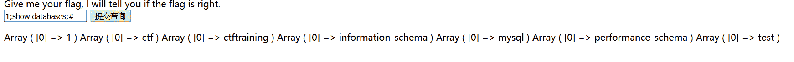
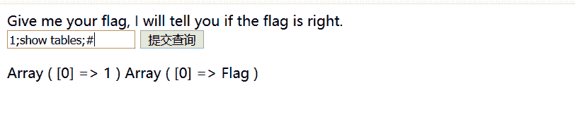
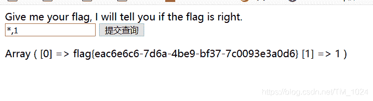
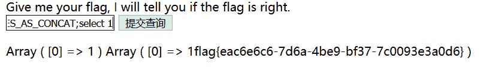

<!--yml
category: 未分类
date: 2022-04-26 14:38:07
-->

# BUUCTF__[SUCTF 2019]EasySQL_题解_风过江南乱的博客-CSDN博客

> 来源：[https://blog.csdn.net/TM_1024/article/details/105815798](https://blog.csdn.net/TM_1024/article/details/105815798)

*   又是sql注入题，不过这题有点不一样。
    

*   还是会想先来试一下闭合方式，分别输入 1 1# , 1’ 1’# , 1" 1"#。

*   发现 1 1# 有回显Array，1’ 1’# ，无回显，1",1"# 提示nonono，应该是被过滤。

*   猜测应该是 " 闭合，如果 ’ 闭合前面应该会报错。然而并不是，这里的查询语句有点不一样。看源码发现是数值型。

*   尝试常用注入方法，发现还是可以堆叠注入。

    ```
    -  1;show databases;# 
    ```



```
 -  1;show tables; 
```



```
-  1;show columns from flag;# 或  1;desc flag;# 
```

*   再尝试发现 from 和列名flag也被过滤，所以我们不能直接读取flag表里的内容。然后就没有然后了，还是看wp。

* * *

* * *

*   先来看一下这里的sql查询语句。

    ```
    -  select $_GET['query'] || flag from flag 
    ```

*   发现不是一般的 select * from （表名） where = 变量。这什么意思???

*   这里的 || 是或运算符，也就是说先查询 select $_GET[‘query’] from flag，查询成功，后面的flag不执行查询。

## 方法一

*   ```
    payload：*,1 
    ```

*   此时sql语句为 select *,1||flag from flag;
*   用 * 查询所有内容，成功显示flag。
    
*   这里结合源码就不难理解。
*   因为没有过滤 *，而且还知道源码。
*   关键还是知道源码。

## 方法二

*   让这里的 || 实现字符串拼接而不是或运算符。

*   但mysql缺省（默认）不支持 || 实现字符串拼接。

*   通过 sql_mode 中PIPES_AS_CONCAT的来使 || 实现字符串拼接功能。

*   SQL Mode 定义了两个方面：MySQL应支持的SQL语法，以及应该在数据上执行何种确认检查。

*   我的理解是，相当于通过 sql_mode 中PIPES_AS_CONCAT 来设置mysql 中 || 支持字符串拼接。

    ```
    - payload:   1;set sql_mode=PIPES_AS_CONCAT;select 1 
    ```

*   解释

    ```
    - set sql_mode=PIPES_AS_CONCAT    就相当于设置 ||  支持字符串拼接。
    - 再 select 1||flag from flag 得到flag。 
    ```

    

*   成功得到flag。

*   关于 sql_mode 有很多种用法。可以参考 https://www.cnblogs.com/piperck/p/9835695.html 中的介绍。

*   建议在本地mysql复现一下sql查询语句。

## 最后

*   附上原题链接 https://buuoj.cn/challenges#[SUCTF%202019]EasySQL
*   持续更新BUUCTF题解，写的不是很好，欢迎指正。
*   欢迎来访个人博客 http://ctf-web.zm996.cloud/
*   贴上题目源码

```
<?php
    session_start();
    include_once "config.php";
    $post = array();
    $get = array();
    global $MysqlLink;

    $MysqlLink = mysqli_connect("localhost",$datauser,$datapass);
    if(!$MysqlLink){
        die("Mysql Connect Error!");
    }
    $selectDB = mysqli_select_db($MysqlLink,$dataName);
    if(!$selectDB){
        die("Choose Database Error!");
    }

    foreach ($_POST as $k=>$v){
        if(!empty($v)&&is_string($v)){
            $post[$k] = trim(addslashes($v));
        }
    }
    foreach ($_GET as $k=>$v){
        }
    }

    ?>

<html>
<head>
</head>
<body>
<a> Give me your flag, I will tell you if the flag is right. </ a>
<form action="" method="post">
<input type="text" name="query">
<input type="submit">
</form>
</body>
</html>
<?php
    if(isset($post['query'])){
        $BlackList = "prepare|flag|unhex|xml|drop|create|insert|like|regexp|outfile|readfile|where|from|union|update|delete|if|sleep|extractvalue|updatexml|or|and|&|\"";

        if(preg_match("/{$BlackList}/is",$post['query'])){

            die("Nonono.");
        }
        if(strlen($post['query'])>40){
            die("Too long.");
        }
        $sql = "select ".$post['query']."||flag from Flag";
        mysqli_multi_query($MysqlLink,$sql);
        do{
            if($res = mysqli_store_result($MysqlLink)){
                while($row = mysqli_fetch_row($res)){
                    print_r($row);
                }
            }
        }while(@mysqli_next_result($MysqlLink));
    }
    ?> 
```