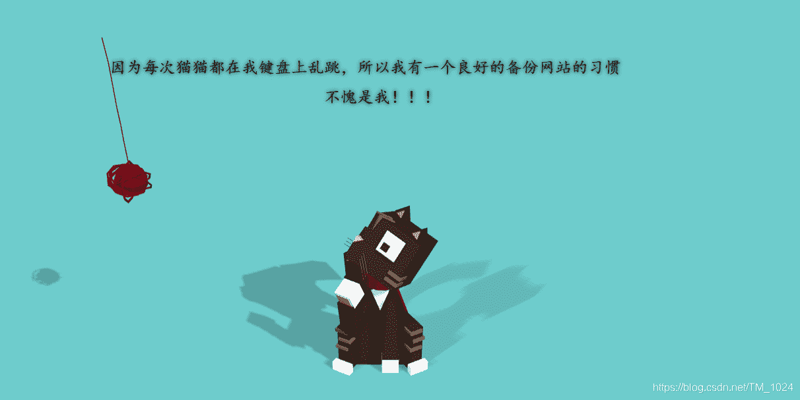
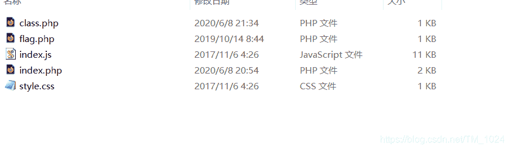
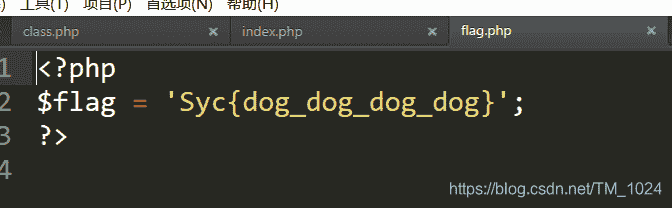
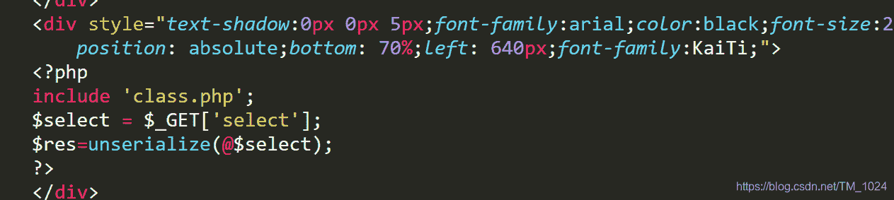
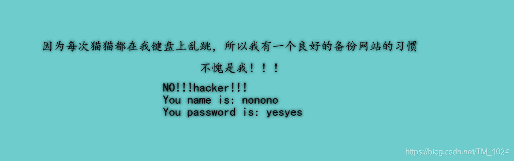
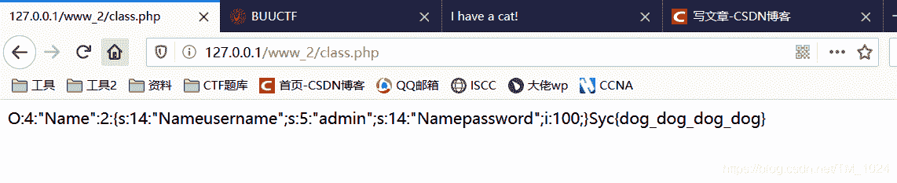
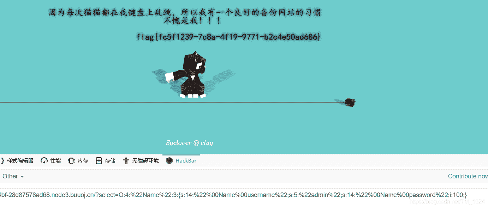

<!--yml
category: 未分类
date: 2022-04-26 14:38:58
-->

# BUUCTF__[极客大挑战 2019]PHP_题解_风过江南乱的博客-CSDN博客

> 来源：[https://blog.csdn.net/TM_1024/article/details/106627210](https://blog.csdn.net/TM_1024/article/details/106627210)

## 前言

*   最近期末考试了，没时间做题，太难了。
*   期末考试真的烦，得冷静冷静。

## 题目

### 源码泄露

*   首先就说网站存在备份，所以很容易想到备份的源码泄露。
    

*   因为之前做高明的黑客备份文件是www.tar.gz,尝试访问一下，没有，然后试了一下www.zip，没想到直接得到文件。很巧合，实际可能会用字典扫，不过也有一些常见网站备份文件，可以尝试一下。

*   得到如下文件。
    

*   先看到 `flag.php` 尝试提交发现是假flag，想想也是，怎么可能就这
    

*   然后再看 `index.php` ,发现要点，包含了class.php，并变量`select` 传入并反序列化。所以，这可能是一道PHP反序列化的一道题。 

*   再来看 `class.php`

```
<?php
include 'flag.php';
error_reporting(0);

class Name{
    private $username = 'nonono';
    private $password = 'yesyes';

    public function __construct($username,$password){
        $this->username = $username;
        $this->password = $password;
    }

    function __wakeup(){
        $this->username = 'guest';
    }

    function __destruct(){
        if ($this->password != 100) {
            echo "</br>NO!!!hacker!!!</br>";
            echo "You name is: ";
            echo $this->username;echo "</br>";
            echo "You password is: ";
            echo $this->password;echo "</br>";
            die();
        }
        if ($this->username === 'admin') {
            global $flag;
            echo $flag;
        }else{
            echo "</br>hello my friend~~</br>sorry i can't give you the flag!";
            die();            
        }
    }
}
?> 
```

### 魔术方法 __wakeup()

*   首先看如何得flag，一看就很明显了，需要反序列化后满足 `password = 100` 和`username === 'admin'`
*   然后看到魔术方法 `__wakeup()`和 ,该函数会在执行`unserialize`时触发，执行后变量`username`的值将变成 guest
*   但这个绕过是很简单的，只需要在反序列化前修改字符串中表示对象里属性的个数的数字。这里有一篇写的很 [详细的文章](https://blog.csdn.net/qq_41617034/article/details/105270864)。
*   但实际却发现，只修改这里后再传入还是会有问题。 
*   发现触发报错，说明变量`username` 和 `password` 没有被正确赋值。
*   可我在序列化前已经让变量赋值了，说明还有考点。看wp后明白，是
    `private` 和 `public` 的问题。

### public 、public、protected

*   访问修饰符，分别对应着类中的 公有、私有、受保护成员。[引用解释](https://blog.csdn.net/jiangnanqbey/article/details/81386527)
*   不同的访问修饰符对应的序列化也有不同。

> 各访问修饰符序列化后的区别：
> public：属性被序列化的时候属性名还是原来的属性名，没有任何改变
> protected：属性被序列化的时候属性名会变成%00*%00属性名，长度跟随属性名长度而改变
> private：属性被序列化的时候属性名会变成%00类名%00属性名，长度跟随属性名长度而改变

*   这里的`username` 和 `password`都为私有成员。理论上序列化后应该会有所不同，但实际上却没变化。
*   最后明白，private在序列化中类名和字段名前都要加上ASCII 码为 0 的字符(不可见字符)，如果我们直接复制结果，该空白字符会丢失。
*   所以前面说加`%00`的目的就是用于替代`\0` ，那为什么不直接加`\0`呢？[引用解释](https://blog.csdn.net/weixin_44077544/article/details/103542260)
*   到这里就明白了

## 解题

*   得到源码，先得到我们需要的序列化后的字符串，只需要在class.php中加上这几行在本地运行即可。

```
$a = new Name("admin",100);
$s = serialize($a);
echo $s 
```

*   成功得到，我们发现第一个属性名长度是14，但却只能看见12个字符，所以，就是因为 `\0` 空白符丢失不可见。
    
*   然后把属性个数2 修改为3，然后再在属性名和类名中添加%00。传入变量select，成功得到flag。
    

## 最后

*   这篇写的有点水，思路写的很乱。
*   但其实重点就在 `public 、public、protected` 序列化时的差别。
*   附上 [题目链接](https://buuoj.cn/challenges#%5B%E6%9E%81%E5%AE%A2%E5%A4%A7%E6%8C%91%E6%88%98%202019%5DPHP)
*   持续更新BUUCTF题解，写的不是很好，欢迎指正。
*   最后欢迎来访[个人博客](http://ctf-web.zm996.cloud/)