<!--yml
category: 未分类
date: 2022-04-26 14:34:27
-->

# BUUCTF__web题解合集（五）_风过江南乱的博客-CSDN博客

> 来源：[https://blog.csdn.net/TM_1024/article/details/107905607](https://blog.csdn.net/TM_1024/article/details/107905607)

## 前言

*   没基础做题可真是痛苦。
*   没想到居然有人关注，受宠若惊。

## 题目

### 1、[BJDCTF2020]The mystery of ip

*   打开页面很很快，在Flag页面提示了ip，看到 174.0.0.2 ，很容易想到127.0.0.1。然后在Hint页面查看源代码看到提示。
    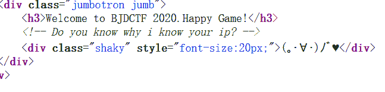

*   这就很容易想起`X-Forwarded-For`伪造ip，抓包尝试修改为 127.0.0.1 。在请求头中加上

    ```
    X-Forwarded-For:127.0.0.1 
    ```

*   发送请求，发现提示你的 ip 为 127.0.0.1 ，看来确实存在ip伪造。然后发现，你后面填什么都提示你的ip是什么。
    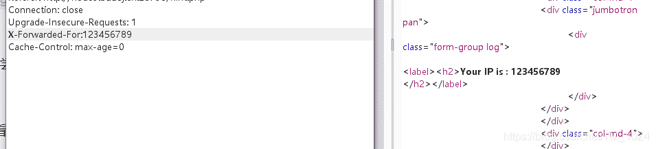

*   这和之前做的[fake google](https://blog.csdn.net/TM_1024/article/details/107237455) 那题有点类似，试试 `{{2*2}}`果然回显为4。

*   那就是`SSTI模板注入`了，继续往下，尝试`{{config}}`报错，从报错提示中发现，这是`Smarty` 模板引擎。可以看看[这个介绍](https://www.jianshu.com/p/eb8d0137a7d3)。
    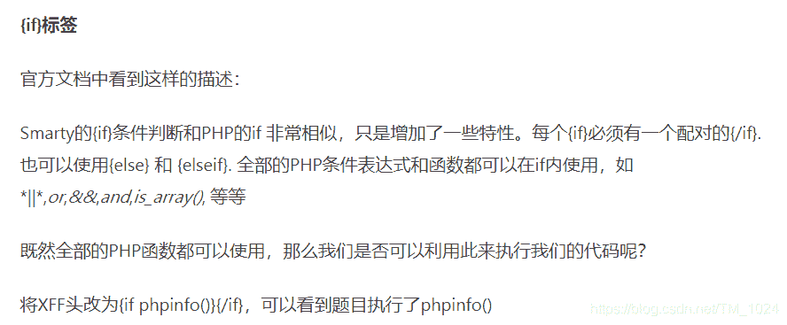

*   所以，尝试`{if phpinfo()}{/if}`标签，执行成功回显。

*   继续执行`{if system('cat /flag')}{/if}` 成功解题。
    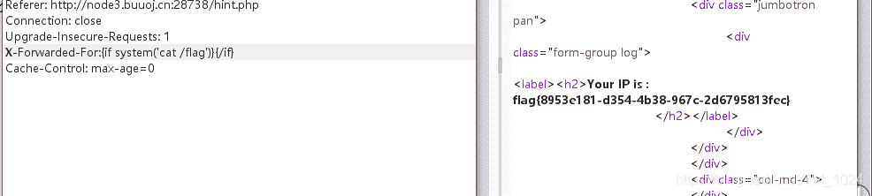

*   总结：首先不难找到注入点，主要就是知道怎么注入。其次，我发现，做题找资料是很关键的。。。

### 2、[BJDCTF2020]Cookie is so stable

*   打开和上题一样的页面，在Flag界面有一个类似登录框，能显示id，同样的在Hint页面源代码中找到提示。
    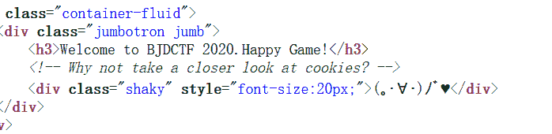

*   提示cookie ，抓包看一下，发现一个user。
    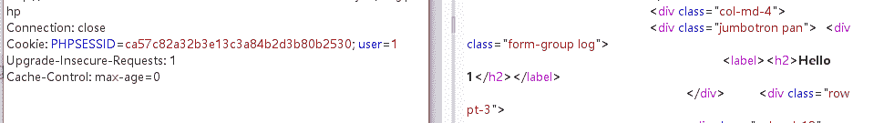

*   修改不同的内容，对应显示在 id 页面，尝试{{2*2}}，回显的 4 。看来还是SSTI模板注入。

*   尝试查看是什么模板，用之前接触过的payload去尝试看回显。真就是误打误撞。
    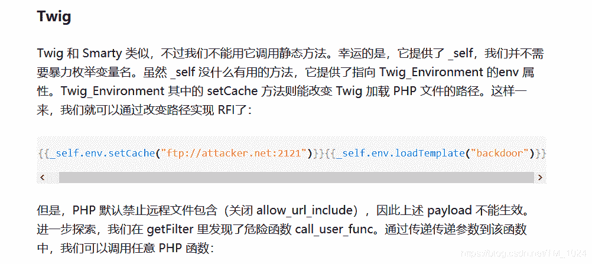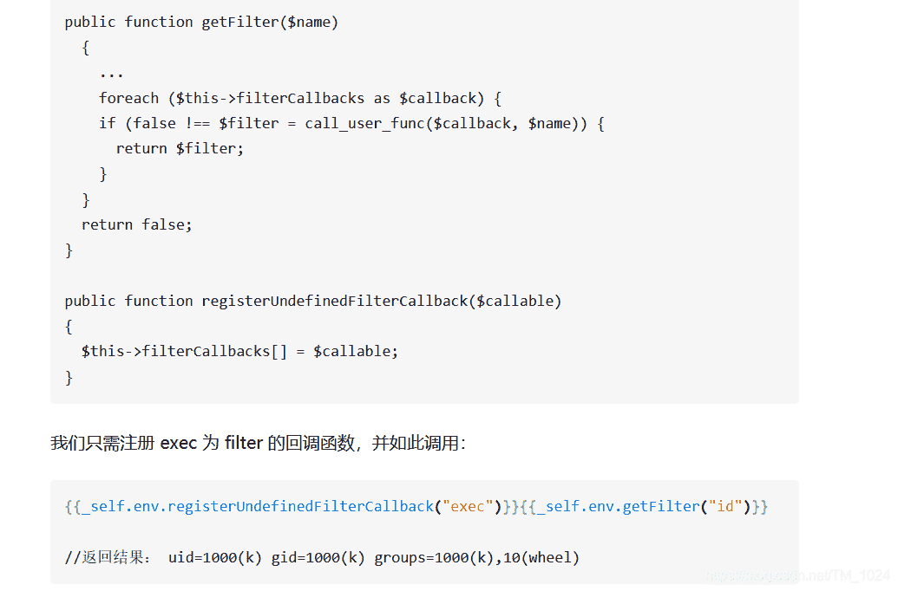

*   还真碰到一个。。。[服务端模板注入攻击](https://zhuanlan.zhihu.com/p/28823933)

*   拿payload尝试，有回显。

    ```
    {{_self.env.registerUndefinedFilterCallback("exec")}}{{_self.env.getFilter("id")}} 
    ```

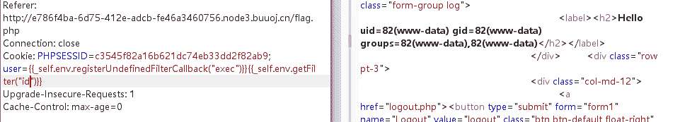

### 3、[WesternCTF2018]shrine

*   这题还是ssti模板注入，打开F12得到美观源码，发现路由绑定的`url/shrine/<path:shrine>` ，访问`url/shrine/{{2*2}}` 回显4。并且明确是 `flask` 框架

    ```
    app.config['FLAG'] = os.environ.pop('FLAG') 
    ```

*   flask项目的配置都是通过app.config对象来进行配置的。设置了一个`FLAG`环境变量,flag就是和它有关。

*   再看下面的过滤，把`()` 替换为空，将单独出现的`self`和`config`替换为`None`,比如说前面加个`1.config`就能绕过。

    ```
    def safe_jinja(s):
        s = s.replace('(', '').replace(')', '')
        blacklist = ['config', 'self']
        return ''.join(['{}'.format(c) for c in blacklist]) + s 
    ```

*   查看环境变量可以用`{{config}}`。但是被过滤，然后寻找内置函数替代。

*   然后就没有然后，去看wp,都是用的`url_for`和`get_flashed_messages`。

*   其中下面返回当前位置的全部全局变量。然后从中寻找到`current_app` 我想是因为 `<Flask 'app'>`来确认引用

    ```
    {{url_for.__globals__}} 
    ```

    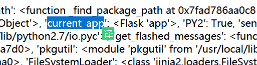

*   所以，查看当前app的config

    ```
    {{url_for.__globals__['current_app'].config}} 
    ```

*   用`get_flashed_messages` 也一样，同样先找到`'current_app': <Flask 'app'>`再引用`__globals__['current_app']`

    ```
     {{get_flashed_messages.__globals__['current_app'].config}} 
    ```

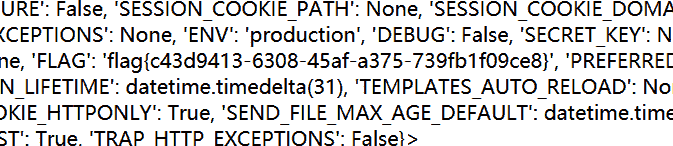

*   这题目做下来，好像就知道了内置函数 `url_for` 和 `get_flashed_messages` 可以替代`config`。最后找到[一篇博客](https://blog.csdn.net/houyanhua1/article/details/85470175)介绍它们。
*   先看到 app.config[‘FLAG’] = os.environ.pop(‘FLAG’) 想到要读取环境变量，但用config不行，所以用上面提到的代替，然后找到current_app读取。

### 4、[BJDCTF2020]ZJCTF,不过如此

*   第一步就很简单，PHP伪协议读取它提示的`next.php` 源码。

*   满足两个条件，file_get_contents 读取的 `text` 变量为I have a dream 和`file`变量不包含flag。

*   但是并不能直接传入 ext=I have a dream 。得用[PHP伪协议](https://blog.csdn.net/qq_43622442/article/details/105894182)

    ```
    text=data://text/plain,I have a dream
    或
    text=php://input
    post：I have a dream 
    ```

*   而file变量就很简单，直接读

    ```
    file=php://filter/read/convert.base64-encode/resource=next.php 
    ```

*   得到next.phpd的源码。

```
<?php
$id = $_GET['id'];
$_SESSION['id'] = $id;

function complex($re, $str) {
    return preg_replace(
        '/(' . $re . ')/ei',
        'strtolower("\\1")',
        $str
    );
}

foreach($_GET as $re => $str) {
    echo complex($re, $str). "\n";
}
function getFlag(){
    @eval($_GET['cmd']);
} 
```

*   看到最后有一个命令执行函数。没有被调用的地方。突破点不在这里。

*   整个过程就调用了`complex()`，有一个return。所以应该在这里。

*   中断，然后看wp。是`preg_replace()` 函数使用`/e` 模式可能存在代码执行漏洞。
    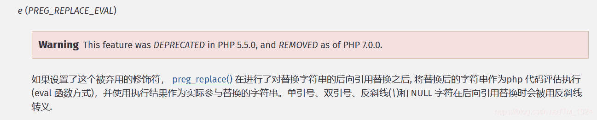

*   而具体情况可以看看这两个[深入研究preg_replace与代码执行](https://xz.aliyun.com/t/2557) 和[慎用preg_replace危险的/e修饰符(一句话后门常用)](https://www.cnblogs.com/dhsx/p/4991983.html)

*   怎么理解呢，我的理解是在使用`/e`参数时原本PHP执行 `replacement`部份的代码却意外执行了`subject`部份
    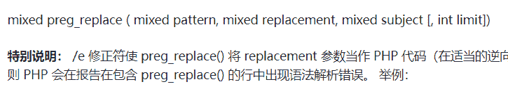

*   然后就是应该传入什么？根据上面第一篇文章提到，和下面的爬坑2
    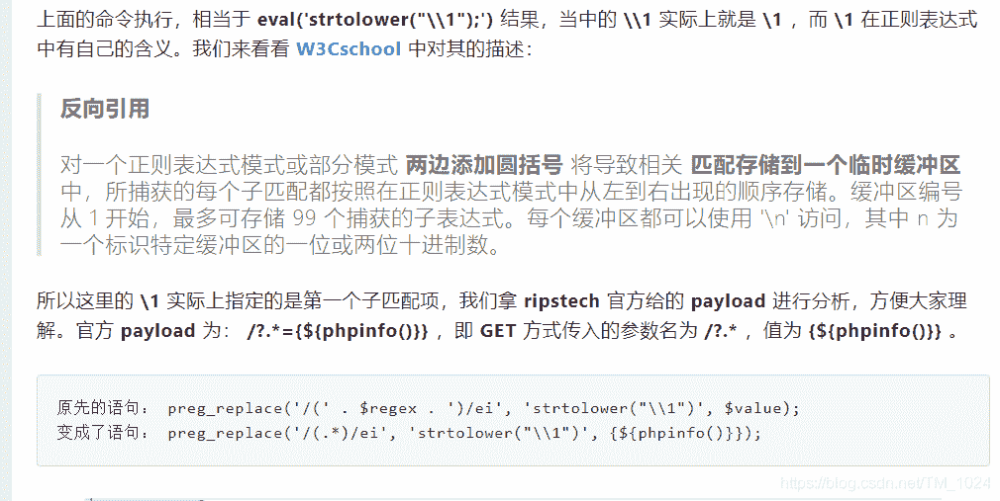

*   所以我们的 payload `?\S*={${phpinfo()}}`是成功执行的，那么读取flag，就可以调用源码中的`getFlag`()函数给cmd赋值。所以

    ```
    ?\S*=${getFlag()}&cmd=system("cat /flag"); 
    ```

*   这题重点在哪呢，首先找到得到nest.php源码不难，难的就是利用`preg_replace` 函数`/e`模式的代码执行漏洞。第一就是不知道，第二就是`\S*`细节，总的来说，不会，难。

### 5、[CISCN 2019 初赛]Love Math

*   这个就，真的就是神仙操作。

*   要满足命令执行的条件，首先就是传入的变量`c`长度小于80，再就是过滤了空格下划线中括号等一系列字符，最后只允许使用白名单里的函数。

*   也就是说，需要满足这些条件来命令执行。比如说`cat /flag`。

*   但这过不去白名单，想办法用白名单里的函数转换出来。

*   首先就是有一个PHP动态函数。php中可以把函数名通过字符串的方式传递给一个变量，然后通过此变量动态调用函数。比如说下面就会执行`cat /flag`

    ```
    $a='cat';
    $a('/flag'); 
    ```

*   然后就是`pi`函数在PHP中被默认字符串而不是函数但它在上面说的白名单中。

*   再介绍几个函数。

    ```
    base_convert() 函数：在任意进制之间转换数字。
    dechex() 函数：把十进制转换为十六进制。
    hex2bin() 函数：把十六进制值的字符串转换为 ASCII 字符。 
    ```

*   还有就是36进制。
    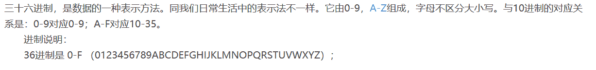

*   直接给payload。

    ```
    $pi=base_convert(37907361743,10,36)(dechex(1598506324));($$pi){pi}(($$pi){abs})&pi=system&abs=cat /flag 
    ```

*   首先就看它长度已经超过80，为什么可以？回去看源码，验证的 $_GET[‘c’] ，而我们传入的后半部分已经相当于`c=&pi=`，属于`pi` 变量，所以可行。而用pi就是用刚刚上面的性质。而后面为什么命令执行的时候又能用，原因是变量被覆盖了。

*   再看前面部分。构造一个`_GET`
    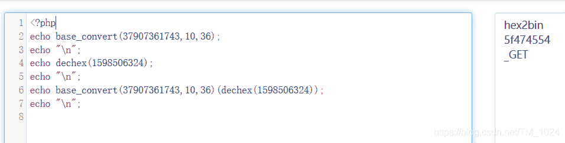

*   这样就就使`$pi=_GET`,然后后面部分`($$pi){pi}`=`$_GET["pi"]`，`(($$pi){abs})`=`$_GET["abs"]`，最后就是`system('cat /flag')`。

*   为什么想一下，为什么不直接构造c=system(‘cat /flag’)呢。。。理论上可以，但是长度好像会大于80，看到好像有师傅是这么弄的，不过复现失败，而且卡的刚刚好，长度=79。我再改一下就不行。

*   思路就是这样。这这种方法利用的就是创造一个`$_GET` 来传入变量覆盖它，先绕过前面的验证，在最后执行的我们后面传入的命令。

*   类似的方法还有不构造`$_GET`传参，而是把参数放请求`header`头部信息。用[getallheaders()函数](https://www.php.net/manual/zh/function.getallheaders.php)取出。在里面添加1参数，赋值为`cat /flag`，然后取出参数1的值。

    ```
    $pi=base_convert,$pi(696468,10,36)($pi(8768397090111664438,10,30)(){1}) 
    ```

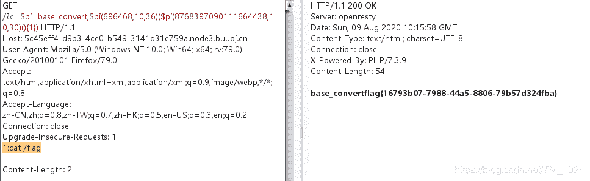

*   还看到有一个用白名单里的函数和数字异或来构造字符串的，tql。

## 最后

*   前面三题都是SSTI模板注入，但是不同的渲染方式。注入的方式也不同，但是，不懂开发来做还是很难理解，准备去实际操作一下。
*   还有就是PHP题目，总是一些函数花里胡哨的。