<!--yml
category: 未分类
date: 2022-04-26 14:50:44
-->

# BUUCTF~Misc~Test4_kvmbox的博客-CSDN博客

> 来源：[https://blog.csdn.net/m0_47643893/article/details/113572544](https://blog.csdn.net/m0_47643893/article/details/113572544)

# 前言

我又来了~

## TARGZ-y1ng

题目说了不用爆破，我以为是伪加密然后找半天，最后用文件名试密码
对了，然后一直解发现是套娃，然后直接上脚本

```
#压缩文件以文件名作为密码无线套完，使用这个脚本
import zipfile
name = '0114'
while True:
    fz = zipfile.ZipFile(name + '.zip', 'r')
    #这里可以改文件压缩后缀如".rar",".zip",".tar.gz"
    fz.extractall(pwd=bytes(name, 'utf-8'))
    name = fz.filelist[0].filename[0:4]
    fz.close() 
```


## Gakki

首先拿到图片用kali binwalk 查看有rar文件，foremost分离然后爆破密码，拿到密码之后有一个txt文件里面很多的符号和数字然后查重两个脚本选其一即可第二个可以直接统计出flag{gaki_IsMyw1fe}

```
alphabet = "abcdefghijklmnopqrstuvwxyzABCDEFGHIJKLMNOPQRSTUVWXYZ1234567890!@#$%^&*()_+- =\\{\\}[]"
strings = open('flag.txt').read()

result = {}
for i in alphabet:
	counts = strings.count(i)
	i = '{0}'.format(i)
	result[i] = counts

res = sorted(result.items(),key=lambda item:item[1],reverse=True)
for data in res:
	print(data)

for i in res:
	flag = str(i[0])
	print(flag[0],end="") 
```

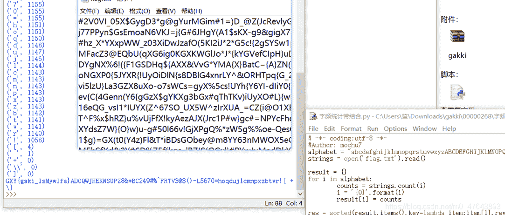

## excel破解

有密码的excel查看隐藏文件没有收获，然后010找flag看到一个ctf的flag
CTF{office_easy_cracked}

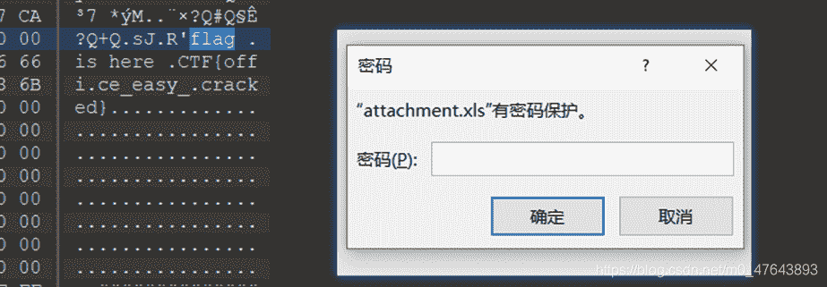

## 喵喵喵

查看图片没有隐写文件，然后在Stegsolve通道里发现了png图片但是打不开文件头有问题改一下，是半张二维码然后就读下图片尺寸，修改一下然后扫码得到网盘地址然后下载yigetxt但是大小不对然后用NTF扫一下得到一个pyc文件。[pyc网站在线反编译](https://tool.lu/pyc/)得到字符串，用脚本跑一下得到flag{Y@e_Cl3veR_C1Ever!}
pyc脚本

```
import base64
text = ['96','65','93','123','91','97','22', '93','70','102','94','132','46','112','64','97','88','80','82','137','90','109','99','112']
text = text[::-1]
def decode():
    code = ''
    for i in range(24):
        if(i%2 == 0):
            a = int(text[i]) - 10
        else:
            a = int(text[i]) + 10
        a = i ^ a
        code = code + chr(a)
    print(code)
decode() 
```

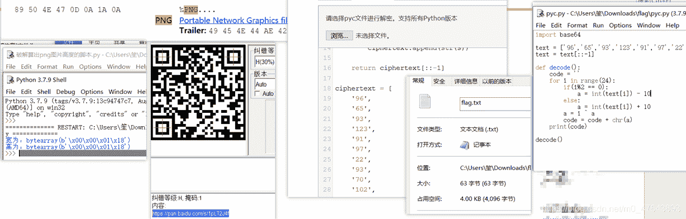

## base64隐写

解压文件看到很多的base64更具题意是base64隐写然后直接上脚本，注意脚本是python2 ACTF{6aseb4_f33!}

```
b64chars = 'ABCDEFGHIJKLMNOPQRSTUVWXYZabcdefghijklmnopqrstuvwxyz0123456789+/'
with open('flag.txt', 'rb') as f:
    bin_str = ''
    for line in f.readlines():
        stegb64 = ''.join(line.split())
        rowb64 =  ''.join(stegb64.decode('base64').encode('base64').split())
        offset = abs(b64chars.index(stegb64.replace('=','')[-1])-b64chars.index(rowb64.replace('=','')[-1]))
        equalnum = stegb64.count('=') #no equalnum no offset
        if equalnum:
            bin_str += bin(offset)[2:].zfill(equalnum * 2)
        print ''.join([chr(int(bin_str[i:i + 8], 2)) for i in xrange(0, len(bin_str), 8)]) 
```

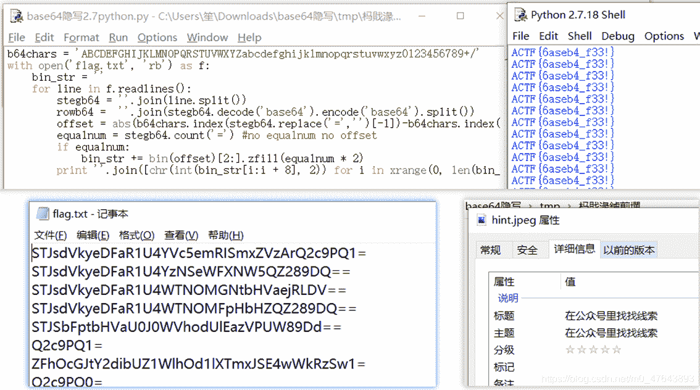

## 来题中等的吧

看到图片寻找隐写没找到然后直接记录莫斯电码然后解密
转化为小写就是flag{alphalab}
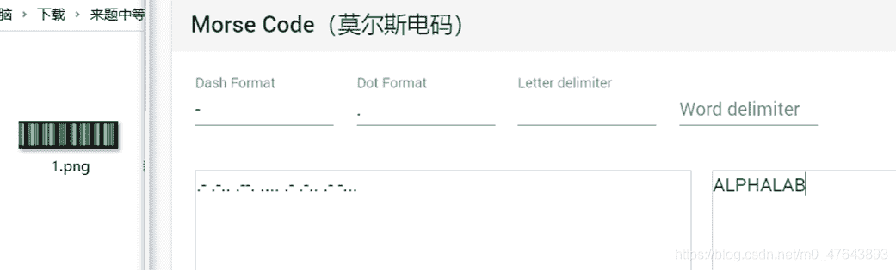

## 伟大的侦探

解压出密码txt文件是一种编码方式提示
然后用010转EBCDIC码,得到解压文件密码
然后图片是跳舞小人按照图表得到flag{iloveholmesandwllm}
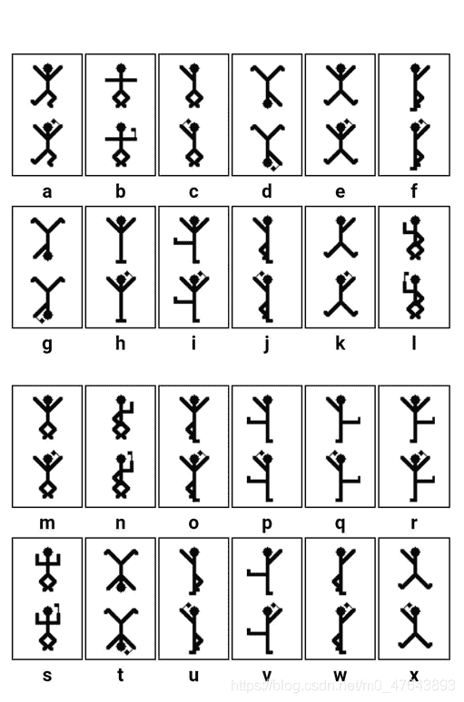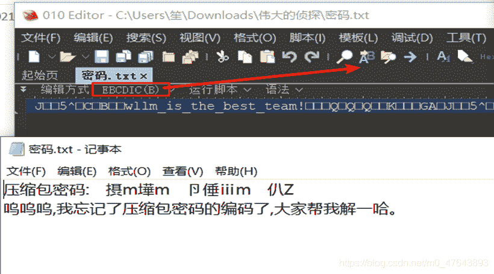

## find_me

在图片备注中找到盲文然后[在线解密](https://www.qqxiuzi.cn/bianma/wenbenjiami.php?s=mangwen)
还有一种方法就是在kali中用exiftool查看也可以找到盲文解密
flag{y$0$u_f$1$n$d$_M$e$e$e$e$e}

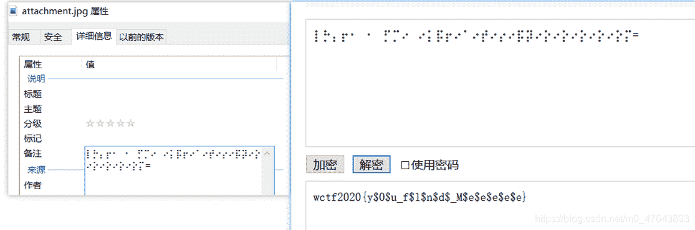

## 黑客帝国

首先解压文件，然后发现一串数字和字母混合，然后用notepad++转acsii编码然后就看到了rar文件解压需要密码然后爆破，打开是一个png图片文件头是png但是后面是jpg改下文件头然后可以打开文件了,里面就是flag
flag{57cd4cfd4e07505b98048ca106132125}

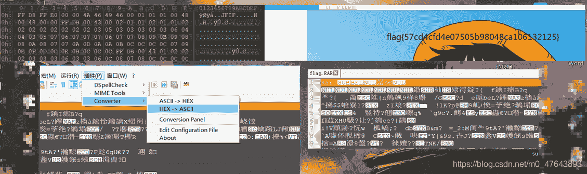

## 弱口令

在winrar下发现备注是摩斯密码然后解密
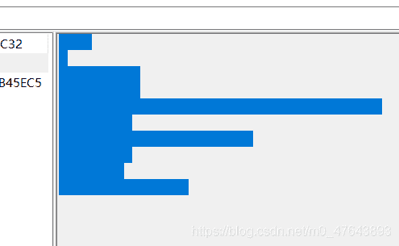应该就是压缩包的密码，然后里面是一张图片
色道理没有发现lsb加密，最后看了人家的wp是脚本lsb加密
这里要用python2同时还要安装非常多的库

Pip install pycryptodome

Pip install Crypto

Pip install matplotlib

Pip install numpy

然后解密即可
命令

```
python lsb.py extract 1.png 1.txt 123456 
```

打开txt文件然后就得到了flag
flag{jsy09-wytg5-wius8}

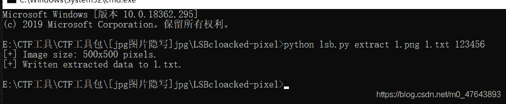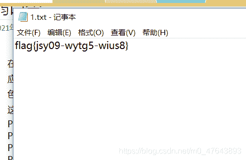

## 你有没有好好看网课?

首先解压，看到两个压缩包然后依次看伪加密都没有，直接爆破密码只出来一个，里面word提示两个数字在视频中对应寻找第一个是一个敲击吗，第二个是base64敲击码翻译之后和第一个敲击吗翻译的拼接应该就是上一个压缩包的密码解压只有在图片中010找到
flag{A2e_Y0u_Ok?}

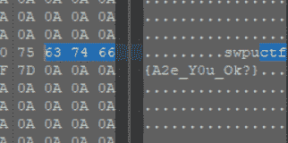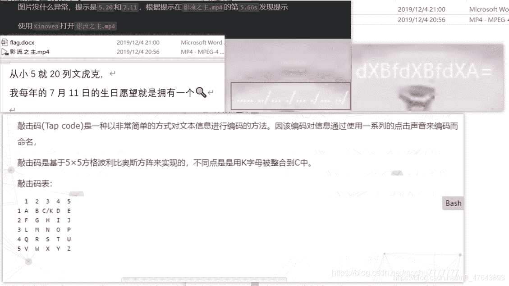

## 你能看懂音符吗

拿到压缩包，winrar提示压缩包损坏，直接用自带工具修复，然后打开是一个word文件然后里面有音符，但是不嫩复制，我们用翻译然后上面就可以复制了，直接用[在线解密网站解密](https://www.qqxiuzi.cn/bianma/wenbenjiami.php?s=yinyue)即可得到
flag{thEse_n0tes_ArE_am@zing~}

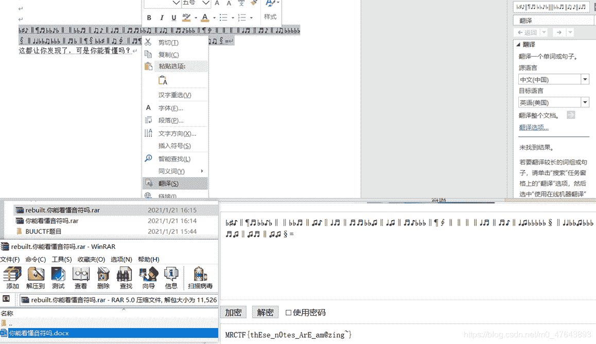

## john-in-the-middle

导出http文件，然后有很多的图片一张最明显的就是旗子，然后用stegslove打开色道上就看到了
flag{J0hn_th3_Sn1ff3r}

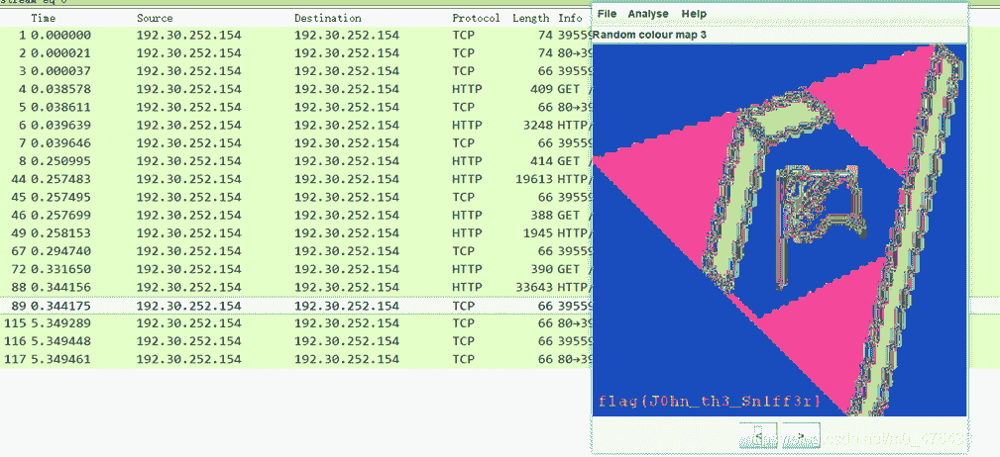看了wp说是用图片对比，但是这样也可以做出来，其实是一样的根本就不用

## KO

打开就是ok码然后[在线解码](https://www.splitbrain.org/services/ook){ }包起来就是flag{welcome to CTF}

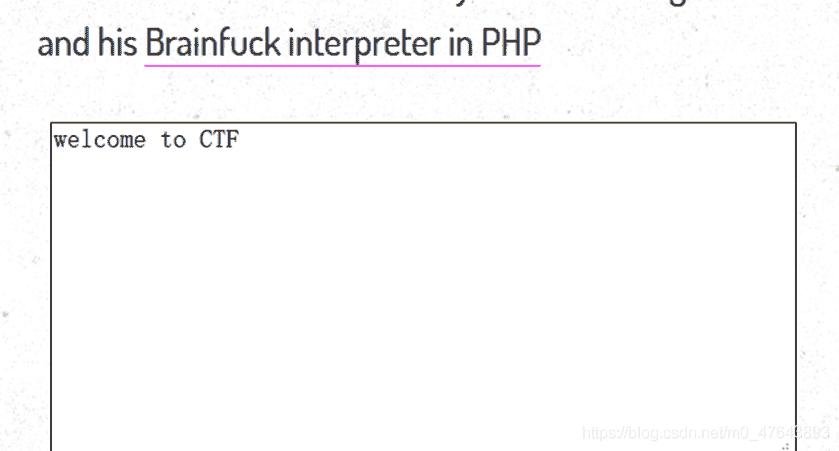

## Caesar

txt文件中直接说明这是个什么编码直接百度是凯撒，然后直接用工具解密，即可得到flag
flag{flagiscaesar}

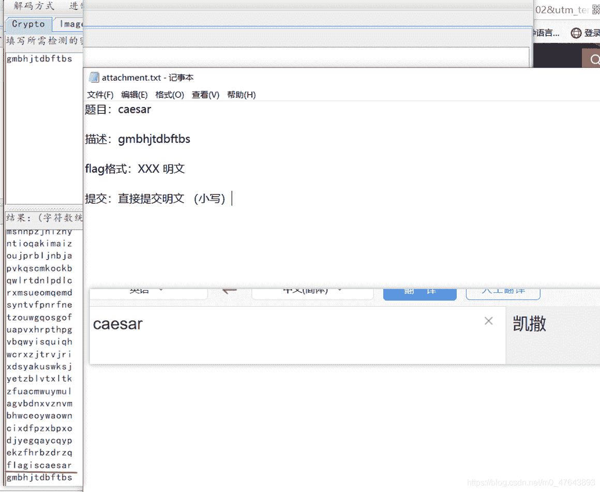

## Zip

看到压缩包只有4字节，所以认为是CRC32然后找脚本爆破一下。

```
import zipfile
import string
import binascii

def CrackCrc(crc):
    for i in dic:
        for j in dic:
            for p in dic:
                for q in dic:
                    s = i + j + p + q
                    if crc == (binascii.crc32(s) & 0xffffffff):
                        #print s
                        f.write(s)
                        return

def CrackZip():
    for I in range(68):
        file = 'out' + str(I) + '.zip'
        f = zipfile.ZipFile(file, 'r')
        GetCrc = f.getinfo('data.txt')
        crc = GetCrc.CRC
        #以上3行为获取压缩包CRC32值的步骤
        #print hex(crc)
        CrackCrc(crc)

dic = string.ascii_letters + string.digits + '+/='

f = open('out.txt', 'w')
CrackZip()
f.close() 
```

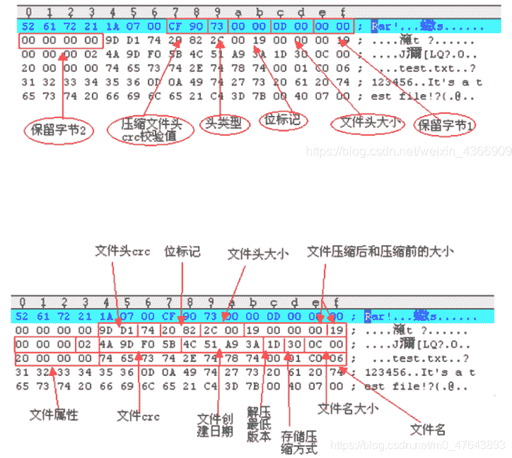
然后的到base64然后解码一下可以用[在线网站](https://the-x.cn/base64)，但是推荐用notepad++。在010里可以看到看到文件尾是rar文件然后把，文件头加上就可以了，直接用winrar打开在备注里看到了flag{nev3r_enc0de_t00_sm4ll_fil3_w1th_zip}

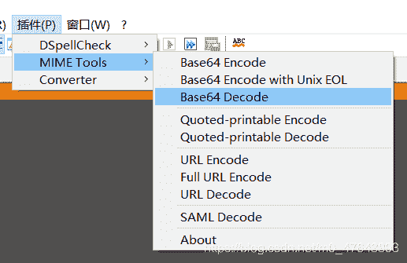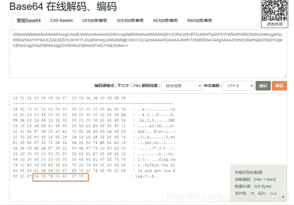

## Ezmisc

找了很久没有找到然后想到png的高度隐写(脚本前面有去找找吧~)，跑一下居然就得到了flagflag{1ts_vEryyyyyy_ez!}

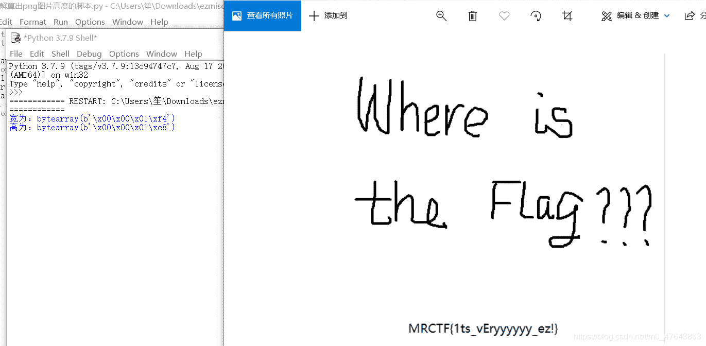

## 低个头

低头看然后划一下就是ctf就是flag{CTF}

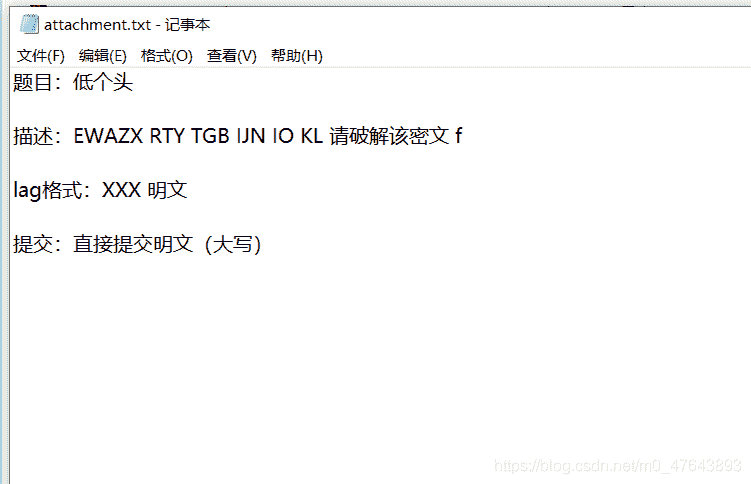

## SXMgdGhpcyBiYXNlPw==

看到很多base64然后跑下脚本隐写和多次编码
然后隐写跑出来了flag
flag{fazhazhenhaoting}

```
def get_base64_diff_value(s1, s2):
    base64chars = 'ABCDEFGHIJKLMNOPQRSTUVWXYZabcdefghijklmnopqrstuvwxyz0123456789+/'
    res = 0
    for i in xrange(len(s2)):
        if s1[i] != s2[i]:
            return abs(base64chars.index(s1[i]) - base64chars.index(s2[i]))
    return res

def solve_stego():
    with open('flag.txt', 'rb') as f:
        file_lines = f.readlines()
        bin_str = ''
        for line in file_lines:
            steg_line = line.replace('\n', '')
            norm_line = line.replace('\n', '').decode('base64').encode('base64').replace('\n', '')
            diff = get_base64_diff_value(steg_line, norm_line)
            print diff
            pads_num = steg_line.count('=')
            if diff:
                bin_str += bin(diff)[2:].zfill(pads_num * 2)
            else:
                bin_str += '0' * pads_num * 2
            print goflag(bin_str)

def goflag(bin_str):
    res_str = ''
    for i in xrange(0, len(bin_str), 8):
        res_str += chr(int(bin_str[i:i + 8], 2))
    return res_str

if __name__ == '__main__':
    solve_stego() 
```

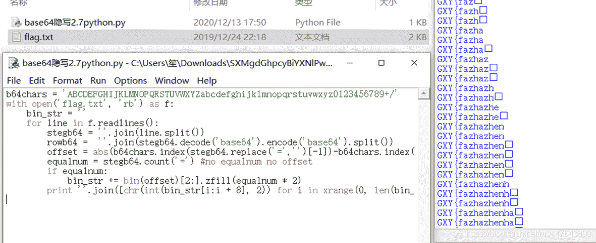

## NTFS数据流

提示了NTFS隐写然后解压出来的flag文件直接扫一下然后排序就找到了隐写，导出即可得到flag
ACTF{AAAds_nntfs_ffunn?}

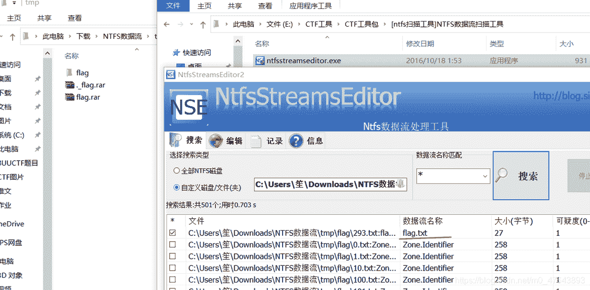

# 总结

敬请期待………………