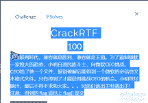
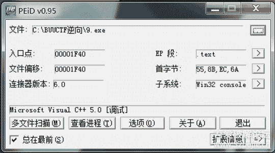
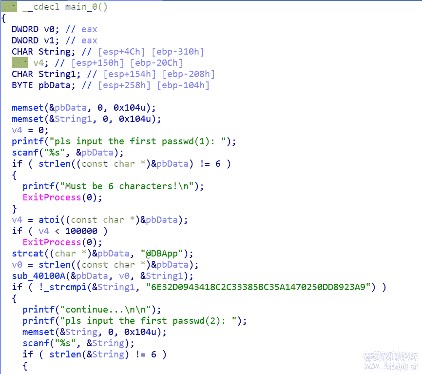
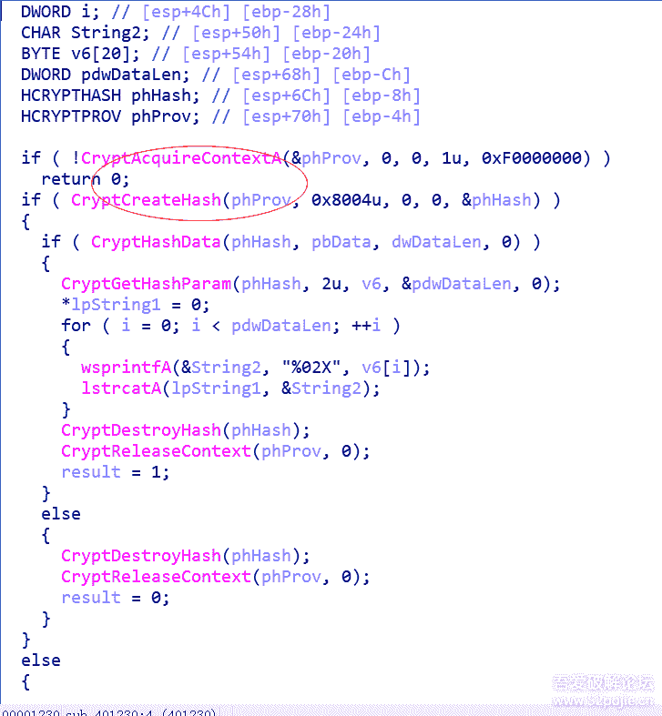
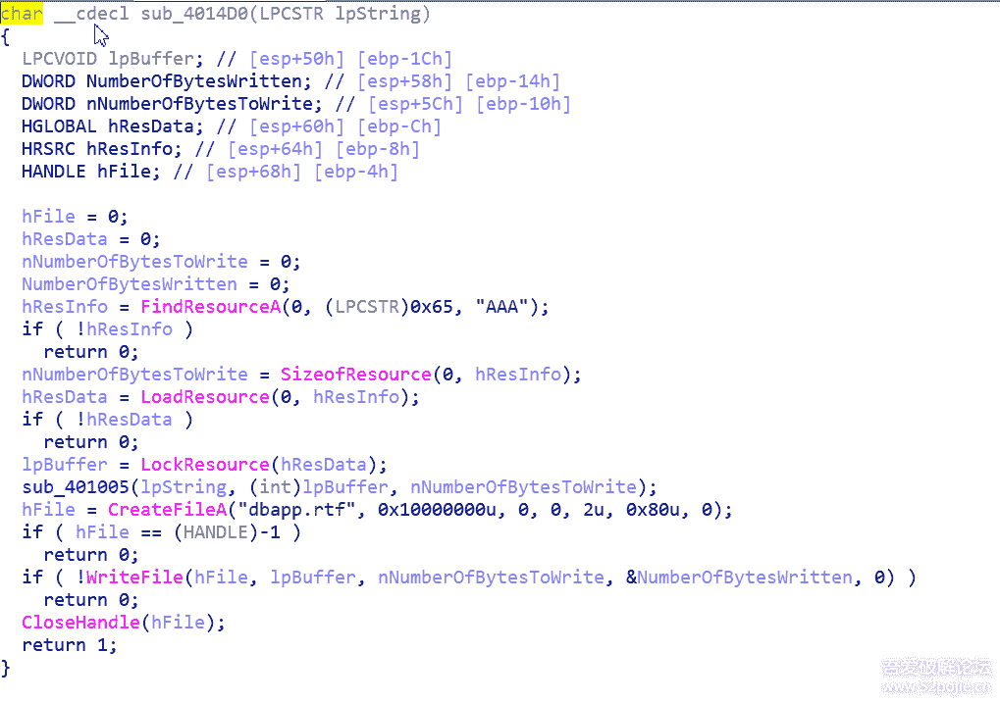
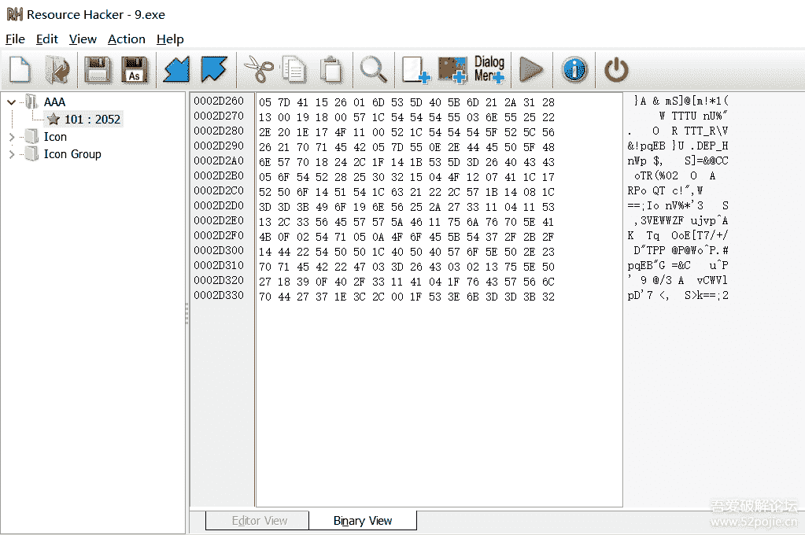
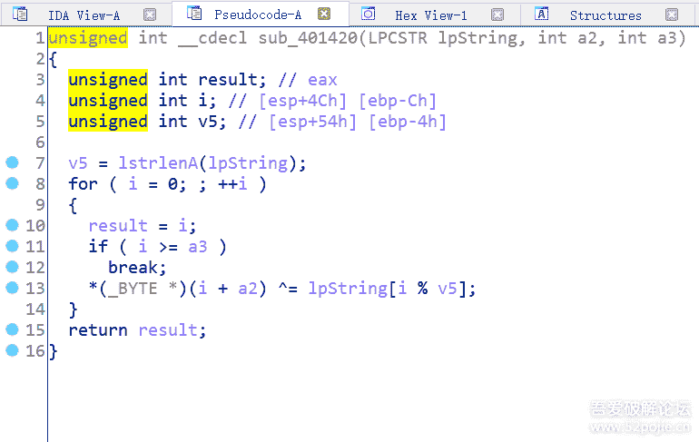
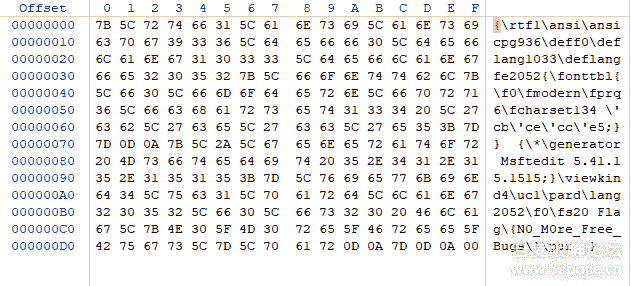

<!--yml
category: 未分类
date: 2022-04-26 14:37:42
-->

# BUUCTF中CrackRTF题详细解法_F10W3RDANC3的博客-CSDN博客

> 来源：[https://blog.csdn.net/DALE1186487104/article/details/97016976](https://blog.csdn.net/DALE1186487104/article/details/97016976)

 

首先拿到题目，分析一波有没有加壳：（题目和注册机我会放到压缩包里的）
 
发现是VC++ 5.0 那我们直接进[IDA](https://www.52pojie.cn/thread-675251-1-1.html)里
先搜索字符串，F5大法好，得到的是这样的界面
 
观察第一部分输入的是六个字符，且大于100000，那么我们判断是6位数字
atoi函数是将数字转化为字符串。后面用STRcat函数将"@DBApp"接到输入的字符串后进入加密函数加密与"6E32D0943418C2C33385BC35A1470250DD8923A9"进行对比：
进入加密函数
 
对相关函数进行百度，发现这些是hash的加密函数，0x8004u是标识码，不同的标识码代表不同的加密方式
标识符代表加密方式
通过查询知道了这是sh1加密，通过python的hashlib包可以进行爆[破解](https://www.52pojie.cn/)密

| 1234567 | `import` `hashlib``for` `i` `in` `range``(``100000``,``999999``):``h2` `=` `hashlib.sha1(``str``(i)``+``flag2)``flags` `=` `h2.hexdigest()``if` `"6e32d0943418c2c33385bc35a1470250dd8923a9"` `=``=` `flags:``print` `(``str``(i)``+``flag2)``print` `flags` |

进行爆破可以得到第一部分的password：123321@DBApp
接下来进行第二部分；
和第一部分的流程差不多，
不同的是，第二部分的六位密码是接在前面破解的密码前面进行加密，并且进行对比
但是这次不一样的是，这次没有给定六位密码的范围（上一次是给定数字大于100000）爆破是在想peach
我们进入函数看一下，发现标识码是0x8003u  MD5加密，
但是可惜的是，百度找到的MD5解密不是要付费就是没用，只能另找途径，
我们看加密函数的下面一个判断函数sub_40100F
 
又是一堆看不懂的函数，看来百度才是王道，
进行一番百度之后，发现是从AAA的文件中取出字符和密码进行异或（异或函数在sub_401005）
这个时候就要用到一个软件：可以直接查看文件中的资源的工具——ResourceHacker
对该程序进行分析，发现是一堆字符串：
 
我们再进异或函数进行查看：
 
a2就是AAA中得到的首部指针，v5是字符串的长度，也就是密码的长度。
整理一下，在进行异或完之后会生成一个RTF文件；
这个时候我们不妨打开一个RTF文件来查看它的头部
 
头部特征位：{\rtfl
这个时候我们思考一下逻辑：
密码一共 6+6+@DBApp=18位
如果按照循环异或的话，前六位应该就是文件的标志位
（这是一个偷鸡的点）我们取文件标志位前六位和AAA文件中的前六位进行异或

| 123456789 | `s` `=` `"{\\rtf1"``a` `=` `[``0x05``,``0x7D``,``0x41``,``0x15``,``0x26``,``0x01``]``flag` `=` `""``for` `i` `in` `range``(``0``,``len``(s)):``x` `=` `ord``(s[i]) ^ a[i]``flag` `+``=` `chr``(x)``print``(flag)` |

得到前六位密码：~!3a@0
ok，运行完整个程序之后就会得到Flag
Flag{N0_M0re_Free_Bugs}[size=13.3333px]PS：我这篇帖子真的很感谢之前做出这道题的表哥们，在此感谢

题目相关链接：https://pan.baidu.com/s/1-nA4xerNGeTvgsOLuADkvg
提取码：e4qi