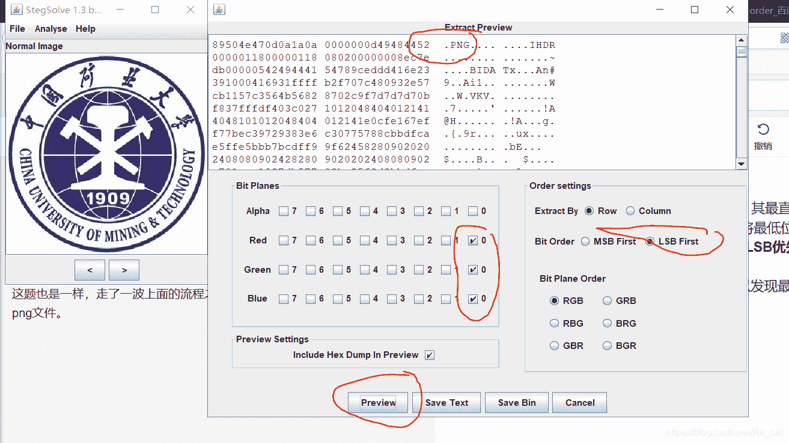
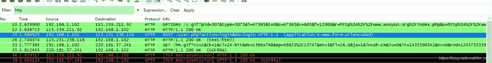
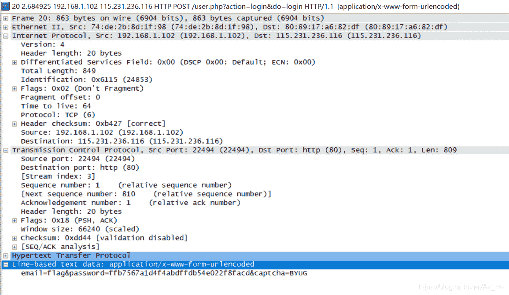
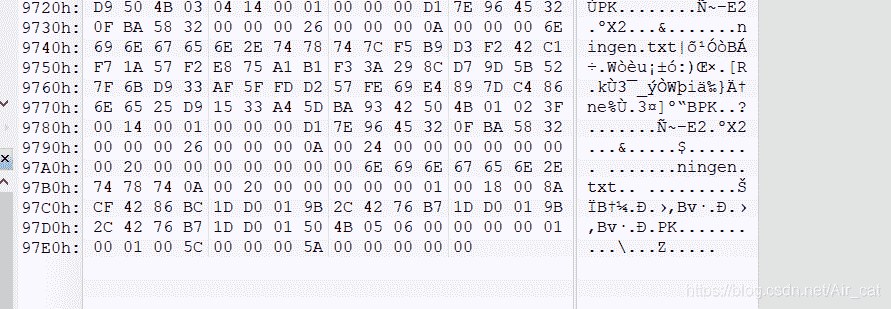
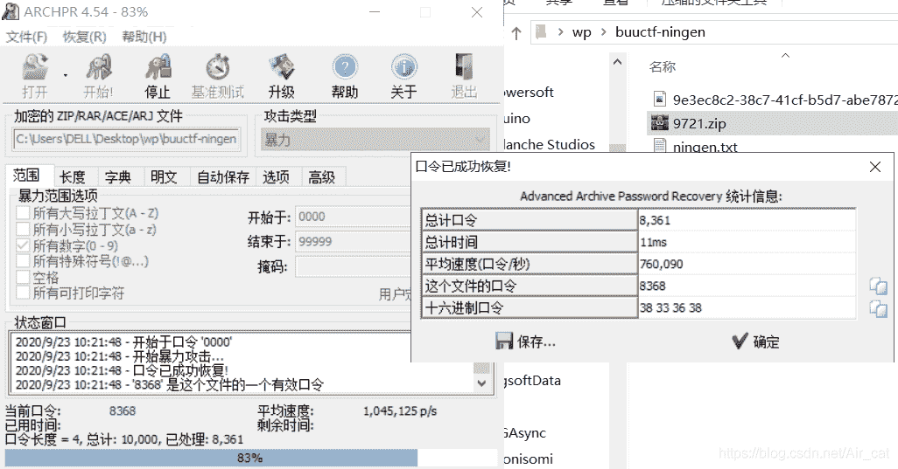
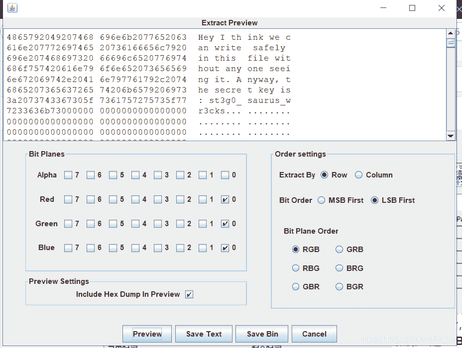

<!--yml
category: 未分类
date: 2022-04-26 14:51:43
-->

# BUUCTF杂项（misc）题练习记录 -- （3）_Air_cat的博客-CSDN博客

> 来源：[https://blog.csdn.net/Air_cat/article/details/108746966](https://blog.csdn.net/Air_cat/article/details/108746966)

### LSB

LSB – Least Significant Bit 即**最低有效位隐写**，其最直接的解法是运用**stegsolver**的**anlayze**的**data extract**功能，将最低位（红绿蓝的0位）0勾选上，右侧的**比特序（bit order）选择LSB优先（LSB first**）。之后右下角可以用**preview**生成数据。
这题也是一样，走了一波上面的流程之后，可以发现最低有效里隐写了一张png文件：
之后再选择下方的save bin，就可以将这个隐写的图片报存下来。
发现其为一张二维码，扫码后可得flag：


### 文件中的秘密

图片文件的常规审阅，在详细信息里找到了flag flag{870c5a72806115cb5439345d8b014396}

### wireshark

先对http协议部分进行审查（左上部的Filter输入http）
非常明显，那个POST很可疑，甚至后面显示是走的login页面
进去查看最后的Line-based text data 可以发现password – 即flag字串


flag{ffb7567a1d4f4abdffdb54e022f8facd}

### ningen

表面上看不出什么，不过看一波hex就发现里面藏东西了。

（misc多用hex看看，然后一般是直接去看文件底部，因为正常情况下只有藏在文件底部才不会破坏其完整性）
走一波kali的binwalk

```
binwalk -e 文件名 
```

掏出来一个zip和txt，txt里面没东西，很明显是要我们解zip了。
因为我的kali莫名其妙的没有fcrackzip，所以我用了win的ARCHPR，发现也很快，拖进去就爆出来了


flag{b025fc9ca797a67d2103bfbc407a6d5f}

### 镜子里面的世界

很惭愧，这题我还是看大师傅们的题解做出来的，本来想的是可能走一波放大，或者里面藏东西了什么的，后面发现，这种没藏东西还几百k的图片，很可能就是走了LSB隐写。
依照第一题**LSB**可解。


flag{st3g0_ saurus_wr3cks}