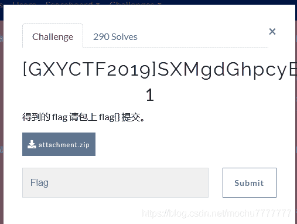

<!--yml
category: 未分类
date: 2022-04-26 14:47:18
-->

# BUUCTF：[GXYCTF2019]SXMgdGhpcyBiYXNlPw==_末 初的博客-CSDN博客

> 来源：[https://blog.csdn.net/mochu7777777/article/details/109463575](https://blog.csdn.net/mochu7777777/article/details/109463575)

> 题目地址：https://buuoj.cn/challenges#[GXYCTF2019]SXMgdGhpcyBiYXNlPw==



```
PS C:\Users\Administrator\Desktop> php -r "var_dump(base64_decode('SXMgdGhpcyBiYXNlPw=='));"
string(13) "Is this base?" 
```

题目`flag.txt`

```
Q2V0dGUgbnVpdCwK
SW50ZW5hYmxlIGluc29tbmllLAp=
TGEgZm9saWUgbWUgZ3VldHRlLAo=
SmUgc3VpcyBjZSBxdWUgamUgZnVpcwp=
SmUgc3ViaXMsCt==
Q2V0dGUgY2Fjb3Bob25pZSwK
UXVpIG1lIHNjaWUgbGEgdOmUmnRlLAp=
QXNzb21tYW50ZSBoYXJtb25pZSwK
RWxsZSBtZSBkaXQsCo==
VHUgcGFpZXJhcyB0ZXMgZGVsaXRzLAp=
UXVvaSBxdSdpbCBhZHZpZW5uZSwK
T24gdHJh5Y2vbmUgc2VzIGNoYeWNr25lcywK
U2VzIHBlaW5lcywK
SmUgdm91ZSBtZXMgbnVpdHMsCm==
QSBsJ2Fzc2FzeW1waG9uaWUsCl==
QXV4IHJlcXVpZW1zLAr=
VHVhbnQgcGFyIGRlcGl0LAq=
Q2UgcXVlIGplIHNlbWUsCt==
SmUgdm91ZSBtZXMgbnVpdHMsCp==
QSBsJ2Fzc2FzeW1waG9uaWUsCp==
RXQgYXV4IGJsYXNwaGVtZXMsCo==
Sidhdm91ZSBqZSBtYXVkaXMsCl==
VG91cyBjZXV4IHF1aSBzJ2FpbWVudCwK
TCdlbm5lbWksCu==
VGFwaSBkYW5zIG1vbiBlc3ByaXQsCp==
RumUmnRlIG1lcyBkZWZhaXRlcywK
U2FucyByZXBpdCBtZSBkZWZpZSwK
SmUgcmVuaWUsCq==
TGEgZmF0YWxlIGhlcmVzaWUsCh==
UXVpIHJvbmdlIG1vbiDplJp0cmUsCo==
SmUgdmV1eCByZW5h5Y2vdHJlLAp=
UmVuYeWNr3RyZSwK
SmUgdm91ZSBtZXMgbnVpdHMsCn==
QSBsJ2Fzc2FzeW1waG9uaWUsCq==
QXV4IHJlcXVpZW1zLAp=
VHVhbnQgcGFyIGRlcGl0LAq=
Q2UgcXVlIGplIHNlbWUsCo==
SmUgdm91ZSBtZXMgbnVpdHMsCm==
QSBsJ2Fzc2FzeW1waG9uaWUsCl==
RXQgYXV4IGJsYXNwaGVtZXMsCm==
Sidhdm91ZSBqZSBtYXVkaXMsCu==
VG91cyBjZXV4IHF1aSBzJ2FpbWVudCwK
UGxldXJlbnQgbGVzIHZpb2xvbnMgZGUgbWEgdmllLAp=
TGEgdmlvbGVuY2UgZGUgbWVzIGVudmllcywK
U2lwaG9ubmVlIHN5bXBob25pZSwK
RGVjb25jZXJ0YW50IGNvbmNlcnRvLAq=
SmUgam91ZSBzYW5zIHRvdWNoZXIgbGUgRG8sCo==
TW9uIHRhbGVudCBzb25uZSBmYXV4LAp=
SmUgbm9pZSBtb24gZW5udWksCo==
RGFucyBsYSBtZWxvbWFuaWUsCl==
SmUgdHVlIG1lcyBwaG9iaWVzLAq=
RGFucyBsYSBkZXNoYXJtb25pZSwK
SmUgdm91ZSBtZXMgbnVpdHMsCv==
QSBsJ2Fzc2FzeW1waG9uaWUsCn==
QXV4IHJlcXVpZW1zLAp=
VHVhbnQgcGFyIGRlcGl0LAo=
Q2UgcXVlIGplIHNlbWUsCm==
SmUgdm91ZSBtZXMgbnVpdHMsCp==
QSBsJ2Fzc2FzeW1waG9uaWUsCm==
RXQgYXV4IGJsYXNwaGVtZXMsCu==
Sidhdm91ZSBqZSBtYXVkaXMsCm==
VG91cyBjZXV4IHF1aSBzJ2FpbWVudCwK
SmUgdm91ZSBtZXMgbnVpdHMsCn==
QSBsJ2Fzc2FzeW1waG9uaWUgKGwnYXNzYXN5bXBob25pZSksCn==
Sidhdm91ZSBqZSBtYXVkaXMsCt==
VG91cyBjZXV4IHF1aSBzJ2FpbWVudA== 
```

base64隐写，脚本如下：

```
def get_base64_diff_value(s1, s2):
    base64chars = 'ABCDEFGHIJKLMNOPQRSTUVWXYZabcdefghijklmnopqrstuvwxyz0123456789+/'
    res = 0
    for i in xrange(len(s2)):
        if s1[i] != s2[i]:
            return abs(base64chars.index(s1[i]) - base64chars.index(s2[i]))
    return res

def solve_stego():
    with open('flag.txt', 'rb') as f:
        file_lines = f.readlines()
        bin_str = ''
        for line in file_lines:
            steg_line = line.replace('\n', '')
            norm_line = line.replace('\n', '').decode('base64').encode('base64').replace('\n', '')
            diff = get_base64_diff_value(steg_line, norm_line)
            print diff
            pads_num = steg_line.count('=')
            if diff:
                bin_str += bin(diff)[2:].zfill(pads_num * 2)
            else:
                bin_str += '0' * pads_num * 2
            print goflag(bin_str)

def goflag(bin_str):
    res_str = ''
    for i in xrange(0, len(bin_str), 8):
        res_str += chr(int(bin_str[i:i + 8], 2))
    return res_str

if __name__ == '__main__':
    solve_stego() 
```

运行结果如下：

```
PS D:\Tools\Misc\Base64_Stego> python2 .\Steg_Base64.py
0

1

0

1

13
G
0
G
1
G
0
G
8
GX
1
GX
0
GX
0
GX
0
GX
6
GX
5
GXY
3
GXY
2
GXY
13
GXY{
9
GXY{
9
GXY{f
8
GXY{f
5
GXY{fa
0
GXY{fa
14
GXY{fa
9
GXY{faz
0
GXY{faz
0
GXY{faz
10
GXY{faz
1
GXY{fazh
8
GXY{fazh
1
GXY{fazha
0
GXY{fazha
7
GXY{fazha
10
GXY{fazhaz
1
GXY{fazhaz
2
GXY{fazhaz
8
GXY{fazhazh
6
GXY{fazhazh
5
GXY{fazhazhe
6
GXY{fazhazhe
14
GXY{fazhazhen
0
GXY{fazhazhen
1
GXY{fazhazhen
0
GXY{fazhazhen
0
GXY{fazhazhen
2
GXY{fazhazhen
8
GXY{fazhazhenh
1
GXY{fazhazhenh
8
GXY{fazhazhenh
5
GXY{fazhazhenha
2
GXY{fazhazhenha
0
GXY{fazhazhenha
15
GXY{fazhazhenhao
7
GXY{fazhazhenhao
1
GXY{fazhazhenhao
0
GXY{fazhazhenhaot
6
GXY{fazhazhenhaot
9
GXY{fazhazhenhaoti
6
GXY{fazhazhenhaoti
14
GXY{fazhazhenhaotin
6
GXY{fazhazhenhaotin
0
GXY{fazhazhenhaotin
7
GXY{fazhazhenhaoting
7
GXY{fazhazhenhaoting
13
GXY{fazhazhenhaoting}
0
GXY{fazhazhenhaoting} 
```

```
flag{fazhazhenhaoting} 
```