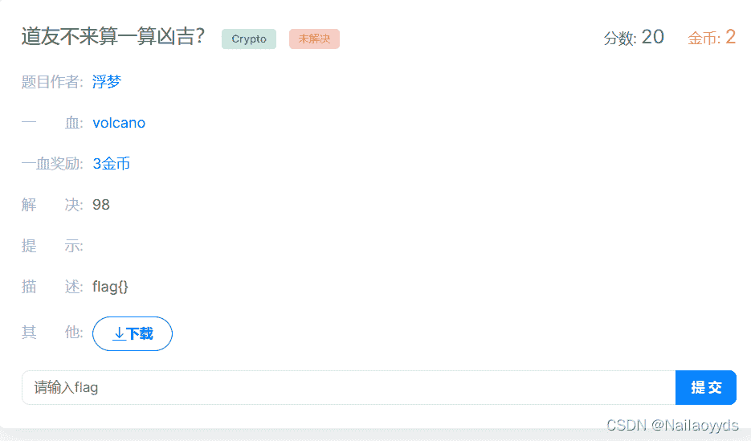
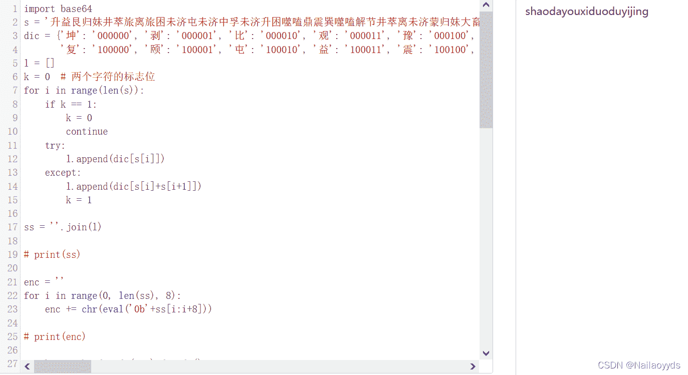

<!--yml
category: 未分类
date: 2022-04-26 14:40:01
-->

# BugKu-CTF(解密篇Crypto)---道友不来算一算凶吉？_Nailaoyyds的博客-CSDN博客

> 来源：[https://blog.csdn.net/weixin_53095382/article/details/123914165](https://blog.csdn.net/weixin_53095382/article/details/123914165)

# **目录**

[题目](#%E9%A2%98%E7%9B%AE)

[题解](#%E9%A2%98%E8%A7%A3)

[编码方式](#%E7%BC%96%E7%A0%81%E6%96%B9%E5%BC%8F)

[二进制转字符串](#%E4%BA%8C%E8%BF%9B%E5%88%B6%E8%BD%AC%E5%AD%97%E7%AC%A6%E4%B8%B2)

[bsae64 解密](#bsae64%20%E8%A7%A3%E5%AF%86)

[加密脚本4逆回](#%E5%8A%A0%E5%AF%86%E8%84%9A%E6%9C%AC4%E9%80%86%E5%9B%9E)

[加密脚本5逆回](#%E5%8A%A0%E5%AF%86%E8%84%9A%E6%9C%AC5%E9%80%86%E5%9B%9E)

[ 总结](#%C2%A0%E6%80%BB%E7%BB%93)

[ 解出flag​](#%C2%A0%E8%A7%A3%E5%87%BAflag%E2%80%8B)

* * *

# 题目



```
半仙我夜观天象，掐指一算，卜出卦象如下，不知道的有无道友可解此卦。

密文:升益艮归妹井萃旅离旅困未济屯未济中孚未济升困噬嗑鼎震巽噬嗑解节井萃离未济蒙归妹大畜无妄解兑临睽升睽未济无妄遁涣归妹

嗯？为什么还有a和b呢?
a=5
b=7 
```

```
# -- coding:UTF-8 --
from secret import flag

def encrpyt5():
    enc=''
    for i in flag:
        enc+=chr((a*(ord(i)-97)+b)%26+97)
    return(enc)

def encrypt4():
    temp=''
    offset=5
    for i in range(len(enc)):
        temp+=chr(ord(enc[i])-offset-i)
    return(temp) 
```

# 题解

## 编码方式

```
易经有64卦 采用编码 000000 -> 1111111
```

## bsae64 解密

## 加密脚本4逆回

## 加密脚本5逆回

#  总结

此题的代码如下

```
import base64
s = '升益艮归妹井萃旅离旅困未济屯未济中孚未济升困噬嗑鼎震巽噬嗑解节井萃离未济蒙归妹大畜无妄解兑临睽升睽未济无妄遁涣归妹'
dic = {'坤': '000000', '剥': '000001', '比': '000010', '观': '000011', '豫': '000100', '晋': '000101', '萃': '000110', '否': '000111', '谦': '001000', '艮': '001001', '蹇': '001010', '渐': '001011', '小过': '001100', '旅': '001101', '咸': '001110', '遁': '001111', '师': '010000', '蒙': '010001', '坎': '010010', '涣': '010011', '解': '010100', '未济': '010101', '困': '010110', '讼': '010111', '升': '011000', '蛊': '011001', '井': '011010', '巽': '011011', '恒': '011100', '鼎': '011101', '大过': '011110', '姤': '011111',
       '复': '100000', '颐': '100001', '屯': '100010', '益': '100011', '震': '100100', '噬嗑': '100101', '随': '100110', '无妄': '100111', '明夷': '101000', '贲': '101001', '既济': '101010', '家人': '101011', '丰': '101100', '离': '101101', '革': '101110', '同人': '101111', '临': '110000', '损': '110001', '节': '110010', '中孚': '110011', '归妹': '110100', '睽': '110101', '兑': '110110', '履': '110111', '泰': '111000', '大畜': '111001', '需': '111010', '小畜': '111011', '大壮': '111100', '大有': '111101', '夬': '111110', '乾': '111111'}
l = []
k = 0  # 两个字符的标志位
for i in range(len(s)):
    if k == 1:
        k = 0
        continue
    try:
        l.append(dic[s[i]])
    except:
        l.append(dic[s[i]+s[i+1]])
        k = 1

ss = ''.join(l)

# print(ss)

enc = ''
for i in range(0, len(ss), 8):
    enc += chr(eval('0b'+ss[i:i+8]))

# print(enc)

s = base64.b64decode(enc).decode()

# print(s)

def encrypt4(enc):
    temp = ''
    offset = 5
    for i in range(len(enc)):
        temp += chr(ord(enc[i])-offset-i)
    return(temp)

def decrypt4(enc):
    temp = ''
    offset = 5
    for i in range(len(enc)):
        temp += chr(ord(enc[i])+offset+i)
    return(temp)

a, b = 5, 7

def encrpyt5(flag):
    enc = ''
    for i in flag:
        enc += chr((a*(ord(i)-97)+b) % 26+97)
    return(enc)

def decrypt5(flag):
    enc = ''
    for i in flag:
        for k in range(20):
            if (ord(i) - 97 - b+26*k) % a == 0:
                enc += chr((ord(i) - 97 - b + 26 * k) // a + 97)
                break
    return(enc)

print(decrypt5(decrypt4(s))) 
```

##  解出flag

```
flag{shaodayouxiduoduyijing}
```