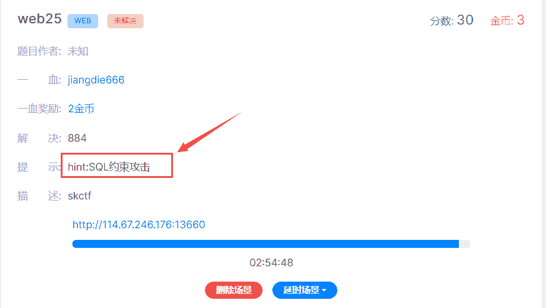
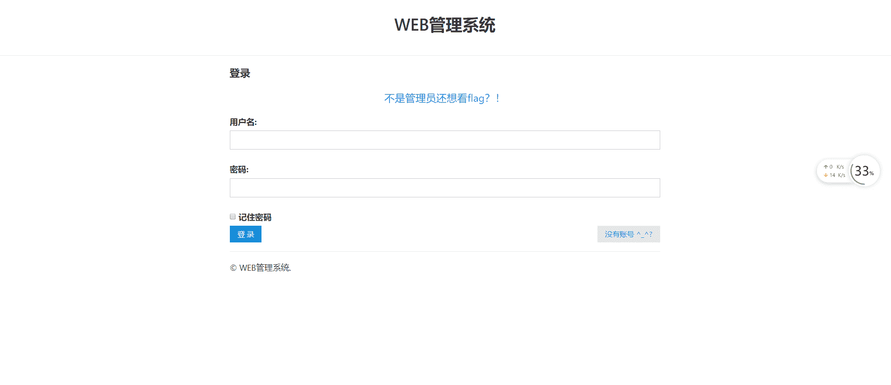
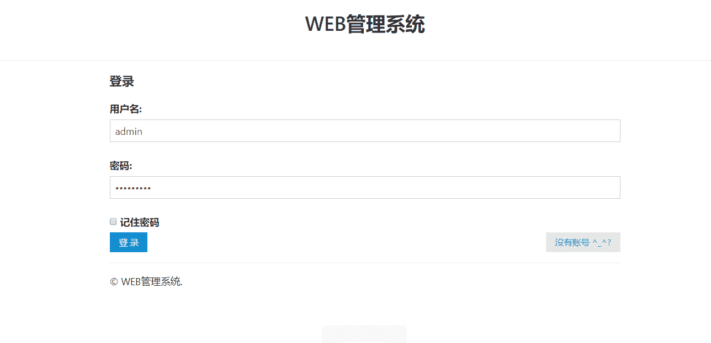
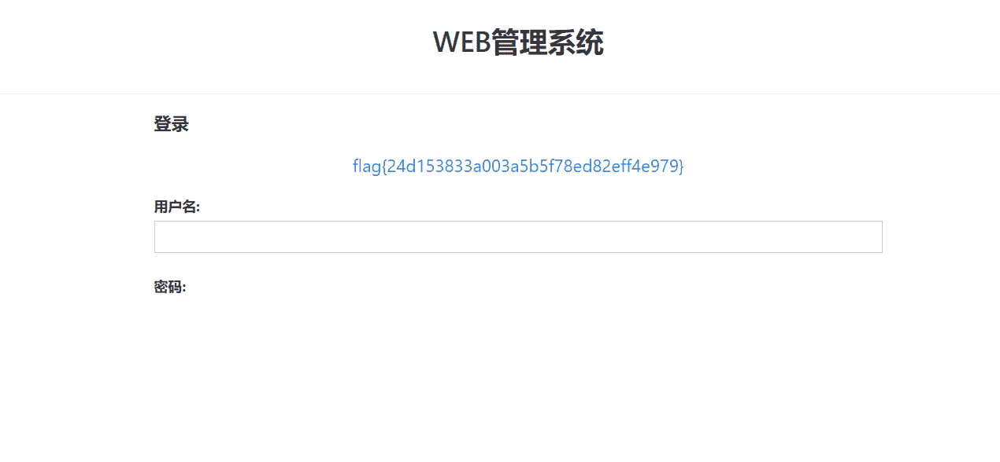

<!--yml
category: 未分类
date: 2022-04-26 14:54:54
-->

# BugKu CTF web25解题思路笔记_曹振国cc的博客-CSDN博客

> 来源：[https://blog.csdn.net/weixin_45736958/article/details/117403714](https://blog.csdn.net/weixin_45736958/article/details/117403714)

<mark>注:关于SQL约束攻击可以查看这篇文章</mark>：[sql注入学习总结](https://www.cnblogs.com/vincy99/p/9642941.html)

* * *

#### 一、打开环境

> 提示：SQL约束攻击

#### 二、注册账号登录

> 发现应该是需要管理员登录才能查看到flag

#### 三、注册admin

> admin +一个或多个空格可以注册

#### 四、登录查看到flag

