<!--yml
category: 未分类
date: 2022-04-26 14:37:33
-->

# BugKuCTF_WEB题解报告_whatacutepanda的博客-CSDN博客_bugku web题解

> 来源：[https://blog.csdn.net/whatacutepanda/article/details/79607030](https://blog.csdn.net/whatacutepanda/article/details/79607030)

在学习CTF中，写点东西记录自己的学习，也算是一个反思吧。

http://ctf.bugku.com/challenges

web2：

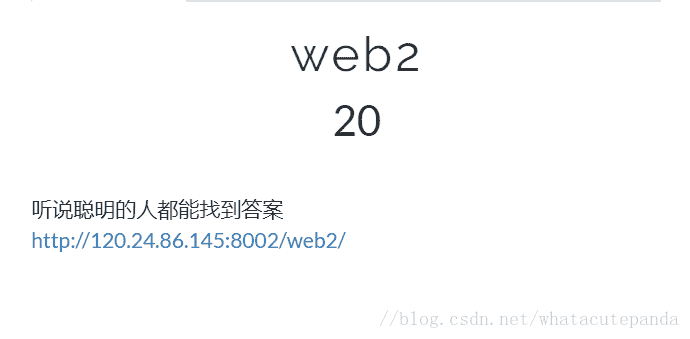

这个只用简单的按F12就能看到

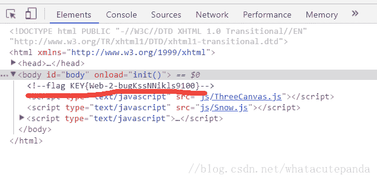

#### 文件上传测试：

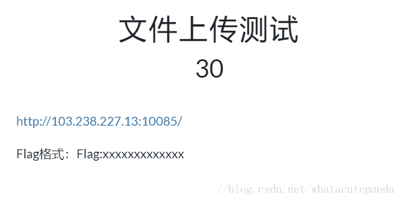

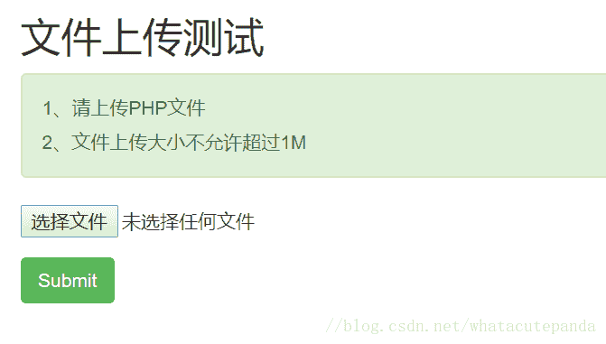

我们首先随便传入一个PHP文件尝试一下

发现提示说非图片文件

那么我们再尝试传入一个图片

然后我们思考一下

题目要求说上传一个PHP文件

但是上传PHP时提示非图片，上传图片时提示非PHP

那我们先尝试上传一个PHP然后用burp抓包将其修改为图片

但我觉得我的想法天真了PHP文件在burp中并没有文件类型所以单纯改变后缀无法欺骗

因此我们改为上传一个图片用burp抓包改为PHP文件

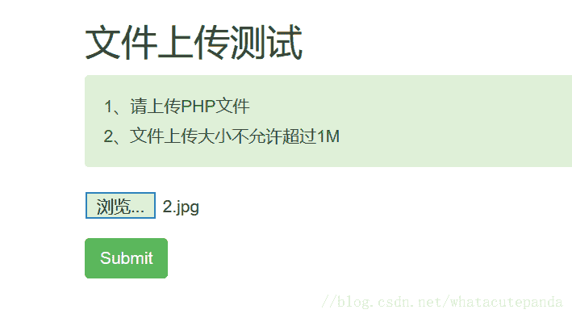

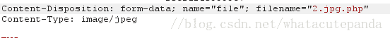

#### 计算器：

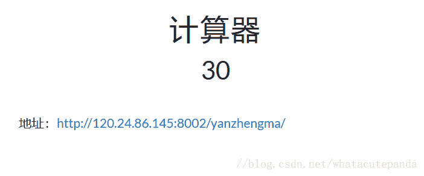

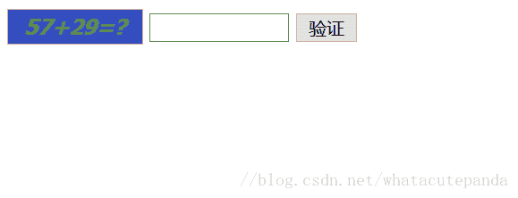

（此题记得允许JS）

验证码计算 发现无法输入结果 只能输入一个数字

所以我们按F12查看源代码

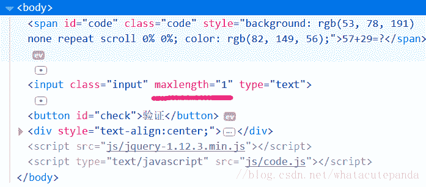

我们发现对输入的长度有了限制

所以我们直接把长度改了 把结果输入即可

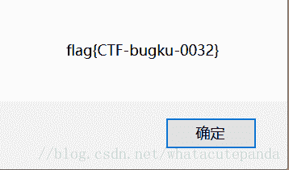

#### web基础$_GET：

我们直接在URL中GET即可

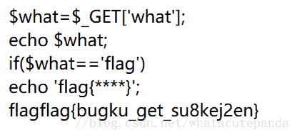

#### web基础$_POST：

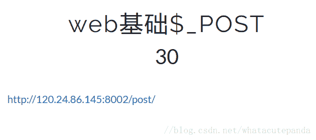

这个简单的POST 我们可以直接利用firefox里面的hackbar附件

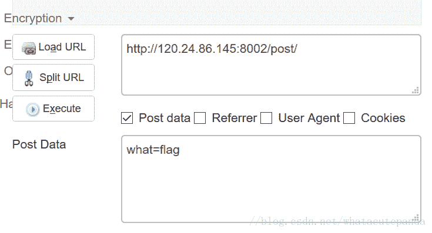

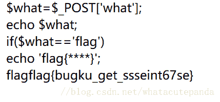

#### 矛盾：

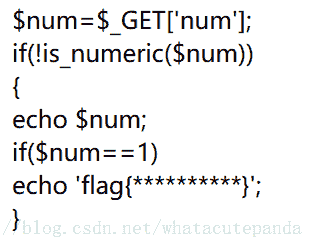

题目要求我们GET一个is_numeric()不是数字而又==1

因此我们想到利用PHP中构造一个1e0

发现并不成功 然后就尝试了1e0.1就可以了

并不清楚为什么 有明白的大佬如果看到求教原理

#### web3：

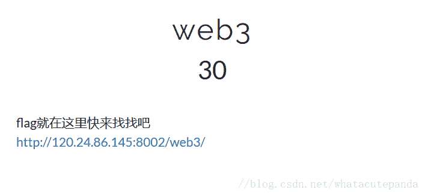

这个题进去之后你会发现一直点确定会一直重复出现

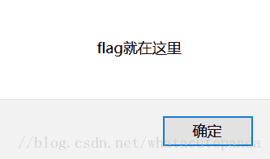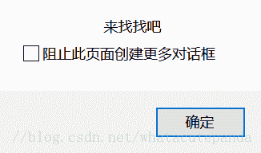

于是我们直接“阻止此页面创建更多的对话框”or禁止JS后再打开

然后我们F12查看源代码

发现里面重复弹窗多次 所以我们直接翻到最下面

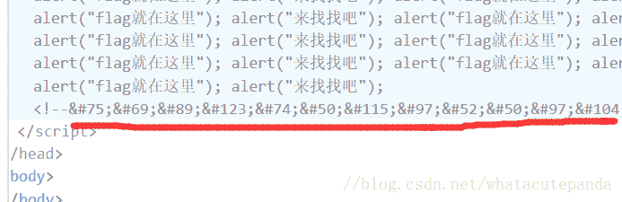

发现其中有&#xxxx格式的“编码”

实际上这是一些转义序列而不是编码（之际上这里我也不懂。。。有懂的大佬请指教）

注：&#后接十进制数字 &#x后面接十六进制数字

直接把这一串序列找个在线转码扔进去就好

