<!--yml
category: 未分类
date: 2022-04-26 14:51:09
-->

# Bugku CTF---哥gie的秘密_3tefanie丶zhou的博客-CSDN博客

> 来源：[https://blog.csdn.net/luochen2436/article/details/121697727](https://blog.csdn.net/luochen2436/article/details/121697727)

### 题目内容

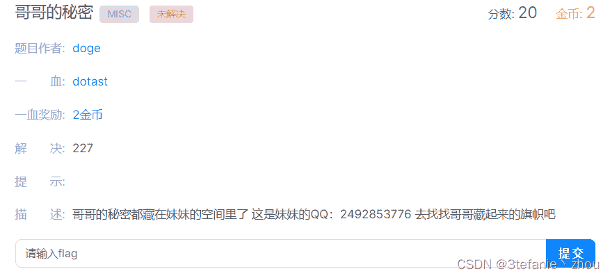

### 解题过程

#### 逛空间收集信息

获取到两个hint

```
hint1：解题流程为：收集空间信息--相册--收集微博信息--相册--解题--相册--提交flag
hint2：解题部分题目需要下载原图才能看到哦 
```

浏览近期的空间动态，获取到4条信息，如下：

```
信息1：flag在相册中 
```


```
信息2：妹妹的名字是刘佳佳 
```


```
信息3：所在地方为四川乐山市 
```

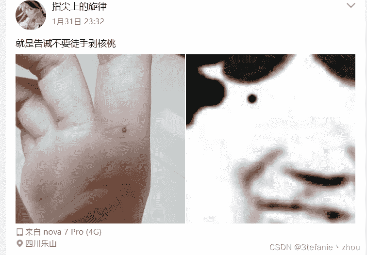

```
信息4：一串乱七八糟的编码 
```


#### 破解乱七八糟字符中的隐藏信息

⠀⡘⠀⡙⠀⡞⠀⡄⣿⠪⡛⣶⡸⠱⠀⠍⡥⣆⡗⠀⡎⢊==
这一串为盲文，找一个在线盲文解密网站
[文本加密为盲文,可自设密码|文本在线加密解密工具](https://www.qqxiuzi.cn/bianma/wenbenjiami.php?s=mangwen)
解密后的明文为：

```
hint：密码=时地人 
```

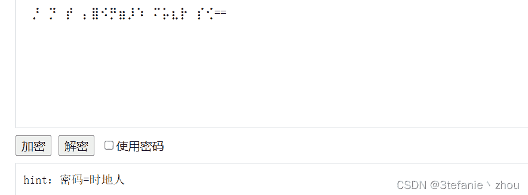
根据hint1的提示，相册的密码和时地人有关，时地人的意思应该是时间地点人物。
从前面获取到的信息2和信息3可知，地点为四川省乐山市，人物为刘佳佳。
还少了时间的信息，回到空间寻找关于时间的动态。
在2020年12月25日的动态中，获悉关键信息：明天是第二个十年
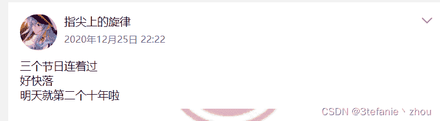
由此，我们可以推算，刘佳佳的出生年月日是2000.12.26
ok,时地人的信息如下：

```
时：2000.12.26或者2020.12.26
地：四川省乐山市
人：刘佳佳 
```

进入相册，发现有三个存放照片的地方
第一个名字为相册，问题是哥哥工作的公司，暂时没有关于哥哥信息，先放一边
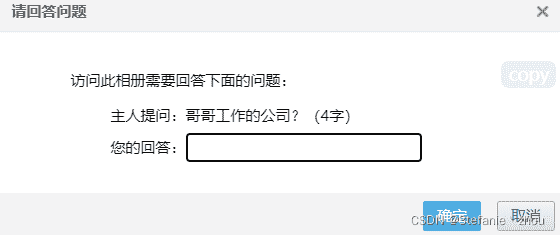
第二个存放照片的地方叫做旗帜（flag），提示我们题目不在这里
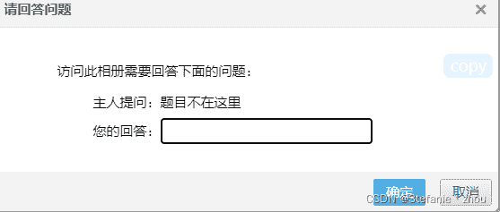
第三个存放照片的地方叫做二维码，问题是2+3+8num=

8num应该是8个数字，目测是刘佳佳的今年生日时间或者出生年月日时间。3的话，可能是名字刘佳佳了，这样的话2应该就关乎于地点了，四川或者乐山。组合一下密码：

```
 四川刘佳佳20201226
	四川刘佳佳20001226
	乐山刘佳佳20201226
	乐山刘佳佳20001226 
```

一一尝试解答相册问题，都不对。把中文换成拼音缩写试试

```
 scljj20201226
	scljj20001226
	lsljj20201226
	lsljj20001226 
```

逐一尝试，最后发现正确的答案为lsljj20001226
拿到二维码
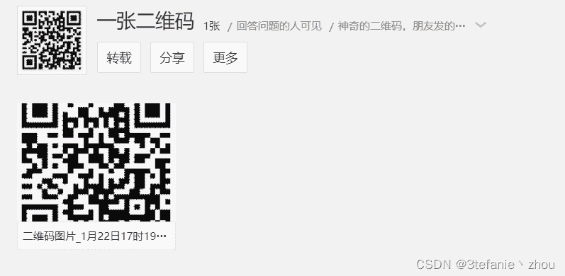

#### 扫描二维码

My MicroBlog name：啊这ovo001
我的微博名字：啊这ovo001


#### 收集微博信息

信息：

```
 人物：哥哥
	公司地址：乐山市
	某号码：2598888 
```

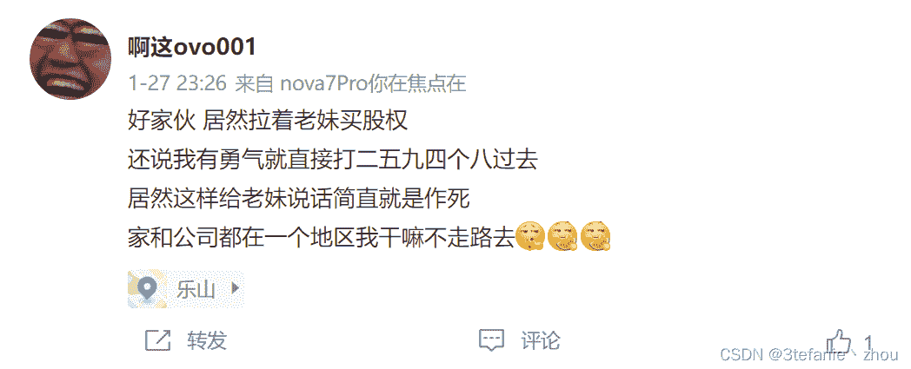
百度查找一下2598888这个号码，地址是乐山市，没错了。
哥哥公司：尚纬股份有限公司
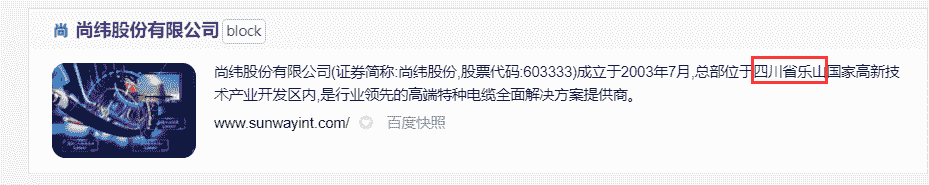
拿到哥哥的公司名字之后，解答相册一的问题

#### 真正的CTF做题现在开始

兜兜转转半天终于拿到了题目，这题目可真难拿丫。


打开相册，得到两张图，如下：
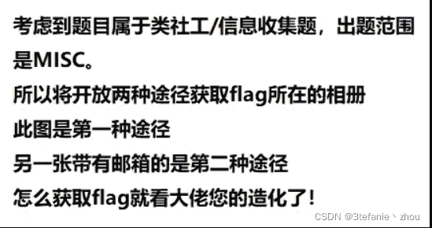

邮箱：a2492853776@163.com

#### 解题:第一种途径

将图片一以原图保存到本地，已知出题范围是misc。所以我先把图片丢到kali中使用binwalk 分析一下。
发现图片中藏了压缩包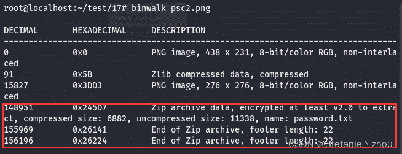
分别使用foremost和binwalk分离，foremost得到一个无密码压缩包
解压得到一个txt和一张图片
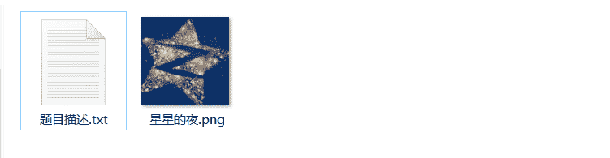
binwalk得到一个有密码的压缩包，其中内容是password.txt
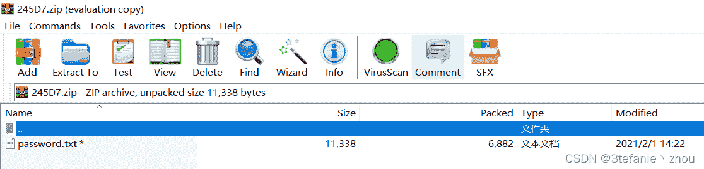

```
以下是题目描述：
噢，我的老兄，很抱歉看了你的照片，这感觉真是太糟了。我是说，虽然隔了这么久，我还是忍不住想用沉默之眼来寻查这之中的秘密。我想你可能对我们的靴子朋友或者屁股老弟有什么偏见，就像我们都以为约翰尼先生总打他的狗，但是事实不是那样的，他们就像兄弟一样，我亲眼所见，我发誓。

题目1：（题目1和题目2都可以得到flag相册密码，自由抉择选择哪条）
找到密码，将密码发送给指定的邮箱，即可获得flag，快来挑战吧！
（密码必须写在主题上而不是内容上） 
```

描述中提到用沉默之眼-SilentEye，所以我们使用这个工具查看隐藏信息
得到key：OhG0dPleaseN0
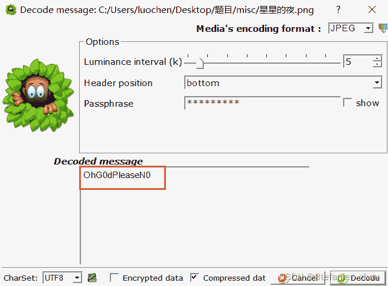
使用key去解压压缩包，得到password.txt内容

```
p​​​​‍​‎​​​​‎‏‍​​​​‌‎‎​​​​‍‏‌​​​​‍​‎​​​​‏‍‍​​​​‎‏‍​​​​‍‏‍​​​​‍​‎​​​​‎‎​​​​​‍‎‍​​​​‎​‏​​​​‍​‎​​​​‎​‌​​​​‏‌​​​​​‏‌‍​​​​‍​‎​​​​‎​‌​​​​‍​​​​​​‎​‎​​​​‍​‎​​​​‏‍‍​​​​‏‌​​​​​‏‎‎​​​​‎‌‏​​​​‌‏‎​​​​‏‎​​​​​‍‍‌assword not here

据说密文前三位是：
Vm0wd2QyUXlVWGxWV0d4V1YwZDRWMVl3WkRSV01WbDNXa1JTVjAxV2JETlhhMUpUVmpBeFYySkVUbGhoTVVwVVZtcEJlRll5U2tWVWJHaG9UVlZ3VlZadGNFSmxSbGw1VTJ0V1ZXSkhhRzlVVmxaM1ZsWmFjVkZ0UmxSTmJFcEpWbTEwYTFkSFNrZGpTRUpYWVRGd2FGcFdXbUZrUjFaSFYyMTRVMkpIZHpGV2EyUXdZekpHYzFOdVVtaFNlbXhXVm1wT1QwMHhjRlpYYlVaclVqQTFSMWRyV2xOVWJVWTJVbFJHVjFaRmIzZFdha1poVjBaT2NtRkhhRk5sYlhoWFZtMHdlR0l4U2tkWGJHUllZbFZhY2xWc1VrZFdiRnBZWlVaT1ZXSlZXVEpWYkZKSFZqSkZlVlZZWkZwbGEzQklXWHBHVDJSV1ZuUmhSazVzWWxob1dGWnRNWGRVTVZGM1RVaG9hbEpzY0ZsWmJGWmhZMnhXY1ZGVVJsTk5WMUo1VmpKNFQxWlhTbFpYVkVwV1lrWktTRlpxUm1GU2JVbDZXa1prYUdFeGNHOVdha0poVkRKT2RGSnJhR2hTYXpWeldXeG9iMWRHV25STldHUlZUVlpHTTFSVmFHOWhiRXB6WTBac1dtSkdXbWhaTW5oWFkxWkdWVkpzVGs1V01VbzFWbXBKTVdFeFdYZE5WVlpUWWtkU1lWUlZXbUZOTVZweFUydDBWMVpyY0ZwWGExcHJZVWRGZUdOR2JGaGhNVnBvVmtSS1RtVkdjRWxVYldoVFRXNW9WVlpHWTNoaU1XUnpWMWhvWVZKR1NuQlVWM1J6VGxaYWRFNVZPVmRpVlhCSVZqSjRVMWR0U2tkWGJXaGFUVzVvV0ZreFdrZFdWa3B6VkdzMVdGSlZjRWxXYlhCTFRrWlJlRmRzYUZSaE1sSnhWVzE0ZDFkR2JITmhSazVPVFZad2VGVXlkREJXTVZweVkwWndXR0V4Y0hKWlZXUkdaVWRPUjJKR2FHaE5WbkJ2Vm10U1MxUXlVa2RVYmtwaFVteEtjRlpxU205bGJHUllaVWM1YVUxWFVraFdNalZUVkd4YVJsTnNhRlZXYkZZMFZHdGFZVmRIVWtoa1JtUk9WakZLU2xkV1ZtRmpNV1IwVTJ0a1dHSlhhR0ZVVnpWdlYwWnJlRmRyWkZkV2EzQjZWa2R6TVZZd01WWmlla1pYWWxoQ1MxUldaRVpsUm1SWldrVTFWMVpzY0ZWWFYzUnJWVEZzVjFWc1dsaGlWVnBQVkZaYWQyVkdWWGxrUkVKWFRWWndlVmt3V25kWFIwVjRZMFJPVjJGcldreFdNVnBIWTIxS1IxcEhiRmhTVlhCS1ZtMTBVMUl5UlhoWFdHeFZZVEZ3YUZWcVNtOVdSbEpZVGxjNVYxWnNjRWhYVkU1dllWVXhXRlZ1Y0ZkTlYyaDJWakJrUzFkV1ZuSlBWbHBvWVRGd1NWWkhlR0ZaVm1SR1RsWmFVRll5YUhCVmJHaENaREZhYzFwRVVtcE5WMUl3VlRKMGExZEhTbGhoUjBaVlZteHdNMWxWV25kU2JIQkhWR3hTVTJFelFqVldSM2hoVkRKR1YxTnVVbEJXUlRWWVZGYzFiMWRHWkZkWGJFcHNVbTFTZWxsVldsTmhWa3AxVVc1b1YxWXphSEpXVkVaelZqRldjMWRzYUdsV1ZuQlFWa1phWVdReVZrZFdXR3hyVWtWS1dGUldXbmRsVm10M1YyNWtXRkl3VmpSWk1HaExWMnhhV0ZWclpHRldWMUpRVldwS1MxSXlSa2hoUlRWWFltdEtNbFp0TVRCVk1VMTRWVmhzVlZkSGVGWlpWRVozWVVaV2NWTnRPVmRTYkVwWlZHeGpOVll4V25OalJXaFlWa1UxZGxsV1ZYaGpiVXBGVld4a1RsWXlhREpXYWtKclV6RktjazVXWkZkaVJscFlWRlJHUzA1c1draGtSMFpYWWxaYVdWWlhkRzloTVVwMFlVWlNWVlpYYUVSVk1uaGhZekZ3UlZWdGNFNVdNVWwzVmxSS01HRXhaRWhUYkdob1VqQmFWbFp0ZUhkTk1XeFdWMjVrVTJKSVFrZFVNVlUxWVZaS1dWRllaRmhpUmxwb1ZrUktSMVl4VW5KWGJGSnBWbFp3V1ZaR1l6RmlNV1JIWWtoR1ZHRXhjSE5WYlRGVFYyeGtjbFpVUmxkTlZuQjZXVEJhVjFkR1duTlRhMmhoVWtWYVlWcFZaRXRUVms1ellVZG9UazFWY0ZkV2JHTjRUa2RSZVZaclpGZFhSM2h5VldwQ1lXTkdWblJsU0dSc1lrWnNOVnBWYUd0WFJrbDNWbXBTV2sxR1NsQldNakZHWlZaV2NscEhSbGROTW1oSlYxUkplRk14U1hsU2EyUm9VbXhLVkZac2FFTlRNVnAwVFZSQ1ZrMVZNVFJXYkdodlYwWmtTR0ZHYkZwaVdHaG9WbXBHYzJNeGNFaFBWbVJUWWxob1lWZFVRbUZoTWtwSVUydG9WbUpIZUdoV2JHUk9UVlpzVjFaWWFGaFNiRnA1V1ZWYWExUnRSbk5YYkZaWFlUSlJNRmxVUms5U01WcDFWR3hvYVZKc2NGbFdSbEpIVXpBMWMxZHJhR3RTTUZwaFZtMTBjMDVXVm5Sa1J6bFdVbXhzTlZsVmFFTldiVXBJWVVWT1lWSkZXbkpXYWtaaFpFVTVWMVpyTlZkaWEwWXpWbXhqZDAxV1RYaFZXR2hZWW1zMVZWbHJaRzlXYkZwMFpVaGtUazFXYkROV01qVkxZa1pLZEZWdWJHRlNWMUl6V1ZaYVlXTnRUa1ppUm1ScFVqRkZkMWRXVWt0U01WbDRWRzVXVm1KRlNsaFZiRkpYVjFaYVIxbDZSbWxOVjFKSVYydGFhMWRIU2taalNFNVdZbFJHVkZwWGVITldiR1J6Vkcxb1YyRXpRWGhXVm1RMFpERlplVk5zYkZaaVIyaG9WV3RXWVZsV2NGWmFSWFJVVm1zMWVsbFZaRzlVYXpGV1kwWmtWMkpIVGpSVWEyUlNaVlphY2xwR1pHbGlSWEJRVm0xNGExVXhXWGhWYkdoclUwZFNXRlJXWkRSbFZscFlUVlZrV0ZKcmJETldiWEJUVjJzeFNHRkZlRmROYm1ob1ZqQmFWMk5zY0VoU2JHUlhUVlZ3VWxac1VrTldhelZYVjFoc1UyRXlhRzlWYkZKWFYwWnNkR1JGZEU1aVJuQXdWRlpTUTFack1WWk5WRkpYVm0xb2VsWnRNVVpsVmxaelZteHdhVmRHU1hwWFYzQkhWakpPVjFSdVVsQldiVkpVV1d4b2IxbFdaRlZSYlVab1RXdFdNMVJXV210aGJFcEdVMjFHVlZaV2NHRmFSRVp6VmpGYVdXRkdhRk5pUm5BMlYxWldZV0V4VW5OWFdHeG9Va1Z3V0ZSV1duZGhSbFkyVW10MGFrMVdTakZXVjNoUFlWWkplRk51WkZkaGEwcFhWRlZWZUZJeFpISmhSM1JUVFVad2RsWkdaSHBOVjFaelYxaHNUMVpyTlc5VVZsWjNUVVphV0U1VlRsZE5hM0JKV1ZWV1UxWnJNWFZoU0VwWFlXdGFhRnBGVlRWV01WcHlUbFprYVdFd1dYcFdiWGhxWkRBeFYxUllhRmhoTW1oVldXdGtiMkl4Vm5GUmJVWlhZa1p3TVZrd1dtdGhNa3BIWWtST1YwMXFWa3haYTFwTFpFWldkV0pIUmxOV01VWXpWbXhTUzFKdFZuTlNia1pZWWtkU2NGVnFSa1prTVZweVZXdDBVMDFXYkRSV1IzaHpZV3hLZFZGck9WVldla1oyVmpGYWExWXhWbkphUjNST1lURndTVlpxU2pSV01WVjVVMnRrYWxORk5WZFpiRkpIVmtaU1YxZHNXbXhXTURReVZXMTRiMVV5UlhwUmJVWlhWbTFSTUZsNlJtdFNNV1IxVld4YVYxSlZjRzlXVjNSWFdWWnNWMk5HV2xoaVdGSnlWbTEwZDJWc1duUk5XRTVYVFZWc05sbFZVbUZXTURGWVZWaGtXRlp0VWxOYVZscGhZMnh3UjFwR2FGTk5NbWcxVm14a2QxUXhWWGxUV0docFUwVTFXRmx0TVZOWFJsSlhWMjVrVGxKdGRETlhhMVpyVjBaSmQyTkZhRnBOUm5CMlZqSnplRk5IUmtabFJtUm9ZVEZ3YjFaWE1UUmhNazUwVm10a1lWSXlhRzlVVkVKTFZXeGFjMXBFVWxwV01GWTFWa1pvYjJGc1NsaGhTRUpXWWxSR2RsWnJXbUZqTWtaR1ZHeFNUbFp1UVhkV1JscFRVVEZhY2sxV1dtbFNSbHBYV1d0a2IyUnNXWGRYYlhSVVVqRmFTRll5ZUhkV01VcFhZak53V0Zac1dtaFdha3BQVmpGU2RWVnNRbGRpVmtwVlYxZDBWMlF4WkhOWGEyaHNVak5DVUZadGVITk9SbGw1VGxVNWFHSkZjRmxaVlZwelZqSkZlRlpZYUdGU00yaDZWbXBHWVZkWFJrZGhSazVwVW0wNU5GWXhVa05aVjBWNFZXNU9XRmRIZUc5VmExWjNWMFpzV0dSRmRHcGlSbGt5VlcweE1GWXdNVmRqUkVaV1RXNW9SRlpxU2t0VFZrWjFWMnhvVjJKRmNFbFhhMUpIVkRGWmVGcElTbWhTTTJoVVZGVmFkMkZHV25STlNHaFdUVlZzTkZaWE5VOVhSMHBXVjJ4a1ZtSllhRE5VVlZwaFYwZE9ObFpzYUdsU2JrSklWa2Q0VjFVeFdsaFRhMlJxVWpKb1YxUlZaRk5YUmxWM1YydDBhMUl3TlVkVWJGcHJWR3hhV0dRemNGZGlXR2hVVlhwQmVGTkdTbGxoUjBaVFZqSm9WbGRYZEd0aU1rbDRWbTVHVW1KVldsaFphMXAzVFZacmQxZHRkR2hOYTNCSVdXdFNUMVl3TVhGV2EzaGFZVEZ3VEZwRldsZGtWMHBJVW14T1YwMVZiRFpXTVZwaFdWWnNXRlJ1VWxWaE1YQndWVzB4VTJOR1ZuRlNhMXByVFZkU1dGWlhkREJWTURGWVZXdG9WazF1YUhwWFZscEtaV3hHYzFWc1pHaGhlbFl5Vm1wR1lXRXhaRWhXYTJoUVZtdHdUMVp0ZEhkVFZtUlZVVzFHYVUxcldqQldiVFZMVjBkS1NHRkdXbGRpVkVaVVZtdGFkMWRIVmtsVWJHUnBVakZLTmxaclkzaGlNVmw1VWxod1VsZEhhRmhXYlRGU1RVWndSVkpzY0d4V2F6VjZXV3RhWVdGV1NYbGhSemxYVmpOU1dGZFdXbk5XTWs1SFYyMUdVMWRHU2xaV2JURjZUVmRXYzJKR1dtRlNlbXhXV1Zod1IxWXhhM2RYYlVaWFRXdHdTVlpIY0ZOV1YwVjVWV3hPWVZac2NHaFpNbmgzVWpGd1NHSkdUazVXV0VGNVZtMTRhazFYVVhsVVdHeFVWMGRvVjFsclpGTlhWbXgwVFZaT2FrMVhlSGxXTWpWUFZERmFkR1JFVGxkaVZFVjNWbXBCZUZKV1NuSlhiRnBwVjBWS1NWWnFTalJaVm1SSFZtNVdXR0pIVWs5WlYzUmhVMFprYzFkdFJsZE5helY2V1RCV2IxVXlTa2hWYkdoVlZteGFNMVpYZUdGak1YQkpXa1pPVGxadGR6RldhMXB2WXpGVmVWSlliR2hUUlVwWFdXeG9UbVZHYTNkWGJGcHJUVlp3ZVZwRlZURmhWa3AxVVdwU1YxWjZRalJWYWtaaFkyc3hWMWRyTlZkU2EzQlpWMWQwYTJJeVVuTlhXR1JZWWxoU1ZWVnFRbUZUUm14V1YyNWthRlp0VWtsWlZXTTFWakpLVlZKVVFscGxhM0JQV2xWa1QxSnRSa2RSYkdScFZtdHdWbFl4WkRCV01sRjRXa2hPV0dFeWFITlZhazVEVlVaYWRHVklUazlTYkd3MVZHeFZOV0ZIU2taalJteGFWbFp3ZWxacVNrWmxSbHBaWVVkR1UwMHlhRFpXYlhCSFdWWmtXRkpyWkdoU2F6VndWVzAxUWsxV1dYaFhiR1JhVmpCV05GWlhOVk5WTWtweVRsWnNXbUV4Y0doV01GcHpWbFpPYzFOck5WTmlWa3BaVm1wS01FMUhSbkpOVm1SVVlXdGFXRlZ1Y0Vka2JGcFZVMnQwVTAxck5VaFphMXB2VmpBd2VGTnRPVmhoTVVwRFZGWmtUbVZHY0VsVGJVWlRZa2hDZGxaR1pEUlRNV1JIVjJ0a1lWTklRbk5WYkZKWFUwWlplR0ZJVGxWTlZuQjVWR3hqTlZaV1duTlhhazVWVmxad2FGWXdWVEZXYkZKeldrVTFhRTB3U2t0V01WcFhWakZWZUZkdVNrNVdiVkp4VldwS2IxbFdVbGRYYm1SV1VtMTBORll5ZUd0aGF6RllWVzVzVldKR2NISldSM2hoVjBkUmVtTkdaR2xYUjJoVlZsaHdRbVZHVGtkVGJHeG9VakJhVkZacVNtOVdiR1JZWkVkMGFVMXJiRFJXYlRWVFZHeGFObUpIUmxkaVdHZ3pXbFphWVdSRk1WWmFSbFpvWld0YVdWZFVRbTlqTVZsM1RWaEdVMkV5YUdGV2FrNXZZVVpyZVUxVk9WTldhM0I2V1ZWa2IxUnNaRVpUYkVwWFlsaFNjbFJyV25OWFJsSjFWV3hXYUUxV2NGbFhWM1JyVlRGYVIxVnNWbFJpVkd4d1ZGWmFkMlZXV2xoa1JFSldUVVJHV1ZaWGRHOVdhekYxWVVod1dGWnNjRXRhVjNoSFl6RldjMXBIYUdobGJGbDVWbTF3UjFsWFJYaGFSV2hYWVRKb1VWWnRkSGRVTVZwMFpFaGtWRlpzY0hwWFdIQkhWa1V4V0dWR2FGWk5ibWh5V1ZkNFQxSnJOVmRhUm5CcFVtdHdTVlp0ZEdGa01XUklWbXRzVldKSFVuQlZha1pMVG14YWNsa3phR2xOVmxZMFZqSjBZVmRIUm5OalJtaFhZVEZhZVZwVlduTmpWa3B6WTBkNFUySldTalJXYWtvMFZERlplRk5zV21wU2VteFlWbXBPVTFkR1pGZGFSVGxxVFZad01WVnRlRk5oUlRCNFUyeGFWMkpVUlRCVmVrRjRVakpLUjFkc2FHaGxiWGgyVmxkd1IxbFhWbk5YV0d4c1VsZFNXRlJYZEZkT1JtdDNXa2M1V0ZKc2NEQldWM2hQV1ZaYWMyTkhhRnBOYm1nelZXcEdkMU5IU2toaVJrNVlVbFZ3VTFadE1IZGxSVFZJVWxob1YxZEhhRmxXTUdSdlZqRnNjbHBIT1dwaVJsWXpWMnRhVDFkR1NuTlRiR2hZWVRGS1ZGbHJXbUZqTWs1SFlrWldWMkpHY0hsV2FrSmhVekpPZEZOclZsVmlSMUp3VmpCV1MxWldXbkZUYm5Cc1VtczFTVlZ0ZEdGaVJrcDBWV3M1V21KVVJuWlpha1poWTFaR2RGSnNaRTVoZWxZMlYxUkNWMkl4VlhsVGEyaFdZa2RvVmxadGVHRk5NVnBZWlVkR2FrMVdXbmxXUjNocllVZFdjMWRzYkZkaGExcDJXV3BLUjJNeFRuTmhSbHBwVmpKb1dGZFhlRzlVYlZaSFYxaGtXR0pJUW5KVVZscDNaVlp3UmxaVVJtaFdhM0F4VlZab2ExWXhTbk5qUmxKV1ZrVmFhRmt5YzNoV01XUnlUbFprVTJFelFscFdiVEIzWlVkSmVWWnVUbGhpYXpWWldXeG9VMVpXVm5GU2JVWlVVbXhzTlZwVmFHdFdNREZXWTBab1dtRnJOVE5XTUZwYVpXeEdjbUZHWkdoaE0wSlJWbTF3UjFZeVVsZFViazVYWWxkNFZGUldWbmRXYkZsNFdrUlNhVTFyYkRSWmExcHJXVlpLYzFkc1RscGlSbHBvV1dwR1UxWXhjRWRVYkZKVFlrZDNNVlpIZUZaT1YwWklVMnRhYWxKRlNtaFdiR1JUVTBaYWMxZHRSbGROYXpWSVYydGFWMVl5U2tsUmFscFhZbGhDU0ZkV1dtdFhSa3B5V2tkb1UyRjZWbmRXVnpCM1RsVTFSMWRZYUZaaE1EVmhWbXBDVjA1R1dsaE9WVGxZVW0xU1NWcFZZelZXYlVWNFYycE9WMDFHY0ZSV2FrWnJaRlp3U0dGR1RtbFNiWFExVm14amVFMUhVWGxUYTJSVVltczFWVmxYZEdGWFJsWjFZMFZrVkZKc2NGWlZNblF3VlRBeGNrNVZhRnBoTVhCMlZtcEJkMlZHVG5GVGJHUlhZa1Z3UkZaR1dtdFViVlpIWTBWc1ZHSlhhRlJVVkVaTFZsWmFSMVp0Um10TlYxSllWMnRhYjJKR1NYZFhiVVpYWWxSR1ZGWXdXbHBsVjFaSVQxZG9UbFpYT0hsWFYzUnFUbFphVjFkdVRsaGlia0pXV1d0YWQyVnNXblJOVldSVFlrWktlbGRyWkhOV01XUkdVMnQwVjAxV2NGaFdha1pTWlVkS1IxcEdVbWhOV0VKYVYxZDRhMkl4YkZkalJtaHJVakJhVDFSV1dtRmxiRmw1WlVkMGFFMVZiRE5VYkZaclZsZEtSMk5JU2xkU00yaG9WakJrVW1WdFRrZGFSMnhZVWpKb1ZsWnNhSGRSYlZaSFZHdGtWR0pIZUc5VmFrSmhWa1phY1ZOdE9WZGlSMUpaV2tWa01HRlZNWEppUkZKWFlsUldWRlpIZUdGT2JVcEhZVVp3YUUxWVFYcFdSbFpoWkRGYWRGSnJhR3RTYkZwdldsZDBZVmRXWkZoa1JrNVZUVlpzTTFSV2FFZFdNa3BHVTJ4b1ZtRXhXak5XUlZwWFpFVXhWazlXVWxkTlJGWkpWMVpXYTJJeFVuUlRhMXBwVWtad1dGbHNhRk5qYkZKeVdrVmFiRkpyTlRGV1IzaFhZVmRGZWxGdVpGZFdla0kwV1dwR2ExSXlTa2xUYkdocFlsWktkMVpHV210Vk1XUkhWMnhvYTFKRlNsZFVWVkpIVjBac2NsVnNUbGhoZWtaSVZqSXhiMWRHV25OalJYaGFUVzVOZUZZd1ZUVldNazVJWVVVMWFWWXlhRWRXYlRGM1VqRnNXRkpZYUdGU1YyaFlXVlJLYjFWV1duUmtTR1JWVFZad01GcEZhR3RXUmxwelkwaHdXR0V4U2xSV01uaGhaRVpXY21KR1drNWliRXB2VjFaa05GUXhTbkpPVm1SaFVtNUNjRlZ0ZEhkVFZscDBaRWRHV0dKV1dsbFdiWFJ2WVRGSmVsRnVRbFppVkZaRVZtcEdZVmRGTVZWVmJXeE9WbXhaTVZaWGVHOWtNVlowVTJ4YVdHSkhhRmhaYkZKSFZURlNWbGR1VGs5aVJYQXdXa1ZhVDFSc1dYaFRXR2hYWWtkUk1GZFdaRWRUUms1eVlrWkthVkl4U2xsWFYzaFRVbXN4UjJORlZsUmlSMUp4VkZaa1UwMVdWblJsUlRsb1ZtdHNORlV5Tlc5V01VcHpZMGhLVjFaRmNGaFpla3BMVWpGa2RGSnNVbE5XUmxveVZtMHdlRTVIVVhsV2JHUm9UVEpTV1ZsdE1WTlhSbEpZWkVoa1ZGWnNjRWxaTUZwUFZqRlpkMVpxVmxkV00yaFFWMVphWVdNeVRraGhSbkJPWW0xbmVsWlhjRWRrTVU1SVUydG9hVkpyTlZsVmJGWjNWVEZhZEUxSVpHeFNWRlpKVld4b2IxWXhaRWhoUjJoV1lrZFNWRlpxUm5OamJHUjFXa1prVGxZemFGZFdWRW8wVkRKR2NrMVdaR3BTUlVwb1ZteGFXbVF4YkhKYVJYUlRUV3MxUmxWWGVGZFdNVnB5WTBac1YySllRa05hVlZwTFZqRk9kVlJ0UmxOaWEwcDNWMWN4TUZNeFVsZFhibEpPVTBkb1ZWUldaRk5YUmxwMFRsWmtXRkl3Y0VsV1Z6QTFWMnhhUmxkcVRscGhhMXBvVmpCVmVGWldWblJoUlRWb1pXeFdNMVp0TUhoTlIwVjRZa1prVkZkSGVHOVZibkJ6Vm14YWNsWnJkRlZTYkhCWldsVmtSMkZyTVZoa1JGcGFWbFpWTVZaVVNrdFhWMFpIWTBaa2FFMVlRakpYVjNCTFVqSk5lRlJ1VG1oU01taFZWV3hXZDFkR1pGaGxSemxWWWxaYVNGWXlkRmRWTWtwV1YyNUdWVlp0VWxSYVYzaHlaREZ3UlZWdGFGZGhNMEY0VmxaYWIyRXhaRWhUYTJSWVltdHdWMWxYZEdGaFJtdDVZek5vVjAxWFVqQlphMXBQVlRKRmVsRnRPVmROVm5CVVZXcEtVbVZXVW5WVWJHaFlVakZLYjFaWGVHOVZNazVYWWtoT1YxWkZXbFJVVmxwSFRrWlplVTFVUW1oU2JIQXdWbGQwYzFkSFJuSk9WRTVYWVd0d1NGa3llRTlrUjBaSFkwZDRhRTFZUWpWV2JYQkRXVlpWZVZSdVRtcFNWMmhVV1d0Vk1XTkdXblJrU0dSWFlrWnNORmRyVWtOWGJGbDRVbXBPVldKR2NISldNR1JMWXpGT2NrOVdaR2hOVm5CTlZqRmFZVmxYVWtoV2ExcGhVbFJzVkZscmFFSmtNV1J6Vm0xR2FFMVdjRmxWTW5SaFlXeEtXR1ZIUmxWV1JUVkVXbFphVjFJeFNsVmlSa1pXVmtSQk5RPT0= 
```

注意前方高能。
我们在点击第一行可以看到有214列，很明显的零宽字符隐写特征
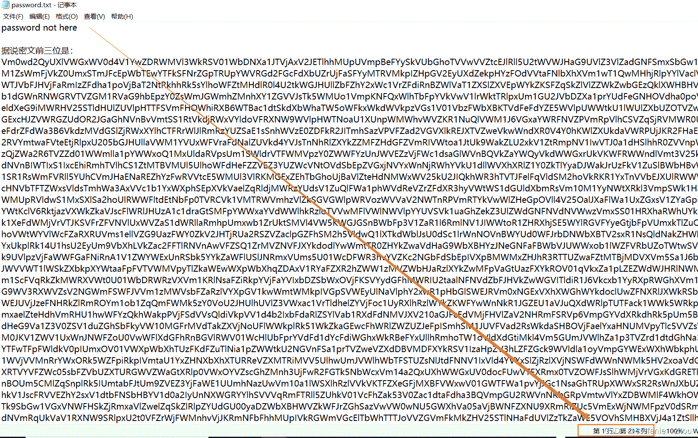
丢进在线零宽字符解密网站
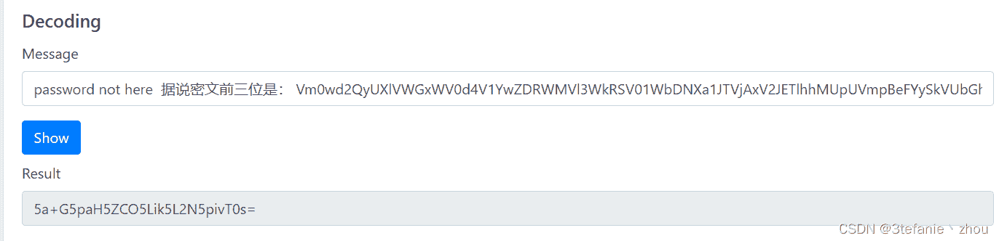
得到base编码的一串字符串

```
5a+G5paH5ZCO5Lik5L2N5pivT0s= 
```

base64解码一下，获取到hint信息

```
 hint:密文后两位是OK 
```

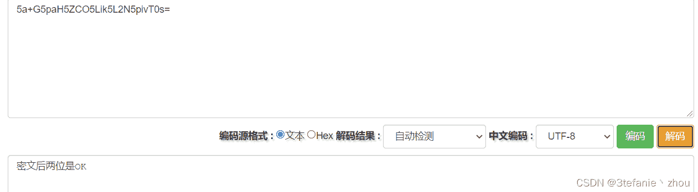
后面还有一串base64信息，根据提示是密文的前三位
这么长一串，约莫是循环base64解码了。
经过21次解码得到，hint信息

```
hint:密文前三位IWF 
```

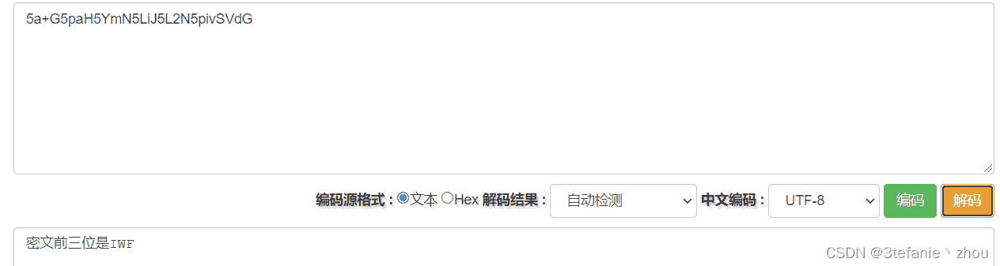
综上，密文为：IWFOK

根据题目要求，将密文作为主题发送到邮箱：a2492853776@163.com
得到flag相册的密码（居然嵌套了4层，有套神mumuzi的感觉了）


```
恭喜你！这是相册“旗帜”的密码（只套了简单的4层）：

23khUrNeAf1igP4PixgoUUDQLaRGGfEpPsFEd9CCKaUWfwYmG4ZmCwFVEkNNwtijxVcn6a6XkwC1ctqMLAax4aGK
This is an automatic reply, confirming that your e-mail was received.Thank you 
```

密文长度是88，结尾没有补=号排除Base64。
有大小写和数字，猜测是base58或者base62
尝试base58解码，得到一串16进制编码

```
4d564c54534d4b324e5657484b5753484746574553554a3548553d3d3d3d3d3d 
```

16进制转字符串，得到base32

```
MVLTSMK2NVWHKWSHGFWESUJ5HU====== 
```

bas32解码，得到base64

```
eW91ZmluZG1lIQ== 
```

base64解码得到key

```
 key：youfindme! 
```

使用Key打开flag相册，得到最终的flag
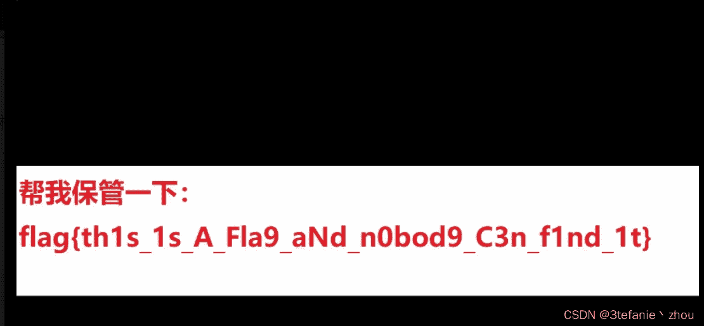

```
flag{th1s_1s_A_Fla9_aNd_n0bod9_C3n_f1nd_1t} 
```

#### 解题:第二种途径

将第二张图片丢进kali，使用binwalk分析一下，发现隐藏了一个压缩包
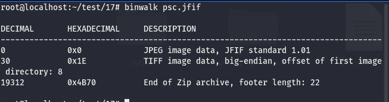
解压压缩包,得到一个txt文件
文件内容如下：

```
题目2：（题目1和题目2都可以得到flag相册密码，自由抉择选择哪条）
本次题目考验收集能力
也要考查搜索能力
一起来快乐的回答问题吧！
（将所有答案的首字母大写连在一起即是答案）请注意是大写大写大写大写大写大写大写大写
答案都是英文字母
例如题目描述：瞌睡乔是指----答：Joseph Robinette Biden, Jr（Joe Biden）。首字母是J

1.打5把csgo出自
2.现任美国中央情报局局长是（出题时间2021年2月1日）
3.“是男人就下一百层”被一位UP主找到正确的版本并且更正了百度词条上的错误信息，请问他更正的词条的版本哈希值是多少？
4.IAU在1928国际天文会议中认定的新的星座的拉丁学名是？
5.https://www.bilibili.com/网站ip地址为110/120.xx.xx.xx的运营商的官网是？ 
```

对应的答案如下

```
1.印尼宽带广告，这‌​​​‌​​‌​‌​​‌‌‌​‌‌‌​‌个梗出自于印尼一家宽带公司的广告,原视频标题为“IndiHome paket Phoenix(Original Iklan)，“打五把CSGO”其实是印尼宽带广告的背景音乐的歌词空耳，这个广告的背景音乐中有一段歌词是“Takupaz Dance Crew”，中文音译是“塔库帕兹舞蹈队”，后来被网友们空耳成“打五把CSGO”。
2.百度搜索美国中央情报局局长历任局长，可知当时的局长为威廉·约瑟夫·伯恩斯（William Joseph Burns）
3.百度搜索"是男人就下一百层被一位UP主找到正确的版本"，得知up主为：假期贩子，B站搜索该Up主，找到其发的视频《是男人就下一百层30年前的隐藏剧情！ 我找到了仅在杂志上出现一次的线索》，时间为2021年1月16日，笔者带着强烈的好奇心打开视频，看完了全部内容，最后根据发布视频的时间2021年1月16日在百度百科的词条历史版本找到当时的词条版本号：307232579，版本哈希值：f2549bf9e2c93acbb794041185c26fc0
4.蛇夫座(Ophiuchus)
5.全球ping  www.bilibili.com，得到关于110/120.XX.XX.XX信息：120.92.218.109 中国北京 ksyun.com 电信/联通/移动，得知运营商的官网为ksyun.com 
```

根据题目要求（首字母）对应的答案（大写）连接起来为：IWFOK

将答案作为主题发到邮箱：a2492853776@163.com

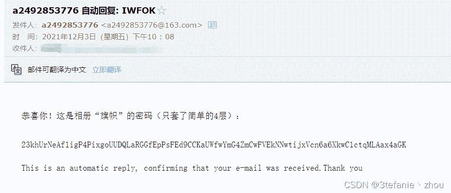
得到相册flag的密文：

```
23khUrNeAf1igP4PixgoUUDQLaRGGfEpPsFEd9CCKaUWfwYmG4ZmCwFVEkNNwtijxVcn6a6XkwC1ctqMLAax4aGK

This is an automatic reply, confirming that your e-mail was received.Thank you。 
```

解码顺序为密文—>base58—>hex转字符串—>base32—>base64—>明文

```
base58：23khUrNeAf1igP4PixgoUUDQLaRGGfEpPsFEd9CCKaUWfwYmG4ZmCwFVEkNNwtijxVcn6a6XkwC1ctqMLAax4aGK

hex转字符串：4d564c54534d4b324e5657484b5753484746574553554a3548553d3d3d3d3d3d

base32：MVLTSMK2NVWHKWSHGFWESUJ5HU======

base64：eW91ZmluZG1lIQ==

明文：youfindme! 
```

使用key：youfindme！,打开flag相册得到flag照片


```
flag{th1s_1s_A_Fla9_aNd_n0bod9_C3n_f1nd_1t} 
```

**PS**:做到这里，终于把这题做完了，从下午2点到晚上10点。期间，遇到了社工，图片隐写，文件隐藏，信息收集，编码与解码等问题，在这漫长的对抗中，一点一点将所有的问题解决，触及到了很多题目之外的知识领域，总的来说，这题还蛮有意思的，比较考验ctfer选手的Misc综合能力。文章写到最后的阶段，在观看完up主假期贩子的视频后还不小心把编辑页面关掉了，幸好有草稿箱，不然就得重新写惹。

【念念不忘，必有回响】