<!--yml
category: 未分类
date: 2022-04-26 14:50:08
-->

# Bugku CTF Web 解题报告（一）_Vayn3的博客-CSDN博客_bugku 金币

> 来源：[https://blog.csdn.net/qq_51090016/article/details/112976196](https://blog.csdn.net/qq_51090016/article/details/112976196)

# Bugku Web 一 （11-15）

刚接触ctf的菜鸡，突发奇想写博客，想记录一下自己的写题过程,。至于为什么从第十一题开始。。。是因为前面的题我已经做过了，舍不得bugku的金币再启动一次场景，只好从11题开始，每五题做成一个合集。

**Web 11 网站被黑了**

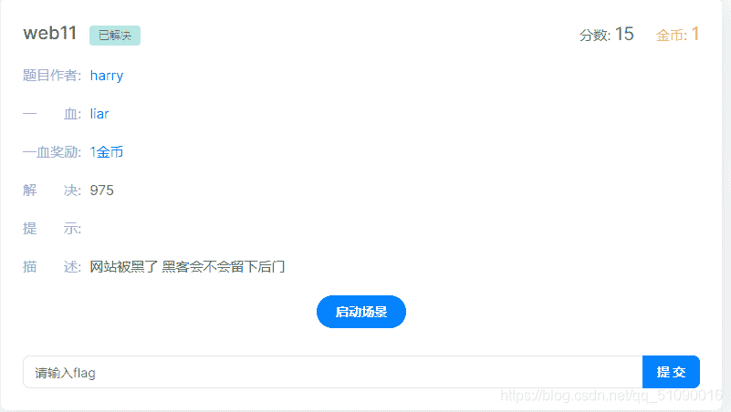
我擦，网站被黑了？？第一反应就是我一菜鸡哪会解这么高大上的题。打开题目一看，还搞得挺炫酷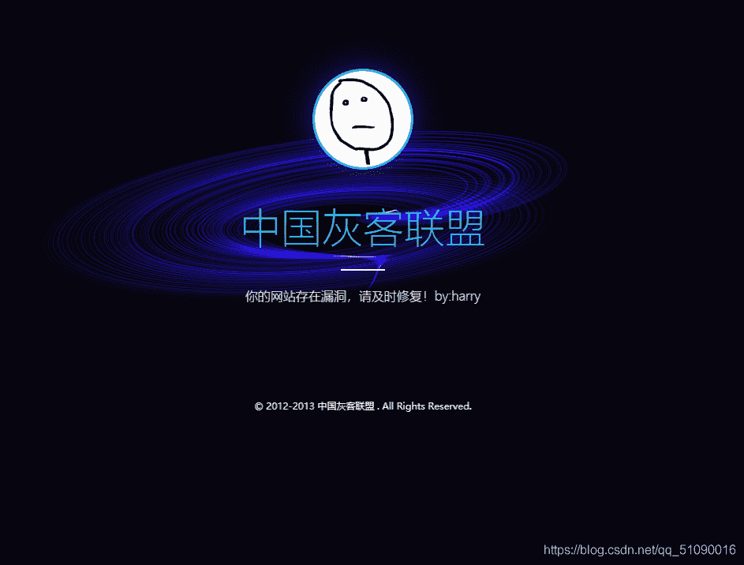
这咋办？鼠标右键点不了，F12一看也没啥。我这也太菜了，只好看看大佬怎么做，原来是要用御剑，于是照葫芦画瓢
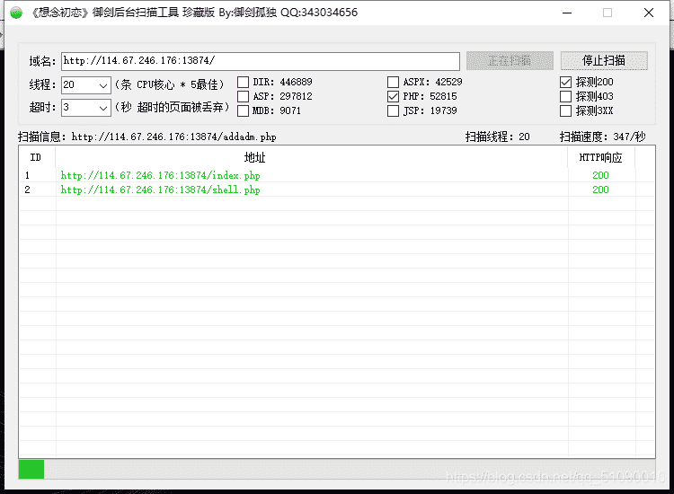

果然有了，访问下面这个看看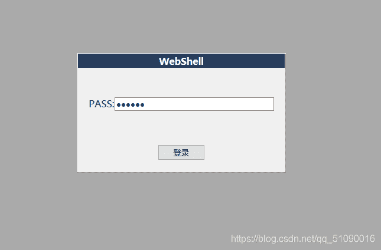
盲猜123456。。果然不对。只好想到用bp爆破。可我还不会爆破啊。。只好搜一下教程现学现用。
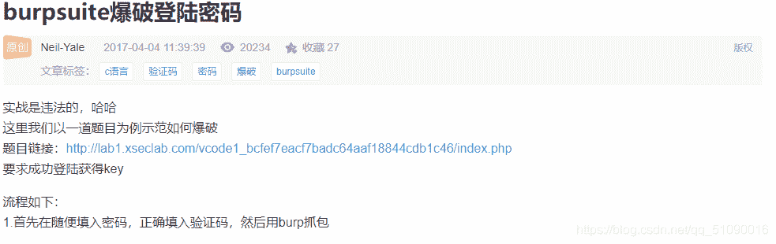
跟着大佬的教程看看能不能搞出密码来
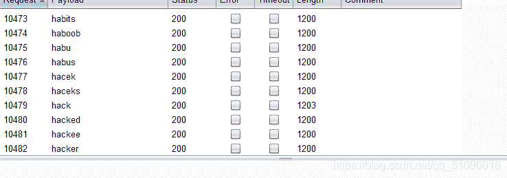

终于搞到了，密码就是——hack
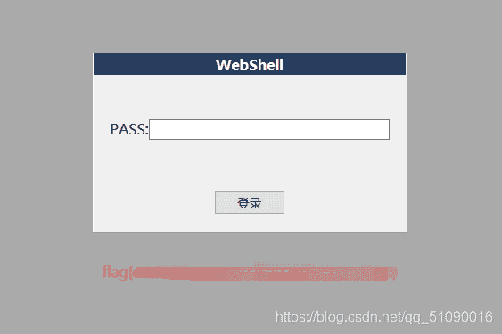
NICE！

## Web 12 本地管理员

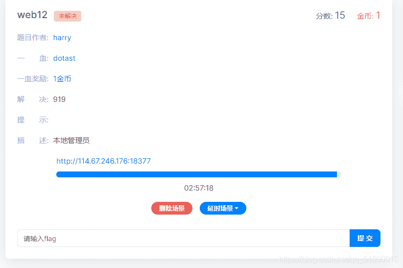

打开一看
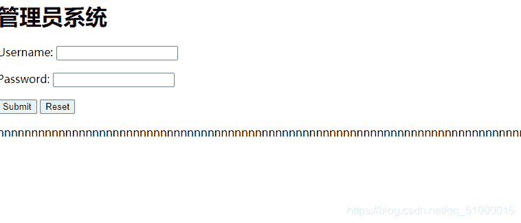
先看看源代码
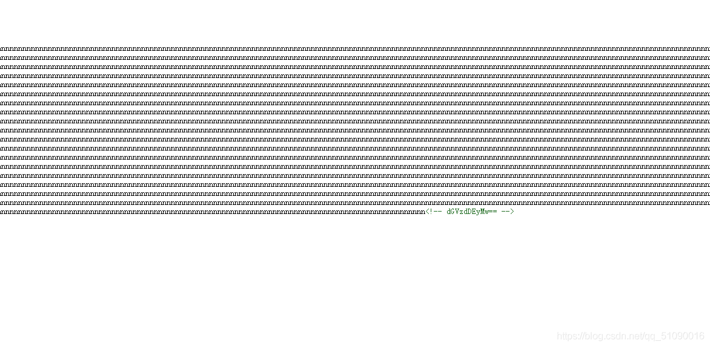
一群n下面还藏着一个base64密码，解码得到test1234

盲猜admin 密码test123
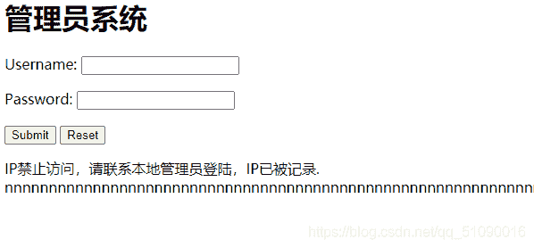
ip被禁止？不知道该干啥了。看看大佬的才知道要利用xxf修改ip，改成本地的127.0.0.1，不过像我一样的新手要记住是在登录的时候拦一下包。。。不是打开页面拦截。
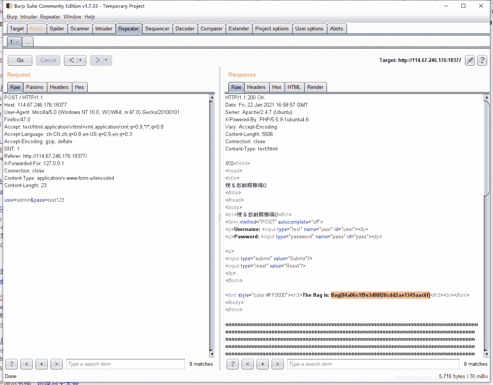

这样就出来了

## Web 13 看看源代码？

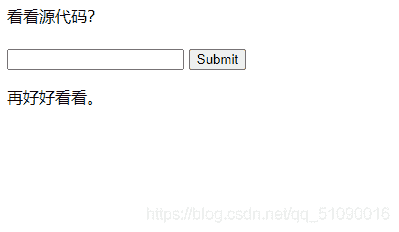

题目都这么说了，那我们就给它个面子，直接看看源代码。

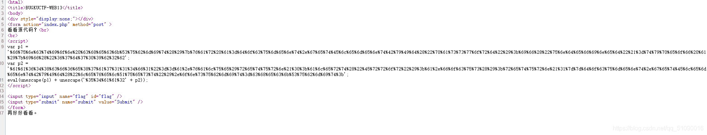
感觉像是什么解码？这是真的不知道，只好学习一下大佬。然后才知道这是URL编码，只好先百度学习一下
解码得到：
var p1 = ‘function checkSubmit(){var a=document.getElementById(“password”);if(“undefined”!=typeof a){if("**67d709b2b**’;
var p2 = ‘**aa648cf6e87a7114f1**"==a.value)return!0;alert(“Error”);a.focus();return!1}}document.getElementById(“levelQuest”).οnsubmit=checkSubmit;’;
eval(unescape(p1) + unescape(‘**54aa2**’ + p2));

然后将三段拼接起来（我也不知道为什么，有没有大佬能和我解释一下），提交就行了。

## Web 14

打开长这样，也没有提示啥的
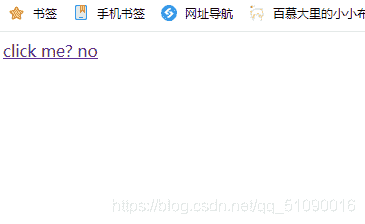

点开，长这样，提示index.php,然后我就想也没想在后面加了个index.php。。。
看看大佬的wp才知道这是文件包含漏洞，要构造一个URL：
file=php://filter/read=convert.base64-encode/resource=index.php
用base方法读取

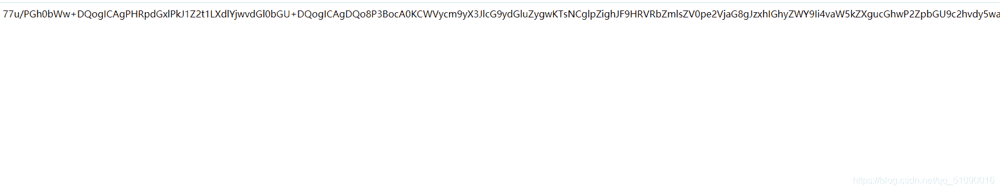
解密就得到flag了：flag{9984d804b38913c99d20fa6c3332cb20}

## Web 15 这好像需要密码

点开
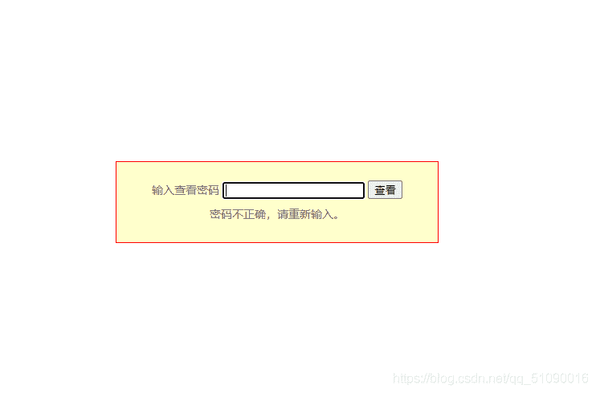
这题我终于会了，直接bp 爆破，要是有和我一样的萌新，还不会爆破的话，去百度一下教程就行了。

不过字典又难到我了。。好在百度了下
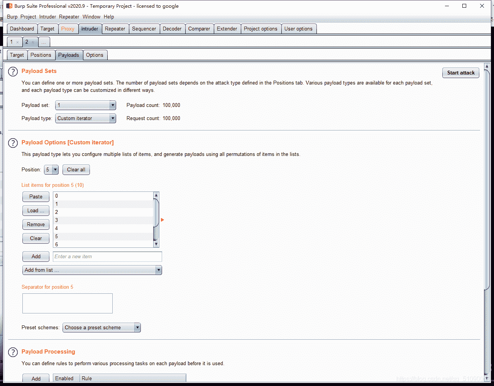
开始的payload type 设为 custom iterator,然后下面每一位（就是position）设为0~9就行了
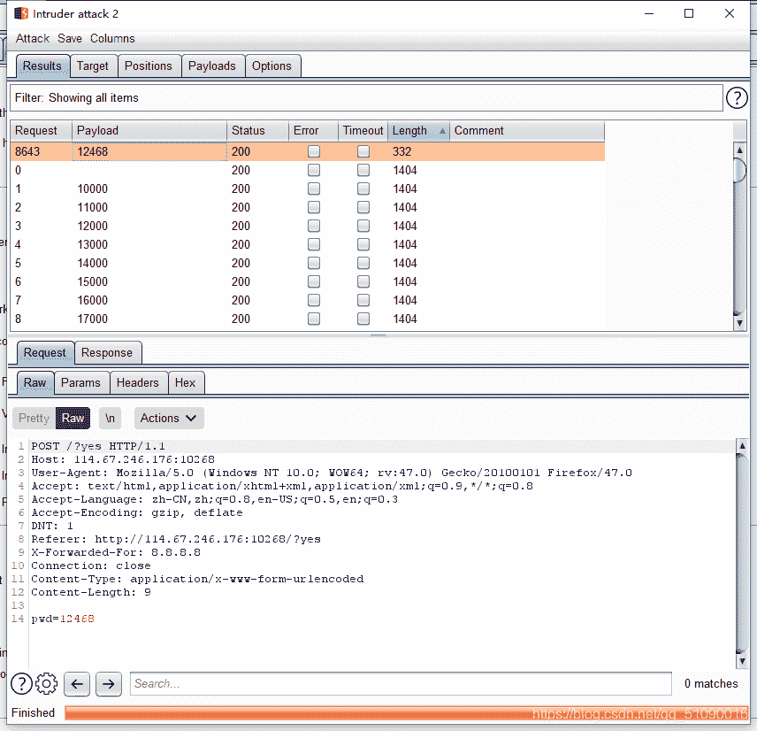
终于找到了：12468

上传密码得到flag：flag{9f0cf273daf4a8419b15448d6019d371}