<!--yml
category: 未分类
date: 2022-04-26 14:55:28
-->

# Bugku CTF 题目解析 (1-10题)_半夜好饿的博客-CSDN博客_ctf题库及详解

> 来源：[https://blog.csdn.net/baidu_35297930/article/details/82874813](https://blog.csdn.net/baidu_35297930/article/details/82874813)

写在前面的话：
  这里只是记录一些自己的解题思路，或者一些有关解题的乱七八糟的东西，自己是刚零基础接触这方面的东西，所以有表述不当的地方请包容，在此谢过！

### 1、web2

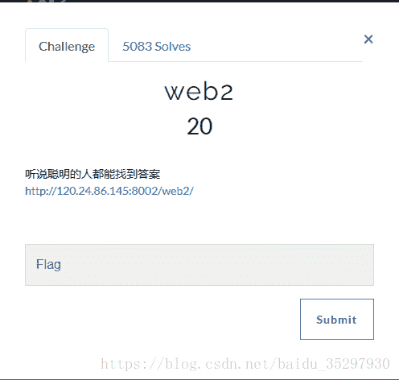
点开网址后：

解题思路：F12 打开 开发者工具看看，可以看到需要寻找的flag。
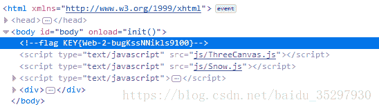
将其复制到提交框即可。

flag： KEY{Web-2-bugKssNNikls9100}

### 2、计算器

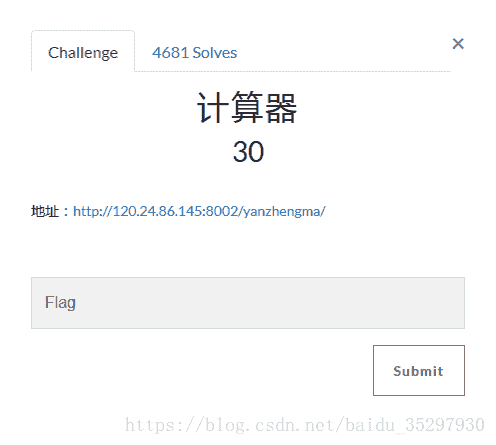
点开网址后：
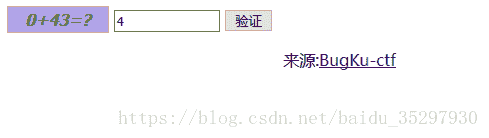

解题思路：
  先提交答案试试看，可以发现只能输入个位数，于是可以想到修改代码，修改maxlenth的值，再输入正确答案即可得到flag。

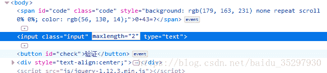
提交后出现：

得到flag，提交即可。
flag：flag{CTF-bugku-0032}

### 3、web基础$_GET

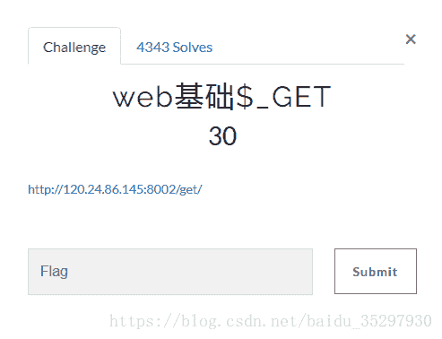
点开网之后：
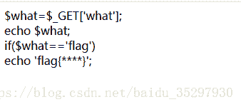
解题思路：
  通过阅读代码，可知道提交数据即可，由代码得知提交方式为get方式，只需要what=flag即可。
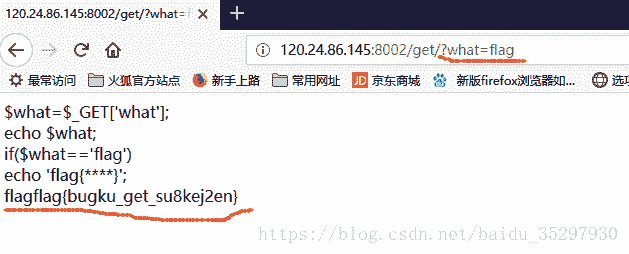
得到flag。

flag：flag{bugku_get_su8kej2en}

> 相关知识：
> $_GET ：
>   1、预定义的 $_GET 变量用于收集来自 method=“get” 的表单中的值。
>   2、 从带有 GET 方法的表单发送的信息，对任何人都是可见的（会显示在浏览器的地址栏），并且对发送信息的量也有限制。

* * *

> $_POST：
>   1、预定义的 $_POST 变量用于收集来自 method=“post” 的表单中的值。
>   2、从带有 POST 方法的表单发送的信息，对任何人都是不可见的（不会显示在浏览器的地址栏），并且对发送信息的量也没有限制。

### 4、web基础$_POST

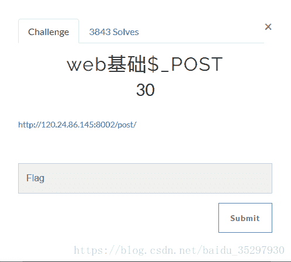
点开网页后：
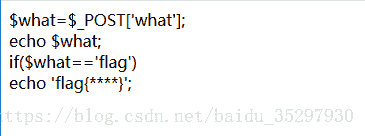
解题思路：阅读代码后可知是post传参，所以可构造一个post传参。

可以有以下几种方式：
  a、利用火狐浏览器的插件HackBar
  b、自己构造一个表单
  c、bp抓包。

**a、利用火狐浏览器的插件：**
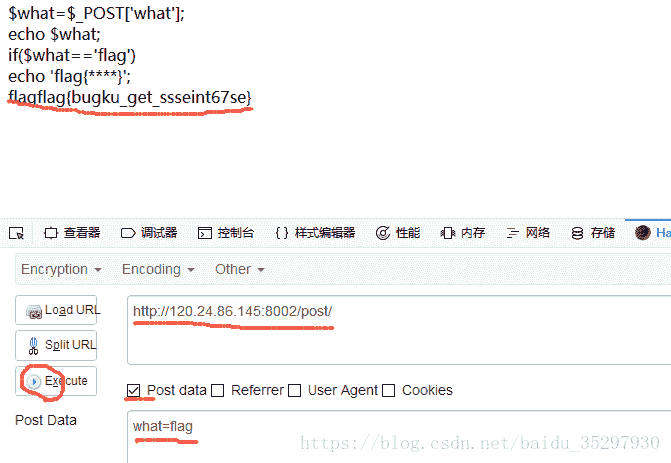
  F12之后选择HackBar，勾选post data，将题目页面的地址与需要构造的post传参填入，运行即可得到flag的值。

**b、自己构造一个表单**
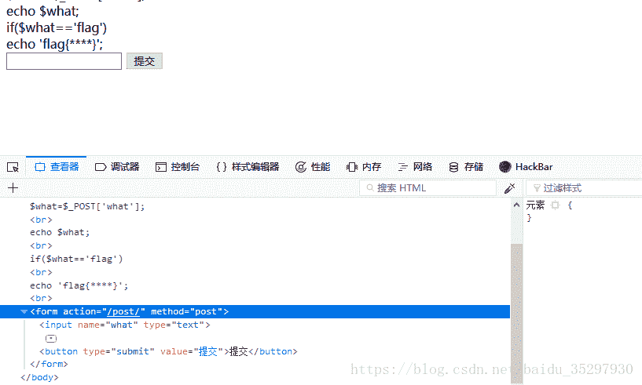
  F12之后，在网页代码中加入自己构造的表单代码，输入flag，提交即可得到flag的值。
表单代码：

```
<form action="/post/" method="post">
	<input type="text" name="what">
	<button type="submit" value="提交">提交</button>
</form> 
```

**c、bp抓包**
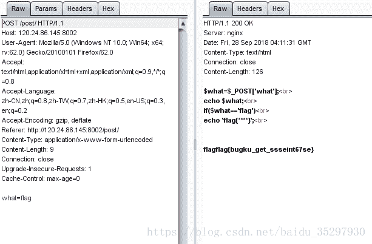

### 5、矛盾

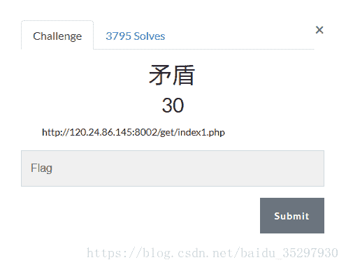
点开网页后：
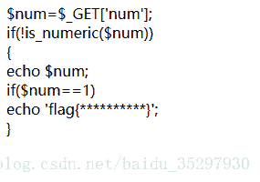
解题思路：
  阅读代码可知传参方式用的是$GET方式 ，判断输入的num ，如果不是数字且为1时输出flag ，和题目所述一样自相矛盾。于是可以想到让num为1但是不是数字 比如num=1w232等，令num=1w232，即可得到flag的值。

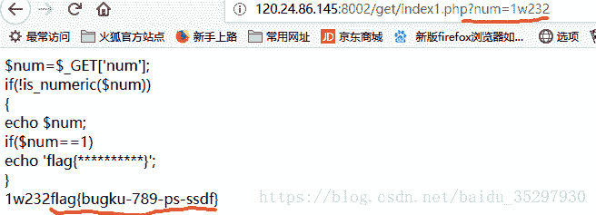

flag：flag{bugku-789-ps-ssdf}

> 相关知识
>  1、is_numeric(）：检测变量是否为数字或数字字符串。
> –
>  2、弱类型语言 与 强类型语言：
>   强类型：指任何变量在使用的时候必须要指定这个变量的类型，而且在程序的运行过程中这个变量只能存储这个类型的数据。因此，对于强类型语言，一个变量不经过强制转换，它永远是这个数据类型，不允许隐式的类型转换。常见的有C++,Pyton、Java等。
>    弱类型则是与强类型定义相反。常见：PHP、VB。
> –
>   3、PHP中 “== ” 与 “=== ”的区别：
>   首先php是一种弱类型语言。
>   “ == ”：只是检测左右两边的值是否相等。在1w232 == 1中，1w232被强制转换成了整型1，则两者相等。
>   “=== ”：操作符除了检测左右两边的值是否相等外，还会检测他们的类型是否相等

### 6、web3

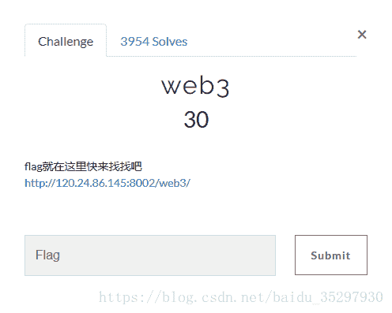
点开网页后：
点击确定，以下两个对话框不断切换。
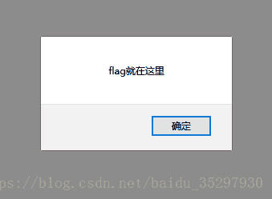
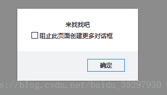
解题思路：勾选组织此页面创建更多对话框之后，查看源码。可看到一串奇怪的字符串。

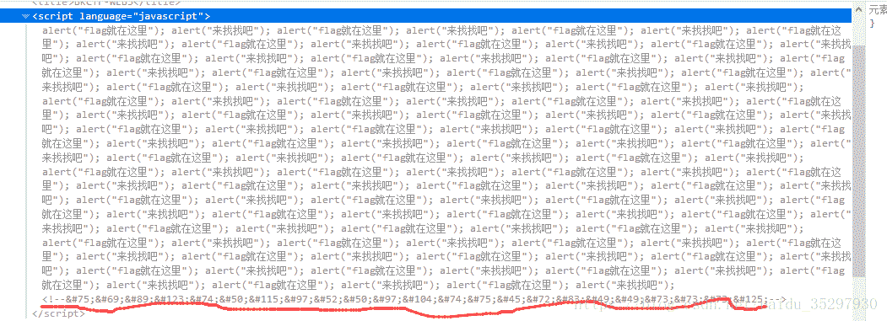

将其利用HtmlEncode解码，即可得到flag的值。

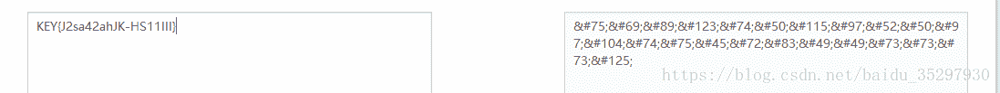

flag：KEY{J2sa42ahJK-HS11III}

### 7、域名解析

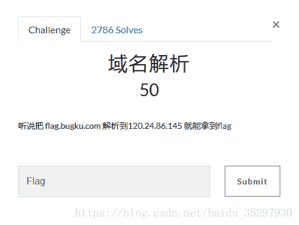

解题思路：
  按照题目意思，需要将flag.bugku.com解析到120.24.86.145。在windows下，修改host文件，在host文件中加入此句 ：
   120.24.86.145 [flag.bugku.com](http://flag.bugku.com)

访问http://flag.bugku.com/即可得到flag。

一般情况下host文件地址为:C:\Windows\System32\drivers\etc\host.
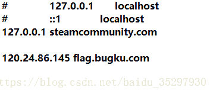
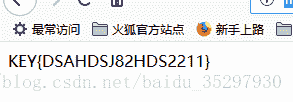

flag：KEY{DSAHDSJ82HDS2211}

> 相关知识：[https://www.cnblogs.com/geaozhang/p/7010353.html](https://www.cnblogs.com/geaozhang/p/7010353.html)

### 8、你必须让他停下来

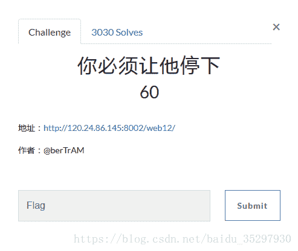

点开网站后，页面不停的闪烁。

解题思路：
  查看后台代码，由于页面一直不停的跳转闪烁，无法看清代码，猜想是否寻找的flag就存在于某一页面之中，采用burp suite 中的repeater功能逐步查看，会发现猜想正确。
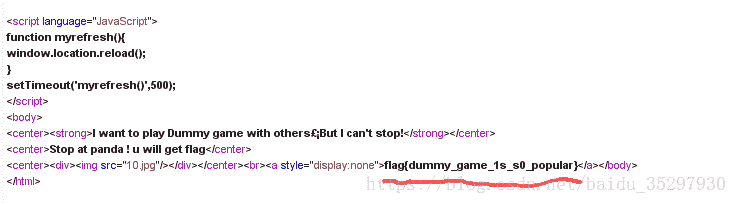

flag：flag{dummy_game_1s_s0_popular

### 9、本地包含

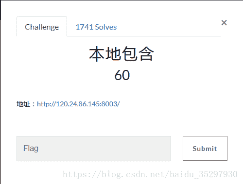
点开网页：
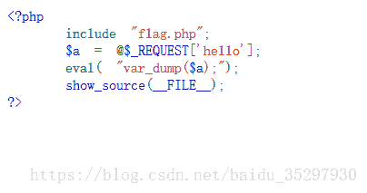

解题思路：阅读代码后猜测，寻找的flag可能在flag.php中，因此想办法将该文件中的内容取出。

以下有2种方式：
  a、利用eval( )函数的漏洞
  b、直接将flag.php的内容读入到hello变量中

**a、利用eval( )函数的漏洞**

> eval( )函数是把字符串按照PHP代码来计算，该字符串必须是合法的PHP代码，且必须以分号结尾。

* * *

> $_REQUEST[ ]函数默认情况下包含了 $_GET、 $_POST、 $_COOKIE。

知道eval( )函数的作用后，我们可以利用hello来构造payload。

题目中以给出了var_dump($a)，且hello的内容赋给了 $a,则可以构造成如下方式：
      hello= );show_source(“flag.php”);var_dump(

即连同var_dump( $a)来看的话，便可以很好的理解了。

   var_dump( **);show_source(“flag.php”);var_dump(** )

加粗部分则是所构造的内容，利用eval的作用，可以获取到flag.php文件中的内容。


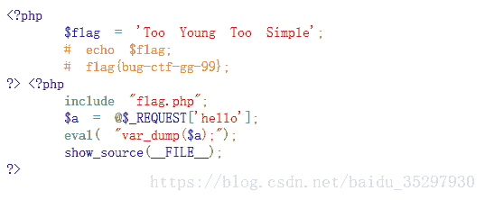

**b、直接将flag.php的内容读入到hello变量中**

还是利用eval（）的作用，同理构造payload，如下：

 1、构造： ?hello=file_get_contents(‘flag.php’) 后结果为：
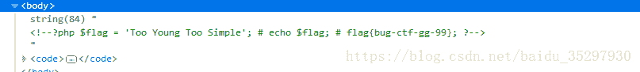
 2、构造： ?hello=file(‘flag.php’) 后结果为：
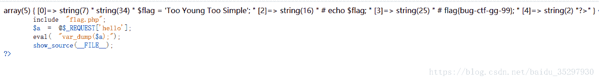

> 相关知识：
> 提到了本地包含，所以就此将本地包含的相关资料贴上来，与本题无关。
> [https://zhuanlan.zhihu.com/p/26308699](https://zhuanlan.zhihu.com/p/26308699)
> [https://thief.one/2017/04/10/2/](https://thief.one/2017/04/10/2/)

flag：flag{bug-ctf-gg-99}

### 10、变量1

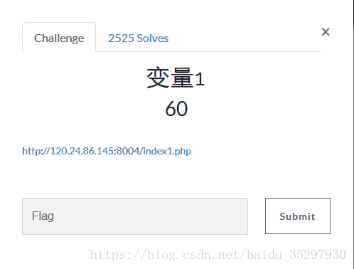
点开网址后：
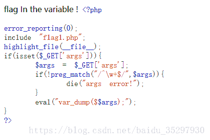

解题思路：先把代码中的函数都弄清楚其作用，理解代码，根据提示解题。

> 相关知识：
> isset( )：用来检测变量是否设置
> preg_match( )：执行匹配正则表达式
> php中变量可以当作另一个变量的变量名：
> eg：
> 
> ```
> <?php
> 	$a='b';
> 	$b="Boogle";
> 	eval("var_dump($$a);");  //输出   Boogle
> ?> 
> ```
> 
> 正则表达式：
> ^：匹配输入字符串的开始位置
> \w：匹配字母、数字、下划线，等价于 '[A-Za-z0-9_]
> +：代表至少一个
> $：匹配输入字符串的结束位置

正则表达式表达的内容为：变量中至少含有一个数字/字符/下划线

如果不匹配会输出 “args error!”，所以我们需要构造一个符合正则式要求的变量。题目提示，flag在变量中和 $$a ，可想到 $GLOBALS变量，既满足正则表达式的要求，也可以找到flag。

> $GLOBALS：一个包含了全部变量的全局组合数组

因此构造payload：?args=GLOBALS


结果：
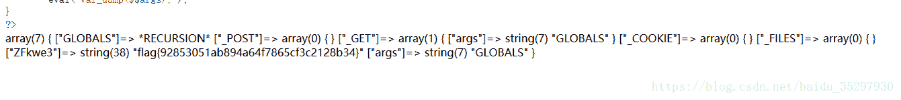

flag：flag{92853051ab894a64f7865cf3c2128b34}