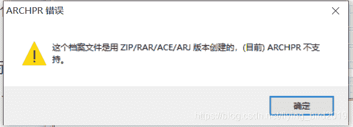
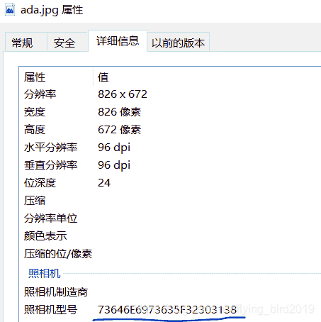
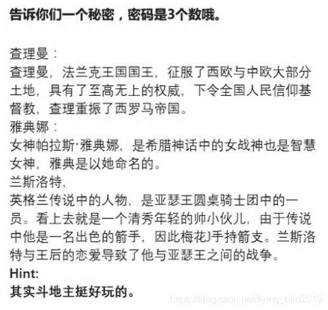

<!--yml
category: 未分类
date: 2022-04-26 14:20:29
-->

# BugkuCTF-MISC部分题解（一）_flying_bird2019的博客-CSDN博客

> 来源：[https://blog.csdn.net/flying_bird2019/article/details/104856773](https://blog.csdn.net/flying_bird2019/article/details/104856773)

# 眼见非实

docx文件无法打开改为zip打开
记录两个命令，避免一个一个文件打开寻找
**tree** 以树状图的形式查看文件夹
**grep “flag” -r .** 搜索含flag字符串的文件

# 啊哒

用binwalk分离后出现一个带密码的zip压缩包
十六进制打开，判断是不是未加密：[判断方法](https://blog.csdn.net/qq_26187985/article/details/83654197)**（特别注意真加密与未加密的区别）**
不是伪加密，也不能用ARCHPR打开，打开时发生错误

错误原因：

其实密码就藏在这里

十六进制转化为字符串得到密码

# 又一张图片，还单纯吗

binwalk分离，发现有很多图片
先用foremost 不知什么原因没有分理出图片
用其他命令：dd

[dd命令详解](https://www.cnblogs.com/linuxde/p/8719253.html)

# 宽带信息泄露

conf.bin文件需要用到一个工具RouterPassView
直接贴一个别人的[题解](https://blog.csdn.net/preserphy/article/details/79440407)

# 隐写2

**这道题有点意思**
先将原图binwalk得到一个压缩包，里边有一张提示图片

这里学到了一些新知识[扑克牌上的历史人物](http://www.360doc.com/content/18/0626/16/5415450_765565021.shtml)
这三个人分别代表KQJ
联想数字就有点离谱（竟然不是13，12，11）
其实是键盘上对应的8，7，1（各自平移到数字那一行）
输入密码有得到一张图，十六进制打开，末尾得到flag
{}里面的字符base64解密，f1@g不用修改