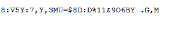
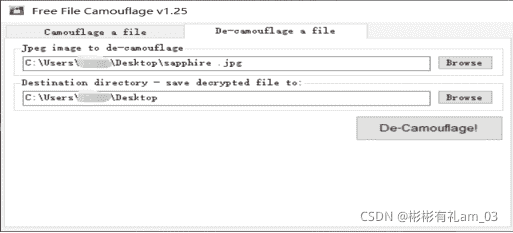
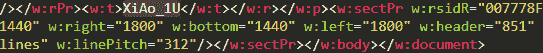
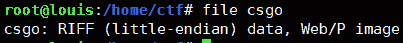
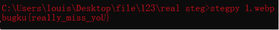

<!--yml
category: 未分类
date: 2022-04-26 14:50:50
-->

# BugkuCTF-MISC题善用工具_彬彬有礼am_03的博客-CSDN博客

> 来源：[https://blog.csdn.net/am_03/article/details/120155671](https://blog.csdn.net/am_03/article/details/120155671)

## 补充

解出此题需要下载一个工具Free_File_Camouflage
Free_File_Camouflage图片隐写工具:能将重要的文件以AES加密算法存放在JPG格式的图片里。你还可以设置口令，就算别人知道你以File Camouflag加密，但不知道密码也无法偷窥的文件。

## 解题流程

描　　述:webp
下载压缩包。解压得到以后3个文件。
先看看hint.png，发现打不开，用010 editor编辑器打开是乱码。属性也没有发现。

010editor打开hint.png
txt文件最后面发现一串字符，请教了大佬才知道是uuencode+base85，真的坑

uuencode 解码
解码结果：keyis91;utF$jAQDfoZ.@: s-

base85解码
解码结果：KEYisCamouflage

百度：软件 Camouflage
搜到Free File Camouflage的相关信息
下载此软件

打开Free_File_Camouflage工具，用De-camouflage a flie加载sapphire .jpg图片，然后点击，De-camouflage，生成1个zip.passwd.doc文档。

6.打开word文档，提示“远在天边近在眼前:”，输入解压出错

使用010e发现是504b文件头 猜测可能是zip文件 修改后缀为zip 然后查看这些xml文件 最后在document.xml发现一个字符串XiAo_1U

猜测可能是题目的zip的解压密码

解压成功
最后解压出来 一个csgo的无后缀文件 这种情况可以利用linux的file命令猜测是什么文件

是riff图片（最后测试发现把后缀改为riff或者webp都可以，riff用画图打开，webp用浏览器打开），然后发现是一个图片
(或者把csgo文件拖到010 editor编辑器里，发现文件头是riff，修改文件后缀为riff，用画图打开是一张图片)

到这里卡住了，请教大佬说是使用一个stegpy的python脚本解码（据说题目提示：webp和stegpy有关，以stegpy隐写工具进行恢复。）

然后pip3 install stegpy
接着 stegpy csgo.riff(csgo.webp)

MISC题就是需要多多操作工具啊