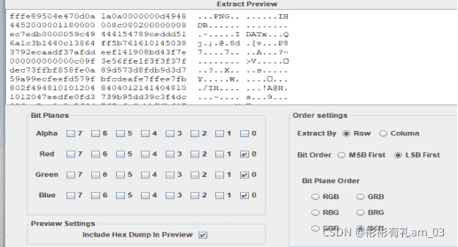
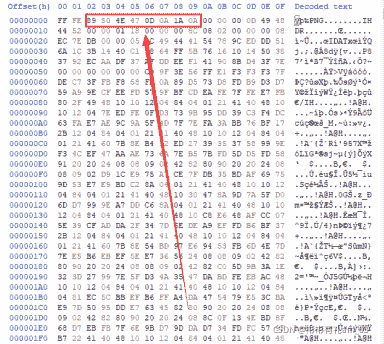
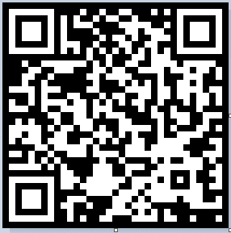
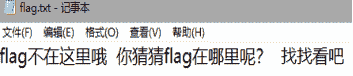
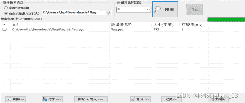
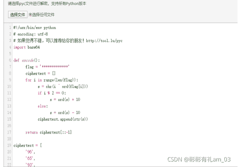

<!--yml
category: 未分类
date: 2022-04-26 14:46:37
-->

# BugkuCTF-MISC题猫片_彬彬有礼am_03的博客-CSDN博客

> 来源：[https://blog.csdn.net/am_03/article/details/120119266](https://blog.csdn.net/am_03/article/details/120119266)

## python知识点

^是按位异或操作符
[::-1]能令列表反向

## 解题流程

题目提示：LSB BGR NTFS

下载之后就是一个叫png的文件，没有后缀，那么加后缀

打开Stegsolve直接就Analyse-----Data Extract，根据提示LSB,BGR,一顿尝试

发现了PNG这个敏感字样，save bin 为png文件
010 editor打开(或者WinHex)

很明显的png文件头格式，将前两个字节删除，保存打开之后，发现是半张二维码

被修改高度的可能极大，修改为长和高一样大，保存
得到一张完整的二维码

但是二维码不太对劲，是反色的，进ps一改就好(不过也可不改直接扫描即可)

识别二维码得到一个链接

打开并下载文件
下载下来，是一个压缩包，里面有一个文本文档，flag.txt

最后根据hint里面的提示“NTFS”，根据大佬的说法，这是一类流隐写，需要用到工具
ntfstreamseditor，然而。。这里还有一个坑就是，这压缩文件一定要用winrar来解压才会产生这样的效果

先用winrar解压
然后用NTFS Streams Editor扫描

这个题目解题的一个转折点就是从数据流里提取出来那个已经编译过的py程序，我们需要拿去反编译

将pyc文件导出，使用在线反编译工具进行反译，结果如下

^是按位异或操作符，求其逆过程只需要再进行一次异或操作
[::-1]能令列表反向，因此秘文在解密前需要颠倒顺序

将反译之后脚本下载之后写 解密脚本

```
def decode():
    ciphertext = [
    '96',
    '65',
    '93',
    '123',
    '91',
    '97',
    '22',
    '93',
    '70',
    '102',
    '94',
    '132',
    '46',
    '112',
    '64',
    '97',
    '88',
    '80',
    '82',
    '137',
    '90',
    '109',
    '99',
    '112']
    ciphertext.reverse()
    flag = ''
    for i in range(len(ciphertext)):
        if i % 2 == 0:
            s = int(ciphertext[i]) - 10
        else:
            s = int(ciphertext[i]) + 10
        s=chr(i^s)
        flag += s
    return flag

def main():
    flag = decode()
    print(flag)

if __name__ == '__main__':
    main() 
```

得到flag： flag{Y@e_Cl3veR_C1Ever!}