<!--yml
category: 未分类
date: 2022-04-26 14:42:10
-->

# BugkuCTF RE部分题解_z.volcano的博客-CSDN博客_bugku 杰瑞的影分身

> 来源：[https://blog.csdn.net/weixin_45696568/article/details/117133693](https://blog.csdn.net/weixin_45696568/article/details/117133693)

菜狗稍微学几道逆向题…

# Reverse

## 树木的小秘密

可以发现这是pyinstaller打包的exe文件，所以使用`pyinstxtractor`把它转为pyc文件
[https://github.com/countercept/python-exe-unpacker/blob/master/pyinstxtractor.py](https://github.com/countercept/python-exe-unpacker/blob/master/pyinstxtractor.py)

这里作者用的py版本是3.7，我用的是3.8，不过也能解

```
python pyinstxtractor.py [filename] 
```

运行后得到一个easy_reverse.exe_extracted文件夹，里面有个`123`文件，flag就在这
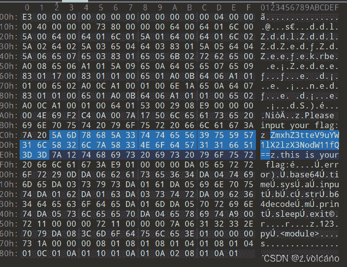

## ez fibon

脱壳，反编译，看主函数代码

```
int __cdecl main(int argc, const char **argv, const char **envp)
{
  int v3; 
  int v5[24]; 
  char Str[524]; 
  int j; 
  int v8; 
  int v9; 
  int i; 
  int v11; 

  _main();
  v11 = 1;
  puts("please input your flag:");
  gets(Str);
  for ( i = 0; i <= 21; ++i )
    *(_DWORD *)&Str[4 * i + 112] = Str[i];
  if ( strlen(Str) == 22 )
  {
    v9 = 1;
    v8 = 1;
    for ( j = 0; j <= 21; ++j )
    {
      if ( (j & 1) != 0 )
      {
        v8 += v9;
        v3 = (v8 + j + *(_DWORD *)&Str[4 * j + 112]) % 64 + 64;
      }
      else
      {
        v9 += v8;
        v3 = (v9 + j + *(_DWORD *)&Str[4 * j + 112]) % 64 + 64;
      }
      *(_DWORD *)&Str[4 * j + 112] = v3;
    }
    v5[0] = 100;
    v5[1] = 121;
    v5[2] = 110;
    v5[3] = 118;
    v5[4] = 70;
    v5[5] = 85;
    v5[6] = 123;
    v5[7] = 109;
    v5[8] = 64;
    v5[9] = 94;
    v5[10] = 109;
    v5[11] = 99;
    v5[12] = 116;
    v5[13] = 81;
    v5[14] = 109;
    v5[15] = 86;
    v5[16] = 83;
    v5[17] = 126;
    v5[18] = 119;
    v5[19] = 101;
    v5[20] = 110;
    v5[21] = 114;
    for ( j = 0; j <= 21; ++j )
    {
      if ( v5[j] != *(_DWORD *)&Str[4 * j + 112] )
        v11 = 0;
    }
    if ( !v11 )
      printf("wrong!");
    if ( v11 == 1 )
      printf("right flag!");
  }
  else
  {
    printf("wrong lenth!");
  }
  return 0;
} 
```

注意到数组v5里像是ascii码值，转字符后得到`dynvFU{m@^mctQmVS~wenr`，应该是需要转换的密文。

看这部分的代码，其中的`*(_DWORD *)&Str[4 * j + 112]`其实是正确的flag中的每一位字符

```
v9 = 1;
    v8 = 1;
    for ( j = 0; j <= 21; ++j )
    {
      if ( (j & 1) != 0 )
      {
        v8 += v9;
        v3 = (v8 + j + *(_DWORD *)&Str[4 * j + 112]) % 64 + 64;
      }
      else
      {
        v9 += v8;
        v3 = (v9 + j + *(_DWORD *)&Str[4 * j + 112]) % 64 + 64;
      }
      *(_DWORD *)&Str[4 * j + 112] = v3;
    } 
```

结合题目名和这里的v8和v9，可以发现这里是`斐波那契数列`，然后结合这部分代码写脚本解密

```
fi = [1, 1, 2, 3, 5, 8, 13, 21, 34, 55, 89, 144, 233, 377, 610, 987, 1597, 2584, 4181, 6765, 10946, 17711, 28657, 46368]
flag = ""
m = list("dynvFU{m@^mctQmVS~wenr")
ind = 1

for i in range(len(m)):
    ind += 1
    if (i&1)!=0:
        x = ord(m[i])-fi[ind]-i
    else:
        x = ord(m[i])-fi[ind]-i
    x = x%64
    if x < 64:
        x += 64
    flag += chr(x)
print(flag) 
```

## 入门逆向

ida打开就能看到flag
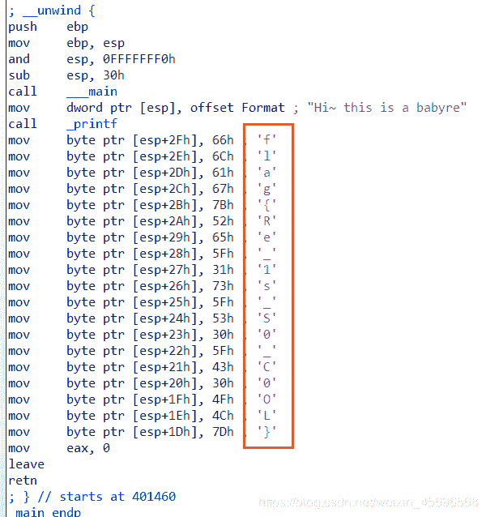

## signin

拿到一个apk文件，考察的是安卓逆向，apk文件其实就是zip包，解压拿到`dex`文件
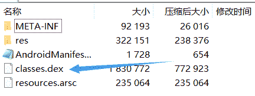
再把dex文件转jar： `d2j-dex2jar.bat classes.dex`
然后用`jd-gui`打开这个jar，接着就是分析源码

注意这里的`paramString.equals(newString(Base64.decode(newStringBuffer(getFlag()).reverse().toString(), 0))))`
**先通过toString()获取一个字符串，然后逆序，再base64解码**

接下来就是找这个`toString`的位置，仍然参考大佬wp，在`string.xml`文件中找到toString的值为`991YiZWOz81ZhFjZfJXdwk3X1k2XzIXZIt3ZhxmZ`

经过前面的步骤解得`flag{Her3_i5_y0ur_f1ag_39fbc_}`

## Easy_Re

用**ida**打开re1.exe，找到main函数，f5查看伪代码
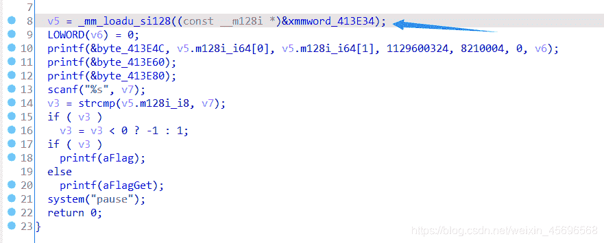
这里的`v5 = _mm_loadu_si128((const __m128i *)&xmmword_413E34);`
是SSE的一个储存指令

> `_mm_store_si128 ( __m128i *p, __m128i a);`
> 功能：可存储128位数据；
> 说明：将__m128i 变量a的值存储到p所指定的变量中去；
> 注意：p必须是一个16-bit对齐的一个变量的地址。

所以找一下`xmmword_413E34`的地址，双击它即可
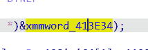
对应地址拿到两串字符，如果这里不是这样显示的，点击它，按R即可
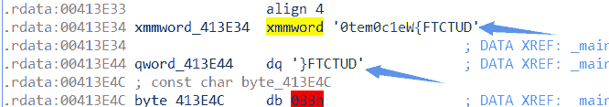
两个字符串拼在一起，逆序得到flag
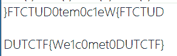
其实这题也可以直接用nodepad打开，搜索dutctf，直接拿到flag

## 游戏过关

第一种解法，可以选择通关游戏，直接`12345678`即可

再就是逆向解法了，ida打开，shift+f12找字符串，看到
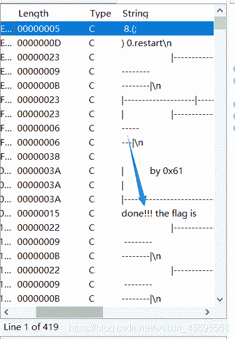
找到位置，f5查看伪代码

```
int sub_45E940()
{
  int i; 
  char v2[22]; 
  char v3[32]; 
  char v4[4]; 
  char v5[64]; 

  sub_45A7BE("done!!! the flag is ");
  v5[0] = 18;
  v5[1] = 64;
  v5[2] = 98;
  v5[3] = 5;
  v5[4] = 2;
  v5[5] = 4;
  v5[6] = 6;
  v5[7] = 3;
  v5[8] = 6;
  v5[9] = 48;
  v5[10] = 49;
  v5[11] = 65;
  v5[12] = 32;
  v5[13] = 12;
  v5[14] = 48;
  v5[15] = 65;
  v5[16] = 31;
  v5[17] = 78;
  v5[18] = 62;
  v5[19] = 32;
  v5[20] = 49;
  v5[21] = 32;
  v5[22] = 1;
  v5[23] = 57;
  v5[24] = 96;
  v5[25] = 3;
  v5[26] = 21;
  v5[27] = 9;
  v5[28] = 4;
  v5[29] = 62;
  v5[30] = 3;
  v5[31] = 5;
  v5[32] = 4;
  v5[33] = 1;
  v5[34] = 2;
  v5[35] = 3;
  v5[36] = 44;
  v5[37] = 65;
  v5[38] = 78;
  v5[39] = 32;
  v5[40] = 16;
  v5[41] = 97;
  v5[42] = 54;
  v5[43] = 16;
  v5[44] = 44;
  v5[45] = 52;
  v5[46] = 32;
  v5[47] = 64;
  v5[48] = 89;
  v5[49] = 45;
  v5[50] = 32;
  v5[51] = 65;
  v5[52] = 15;
  v5[53] = 34;
  v5[54] = 18;
  v5[55] = 16;
  v5[56] = 0;
  v2[0] = 123;
  v2[1] = 32;
  v2[2] = 18;
  v2[3] = 98;
  v2[4] = 119;
  v2[5] = 108;
  v2[6] = 65;
  v2[7] = 41;
  v2[8] = 124;
  v2[9] = 80;
  v2[10] = 125;
  v2[11] = 38;
  v2[12] = 124;
  v2[13] = 111;
  v2[14] = 74;
  v2[15] = 49;
  v2[16] = 83;
  v2[17] = 108;
  v2[18] = 94;
  v2[19] = 108;
  v2[20] = 84;
  v2[21] = 6;
  qmemcpy(v3, "`S,yhn _uec{", 12);
  v3[12] = 127;
  v3[13] = 119;
  v3[14] = 96;
  v3[15] = 48;
  v3[16] = 107;
  v3[17] = 71;
  v3[18] = 92;
  v3[19] = 29;
  v3[20] = 81;
  v3[21] = 107;
  v3[22] = 90;
  v3[23] = 85;
  v3[24] = 64;
  v3[25] = 12;
  v3[26] = 43;
  v3[27] = 76;
  v3[28] = 86;
  v3[29] = 13;
  v3[30] = 114;
  v3[31] = 1;
  strcpy(v4, "u~");
  for ( i = 0; i < 56; ++i )
  {
    v2[i] ^= v5[i];
    v2[i] ^= 0x13u;
  }
  return sub_45A7BE("%s\n");
} 
```

两个数组先按位异或，再与0x13异或，上脚本

```
a=[18, 64, 98, 5, 2, 4, 6, 3, 6, 48, 49, 65, 32, 12, 48, 65, 31, 78, 62, 32, 49, 32, 1, 57, 96, 3, 21, 9, 4, 62, 3, 5, 4, 1, 2, 3, 44, 65, 78, 32, 16, 97, 54, 16, 44, 52, 32, 64, 89, 45, 32, 65, 15, 34, 18, 16, 0]
b=[123, 32, 18, 98, 119, 108, 65, 41, 124, 80, 125, 38, 124, 111, 74, 49, 83, 108, 94, 108, 84, 6, 96, 83, 44, 121, 104, 110, 32, 95, 117, 101, 99, 123, 127, 119, 96, 48, 107, 71, 92, 29, 81, 107, 90, 85, 64, 12, 43, 76, 86, 13, 114, 1, 117, 126, 0]

for i in range(len(b)):
    print(chr(a[i]^b[i]^19),end="") 
```

## Easy_vb

稍微翻一下就看到了
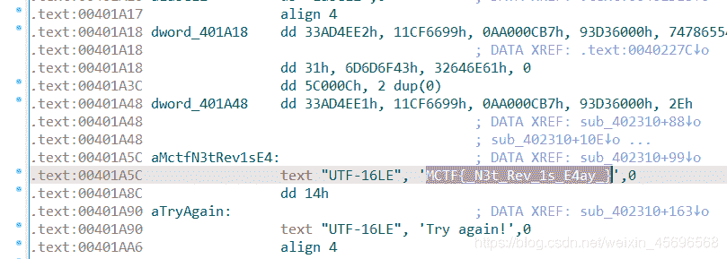

## 逆向入门

杂项题，base64转图片，扫码拿flag

## love

ida打开，**shift+f12搜索字符串**，注意到
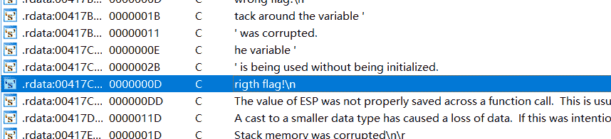
点进去，双击进入main函数
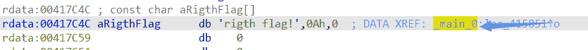
f5查看伪代码

```
int __cdecl main_0(int argc, const char **argv, const char **envp)
{
  size_t v3; 
  const char *v4; 
  size_t v5; 
  char v7; 
  char v8; 
  signed int j; 
  int i; 
  signed int v11; 
  char Destination[108]; 
  char Str[28]; 
  char v14[8]; 

  for ( i = 0; i < 100; ++i )
  {
    if ( (unsigned int)i >= 0x64 )
      j____report_rangecheckfailure();
    Destination[i] = 0;
  }
  sub_41132F("please enter the flag:", v7);
  sub_411375("%20s", (char)Str);
  v3 = j_strlen(Str);
  v4 = (const char *)sub_4110BE(Str, v3, v14);
  strncpy(Destination, v4, 0x28u);
  v11 = j_strlen(Destination);
  for ( j = 0; j < v11; ++j )
    Destination[j] += j;
  v5 = j_strlen(Destination);
  if ( !strncmp(Destination, Str2, v5) )
    sub_41132F("rigth flag!\n", v8);
  else
    sub_41132F("wrong flag!\n", v8);
  return 0;
} 
```

简单分析，这里输入一个字符串str，然后**base64编码**，接着有两步加密。第一步是把str中的每一个字符存入数组**Destination**中，再按照每个数在数组中的位置进行移位。

最后判断Destination的**长度是否与str2相等**，str2是`e3nifIH9b_C@n@dH`

写脚本解密：

```
import base64
s="e3nifIH9b_C@n@dH"
flag=""
for i in range(len(s)):
   flag += chr(ord(s[i])-i)
print(base64.b64decode(flag)) 
```

## 特殊的base64

当初看这题目名以为是杂项题，下载了才发现是逆向…

拖进ida看一下，shift+f12，得到一串base64编码和对应的编码表
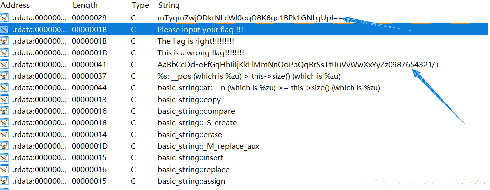

> mTyqm7wjODkrNLcWl0eqO8K8gc1BPk1GNLgUpI==
> AaBbCcDdEeFfGgHhIiJjKkLlMmNnOoPpQqRrSsTtUuVvWwXxYyZz0987654321/+

这串base64直接解码是得不到结果的，这题用的不是普通的编码表，所以称为**特殊**的base64

因为编码表已经得到了，所以到[在线网站](http://web.chacuo.net/netbasex)直接操作
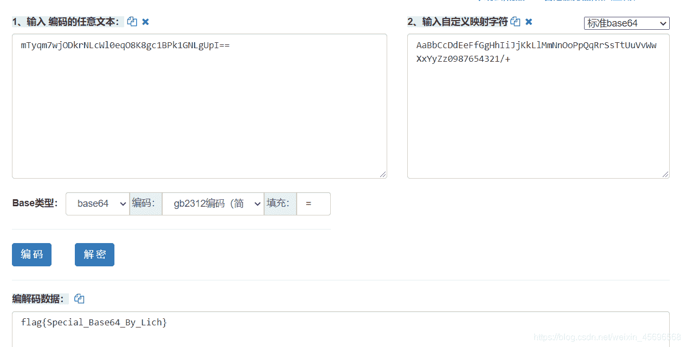

## 不好用的ce

解法一：点击一万下
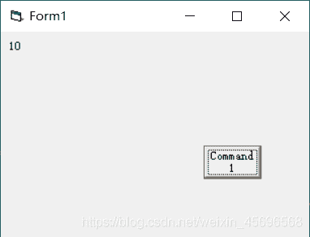
所以我果断选择其他方法，ida打开，发现好几个字符串，其中有一个是可以解出来flag的
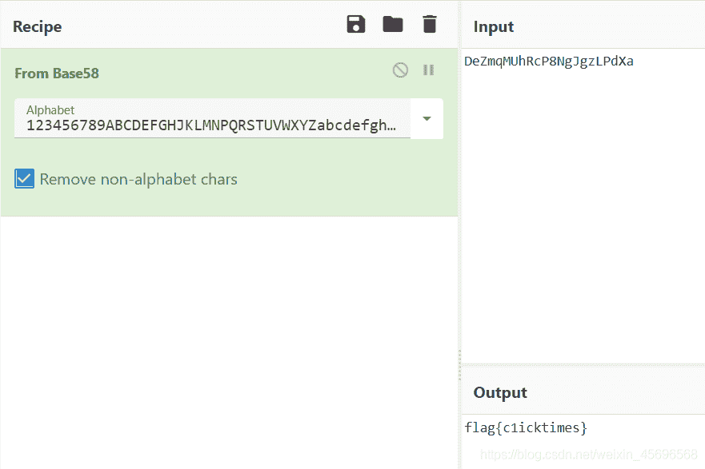

## mobile2(gctf)

再把dex文件转jar： `d2j-dex2jar.bat classes.dex`
然后用`jd-gui`打开这个jar，查看源码，没翻到有用的东西

然后回头打开`AndroidManifest.xml`，看到flag…
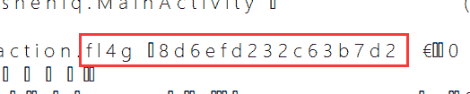
**flag{8d6efd232c63b7d2}**

## HelloSmali2

因为没学过java，所以就不逆向分析了

这题直接把`XMan.java`里的代码运行就能得到flag
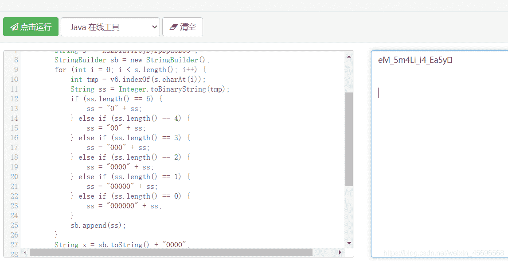
**XMAN{eM_5m4Li_i4_Ea5y}**

## NoString

确实和题目名描述的一样，ida打开后，shift+f12看不到什么有效信息

f5看一下伪代码

```
int wmain()
{
  signed int v0; 
  signed int i; 
  signed int v2; 
  signed int j; 
  int k; 
  int v5; 
  signed int v6; 
  signed int l; 
  signed int v8; 
  signed int m; 
  char v11; 
  __int128 v12; 
  __int16 v13; 

  v0 = strlen(Format);  
  for ( i = 0; i < v0; ++i )
    Format[i] ^= 9u;   
  printf("yelhzl)`gy|})|)oehnl3");
  v11 = 0;
  v13 = 0;
  v12 = 0i64;
  v2 = strlen(a80z);
  for ( j = 0; j < v2; ++j )
    a80z[j] ^= 9u;  
  scanf(a80z, &v11);  
  for ( k = 0; k < 19; ++k )
    *(&v11 + k) ^= 9u;
  v5 = strcmp(&v11, aOehnl3rHfCcgpt);  
  if ( v5 )
    v5 = v5 < 0 ? -1 : 1;   
  if ( v5 )    
  {
    v6 = strlen(aLF);
    for ( l = 0; l < v6; ++l )
      aLF[l] ^= 9u;
    printf("l{{f{");
  }
  else  
  {
    v8 = strlen(aNa);
    for ( m = 0; m < v8; ++m )
      aNa[m] ^= 9u;
    printf("{`na}");
  }
  printf("\r\n");
  system("pause");
  return 0;
} 
```

注意到**Format**中每一位依次`与9u异或`后得到的结果可能是**yelhzl)`gy|})|)oehnl3**

尝试写脚本，看一下Format本来的值是什么

```
#include<stdio.h>
#include <string.h>

int  main(){
	char a[] = "yelhzl)`gy|})|)oehnl3";
	for(int i = 0;i < strlen(a) ; i++)
	{
		a[i] ^= 9u;
	}
	printf("%s",a);  
} 
```

发现输出的结果正好是打开exe文件时，打印出的字符
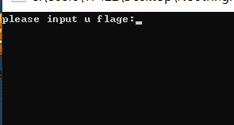
那么后面某串字符肯定与输出的flag有关系，注意到后面v5赋值为1时，输出了一串`l{{f{`，拿去运行一下发现结果是`error`；而v5赋值为-1时，输出了 **{`na}**，运行结果是`right`。

那么说明重要的判断条件在前面，应该就是 `v5 = strcmp(&v11, aOehnl3rHfCcgpt);`，找到`aOehnl3rHfCcgpt`对应的值`oehnl3r=<?=hF@CCGPt`
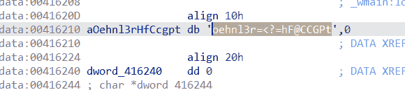
拿去跟9u异或一下，得到flag
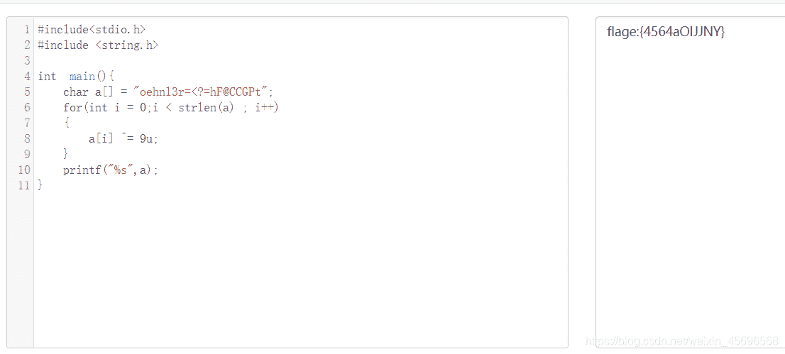

## First_Mobile(xman)

把classes.dex解压出来，打包成jar后用`jd-gui`打开，然后看一下encode.class

```
package com.example.xman.easymobile;

public class encode {
  private static byte[] b = new byte[] { 
      23, 22, 26, 26, 25, 25, 25, 26, 27, 28, 
      30, 30, 29, 30, 32, 32 };

  public static boolean check(String paramString) {
    byte[] arrayOfByte1 = 

    byte[] arrayOfByte2 = new byte[16];
    int i;
    for (i = 0; i < 16; i++)
      arrayOfByte2[i] = (byte)((arrayOfByte1[i] + b[i]) % 61); 
    for (i = 0; i < 16; i++)
      arrayOfByte2[i] = (byte)(arrayOfByte2[i] * 2 - i); 
    return (new String(arrayOfByte2)).equals(paramString);
  }
} 
```

加密过程并不复杂，写脚本解密即可

```
s=[23, 22, 26, 26, 25, 25, 25, 26, 27, 28, 30, 30, 29, 30, 32, 32]
print("XMAN{",end="")
for i in range(len(s)):
    for j in range(128):
        if (j+s[i])%61*2-i == j:
            print(chr(j),end="")
print("}") 
```

## 杰瑞的奶酪

直接f5查看伪代码

```
int wmain()
{
  int v0; 
  int v1; 
  int v2; 
  int v3; 
  char Str; 

  sub_4010E0(0, 0, 0, 0, 0);
  v0 = sub_4011A0(aAfxIdM, 8);
  ((void (__cdecl *)(int))dword_417220[5])(v0);
  v1 = sub_4011A0(aU, 6);
  ((void (__cdecl *)(int, char *))dword_417220[6])(v1, &Str);
  sub_401000(&Str);
  v2 = sub_4011A0(aNgmb6, 9);
  if ( sub_401060(v2, &Str) )
    v3 = sub_4011A0(aUnOs, 7);
  else
    v3 = sub_4011A0(aWw, 5);
  ((void (__cdecl *)(int))dword_417220[5])(v3);
  ((void (__cdecl *)(void *))dword_417220[5])(&unk_411198);
  system("pause");
  return 0;
} 
```

注意到多次出现**sub_4011A0**方法，跟进一下发现，**sub_4011A0(str,n)** 作用是将字符串str中每一位分别与n异或。

那么稍微运行一手，得到一些值：

> v0 = input value
> v1 = %s
> 前一个v3 = right
> 后一个v3 = err

可见重点就在这里了

```
 if ( sub_401060(v2, &Str) )
    v3 = sub_4011A0(aUnOs, 7); 
```

其中v2的值是在**byte_416000**输入的内容分别与9异或

跟进`byte_416000`，拿到输入的内容
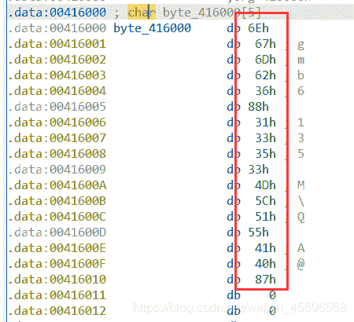
跟进**sub_401060**发现判断的代码

```
int __cdecl sub_401060(_BYTE *a1, char *a2)
{
  int result; 
  _BYTE *v4; 
  int i; 
  char v6; 

  result = (int)a1;
  v4 = a1;
  for ( i = 0; i < 100; ++i )
  {
    v6 = *a2;
    if ( !*v4 && !v6 )
      return 1;
    if ( (char)*v4 != v6 )
      return 0;
    result = (int)++v4;
    ++a2;
  }
  return result;
} 
```

写脚本

```
s = [0x6E,0x67,0x6D,0x62,0x36,0x88,0x31,0x33,0x35,0x33,0x4D,0x5C,0x51,0x55,0x41,0x40,0x87]
for i in range(len(s)):
    print(chr((s[i]^9)-i-1),end="") 
```

## mobile1(gctf)

把classes.dex解压出来，打包成jar，再用jd-gui打开

看一下`MainActivity`，发现主要代码

```
 private boolean checkSN(String paramString1, String paramString2) {
    if (paramString1 != null)
      try {
        if (paramString1.length() == 0)
          return false; 
        if (paramString2 != null && paramString2.length() == 22) {  #判断参数paramString2长度是否为22
          MessageDigest messageDigest = MessageDigest.getInstance("MD5");   #创建md5对象
          messageDigest.reset();
          messageDigest.update(paramString1.getBytes());
          paramString1 = toHexString(messageDigest.digest(), "");
          StringBuilder stringBuilder = new StringBuilder();
          for (int i = 0; i < paramString1.length(); i += 2)   #这里是隔位取的，取0、2、4...
            stringBuilder.append(paramString1.charAt(i)); 
          paramString1 = stringBuilder.toString();
          boolean bool = ("flag{" + paramString1 + "}").equalsIgnoreCase(paramString2);
          if (bool)
            return true; 
        } 
      } catch (NoSuchAlgorithmException noSuchAlgorithmException) {
        noSuchAlgorithmException.printStackTrace();
      }  
    return false;
  } 
```

简单分析，就是把传入的`paramString1`md5加密后，取奇数位字符，连在一起就是flag

又注意到传入的paramString1是`Tenshine`
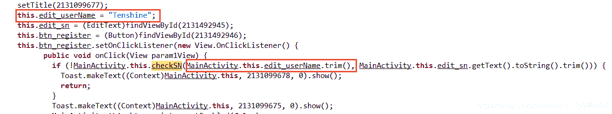
写脚本

```
import hashlib

def md5(s):
    md5 = hashlib.md5() 
    s = s.encode('utf-8')
    md5.update(s) 
    return md5.hexdigest()

if __name__ == '__main__':
    x = md5("Tenshine")
    print("flag{",end="")
    for i in range(0,len(x),2):
        print(x[i],end="")
    print("}",end="") 
```

## Timer(阿里CTF)

一个apk，老样子，把classes.dex解压出来，打包成jar后用jd-gui打开，看一下MainActivity

```
package net.bluelotus.tomorrow.easyandroid;

import android.os.Bundle;
import android.os.Handler;
import android.support.v7.app.AppCompatActivity;
import android.view.Menu;
import android.view.MenuItem;
import android.widget.TextView;

public class MainActivity extends AppCompatActivity {
  int beg = (int)(System.currentTimeMillis() / 1000L) + 200000;

  int k = 0;

  int now;

  long t = 0L;

  static {
    System.loadLibrary("lhm");
  }

  public static boolean is2(int paramInt) {
    if (paramInt <= 3)
      return !(paramInt <= 1); 
    if (paramInt % 2 == 0 || paramInt % 3 == 0)
      return false; 
    int i = 5;
    while (true) {
      if (i * i <= paramInt) {
        if (paramInt % i == 0 || paramInt % (i + 2) == 0)
          return false; 
        i += 6;
        continue;
      } 
      return true;
    } 
  }

  protected void onCreate(Bundle paramBundle) {
    super.onCreate(paramBundle);
    setContentView(2130968600);
    final TextView tv1 = (TextView)findViewById(2131492944);
    final TextView tv2 = (TextView)findViewById(2131492945);
    final Handler handler = new Handler();
    handler.postDelayed(new Runnable() {
          public void run() {
            MainActivity.this.t = System.currentTimeMillis();
            MainActivity.this.now = (int)(MainActivity.this.t / 1000L);
            MainActivity.this.t = 1500L - MainActivity.this.t % 1000L;
            tv2.setText("AliCTF");
            if (MainActivity.this.beg - MainActivity.this.now <= 0) {
              tv1.setText("The flag is:");
              tv2.setText("alictf{" + MainActivity.this.stringFromJNI2(MainActivity.this.k) + "}");
            } 
            if (MainActivity.is2(MainActivity.this.beg - MainActivity.this.now)) {
              MainActivity mainActivity = MainActivity.this;
              mainActivity.k += 100;
            } else {
              MainActivity mainActivity = MainActivity.this;
              mainActivity.k--;
            } 
            tv1.setText("Time Remaining(s):" + (MainActivity.this.beg - MainActivity.this.now));
            handler.postDelayed(this, MainActivity.this.t);
          }
        }0L);
  }

  public boolean onCreateOptionsMenu(Menu paramMenu) {
    getMenuInflater().inflate(2131558400, paramMenu);
    return true;
  }

  public boolean onOptionsItemSelected(MenuItem paramMenuItem) {
    return (paramMenuItem.getItemId() == 2131492959) ? true : super.onOptionsItemSelected(paramMenuItem);
  }

  public native String stringFromJNI2(int paramInt);
} 
```

注意到输出flag的条件是`beg-now<=0`

```
 if (MainActivity.this.beg - MainActivity.this.now <= 0) {
              tv1.setText("The flag is:");
              tv2.setText("alictf{" + MainActivity.this.stringFromJNI2(MainActivity.this.k) + "}"); 
```

再找一下**beg**和**now**分别是什么

```
#System.currentTimeMillis()会获取系统时间，单位为ms，再/1000L把单位换成s
int beg = (int)(System.currentTimeMillis() / 1000L) + 200000;

MainActivity.this.now = (int)(MainActivity.this.t / 1000L); 
```

按照这个逻辑，正常要等200000s才能拿flag，肯定是不能这样等，注意到这里有个k变量，跟它有关系的代码

```
 if (MainActivity.is2(MainActivity.this.beg - MainActivity.this.now)) {
              MainActivity mainActivity = MainActivity.this;
              mainActivity.k += 100;
            } else {
              MainActivity mainActivity = MainActivity.this;
              mainActivity.k--;
            } 
```

```
 public static boolean is2(int paramInt) {
    if (paramInt <= 3)
      return !(paramInt <= 1); 
    if (paramInt % 2 == 0 || paramInt % 3 == 0)
      return false; 
    int i = 5;
    while (true) {
      if (i * i <= paramInt) {
        if (paramInt % i == 0 || paramInt % (i + 2) == 0)
          return false; 
        i += 6;
        continue;
      } 
      return true;
    } 
  } 
```

可见，每过1s，就会把**beg**和**now**代入**is2**函数运算一次，如果返回true，k+100，否则k-1，写个脚本计算一下当运行200000s后k的值

```
def is2(n):
    if n<=3:
        if n>1:
            return True
        return False
    if n%2 ==0 or n%3 == 0:
        return False
    i = 5
    while True:
        if i**2 <= n:
            if n%i == 0 or n%(i+2) == 0:
                return False
            i += 6
            continue
        return True
k=0
for j in range(200000):
    if is2(j):
        k += 100
    else:
        k -= 1
print(k) 
```

随后用apktool反编译原apk，对**smali\net\bluelotus\tomorrow\easyandroid**中的`MainActivity$1.smali`进行修改

在第139行，发现v3是k的值，所以在接下来的第140行，给v3赋值：`const v3,1616384`
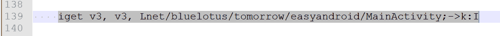
只改了k的值还不够，还需要满足另一个条件，在113行，有一个small的基本语法：`if-gtz v0, :cond_0`，这里的意思是如果`v0大于0`则跳转到`cond_0`，这里改成`if-ltz v0, :cond_0`就满足条件了

> "if-ltz vA, :cond_**" 如果vA小于0则跳转到:cond_**
> "if-gtz vA, :cond_**" 如果vA大于0则跳转到:cond_**

修改完后，用apktool重新打包成apk文件，然后`签名`，之后才能安装，然后得到flag(提交时需要改格式)