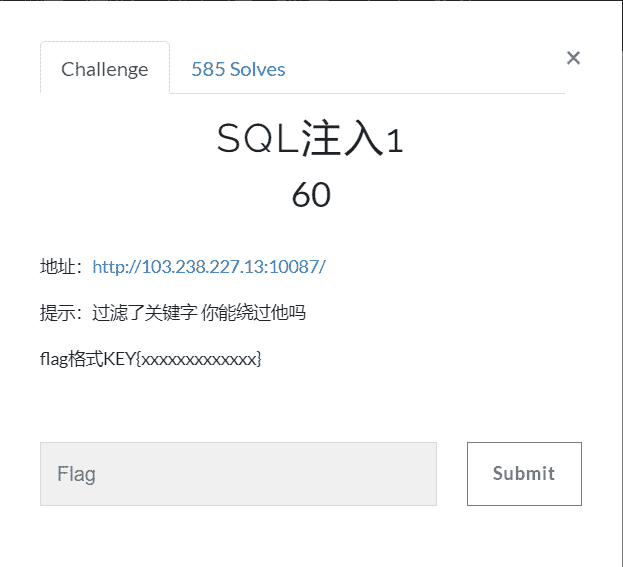
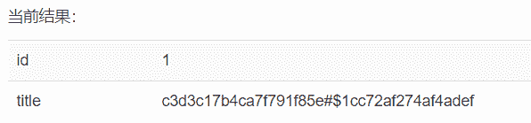

<!--yml
category: 未分类
date: 2022-04-26 14:46:52
-->

# BugkuCTF SQL注入1_weixin_34397291的博客-CSDN博客

> 来源：[https://blog.csdn.net/weixin_34397291/article/details/85987794](https://blog.csdn.net/weixin_34397291/article/details/85987794)

**前言**

写了这么久的web题，算是把它基础部分都刷完了一遍，以下的几天将持续更新BugkuCTF WEB部分的题解，为了不影响阅读，所以每道题的题解都以单独一篇文章的形式发表，感谢大家一直以来的支持和理解，共勉~~~



我们点开链接，里面有段这样的代码：

```
//过滤sql
$array = array('table','union','and','or','load_file','create','delete','select','update','sleep','alter','drop','truncate','from','max','min','order','limit'); foreach ($array as $value)
{ if (substr_count($id, $value) > 0)
    { exit('包含敏感关键字！'.$value);
    }
} //xss过滤
$id = strip_tags($id); $query = "SELECT * FROM temp WHERE id={$id} LIMIT 1";
```

上面 //过滤sql

对sql注入进行了严格的过滤，完全没法注入，但百密必有一疏，

下面的//xss过滤

中的 strip_tags($id) 函数，使得注入有了思路。

首先看一下strip_tags这个函数: 

strip_tags() 函数剥去字符串中的 HTML、XML 以及 PHP 的标签。

那么可以利用这点，在union等敏感字中间加上 <a><br>等标签。

根据题目提示说要访问参数为：?id=x

查找表为key的数据表，id=1值hash字段值，我们构造出如下注入语句：

```
http://103.238.227.13:10087/?id=-1 u<a>nion selec<a>t  1,hash fro<a>m .key
```

直接爆出了答案，这应该就算我们需要的flag

