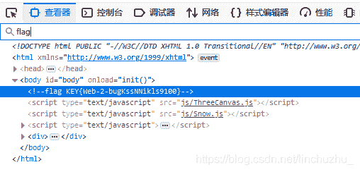
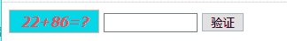
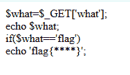
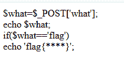
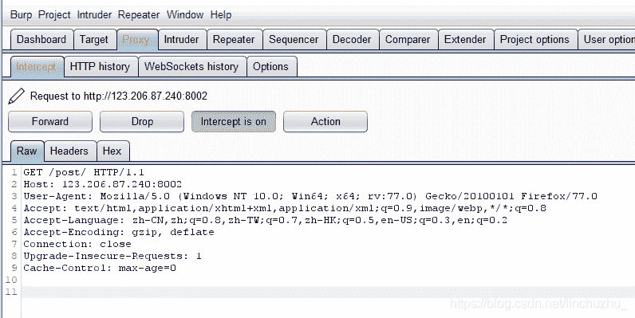
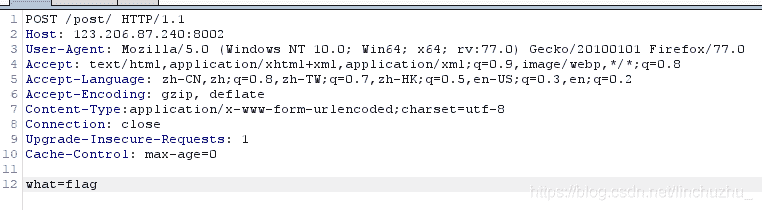
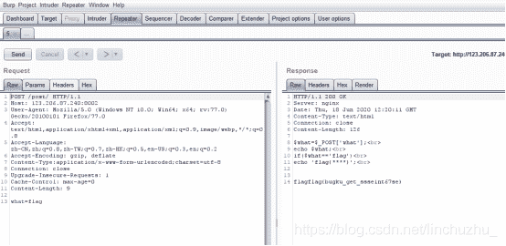
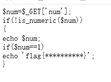

<!--yml
category: 未分类
date: 2022-04-26 14:43:03
-->

# BugkuCTF WEB前五题题解 莽就完事了_废物竹子的博客-CSDN博客

> 来源：[https://blog.csdn.net/linchuzhu_/article/details/106841745](https://blog.csdn.net/linchuzhu_/article/details/106841745)

<font>第一次写题解多担待！</font>

# （一）web2

[http://123.206.87.240:8002/web2/](http://123.206.87.240:8002/web2/).
打开网页后是闪瞎眼的表情包，不过不要紧，直接F12查找flag。

完毕。

# （二）计算器

[http://123.206.87.240:8002/yanzhengma/](http://123.206.87.240:8002/yanzhengma/)
还是老样子，遇题先按F12，没有发现什么特殊的地方。

尝试在输入框中输入答案，发现只能输入一位数字。
接着在开发者工具中发现

出题者对输入长度进行限制，当然，前端的限制是可以让我们~~为所欲为~~的。
接着将maxlength限制删除后在输入答案（如果算不出来可以百度一下计算器哦），即可获得flag。

# （三）web基础$_GET

[http://123.206.87.240:8002/get/](http://123.206.87.240:8002/get/)


```
$what=$_GET['what'];
 echo $what;
 if($what=='flag')
 echo 'flag{****}'; 
```

OK明显的代码审计题目。
让我们看看代码，先get获取what参数变量，如果what变量==‘flag’，输出flag。

该题为GET传参，可直接在url后面加参数
在url后加上?what=flag

```
http://123.206.87.240:8002/get/?what=flag 
```

即可获得flag

# （四）web基础$_POST

OK第二道代码审计来了！

还是先让我们看看代码，哎呀，POST！好像比GET稍微麻烦了一点诶。
~~要不明天再做？~~

## 方法一

一开始刚学的时候用的是HackBar，但是现在再用一次不是先得我很low吗！（~~其实就是懒~~）
所以直接复制了之前自己写的小笔记，反正有方法二，害。
（1）F12，打开HackBar
（2）将url输入并load
（3）选中Post data
（4）提交what=flag的Post请求
（5）Execut

## 方法二

使用万能的Burp Suite（~~让我们来问问神奇小bp吧~~）
首先打开bp抓包

接着修改相关参数，这里因为是post传参，需要先将GET改为POST，再加上一个消息头

```
Content-Type:application/x-www-form-urlencoded;charset=utf-8 
```

最后最关键的是在数据部分加入

```
what=flag 
```

就像这样

最后右键选择 Send to Repeater
打开repeater并send，flag就到手啦！


# （五）矛盾

[http://123.206.87.240:8002/get/index1.php](http://123.206.87.240:8002/get/index1.php)
好的又是~~该死的~~代码审计
还是让我们先来看看代码！

首先get一个参数num，若num不满足is_numeric方法，则返回num，若um不满足is_numeric方法且num等于(?)1，则输出flag。

我上面这句话好像是矛盾的，既要num为不为数字，又要num等于(?)1，明显是不可能的，其实不然。

首先让我们来看看[is_numeric()](https://www.runoob.com/php/php-is_numeric-function.html)方法
is_numeric()返回值:
如果指定的变量是数字和数字字符串则返回 TRUE，否则返回 FALSE。

其次，“==”在php中是弱比较，什么是弱比较，让我们看看[PHP的比较运算符](https://www.php.net/manual/zh/language.operators.comparison.php)和[PHP的类型比较表](https://www.php.net/manual/zh/types.comparisons.php)。
弱比较中只要数值等于就可以了，类型无所谓。
这样我们就可以构造num=1x（1开头的字符串皆可），然后get传参

```
http://123.206.87.240:8002/get/index1.php?num=1x 
```

即可得到flag！

<font>**好了今天的弟弟题解写完了，下次再见！**</font>