<!--yml
category: 未分类
date: 2022-04-26 14:31:23
-->

# BugkuCTF WEB解题记录 1-5_weixin_30556959的博客-CSDN博客

> 来源：[https://blog.csdn.net/weixin_30556959/article/details/96107465](https://blog.csdn.net/weixin_30556959/article/details/96107465)

####  写了一部分的web题，算是把它最基础的一部分做了一遍，以后的几天将持续更新BugkuCTF WEB部分的题解，为了不影响阅读，所以每五道题的题解以一篇文章的形式发表，感谢大家一直以来的支持和理解，共勉~~~

## web2

[ ](https://www.cnblogs.com/Anser-dabao-982480259/p/9432021.html)

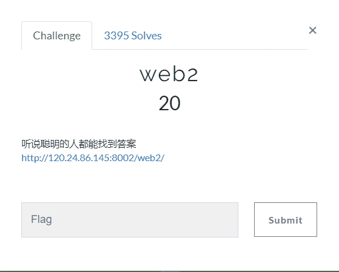

打开链接[http://120.24.86.145:8002/web2/](http://120.24.86.145:8002/web2/)    看到的是一个充满滑稽脸的网页 ，这个题目很简单

我们直接利用F12查看网页源代码

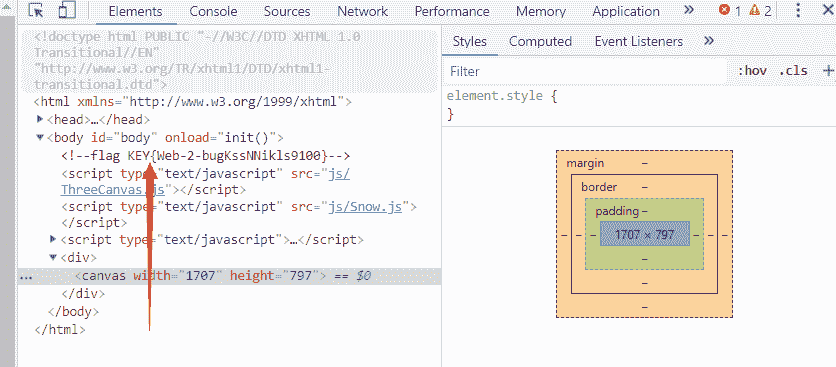

KEY 就在这里  直接复制粘贴回去就成功了

KEY{Web-2-bugKssNNikls9100}

## 文件上传测试

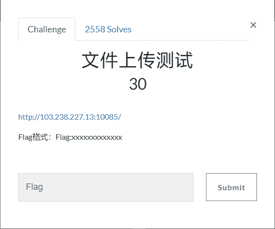

打开链接[http://103.238.227.13:10085/](http://103.238.227.13:10085/)   看到以下页面

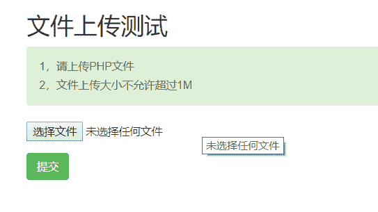

首先我们试一试上传php格式文件123.php

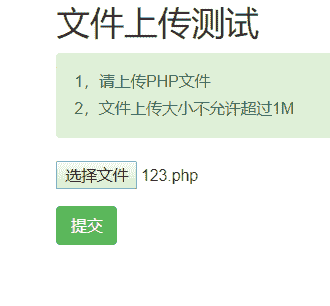

系统提示  非图片文件 

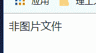

当我们上传png格式的文件时又提示   非php文件

我们联想到使用BP进行数据包抓取 然后更该再进行上传

首先实验下 123.png格式的    上传   然后更改

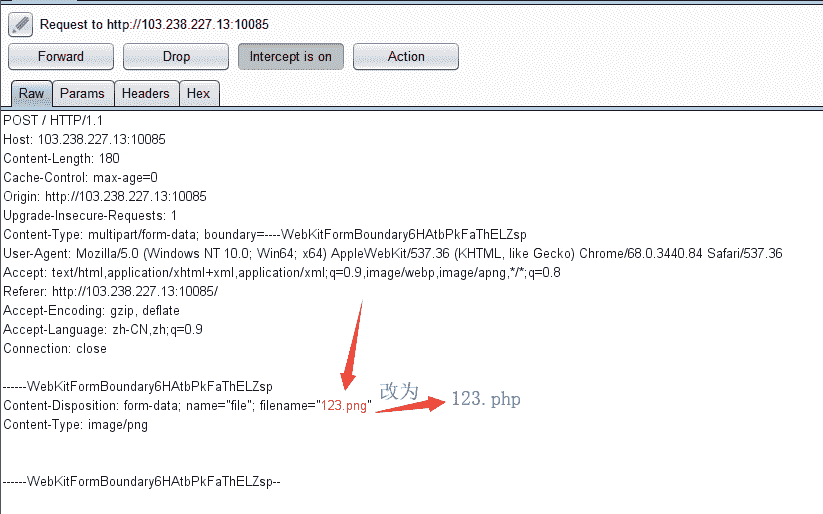

提示为非php文件，那么我们就该思考了

首先要满足图片格式  其次还要满足为php文件

我们就联想到试一试123.php.png   继续使用BP抓包改包

将123.php.png的png去掉  更名为123.php

 之后点击最上边的 intercept is on 释放数据  

flag就出现了

Flag:42e97d465f962c53df9549377b513c7e

## 计算器

~

打开链接[http://120.24.86.145:8002/yanzhengma/](http://120.24.86.145:8002/yanzhengma/)  

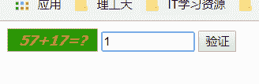

计算完成之后输入发现最多只能输入一个数字  猜测是最大长度限制 按F12查看源码

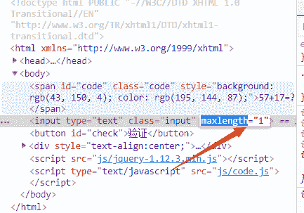

原来设置的最大长度maxlength=“1”  将它改成>=2的数字  点击 页面空白处然后就发现可以输入多个字节了

将答案填写进去 验证就得到了flag

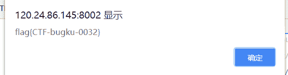

flag{CTF-bugku-0032}

## web基础$_GET

~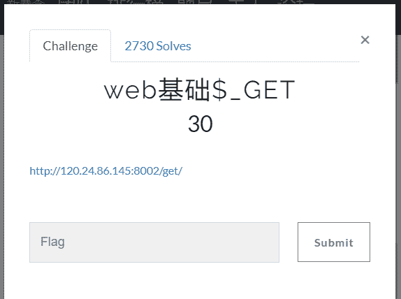

打开链接[http://120.24.86.145:8002/get/](http://120.24.86.145:8002/get/)  是这样一段代码

```
$what=$_GET['what']; echo $what; if($what=='flag') echo 'flag{****}';
```

查看源码，

源码的意思是要以GET的方式传输一个what的值获取flag

那我们就按照上边的来输入

http://120.24.86.145:8002/get/?what=flag

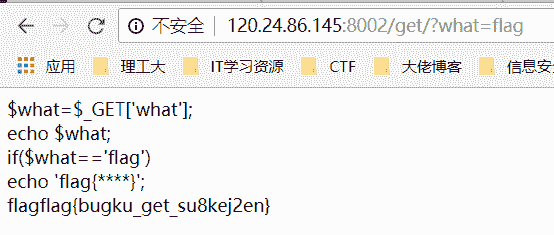

flag就出现了 

## web基础$_POST

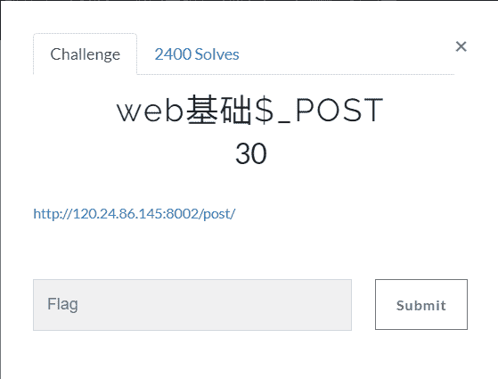

打开链接[http://120.24.86.145:8002/post/](http://120.24.86.145:8002/post/)

查看浏览器显示的源码

```
$what=$_POST['what']; echo $what; if($what=='flag') echo 'flag{****}';
```

源码里的意思就是要我们以POST的方式传输一个what的值然后获取flag

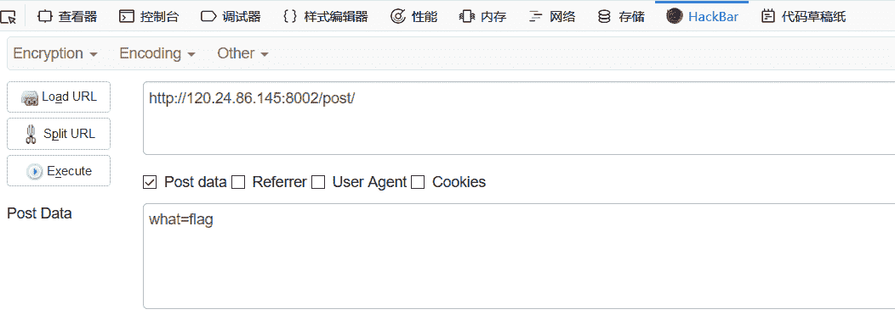

 那我们就按要求传输  flag就出来了

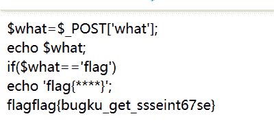