<!--yml
category: 未分类
date: 2022-04-26 14:31:25
-->

# BugkuCTF WEB解题记录 11-15_weixin_30699463的博客-CSDN博客

> 来源：[https://blog.csdn.net/weixin_30699463/article/details/96107472](https://blog.csdn.net/weixin_30699463/article/details/96107472)

## 写了一部分的web题，算是把它最基础的一部分做了一遍，以后的几天将持续更新BugkuCTF WEB部分的题解，为了不影响阅读，所以每五道题的题解以一篇文章的形式发表，感谢大家一直以来的支持和理解，共勉~~~

## 你必须让他停下

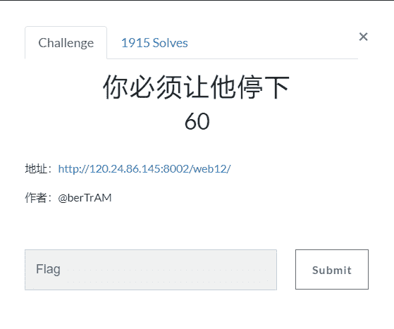

题目链接[http://120.24.86.145:8002/web12/](http://120.24.86.145:8002/web12/)

这个题目，打开的是一个不断自动刷新停不下来的网页

看到网页一直不断刷新，就想网页刷新，还时不时出现图片。源码会出现改变

联想到falg应该就是在源码里了

打开源码查看，观察不断刷新过程中源码的改变。直到突然出现一页

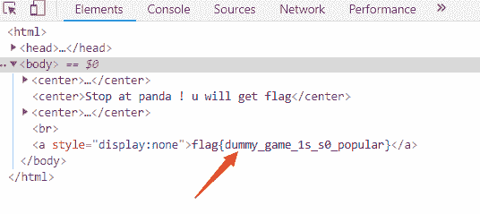

证明了我们的猜想是正确的。

这个页面一闪即逝，必须让他停下来。我们就考虑试试用BP抓包试一试

我们把信息通过Action发送到Repeater，然后多GO几次传输数据模拟网页刷新，得到flag

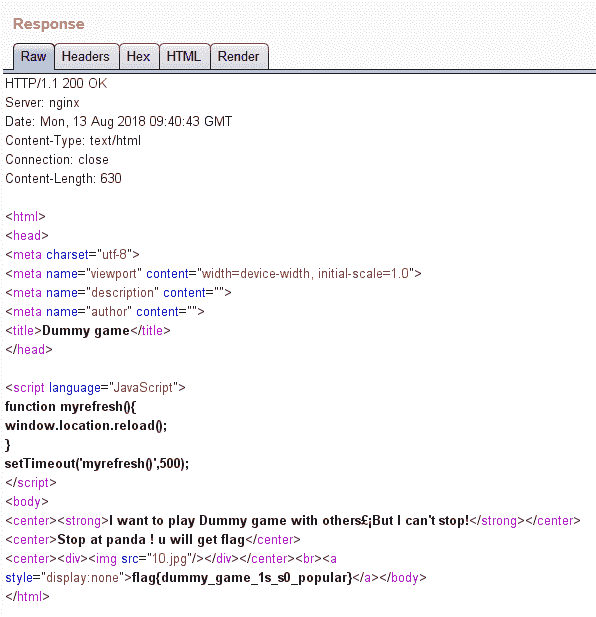

这个时候flag就出来了

## 本地包含

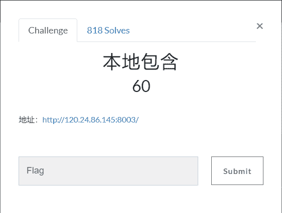

题目链接[http://120.24.86.145:8003/](http://120.24.86.145:8003/)

由于题目暂时进不去，后期更新

## 变量1

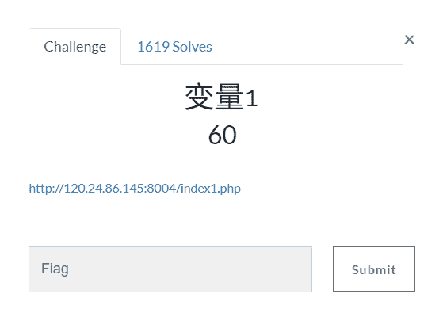

题目链接[http://120.24.86.145:8004/index1.php](http://120.24.86.145:8004/index1.php)

打开网页我们看到这样的 代码

```
flag In the variable ! <?php error_reporting(0); include "flag1.php"; highlight_file(__file__); if(isset($_GET['args'])){ $args = $_GET['args']; if(!preg_match("/^\w+$/",$args)){ die("args error!");
    } eval("var_dump($$args);");
} ?>
```

其中定义了一个变量args    而且我们可以从语句中得知变量是7个字符

我们思考一下，七个字符的变量   

于是就想到了这个题可能考的是全局变量   GLOBALS

构造一下，用GET方式传输

```
http://120.24.86.145:8004/index1.php?args=GLOBALS
```

直接就爆出了flag

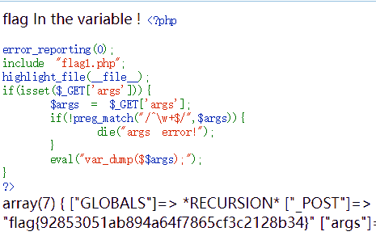

## web5

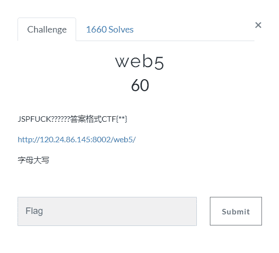

题目链接[http://120.24.86.145:8002/web5/](http://120.24.86.145:8002/web5/)

打开之后是一个输入窗口，要我们输入正确的指令获取flag

查看源代码，有一大串括号组成的字符。

这是一种JS转码的特殊字符，我们复制粘贴，放到控制台里运行一下。

给了我们一条指令：ctf{whatfk}

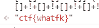

我们将指令按照要求输入窗口就pass了

## 头等舱

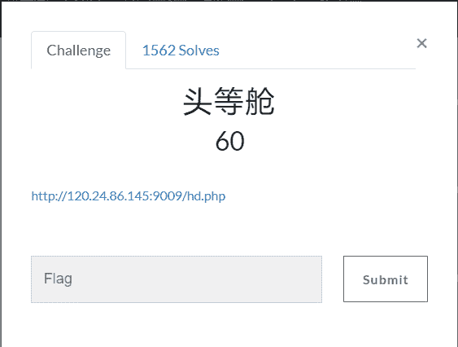

题目链接[http://120.24.86.145:9009/hd.php](http://120.24.86.145:9009/hd.php)

进去网页，里面只有几个字   ”什么也没有“

查看下源代码   发现也是什么有用信息也没有

那么我们使用BP抓包GO一下看有没有得到什么信息

先将信息发送到对话窗口

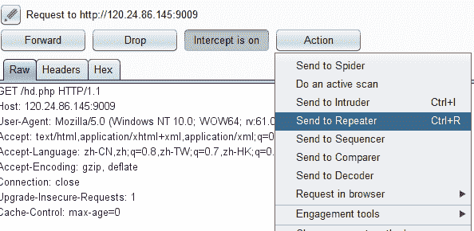

GO 运行一下flag就出来了

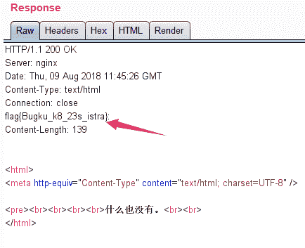