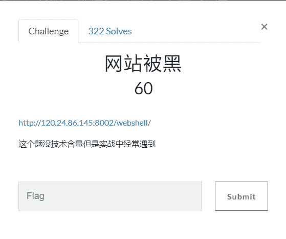
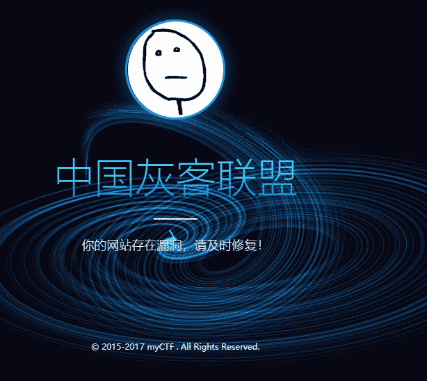
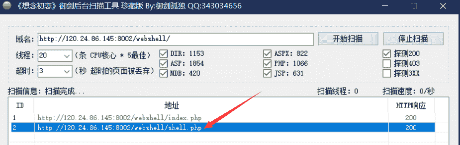
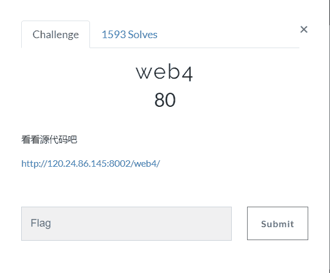
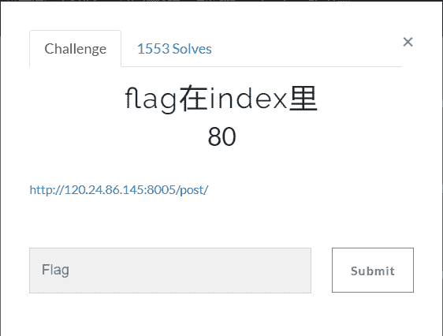
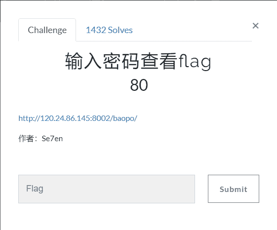
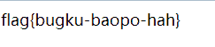
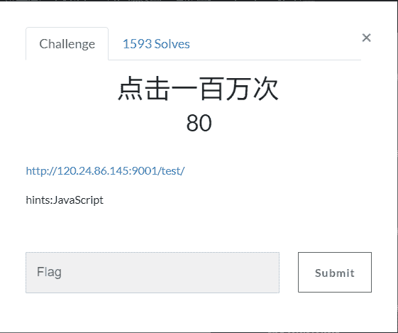
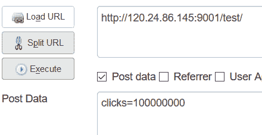

<!--yml
category: 未分类
date: 2022-04-26 14:19:55
-->

# BugkuCTF WEB解题记录 16-20_aap49042的博客-CSDN博客

> 来源：[https://blog.csdn.net/aap49042/article/details/102388432/](https://blog.csdn.net/aap49042/article/details/102388432/)

## 写了一部分的web题，算是把它最基础的一部分做了一遍，以后的几天将持续更新BugkuCTF WEB部分的题解，为了不影响阅读，所以每五道题的题解以一篇文章的形式发表，感谢大家一直以来的支持和理解，共勉~~~

## 网站被黑



题目链接[http://120.24.86.145:8002/webshell/](http://120.24.86.145:8002/webshell/)

打开网页是一个被人给黑掉的网页

 

我们试过很多种方法，但是依旧没有头绪。

这个时候我们就只能使用扫描工具扫描一下后台了

工具链接：https://pan.baidu.com/s/1QmLLuWXLaX_xVwVxYZCctg 密码：raxy



我们两个都试试，是webshell，需要输入密码，这里考验使用弱口令进行爆破

我们就使用BP密码爆破一下就进入拿到flag了

(密码我就不说了，给个提示hhhh，自己想)

## web4



 题目链接[http://120.24.86.145:8002/web4/](http://120.24.86.145:8002/web4/)

查看原源代码，里边有一大串字符

```
var p1 = '%66%75%6e%63%74%69%6f%6e%20%63%68%65%63%6b%53%75%62%6d%69%74%28%29%7b%76%61%72%2
0%61%3d%64%6f%63%75%6d%65%6e%74%2e%67%65%74%45%6c%65%6d%65%6e%74%42%79%49%64%28%22%70%61%73
%73%77%6f%72%64%22%29%3b%69%66%28%22%75%6e%64%65%66%69%6e%65%64%22%21%3d%74%79%70%65%6f%66
%20%61%29%7b%69%66%28%22%36%37%64%37%30%39%62%32%62';
var p2 = '%61%61%36%34%38%63%66%36%65%38%37%61%37%31%31%34%66%31%22%3d%3d%61%2e%76%61%6c%75
%65%29%72%65%74%75%72%6e%21%30%3b%61%6c%65%72%74%28%22%45%72%72%6f%72%22%29%3b%61%2e%66%6f%
63%75%73%28%29%3b%72%65%74%75%72%6e%21%31%7d%7d%64%6f%63%75%6d%65%6e%74%2e%67%65%74%45%6c%6
5%6d%65%6e%74%42%79%49%64%28%22%6c%65%76%65%6c%51%75%65%73%74%22%29%2e%6f%6e%73%75%62%6d%69
%74%3d%63%68%65%63%6b%53%75%62%6d%69%74%3b';
eval(unescape(p1) + unescape('%35%34%61%61%32' + p2));
```

有点基础的就能看出来这个是url转码的我们使用url解码工具解码一下[UrlEncode编码/解码](http://tool.chinaz.com/tools/urlencode.aspx)，获得以下字符

```

  var p1 = 'function checkSubmit(){var a=document.getElementById("password");if("undefined"!=typeof a){if("67d709b2b';
var p2 = 'aa648cf6e87a7114f1"==a.value)return!0;alert("Error");a.focus();return!1}}document.getElementById("levelQuest").οnsubmit=checkSubmit;';
eval(unescape(p1) unescape('54aa2' p2)) 

```

我们按照代码进行组合：67d709b2b54aa2aa648cf6e87a7114f1

将组合的字符输入框中

flag就出来了

## flag在index里



题目链接[http://120.24.86.145:8005/post/](http://120.24.86.145:8005/post/)

打开题目，里边是一个链接，点击一下进去发现只有test5几个字符

查看链接发现有file=xxxxxx  再结合题目名字flag再index里

我们会联想到是file类型的本地文件包含，那么我们构造一下

```
http://120.24.86.145:8005/post/index.php?file=php://filter/read=convert.base64-encode/resource=index.php
```

打开了一个页面，我们为了方便查看利用F12查看下源代码

这样的一大串字符，这是base64加密格式  我们用工具解密一下[Base64加密解密](http://tool.chinaz.com/tools/base64.aspx)

```
PGh0bWw+DQogICAgPHRpdGxlPkJ1Z2t1LWN0ZjwvdGl0bGU+DQogICAgDQo8P3B
ocA0KCWVycm9yX3JlcG9ydGluZygwKTsNCglpZighJF9HRVRbZmlsZV0pe2VjaG
8gJzxhIGhyZWY9Ii4vaW5kZXgucGhwP2ZpbGU9c2hvdy5waHAiPmNsaWNrIG1lP
yBubzwvYT4nO30NCgkkZmlsZT0kX0dFVFsnZmlsZSddOw0KCWlmKHN0cnN0cigk
ZmlsZSwiLi4vIil8fHN0cmlzdHIoJGZpbGUsICJ0cCIpfHxzdHJpc3RyKCRmaWx
lLCJpbnB1dCIpfHxzdHJpc3RyKCRmaWxlLCJkYXRhIikpew0KCQllY2hvICJPaC
BubyEiOw0KCQlleGl0KCk7DQoJfQ0KCWluY2x1ZGUoJGZpbGUpOyANCi8vZmxhZ
zpmbGFne2VkdWxjbmlfZWxpZl9sYWNvbF9zaV9zaWh0fQ0KPz4NCjwvaHRtbD4NCg==
```

**给我们以下的一串代码  flag就再代码里边**

## 输入密码查看flag



题目链接[http://120.24.86.145:8002/baopo/](http://120.24.86.145:8002/baopo/)

打开是一个页面需要输入密码


看到要输入密码我们就想到用BP进行密码爆破了 ，关于BP密码爆破的文章随后会补充

密码：13579

爆破出密码之后，输入即可得到flag



## 点击一百万次



题目链接[http://120.24.86.145:9001/test/](http://120.24.86.145:9001/test/)

打开页面，要求我们点击一百万次，我们查看下源代码，看可不可以从源代码入手受解决问题

我们点击之后有一些数据会更改，我们试图更改下点击数据，点击之后依然回复原来状态

我们继续往下看有这也难怪一大串代码

```
    var clicks=0 $(function() {
      $("#cookie") .mousedown(function() {
          $(this).width('350px').height('350px');
        }) .mouseup(function() {
          $(this).width('375px').height('375px');
          clicks++;
          $("#clickcount").text(clicks); if(clicks >= 1000000){ var form = $('<form action="" method="post">' +
                        '<input type="text" name="clicks" value="' + clicks + '" hidden/>' +
                        '</form>');
                        $('body').append(form);
                        form.submit();
          }
        });
    }); 
```

定义了一个clicks  继续查看发现是使用POST方式传输

我们使用Hackbar(火狐的插件)传输一下



 将控制台页面下拉一下就可以看到我们的flag

