<!--yml
category: 未分类
date: 2022-04-26 14:32:18
-->

# BugkuCTF WEB解题记录 6-10_aap49042的博客-CSDN博客

> 来源：[https://blog.csdn.net/aap49042/article/details/102388431](https://blog.csdn.net/aap49042/article/details/102388431)

写了一部分的web题，算是把它最基础的一部分做了一遍，以后的几天将持续更新BugkuCTF WEB部分的题解，为了不影响阅读，所以每五道题的题解以一篇文章的形式发表，感谢大家一直以来的支持和理解，共勉~~~

矛盾

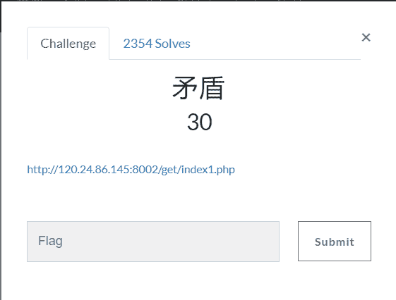

打开链接[http://120.24.86.145:8002/get/index1.php](http://120.24.86.145:8002/get/index1.php)  查看显示的源码 

```
$num=$_GET['num']; if(!is_numeric($num))
{ echo $num; if($num==1) echo 'flag{**********}';
}
```

这题同样是一道代码审计的题目

要求以GET方式传输一个num的值

这其中涉及了一个函数is_numeric，这个函数是检测变量是否为数字或数字字符串，是数字和数字字符串则返回 **`TRUE`**，否则返回 **`FALSE`**

代码显示的意思是要传入的num参数既不是数字字符串，又要等于1，这时候我们自然的联想到了科学记数法。

所以我们给num传递一个值 http://120.24.86.145:8002/get/index1.php?num=1e

flag就直接出来了

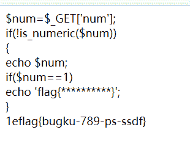

web3

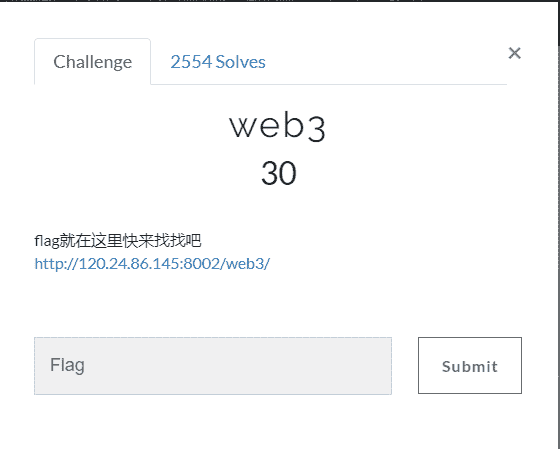

打开链接[http://120.24.86.145:8002/web3/](http://120.24.86.145:8002/web3/)

里边是一个 空白网页并且不断循环弹出flag就在这里，来找找吧

我们查看网页的源码发现  源码最后一排的注释标签有一串特殊的字符

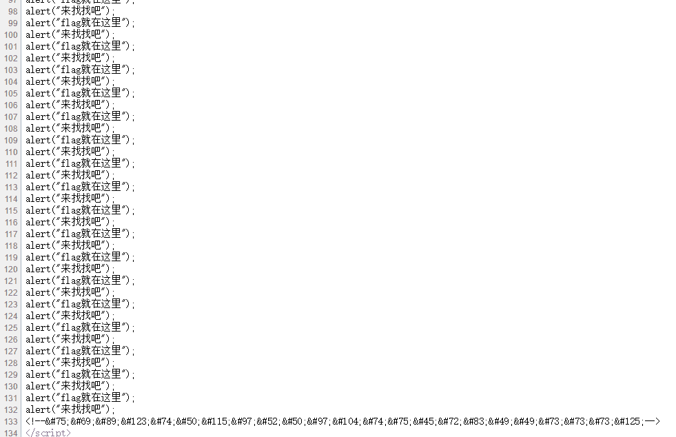

&#75;&#69;&#89;&#123;&#74;&#50;&#115;&#97;&#52;&#50;&#97;&#104;&#74;&#75;&#45;&#72;&#83;&#49;&#49;&#73;&#73;&#73;&#125;

我们百度查看下，这个是HTML的特殊字符  下面是一个对照表http://www.mamicode.com/info-detail-1680849.html

一个一个对比即可解出flag

第二个方法就是使用站长工具的[Unicode编码转换](http://tool.chinaz.com/tools/unicode.aspx)

直接便可爆出flag

sql注入

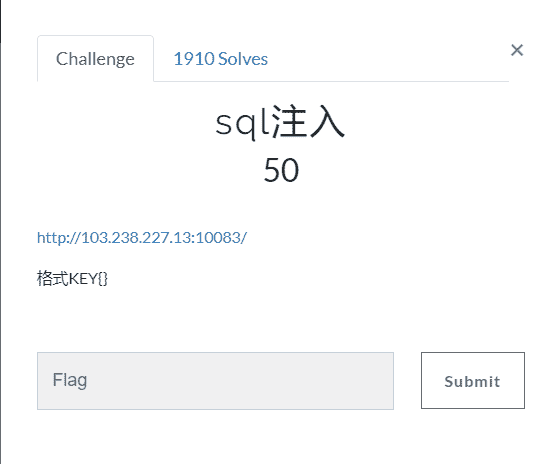

题目链接[http://103.238.227.13:10083/](http://103.238.227.13:10083/)

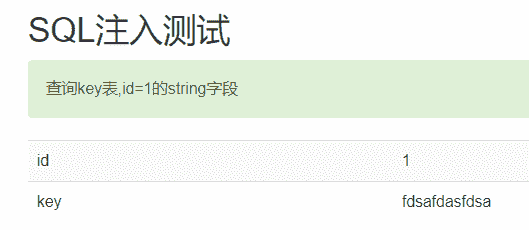

这个题就是要我们进行sql注入  

因为我们不知道注入类型，首先我们右键----》查看一下源代码  

发现源代码里有一个gb2312，于是我们联想到宽字节注入

题目要求是查询key表,id=1的string字段

这样的话我们构造payload：

```
第一个    http://103.238.227.13:10083/?id=1%df'    我们构造一个宽字节输入使‘逸出，使之出现一个错误
```

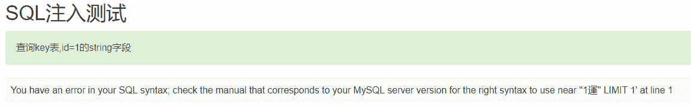

下面我们就可以进行注入了

继续构造第二个apyload

```
第二个     http://103.238.227.13:10083/?id=1%df' union select 1,2 %23      //查询到的表
```

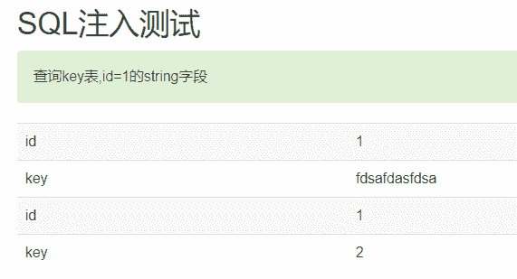

```
第三个        http://103.238.227.13:10083/?id=1%df' union select 1,database() %23    //查询数据库的表
```

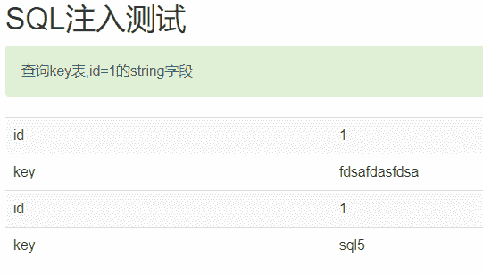

最后我们构造一个payload：查询数据库内数据

```
查询库内数据     http://103.238.227.13:10083/?id=1%df' union select 1,string from sql5.key %23    
```

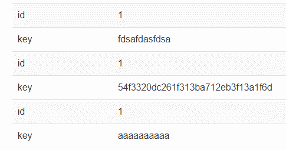

直接查询到flag

域名解析

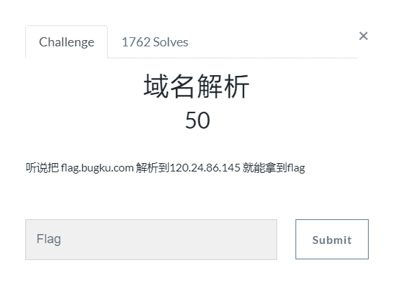

这个题目的意思是将flag.bugku.com解析到120.24.86.145     

原理就是更改电脑host文件达到目的

```
windows的hosts路径    C:\Windows\System32\drivers\etc       
```

直接打开hosts文件在最后边加入120.24.86.145      flag.bugku.com  (不用管前面什么内容)

PS：更改系统文件注意备份

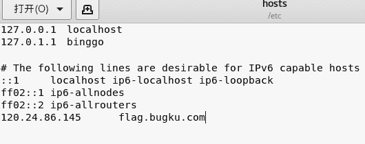

这时候我们再在浏览器中打开flag.bugku.com   falg就直接爆出来了

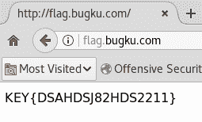

SQL注入1

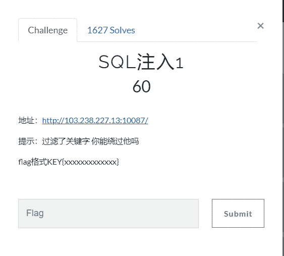

题目链接：[http://103.238.227.13:10087/](http://103.238.227.13:10087/)  

打开之后我们可以看到有这样一串代码

```
//过滤sql
$array = array('table','union','and','or','load_file','create','delete','select','update','sleep','alter','drop','truncate','from','max','min','order','limit');
foreach ($array as $value)
{
    if (substr_count($id, $value) > 0)
    {
        exit('包含敏感关键字！'.$value);
    }
}

//xss过滤
$id = strip_tags($id);

$query = "SELECT * FROM temp WHERE id={$id} LIMIT 1";
```

上边有//过滤sql

对sql的注入语句进行了严格的过滤，从这里看我们貌似没有什么注入的思路

下面的//xss过滤

 里边有一个 strip_tags($id)函数  我们百度一下可以了解到

```
strip_tags ()函数的作用      用来从字符串中去除 HTML 和 PHP 标记。
```

这样我们就想到可以试试在sql注入的语句中加入html或者php代码来绕过过滤

查看一下源代码，可以使用普通的注入

我们构造一个payload：

```
注入语句     http://103.238.227.13:10087/?id=1 un<p>ion sel<p>ect 1,hash fr<p>om sql3.key %23
```

PS:上一篇sql手工注入文章写了中间的详细步骤 ，不太了解的查阅下[BugkuCTF sql注入](https://www.cnblogs.com/Anser-dabao-982480259/p/9449965.html)

直接就爆出了答案，这个应该就是我们要的flag